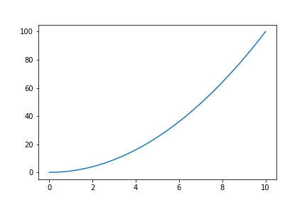
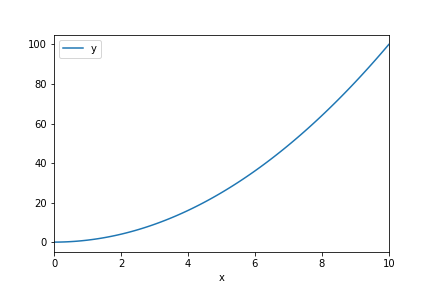

After having some Applied Math friends rant to me at how awful plotting was in Python I decided to write up a quick guide to hopefully change their minds.

# Numpy

This assumes a basic familiarity with `numpy`, although I'll go over the basics really quickly just in case. The syntax/API is very similar to MATLAB, so any familiarity with MATLAB will help.

```
import numpy as np
```

We can initialize an array from a normal list using `array()`, create ranges using `arange()`, or create evenly distributed numbers using `linspace()`.

```
np.array(range(3))  #=> array([0, 1, 2])
np.arange(3)  #=> array([0, 1, 2])
np.linspace(0, 1, 3)  #=> array([0, 0.5, 1])
```

Operations can be applied to these arrays on an element-wise basis.

Indexing can be done on any axis (up to the max number of axes the array has). Given some n-dimensional array, the first index corresponds to the first row, the second index corresponds to the first column, etc.

```
>>> a = np.zeros((5, 2))
>>> a
array([[ 0.,  0.],
       [ 0.,  0.],
       [ 0.,  0.],
       [ 0.,  0.],
       [ 0.,  0.]])
>>> a[0]
array([ 0.,  0.])
>>> a[:, 0]
array([ 0.,  0.,  0.,  0.,  0.])
```

# Let's talk about `matplotlib`

By default, `matplotlib` provides two different interfaces to control plotting.

1. A State-Machine Interface (very similar to MATLAB)
2. An Object-Oriented Interface (more pythonic)

We'll go over both, especially since they can be used in tandem and both provide easy ways to approach problems.

[For the official documentation click here.](http://matplotlib.org/faq/usage_faq.html#matplotlib-pyplot-and-pylab-how-are-they-related)

# Let's talk `pyplot`

The `pyplot` module provides this state-machine interface, where the global state of all figures is maintained without the user directly specifying which figure they're editing.

```
import matplotlib.pyplot as plt
```

Let's assume we have some generic dataset. I'll create a random one just for an example that uses \[latex\]f(x) = x^2\[/latex\].

```
x = np.linspace(0, 10, 100)
y = x**2
```

So let's plot it.

```
plt.figure()  # Creates a new figure
plt.plot(x, y)  # Plots a line with our data
plt.savefig('out.png')  # saves it to a file (in current directory)
# Can also use plt.show() to display using your front-end
```



# Object Oriented Approach

We can use `pyplot` for the initial figure creation, or we can be more verbose and use the object oriented approach (which is very similar).

```
fig = plt.figure()  # Creates a new figure (same syntax as above)
ax = fig.add_axes([0.1, 0.1, 0.8, 0.8])  # Adds axes to the (initially blank) figure
ax.plot(x, y)  # Plots the line on our axes
plt.savefig(out)  # Saves the figure (same as above)
```

This creates the same plot as above.

## Configuration

Given the basic structure above, we can tweak settings and change things around. Let's go over common configurations (code provided for both approaches)

1. Figure-size - Add arguments to the figure creation
    
    - `plt.figure(figsize=(width, height))` (same for both)
2. Labels - Use `xlabel` and `ylabel`
    
    - `plt.xlabel('Some X Axis Label')` (state machine)
    - `ax.set_xlabel('Some X Axis Label')` (object oriented)
3. Title - Use `title`
    
    - `plt.title('Some Amazing Plot Title')` (state machine)
    - `ax.set_title('Some Amazing Plot Title')` (object oriented)

# Pandas

We can also use `pandas`, which is built on `matplotlib` for its plotting. `pandas` is very powerful and can create amazing plots in very few lines of code.

```
import pandas as pd
data = pd.DataFrame({'x': x, 'y': y})  # create a new DataFrame from our dataset
data.plot(
    x='x',
    y='y'
)  # Plot the data setting the X and Y axis datapoints.
plt.show()  # show
```



For more examples see [the official visualization docs here.](https://pandas.pydata.org/pandas-docs/stable/visualization.html)

# Final Thoughts

This isn't mean to be a comprehensive guide on plotting in Python, but rather an argument that plotting isn't some giant nightmare like my mathematician friends are convinced it is. If you have questions or want a follow up article on something specific, let me know in the comments down below.
