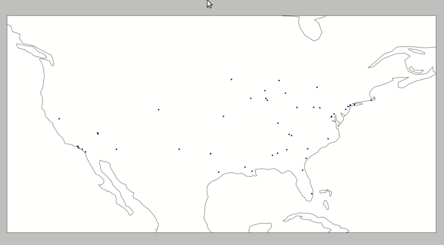

# Introduction

On Monday I attended the CU Boulder Computer Science Senior Projects Expo, and there was one project in particular that I thought was pretty neat: determining areas of civil unrest through Twitter post analysis. They had some pretty cool visuals and used Apache Spark, so I figured I'd try to recreate it on my own. What follows is an initial prototype attempt as a proof of concept. I'll go through each step included here, [but I've also included the code on my github profile](https://github.com/TheDataLeek/TwitterPanic), so feel free to clone and run it.

Again, this is a result that I was able to put together in just a couple days, so it's not completely fleshed out. This means that my solution is _not_ a pretty solution, but instead a solution that shows that a project of this nature is not only feasible, but scalable using Spark. For reasons I will go into later, the video demo is at 4x speed.

The final result is pretty neat. (Press the play button on the below animation).

\[video width="960" height="540" webm="http://dataleek.io/wp-content/uploads/2017/09/demosped.webm"\]\[/video\]

# General Approach

The steps for this project are fairly straightforward.

1. **First establish the data, either in streaming or static form.** For a static data form, this is relatively simple since nothing changes and our analysis can be performed all at once. For this project I chose to use a streaming data source in order to have a more adaptive solution. This solution can scale from either a small file or stream to gigabytes of data.
    
2. **Perform the analysis.** Since we're using Spark, this analysis is done using functional techniques and is scalable depending on the system you've set up.
    
3. **Display the results.** This is completely up to the analyst as different approaches will have different strengths and weaknesses. A generally accepted way (that would be another step for this project) is to use D3, a javascript library, to display the data. Right now I use Cartopy.
    

# PySpark Streaming

One initial design choice that I made was to create a streaming program that constantly runs and produces results. This means that the best approach is [Spark's streaming API](https://spark.apache.org/docs/1.2.0/streaming-programming-guide.html). As with any other Spark program I first created a `SparkContext` object, and since I'm set up on my laptop (with 4 workers) I designated the program to use the local Spark instance. After I instantiated the `SparkContext` I created a `StreamingContext` object and established a batch interval, which is simply the interval at which the streaming API will update.

[For reference, here's a link to the streaming API.](https://spark.apache.org/docs/latest/api/python/pyspark.streaming.html)

```
sc  = SparkContext('local[4]', 'Social Panic Analysis')
ssc = StreamingContext(sc, BATCH_INTERVAL)
```

Once the setup code is complete, the stream can be started by setting a default "blank" [RDD](https://spark.apache.org/docs/latest/quick-start.html), and creating a new `queueStream` whose default contents is the blank RDD.

```
rdd = ssc.sparkContext.parallelize([0])
stream = ssc.queueStream([], default=rdd)
```

At this point the stream consists of a single entry: an RDD with contents `[0]`. To convert it to a usable stream, I applied a flat map over every element in the stream. This mapping process converts each element currently in the stream to a new RDD that contains the next chunk of Twitter data. (Note, you could absolutely have a ton of elements in your blank RDD to start, which would mean that you're pulling in data over each one of those elements. I did not do that due to [Twitter's Rate Limiting](https://dev.twitter.com/rest/public/rate-limiting), which I'll go over more in depth later.)

```
stream = stream.transform(tfunc)
```

Analysis is now performed on the streaming object! (I'll cover this more in depth later)

```
coord_stream = stream.map(lambda line: ast.literal_eval(line)) \
                    .filter(filter_posts) \
                    .map(get_coord)
```

After the analysis is complete, the results are visualized. (Again, I'll go over this later)

```
coord_stream.foreachRDD(lambda t, rdd: q.put(rdd.collect()))
```

Since Spark is lazily evaluated, nothing has been done yet. All that's been established is the fact that we have some data stream and the intent to perform some series of steps on it in our analysis. The final step is to start our stream and basically just wait for something to stop it. (Any keyboard interrupt or process termination signal counts.)

```
ssc.start()
ssc.awaitTermination()
```

And that's it! Data is now being pulled from our streaming object.

# Transforming our Data Stream

In order to convert our initial blank RDD to twitter data, a [flat map](http://www.dattamsha.com/2014/09/map-vs-flatmap-spark/) is applied over it. This converts each element (currently just one) to my stream output.

```
return rdd.flatMap(lambda x: stream_twitter_data())
```

The stream output is determined by the contents of the following streaming endpoint.

```
https://stream.twitter.com/1.1/statuses/filter.json?language=en&locations=-130,20,-60,50
```

This restricts my results to English tweets over a bounding box that is mostly just the United States. (You could remove the bounding box option, but since the only language I know is English I wanted to be able to accurately parse the results.) [A more complete guide to the Twitter API is located on their site](https://dev.twitter.com/overview/documentation).

The response object that we get when we use the `stream=True` option with the [python `requests` library](http://docs.python-requests.org/en/latest/) has an iterable object. I iterate over those lines, yield them, and after receiving a set number of tweets I break and terminate the request. If I run into any hiccups along the way, for the purpose of this prototype, they are just printed out for visual debugging.

```
    response  = requests.get(query_url, auth=config.auth, stream=True)
    print(query_url, response)
    count = 0
    for line in response.iter_lines():
        try:
            if count > BLOCKSIZE:
                break
            post     = json.loads(line.decode('utf-8'))
            contents = [post['text'], post['coordinates'], post['place']]
            count   += 1
            yield str(contents)
        except:
            print(line)
```

A more complete solution would ideally log these and create workarounds.

# Analysis

Since each element in our resulting RDD is a string representation of a Python object, each line in our RDD is mapped to a literal Python object.

```
    coord_stream = stream.map(lambda line: ast.literal_eval(line))
```

The posts are filtered by its text content. For this project, the filters look for language indicative of social unrest. (If you'll note, this application is not limited to social unrest and many other filters could be applied.) I don't really have the background for the best [sentiment analysis](http://en.wikipedia.org/wiki/Sentiment_analysis), so all I have is a list of keywords as my filtering criteria. (I've also included the word "http" in there so that in my pool of limited results I actually have some content.)

```
:::python
filtered_stream = coord_stream.filter(filter_posts)
```

For a more sophisticated process, implementing word association and natural language processing would produce more accurate results. I didn't implement something along those lines due to personal time and scope constraints. [For some ideas, here's a paper on the subject](http://www.umiacs.umd.edu/~saif/WebPages/Abstracts/NRC-SentimentAnalysis.htm).

```
    final_stream = filtered_stream.map(get_coord)
```

At this point, the only posts that are left are those that indicate violence which need to be reduced to just their geographical coordinates. Once this is complete each point can be plotted.

```
    final_stream.foreachRDD(lambda t, rdd: q.put(rdd.collect()))
```

# Plotting

As you probably noticed, the "plotting" referenced above actually puts the contents of the RDD into a [queue](https://docs.python.org/2/library/queue.html). This queue is also accessed by the other thread of the program which checks the queue every 5 seconds and pulls data out.

[Cartopy](http://scitools.org.uk/cartopy/docs/latest/) is used for the plotting process, and a new `matplotlib` figure is set to [interactive mode](http://stackoverflow.com/questions/6130341/exact-semantics-of-matplotlibs-interactive-mode-ion-ioff). If there is a new entry in the queue, we pull it out and add the points to our figure instance.

```
    plt.ion() # Interactive mode
    fig = plt.figure(figsize=(30, 30))
    ax = plt.axes(projection=ccrs.PlateCarree())
    ax.set_extent([-130, -60, 20, 50])
    ax.coastlines()
    while True:
        if q.empty():
            time.sleep(5)
        else:
            data = np.array(q.get())
            try:
                ax.scatter(data[:, 0], data[:, 1], transform=ccrs.PlateCarree())
                plt.draw()
            except IndexError: # Empty array
                pass
```

The final result is decent.



# Rate Limiting

[Because Twitter will only let me query their site 15 times in 15 minutes](https://dev.twitter.com/rest/public/rate-limiting), I'm restricted in how much actual analysis I can do. Not only do I have to use their sample stream, but I can only update once every 60 seconds unless I want to be rate limited very quickly, which is why this process is so slow. The next step would be to make this update at a more reasonable speed by maintaining the `response` object that is received from the request. All attempts to make that work failed horribly. I'm hoping to get it working at one point, but right now it will just hang and never evaluate anything.

# Final Thoughts

All in all, this was a really neat project. The streaming API still has some kinks to iron out chiefly in the documentation. No real tutorials exist for this tool yet, and I had to refer to the unit tests for some of modules I was using. Often times, it was the only instance of working code I could find. I'm hoping that this article may help someone who decides to work on Spark in the future.

There is still a ton I could do with this project. Something that I'm planning on doing in the next few weeks (sometime after finals finish up) is to implement a static version that acts on a collected data set and shows behavior over the last few weeks.

My visualization is not very pretty. Yes, it gets the job done, but the black coastlines leave a lot to be desired...

The hope is that the stream will just pass around the response object. Again, I was never quite able to get that part implemented, but I think after a few more hours of working with it I can figure out what the problem is.

Please let my know what you think! Leave comments below or on [its github page](https://github.com/TheDataLeek/TwitterPanic) and I'll get back to you as quickly as I can.
