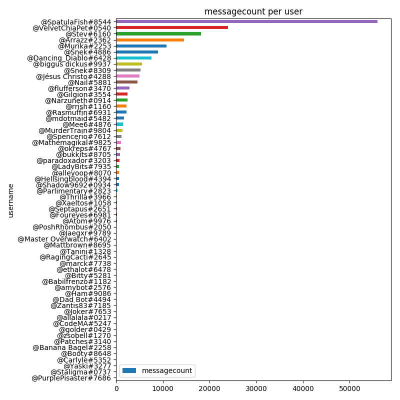
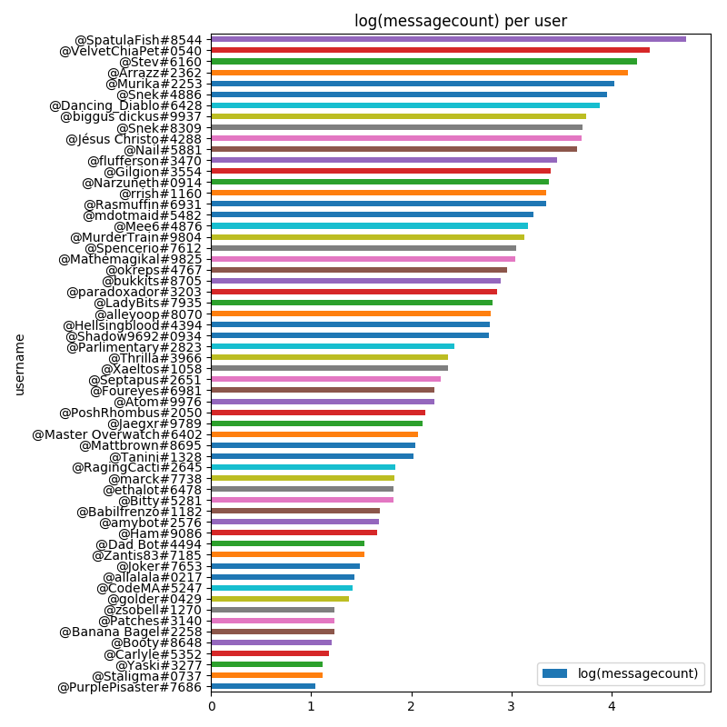
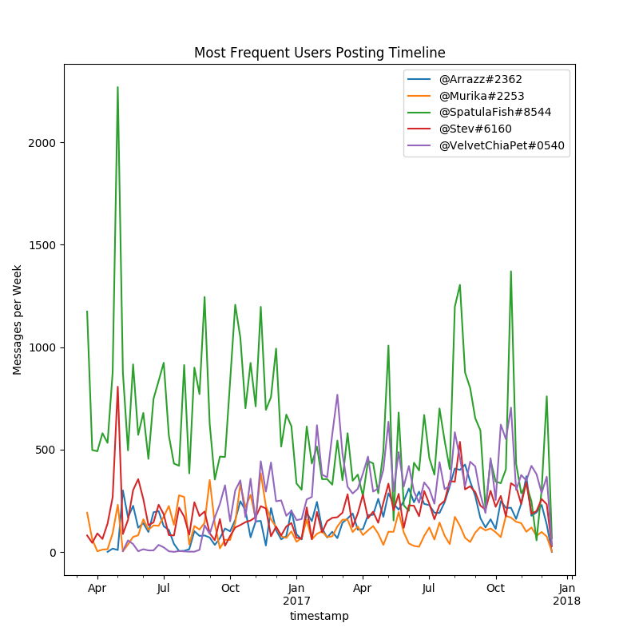
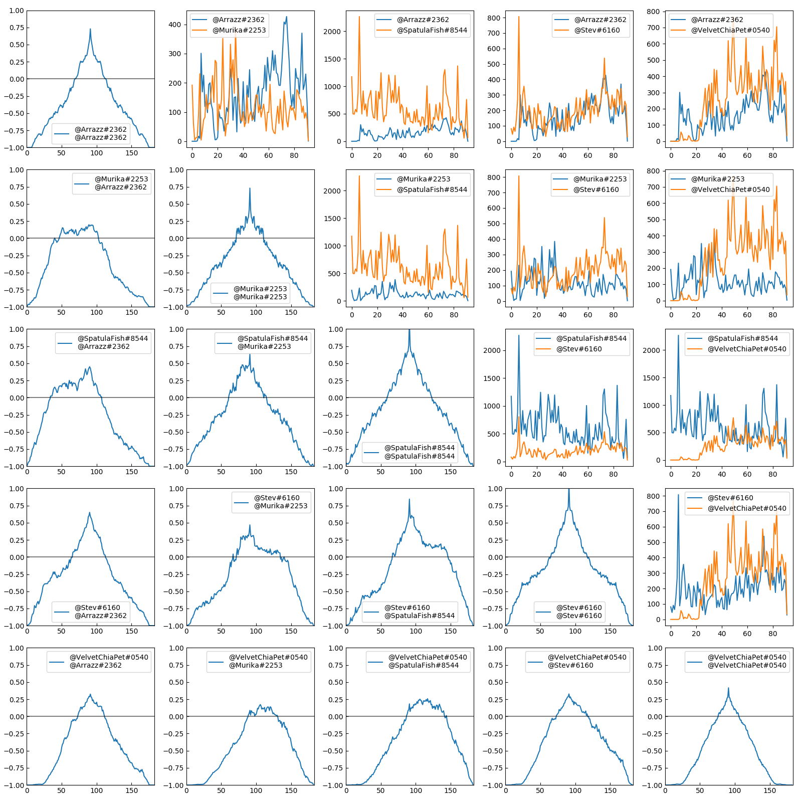
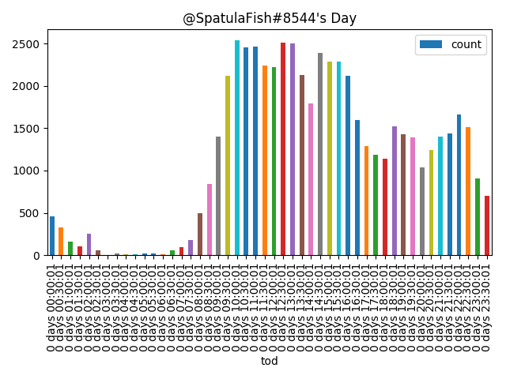
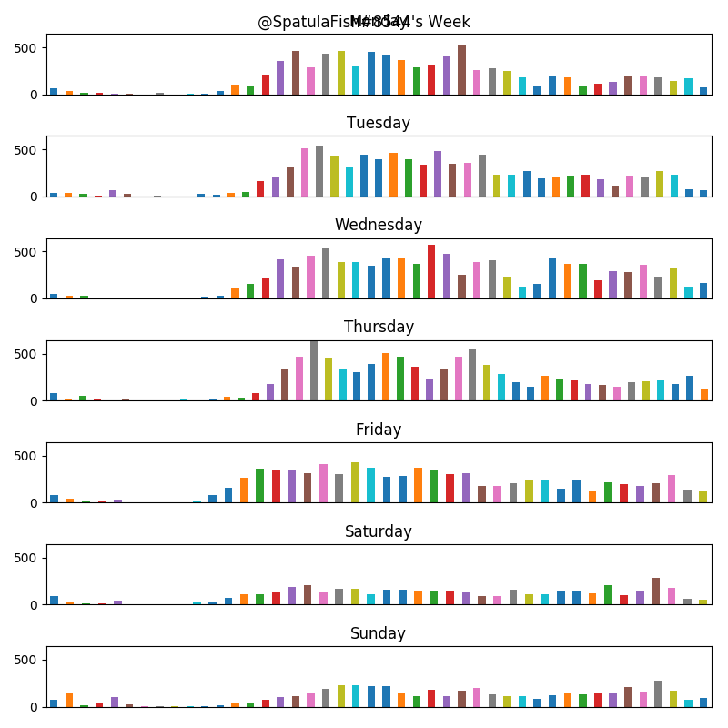

I run a Discord server for my friends. We've essentially given up texting and now use Discord for virtually all communication. This server has been running since about January 2016, and we now have around 75 users and collectively we've sent almost 200,000 messages.

I scraped all of this data using my bot and decided to do some analysis and dig into some patterns. For obvious reasons, I won't be making this data public.

# Scraping the Data

I use [Red-Discord Bot](https://github.com/Cog-Creators/Red-DiscordBot) as my bot.

The cog that scrapes is [activitylog](https://github.com/calebj/calebj-cogs).

This results in a file per channel with lines that all look like this:

```
2016-03-16 21:10:32 #general @SpatulaFish#8544: test
```

# Importing the Data

First step is to get this data into a form that we can tinker with it in. We can use regular expressions

[](https://xkcd.com/208/)

[There's a good article on treating your regular expressions as code here that I recommend after you read this writeup.](https://alexwlchan.net/2016/04/regexes-are-code/)

The following code performs the following steps:

1. Establish a regular expression to match each line.
2. For each file, find all matches of our regular expression.
3. Create a pandas DataFrame from the matches.
4. Parse datetimes and add extra helper fields.

```
num = '[0-9]'
channel = '#[a-zA-Z\-]+'
user = f'@.+#{num}{{4}}'
date = f'{num}{{4}}-{num}{{2}}-{num}{{2}}'
time = f'{num}{{2}}:{num}{{2}}:{num}{{2}}'
message = f'({date} {time}) ({channel}) ({user}): (.*)'
message_re = re.compile(message)

messages = []
for root, dirs, files in os.walk(directory):
    for filename in files:
        with open(os.path.join(root, filename), 'r') as fileobj:
            for message in re.findall(message_re, fileobj.read()):
                messages.append(message)

df = pd.DataFrame(messages,
                  columns=['timestamp', 'channel', 'user', 'text'])
df['timestamp'] = pd.to_datetime(df['timestamp'])
df['timestamp'] = df['timestamp'] - pd.Timedelta('07:00:00')
df['time_of_day'] = df['timestamp'].apply(lambda x: x - pd.Timestamp(x.date()))
df['day_of_week'] = df.timestamp.apply(lambda x: x.dayofweek)
```

# Busiest Users

For our first real analysis we can dig into how many posts in our dataset each user has. This is just a simple groupby and count.

```
user_counts = df[['user', 'channel']].groupby('user').count()
user_counts = user_counts.reset_index()
user_counts.columns = ['username', 'messagecount']
user_counts = user_counts.sort_values('messagecount')
```

We can plot all users that have at least 10 messages logged.



And make the equivalent plot in $latex log\_{10}$ space.



This matches a very intuitive understanding of how any chatroom would look: you have a few busy users that make up the majority of the traffic, and then a long tail of less frequent users. In fact, [Reddit itself has this same distribution, with the vast majority of the karma belonging to only a few users](https://www.reddit.com/r/dataisbeautiful/comments/425zk4/1_of_reddit_has_47_of_all_karma_earned_in_2015_oc/).

# Plotting Post History

We can also plot our top users over time, and see if they have any patterns in their post history. This is again a simple groupby, except this time we need to use a pandas grouper to roll things up by week.

```
overtime = df[['user', 'timestamp', 'channel']]\
        .groupby([pd.Grouper(key='timestamp', freq='1W'), 'user'])\
        .count()
overtime = overtime.reset_index()
overtime.columns = ['timestamp', 'username', 'count']
```



Unfortunately not much is obvious from this graph, save that the users are correlated. We can dig into this correlation using [cross-correlation](https://en.wikipedia.org/wiki/Cross-correlation).



- There's weak correlation with every user, which makes sense as any given conversation will probably prompt replies.
- @Stev is correlated with @SpatulaFish and @Murika
- @VelvetChiaPet kinda just does his own thing
- @Murika @SpatulaFish and @Stev @SpatulaFish have similar high correlations. But @Murika @Stev is much lower. Which means that normally one person is answering @SpatulaFish

# Posting Frequency

Finally, we can dig into the hours of the day and the days of the week that a user posts the most. I'm just going to show the charts for @SpatulaFish (our most frequent poster), but the rest of them [are available here](https://drive.google.com/drive/folders/1c8bW8jtbGV8dDJBtc7-VWv_QqaNzwBf0?usp=sharing). These have been normalized for Mountain Standard Time.

For time of day it's another groupby.

```
tod = df[['user', 'time_of_day', 'channel']]\
        .groupby(['user', pd.Grouper(key='time_of_day', freq='30T')])\
        .count()
tod = tod.reset_index()
tod.columns = ['user', 'tod', 'count']
tod = tod[tod.user == name].sort_values('tod')
```



Same with time of week.

```
tod = df[['user', 'time_of_day', 'day_of_week', 'channel']]\
        .groupby(['user', 'day_of_week', pd.Grouper(key='time_of_day', freq='30T')])\
        .count()
tod = tod.reset_index()
tod.columns = ['user', 'dow', 'tod', 'count']
tod = tod[tod.user == name].sort_values(['dow', 'tod'])
```



# Conclusions

As we'd expect in this sort of system, our user's posts are inversely distributed.

We have one user in particular that drives much of the conversation on Discord, and several of the users are strongly correlated with that distinct user.

Definitely do statistical analysis on your friends. It's fascinating to dig into how your group functions.

Source code is available below.

Expand Code
<script src="https://gist.github.com/TheDataLeek/c5aff9ca5ee2a8db61fe8dbc5fca95c9.js"></script>
