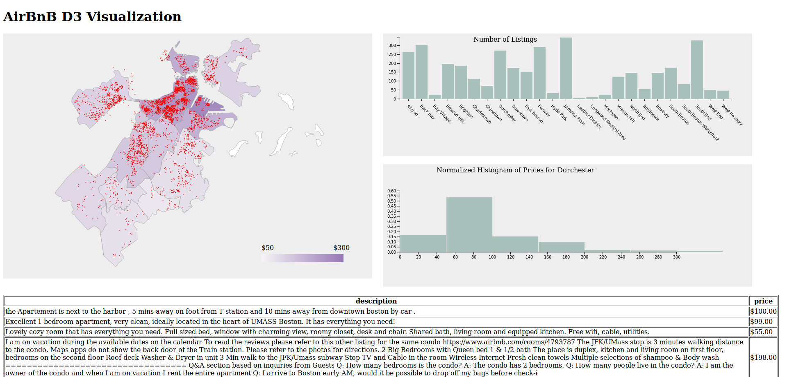

This is a followup visualization from [my post on analyzing Boston's AirBnB.](../evolve-project-interview/index.md)

The below embedding is less than perfect, [so please check it out fullscreen.](/presentations/airbnb/index.html)

If it's not rendering well for you, this is what you should see.



The Python to convert the raw data to `geojson` is super straightforward. (As an aside, I love how easy `geojson` is in D3)

We don't save all the data, as that gives us a 16MB page download, so instead we only save the columns we need.

```python
json_obj = []
column_keys = {key: i for i, key in enumerate(combined_data.columns)}
for row in combined_data.values:
    json_obj.append({
      "type": "Feature",
      "geometry": {
        "type": "Point",
        "coordinates": [
            row[column_keys['longitude']],
            row[column_keys['latitude']]
        ]
      },
      "properties": {
          str(key): str(row[column_keys[key]])
          for key in column_keys
          if ((not isinstance(key, tuple)) and
              (key.lower() in ['price', 'name', 'neighbourhood_cleansed', 'summary', 'description']))
      }
    })
with open('d3demo/airbnb.geojson', 'w') as fobj:
    fobj.write(json.dumps({
        'type': 'FeatureCollection',
        'features': json_obj
    }))
```

<iframe src="/presentations/airbnb/index.html" style="
width: 100%;
height: 200em;
overflow: hidden;"></iframe>
