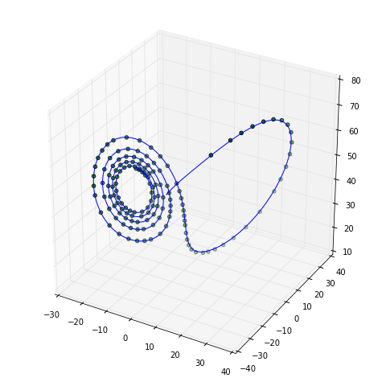

```
import numpy as np
import matplotlib.pyplot as plt
import csv
import pandas as pd
from mpl_toolkits.mplot3d import Axes3D
import numpy.linalg as nl

%pylab inline
```

    Populating the interactive namespace from numpy and matplotlib


```
def _step_rk4(f, t0, y0, dt):
    """
    Perform one Fourth-Order Runge-Kutta Step
    
    :param f: function
                ODE function with input f(t, y)
    :param t0: float
                Initial starting time
    :param y0: numpy.ndarray()
                Initial ODE state (vector)
    :param dt: float
                Timestep
    """
    k1 = f(t0, y0)
    k2 = f(t0 + (dt / 2), y0 + (k1 * dt / 2))
    k3 = f(t0 + (dt / 2), y0 + (k2 * dt / 2))
    k4 = f(t0 + dt, y0 + (k3 * dt))
    y = y0 + dt * ((k1 / 6) + (k2 / 3) +
                   (k3 / 3) + (k4 / 6))
    t = t0 + dt
    return t, y
```


```
def mrk4(f, t0, y0, dt, n, writecsv=''):
    """
    Fixed-Step Fourth-Order Runge-Kutta ODE Solver
    
    :param f: function
        ODE function with input f(t, y)
    :param t0: float
        Initial starting time
    :param y0: numpy.ndarray()
        Initial ODE state (vector)
    :param dt: float
        Timestep
    :param n: int
        Number of iterations (steps) to perform
    :param writecsv: bool
        :default: False
        Write to csv file?
    """
    dim = y0.size
    
    # Establish blank solution trajectory
    # [[y00, ..., y0n, t0],
    #  [y10, ..., y1n, t1],
    # ...]
    traj = np.zeros((n + 1, dim + 1), dtype=np.float64)
    
    # Set initial position
    traj[0, 0:dim] = y0
    traj[0, -1]    = t0
    
    # Iterate
    for i in range(1, n + 1):
        (traj[i, -1],
         traj[i, 0:dim]) = _step_rk4(f,
                                    traj[i - 1, -1],
                                    traj[i - 1, 0:dim],
                                    dt)

    if writecsv != '':
        with open(writecsv, 'w') as f:
            csvwriter = csv.writer(f)
            [csvwriter.writerow(line) for line in m]
    return traj
```

**1. Write an adaptive time-step fourth-order Runge-Kutta integrator.**


```
def ark4(f, t0, y0, dt, n, error=1e-3, writecsv=''):
    """
    Adaptive Fourth-Order Runge-Kutta ODE Solver
    
    :param f: function
        ODE function with input f(t, y)
    :param t0: float
        Initial starting time
    :param y0: numpy.ndarray()
        Initial ODE state (vector)
    :param dt: float
        Timestep
    :param n: int
        Number of iterations (steps) to perform
    :param error: float
        :default: 0.001
        Precision of adaptive step
    :param writecsv: bool
        :default: False
        Write to csv file?
    """
    dim = y0.size
    
    # Establish blank solution trajectory
    # [[y00, ..., y0n, t0],
    #  [y10, ..., y1n, t1],
    # ...]
    traj = np.zeros((n + 1, dim + 1), dtype=np.float64)
    
    # Set initial position
    traj[0, 0:dim] = y0
    traj[0, -1]    = t0
    
    # Iterate
    for i in range(1, n + 1):
        halved = False
        while True:
            t1, x1 = _step_rk4(f, traj[i - 1, -1],
                               traj[i - 1, 0:dim], dt)
            tt, xt = _step_rk4(f, traj[i - 1, -1],
                               traj[i - 1, 0:dim], dt / 2)
            t2, x2 = _step_rk4(f, tt, xt, dt / 2)

            delta = x2 - x1
            err = nl.norm(delta, np.inf)

            if err > error:
                dt = dt / 2
                halved = True
            elif err <= error:
                if halved:
                    break
                else:
                    dt = 2 * dt
            
        (traj[i, -1],
         traj[i, 0:dim]) = _step_rk4(f,
                                    traj[i - 1, -1],
                                    traj[i - 1, 0:dim],
                                    dt)
        
    if writecsv != '':
        with open(writecsv, 'w') as f:
            csvwriter = csv.writer(f)
            [csvwriter.writerow(line) for line in m]
    return traj
```

**2. (a) Use your adaptive integrator to plot a picture of the chaotic attractor in the Lorenz System:**

$$
\vec{F}\left( \vec{x}, a, r, b \right) =
\left[
\begin{array}{c}
\dot{x}\\
\dot{y}\\
\dot{z}\\
\end{array}
\right]
=
\left[
\begin{array}{c}
a(y - x)\\
rx - y - xz\\
xy - bz\\
\end{array}
\right]
$$

**with $a=16$, $r = 45$, and $b = 4$, starting from the initial condition $(x, y, z) = (-13, -12, 52)$.**


```
a = 16
r = 45
b = 4
initial_state = np.array([-13, -12, 52])

lorenz = lambda t, y: np.array([
    a * (y[1] - y[0]),
    r * y[0] - y[1] - y[0] * y[2],
    y[0] * y[1] - b * y[2]
])

data = ark4(lorenz, 0, initial_state, 0.001, 700)

fig = plt.figure(figsize=(8, 8))
ax = fig.add_axes([0.1, 0.1, 0.8, 0.8], projection='3d')
ax.plot(data[:, 0], data[:, 1], data[:, 2])
fig.show()
```


    

    


**(b) Use your nonadaptive integrator from PS4 to plot a trajectory from the same initial condition using a timestep of $0.001$. Overlay your plots from (a) and (b). Do the two solutions agree? Are the points produced by the adaptive solver evenly spaced in time?**


```
a = 16
r = 45
b = 4
initial_state = np.array([-13, -12, 52])

lorenz = lambda t, y: np.array([
    a * (y[1] - y[0]),
    r * y[0] - y[1] - y[0] * y[2],
    y[0] * y[1] - b * y[2]
])

adaptive_data = ark4(lorenz, 0, initial_state, 0.001, 145)
data = mrk4(lorenz, 0, initial_state, 0.001, 2800)

fig = plt.figure(figsize=(8, 8))
ax = fig.add_axes([0.1, 0.1, 0.8, 0.8], projection='3d')
ax.plot(data[:, 0], data[:, 1], data[:, 2])
ax.scatter(adaptive_data[:, 0], adaptive_data[:, 1], adaptive_data[:, 2], c='green')
fig.show()
```


    

    


If you'll note, the two different methods do in fact agree, even though the adaptive method does not have fixed time step operations. This is by design, and allows for a much faster computation of the same system.

**(c) What happens if you keep $a$ and $b$ fixed and change $r$?**


```
def lorenzsystem(a, r, b, initial, steps):
    lorenz = lambda t, y: np.array([
        a * (y[1] - y[0]),
        r * y[0] - y[1] - y[0] * y[2],
        y[0] * y[1] - b * y[2]
    ])
    return ark4(lorenz, 0, initial, 0.001, steps)

fig = plt.figure(figsize=(16, 16))

r_vals = [45, 0.25, 0.8, 13.765, 25, 28.54]
steps  = [500, 300, 200, 200, 200, 500]
ics    = np.array([
    np.array([-13, -12, 52]),
    np.array([100, 30, 500]),
    np.array([100, 100, 100]),
    np.array([-13, -12, 52]),
    np.array([-13, -12, 52]),
    np.array([-13, -12, 52])
])
titlestring = r'$(a, r, b) = (16, {}, 4)$ with $i_c = \langle {} \rangle$'

for i in range(6):
    ax = fig.add_subplot(321 + i, projection='3d')
    data = lorenzsystem(16, r_vals[i], 4, ics[i], steps[i])
    ax.plot(data[:, 0], data[:, 1], data[:, 2])
    plt.title(titlestring.format(r_vals[i], ','.join([str(num) for num in ics[i]])))
fig.show()
```


    

    


**3. Use your adaptive integrator to plot a picture of the chaotic attractor in the Rossler system**

$$
\vec{F}(\vec{x}, a, b, c) =
\left[
\begin{array}{c}
\dot{x}\\
\dot{y}\\
\dot{z}\\
\end{array}
\right]
=
\left[
\begin{array}{c}
-(y + z)\\
x + ay\\
b + z(x - c)\\
\end{array}
\right]
$$

**with $a = 0.398$, $b = 2$, and $c = 4$.**


```
a = 0.398
b = 2
c = 4

initial_state = np.array([5, -5, 5])

rossler = lambda t, y: np.array([
    -(y[1] + y[2]),
    y[0] + a * y[1],
    b + y[2] * (y[0] - c)
])

data = ark4(rossler, 0, initial_state, 0.001, 1000)

fig = plt.figure(figsize=(8, 8))
ax = fig.add_axes([0.1, 0.1, 0.8, 0.8], projection='3d')
ax.plot(data[:, 0], data[:, 1], data[:, 2])
fig.show()
```


    

    


**4. Now go back to the Lorenz system and the parameter value given in problem 2. Your task is to explore the effects of loosening the error bounds. Increase the allowed error from $0.01$ until you see the dynamics break down. Turn in one or two plots in this series. How is this related to the results of the timestep explorations you did on the last problem set?**


```
def lorenzsystem(a, r, b, initial, steps, err):
    lorenz = lambda t, y: np.array([
        a * (y[1] - y[0]),
        r * y[0] - y[1] - y[0] * y[2],
        y[0] * y[1] - b * y[2]
    ])
    return ark4(lorenz, 0, initial, 0.001, 500, error=err)

fig = plt.figure(figsize=(16, 16))

error = [0.001, 0.01, 0.1, 0.5, 1, 2, 3, 10]

titlestring = r'Error: ${}$'

for i in range(8):
    ax = fig.add_subplot(421 + i, projection='3d')
    data = lorenzsystem(16, 45, 4, np.array([-13, -12, 52]), 500, error[i])
    ax.plot(data[:, 0], data[:, 1], data[:, 2])
    plt.title(titlestring.format(error[i]))
fig.show()
```


    

    


Looking at the progression of error propagation in the above graphs we note that we have similar behavior to when we adjust the timestep in the previous problem set as in both cases we are adjusting the inherent precision of the plots.


```

```
