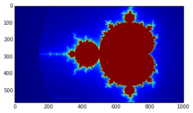

```
%pylab inline
```

    Populating the interactive namespace from numpy and matplotlib


```
import numpy as np
from calculate_iterations import calculate_iterations
import matplotlib.pyplot as plt

max_iterations = 50
width = 1000
height = int(width * (2/3.5))

colors = np.zeros((height, width))

def add_color():
    x0s = [((3.5 * px)/width) - 2.5 for px in range(width)]
    y0s = [((2 * py)/height) - 1 for py in range(height)]
    for px in range(width):
        if px % 100 == 0:
            print(px)
        x0 = x0s[px]
        for py in range(height):
            y0 = y0s[py]
            colors[py][px] = (255 * calculate_iterations(px, py, x0, y0, max_iterations))/max_iterations
            
add_color()
plt.imshow(colors)
plt.imsave('Mandelbrot.png', colors)
```

    0
    100

    
    200

    
    300

    
    400

    
    500

    
    600

    
    700

    
    800

    
    900

    


    

    


```

```
