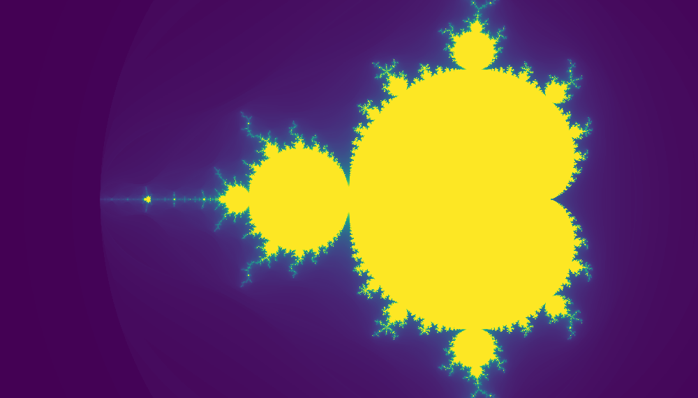

The Mandelbrot set is the set of all complex numbers *c* for which the recurrence *z* → *z*² + *c*, starting from *z* = 0, stays bounded forever. In practice, we test for escape: if \|*z*\| ever exceeds 2, the orbit will diverge. The interesting structure lives at the boundary between points that escape and points that don't.

The goal here is to render that boundary directly, pixel by pixel, using the escape-time algorithm.

## The iteration kernel

The core calculation is extracted into its own module so it can be compiled with Cython for performance. A naive Python loop over a 1000×571 grid means over half a million calls, which is slow in pure Python.

```python
import math as np

def calculate_iterations(x0, y0, max_iterations):
    x = y = iteration = 0
    while ((x**2 + y**2 < 4) and (iteration < max_iterations)):
        xtmp = x**2 - y**2 + x0
        y = 2 * x * y + y0
        x = xtmp
        iteration += 1
    if iteration < max_iterations:
        iteration += 1 - np.log(np.log(np.sqrt(x**2 + y**2)) / np.log(2) ) / np.log(2)
    return iteration
```

The loop implements *z* → *z*² + *c* in real arithmetic: if *z* = *x* + *iy* and *c* = *x₀* + *iy₀*, then Re(*z*² + *c*) = *x*² − *y*² + *x₀* and Im(*z*² + *c*) = 2*xy* + *y₀*.

The condition `x**2 + y**2 < 4` is the \|*z*\| < 2 escape check (squaring both sides avoids a sqrt on every iteration).

**Smooth coloring:** when the orbit escapes, raw integer iteration counts produce hard color bands. The fractional correction at line 9–11 is the normalized iteration count formula — it uses the final \|*z*\| value to interpolate between integer iteration levels, so adjacent bands blend smoothly into gradients instead of discrete rings.

Note: `px` and `py` are passed in but unused; the only inputs that matter are `x0` and `y0` (the complex coordinates). Vestigial parameters from an earlier version.

The module is compiled to a C extension via `setup.py`:

```python
from distutils.core import setup
from Cython.Build import cythonize

setup(
    name = "iterations",
    ext_modules = cythonize("./calculate_iterations.py")
    )
```

## Rendering

```python
import numpy as np
from calculate_iterations import calculate_iterations
import matplotlib.pyplot as plt

max_iterations = 50
width = 1000
height = int(width * (2/3.5))

colors = np.zeros((height, width))

def add_color():
    x0s = [((3.5 * px)/width) - 2.5 for px in range(width)]
    y0s = [((2 * py)/height) - 1 for py in range(height)]
    for px in range(width):
        x0 = x0s[px]
        for py in range(height):
            y0 = y0s[py]
            colors[py][px] = (255 * calculate_iterations(px, py, x0, y0, max_iterations))/max_iterations

add_color()
plt.imshow(colors)
plt.imsave('Mandelbrot.png', colors)
```

The pixel-to-complex-plane mapping covers the standard Mandelbrot viewing window: *x* ∈ [−2.5, 1.0] and *y* ∈ [−1.0, 1.0]. The width is 3.5 units and height 2 units, so `height = width * (2/3.5)` preserves the aspect ratio.

Each pixel's iteration count is normalized to [0, 255] and stored in the `colors` array, which matplotlib renders as a heatmap.

<figure>
  
  <figcaption>Click to view full resolution</figcaption>
</figure>

<div class="pdf-lightbox" id="mandelbrot-lb" aria-hidden="true" role="dialog" aria-modal="true">
  <button class="pdf-lightbox__close" aria-label="Close">×</button>
  <div class="pdf-lightbox__content">
    
  </div>
</div>

<script>
(function () {
  var lb   = document.getElementById('mandelbrot-lb');
  var img  = lb.querySelector('.pdf-lightbox__img');

  function open() {
    img.src = '{{ "/college/fractals/MandelbrotBig.png" | relative_url }}';
    lb.setAttribute('aria-hidden', 'false');
    document.body.style.overflow = 'hidden';
  }
  function close() {
    lb.setAttribute('aria-hidden', 'true');
    document.body.style.overflow = '';
  }

  document.getElementById('mandelbrot-thumb').addEventListener('click', open);
  lb.querySelector('.pdf-lightbox__close').addEventListener('click', close);
  lb.addEventListener('click', function (e) { if (e.target === lb) close(); });
  document.addEventListener('keydown', function (e) {
    if (lb.getAttribute('aria-hidden') === 'true') return;
    if (e.key === 'Escape') close();
  });
}());
</script>
