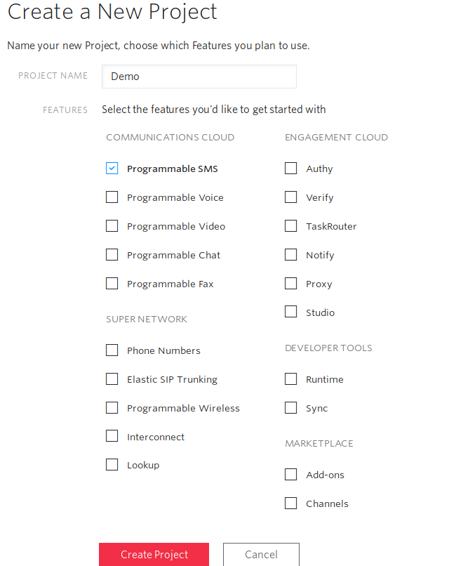

Let's say that you need to integrate SMS capabilities into your project, and let's also say that you're using python. You can use Twilio to _very_ easily integrate texts directly into your application.

# Setting Up Twilio

First though, you'll need a Twilio account. Go to [their signup page](https://www.twilio.com/try-twilio), and create a new account (or log in to yours if you already have one).


Create a new project.



You'll now see your project dashboard.


You'll need to buy a phone number to text from, go to the "Buy a Number" link and pick whichever you'd like (this will cost $1 a month).

Lastly you'll need to add funds to the account, since each block of each text costs $0.0075. (tl;dr text messages can only be so long, so they get split into blocks and each is sent seperately)

# Python Integration

Now with our Account SID and Auth Token for Twilio in hand we can hook it up to our application. The following code is taken from a [sms-notifying chat bot feature available here](https://github.com/TheDataLeek/fish/tree/master/cogs/notify).

We're using the [twilio-python](https://github.com/twilio/twilio-python) library to make things easy for us.

```
import twilio
from twilio.rest import Client
```

While you can provice your account and auth to the `Client` instance manually, it will also pull the environment variables `TWILIO_ACCOUNT_SID` and `TWILIO_AUTH_TOKEN`, which is safer than hard-coding these tokens in. Specify these in your Docker instance, bashrc, or however you deploy your application.

Instantiate your client.

```
client = Client()
```

Now use `.messages.create()`, specifying the destination phone number, the message body, and the phone number that you purchased from Twilio.

```
client.messages.create(
    to='1111111111',
    body='Hello World!',
    from_='2222222222'
)
```

And that's it! Note, sending a message is a blocking operation so if your application is threaded you'll run into problems.
