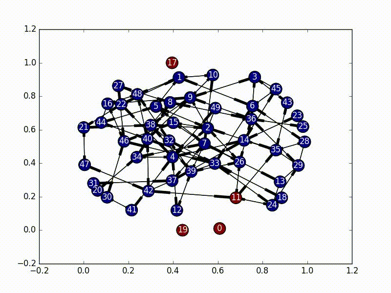
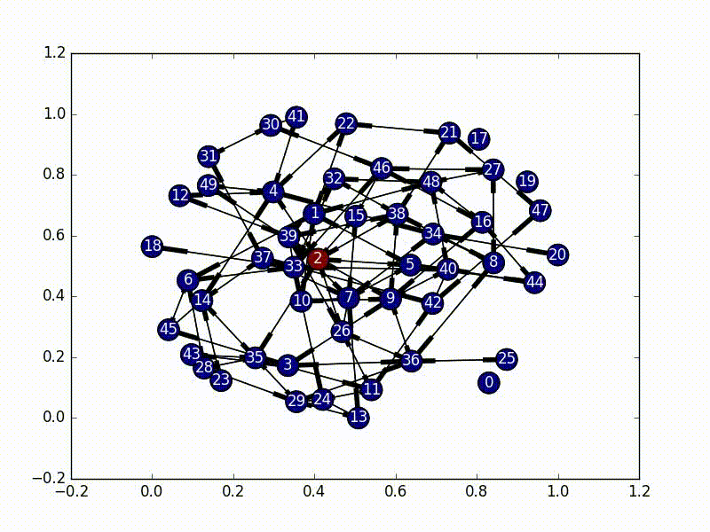

# Khan Academy Virus Propagation

Part of the interview process at Khan Academy is to complete their interview project. This project deals with virus propagation through a directed network. We will be using the terms "graph" and "network" interchangeably, [but I'm referring to the same thing for both](https://en.wikipedia.org/wiki/Graph_theory).

From a high level, Khan Academy would like to know the best method for choosing a small portion of their users to be affected by UI changes (along with others), without affecting every user at the same time. They define their network of users by _Teacher -> Student_ relationships. I assume that teachers can also be students, leading to a [many-to-many](https://en.wikipedia.org/wiki/Many-to-many_%28data_model%29) network, or a [multigraph](https://en.wikipedia.org/wiki/Multigraph).

The requirements for this project are the following. \* Spend no more than 12 hours. \* Put the code wherever, send it with any method. \* Implement a total infection algorithm. \* Implement a limited infection algorithm. \* Provide tests and instructions for running.

Table of Contents

1. [Methodology](#methodology)
2. [Setup](#setup)
3. [Choosing an Initial Infected Node](#choosing-an-initial-infected-node)
    
    1. [The Naive Approach](#the-naive-approach)
    2. [Adding Sophistication](#adding-sophistication)
    3. [Next Steps](#next-steps)
4. [Total Infection](#total-infection)
5. [Limited Infection](#limited-infection)
    
    1. [Naive Limited Infection](#naive-limited-infection)
    2. [(Better) Naive Limited Infection](#better-naive-limited-infection)
    3. [Markov Chain Infection](#markov-chain-infection)
    4. [Other Algorithms](#other-algorithms)
6. [Final Thoughts](#final-thoughts)

## Methodology

In terms of language, `python3.5` is used for this analysis and it has not been tested for other versions.

We will be using [`pytest`](http://pytest.org/latest/), [`numpy`](http://www.numpy.org/), [`matplotlib`](http://matplotlib.org/), and [`networkx`](https://networkx.github.io/) as external libraries for this analysis. We will be using the following common abreviations:

```python
import numpy as np
import matplotlib.pyplot as plt
import networkx as nx
```

The test framework used was [PyTest](http://pytest.org/latest/). To run these tests, run

```python
py.test
```

## Setup

Right off the bat we need to define our network. For adaptability we will assume that a local [`.npy`](http://docs.scipy.org/doc/numpy-1.10.1/reference/generated/numpy.load.html) file exists and contains an [adjacency matrix](https://en.wikipedia.org/wiki/Adjacency_matrix) that defines the nodes and connections in our directed graph. We don't keep track of any unique names for the nodes, and instead just refer to them as numbers for simplicity.

## Choosing an Initial Infected Node

The first part of this is to figure out where exactly to kick off our infection. There are a couple ways to do this, and we use two main ones.

### The Naive Approach

The easiest way is to just pick a node at random. Using [`numpy`'s choice function](http://docs.scipy.org/doc/numpy-1.10.0/reference/generated/numpy.random.choice.html) and [`networkx`'s `nodes()` function](https://networkx.github.io/documentation/latest/reference/generated/networkx.Graph.nodes.html) we can easily select a single starting node.

```python
np.random.choice(graph.nodes())
```

The one possible issue with this approach is that if we have [independent subgraphs](https://en.wikipedia.org/wiki/Connectivity_%28graph_theory%29) we need to examine each separately, and pick a random node for every subgraph.

```python
self.choice = []
for graph in nx.weakly_connected_component_subgraphs(self.nxgraph):
    self.choice.append(np.random.choice(graph.nodes()))
```

### Adding Sophistication

In graph theory there's a concept of [centrality](https://en.wikipedia.org/wiki/Centrality). In essence, centrality is the concept of how "important" each node in the graph is. There are a ton of different ways to define this concept of "importance", from the number of edges of each node, to examining the [leading eigenvalue](https://en.wikipedia.org/wiki/Centrality#Eigenvector_centrality). Using this approach we can find the "most important" node and infect it first.

```python
centrality_scores = [(a, b) for a, b in nx.eigenvector_centrality(self.nxgraph).items()]
central_node = max(centrality_scores, key=lambda tup: tup[1])[0]
```

The reason behind focusing on centrality for the initial node choice is that in the type of network that we have, we want to infect teachers and every student first. By selecting a more central node as our starting point, we can hopefully avoid halfway infecting [strongly connected](https://en.wikipedia.org/wiki/Strongly_connected_component) parts of the network.

Again, we need to pick one of these per subgraph, so that way we aren't limited by unconnected portions of the graph.

### Next Steps

Other good methods that were considered (but not implemented) were using various centrality metrics in order to examine the best center point. These include

- Degree Centrality
- Closeness Centrality
- Betweenness Centrality
- PageRank
- etc.

To emphasize rigour, these various centrality measures could be compared.

## Total Infection

> Ideally we would like every user in any given classroom to be using the same version of the site. Enter “infections”. We can use the heuristic that each teacher­student pair should be on the same version of the site. So if A coaches B and we want to give A a new feature, then B should also get the new feature. Note that infections are transitive ­ if B coaches C, then C should get the new feature as well. Also, infections are transferred by both the “coaches” and “is coached by” relations. Now implement the infection algorithm. Starting from any given user, the entire connected component of the coaching graph containing that user should become infected.

The solution to this part is very straightforward. We need to first select a node as our initial infected node, and then just do a [Breadth First Search](https://en.wikipedia.org/wiki/Breadth-first_search) from that node (a [Depth First Search](https://en.wikipedia.org/wiki/Depth-first_search) would also work). As we travel through the nodes we "infect" it until every node has the virus.



The code for this is also fairly straightforward, especially as `networkx` has graph traversal algorithms built in.

```python
subgraphs = list(nx.weakly_connected_component_subgraphs(self.nxgraph))
for i, graph in enumerate(subgraphs):
    choice = self.choice[i]
    bfs = nx.bfs_edges(graph, choice)
    for start, end in bfs:
        self.infections[end] = True
```

To run this code yourself, run

```bash
python3.5 ./infection.py -a
```

And it will infect all the nodes with a nice little animation once the analysis is complete.

## Limited Infection

> We would like to be able to infect close to a given number of users. Ideally we’d like a coach and all of their students to either have a feature or not. However, that might not always be possible. Implement a procedure for limited infection. You will not be penalized for interpreting the specification as you see fit. There are many design choices and tradeoffs, so be prepared to justify your decisions.

This is a little harder, and there are many different ways to approach the problem.

### Naive Limited Infection

The most straightforward approach is to just do the same breadth-first search used in the total infection portion, and just put a limiter on it. Once `n` nodes have been infected, just stop infecting new ones and leave it at that. This works _ok_, but it lacks a concept of importance. It doesn't prioritize certain nodes over others (which we probably want). As solutions go though, it's not bad as it's much faster than other solutions and we can give it an exact number of nodes to infect, and it will _always_ infect that number of nodes (as long as that number is less than the total size of the graph).

### (Better) Naive Limited Infection

A slightly better method is to use a decaying probability function, and break out of the infection process once the "escape probability" is high enough. This has the benefit that it's almost as fast as the naive approach, but it's less good in that we can no longer choose to only infect a certain number of nodes. We just can define the decay rate for our virus. This is the version implemented in the code under the name `naive_limited_infection`. Note, that this doesn't really give us any benefits over the basic Naive Limited Infection.

### Markov Chain Infection

An interested way that assumes the virus is a single-state entity bouncing around in the network is called a [Markov Chain](https://en.wikipedia.org/wiki/Markov_chain). There are a bunch good tutorials that go in depth on how exactly these work ([specifically check this one out](http://setosa.io/ev/markov-chains/)), but in essence we have a matrix of probabilities of state changes which don't rely on the previous state.

In this implementation, we set our initial virus location as the most central node, and then based on the adjacency matrix of our network, we set up a random initial markov matrix (making sure that each column sums to 1), and then proceed to basically bounce around a bunch until we hit a certain number of infected nodes, or until we bounce around too much inside the infected portion of the network.



The really interesting part about this is that every time we jump to a new node, we rebalance the new node's jump probabilities based on the size of the infected network as well as the centrality score of the new node. These terms make our probabilities decay, and the "rest of the probability" is put in the node that was previously visited, essentially emphasizing "backjumps". This means that as our infected network grows, and as our nodes become less and less important, there's a smaller and smaller chance of infecting a new node, until it eventually bounces around inside the infected network too much and stops infecting new nodes.

(So, because our new probability is based off of where we came from, this is not actually a Markov Chain, as it no longer satisfies the [Markov process](https://en.wikipedia.org/wiki/Markov_process) criteria...)

To run this yourself, use

```bash
python3.5 ./infection.py -l -a
```

### Other Algorithms

Some other algorithm choices include the following. These were not implemented.

- Breadth First Search with exit thresholds: Essentially find the most central node (as has been discussed), infect each one of its neighbors, check how many have been infected, and iterate. Exit out if too many are infected.
- Various connected node measures: Strongly connected subgraphs, weakly connected subgraphs, etc.
- Polynomial Chaos: [As discussed in this paper](http://www.sciencedirect.com/science/article/pii/S0895717711007503)
- Peer to Peer Network Virus Simulation: [As discussed in this paper](http://www.oalib.com/paper/2648814)
- Email Virus Simulation: [PDF Warning](http://www.eecs.ucf.edu/~czou/research/emailvirus-techreport.pdf)

## Final Thoughts

This is a hard problem with a ton of solutions. The naive approaches work _very_ well, but they also miss out on a lot of the nuanced behavior that occurs in this sort of problem.

From here the next best steps are to start examining other algorithms. A good approach would be to find the "densest" part of the network and infect it. The Markov Chain process above attempts to do this, but it's far from perfect.

A important part to note about my stab at this project, is that the fact that we have a directed graph doesn't matter too much at the end of the day. Since we want the virus to propagate both forwards and backwards on these directed edges, we can treat the graph like it was undirected and just emphasize more central nodes. A more sophisticated method could in theory use these directed edges for more accurate infection, however it would probably be unproductive as we still want these infections to go both ways.

In terms of time spent working on this, the code itself was written in probably 4 to 6 hours, and then an additional 2-4 hours (hard to track) was spent on documentation and this writeup.
