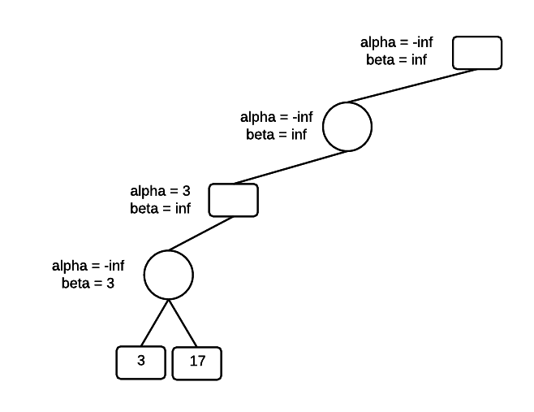

# Search Algorithms

## Breadth First Search (BFS)

Here's the [Wikipedia](https://en.wikipedia.org/wiki/Breadth-first_search) link.

TL;DR Get further and further out as you search.

$O(|V| + |E|)$

```python
def BFS(graph, root):
  for node in graph:
    node.distance = inf
    node.parent = None
  q = Queue()
  root.distance = 0
  q.put(root)
  while not q.empty():
    cnode = q.get()
    for node in cnode.adjacent:
      if node.distance = inf:
        node.distance = cnode.distance + 1
        node.parent = cnode
        q.put(node)
```

## Depth First Search (DFS)

[Wikipedia](https://en.wikipedia.org/wiki/Depth-first_search). TL;DR search all the way down before going out.

```python
def DFS(root):
  root.discovered = True
  for node in root.adjacent:
    if node.discoverd == False:
      DFS(node)
```

# Heuristics

[Wikipedia](https://en.wikipedia.org/wiki/Heuristic_(computer_science)). Rank algorithm based on information available.

# Graph Traversal

## Dijkstra's Algorithm

[Wikipedia](https://en.wikipedia.org/wiki/Dijkstra%27s_algorithm)

```python
def dijkstra(graph, start_node, end_node):
  for node in graph:
    node.distance = inf
    node.visited = False
  start_node.distance = 0
  cnode = start_node
  # Using min-heap as unvisited helps
  # with runtime, cause it's always sorted
  unvisited = {n for n in graph.nodes if n.visited == False}
  while True:
    for node in cnode.adjacent:
      tentative_distance = cnode.distance + 1 # or edge weight
      if tentative_distance < node.distance:
        node.distance = tentative_distance
      cnode.visited = True
      unvisited.remove(cnode)
      if cnode == end_node:
        break
      cnode = unvisited.smallest_distance
```

## A* Search

[Wikipedia](https://en.wikipedia.org/wiki/A*_search_algorithm) - very similar to Dijkstra...

```python
def A_star(graph, start, end):
  closed_set = {}  # Nodes already evaluated
  open_set = {}  # Nodes discovered to be evaluated
  came_from = None  # for each node, its most efficient parent
  for node in graph:
    node.gscore = inf  # cost of getting from start to this node
    node.fscore = inf  # cost of start to goal through node
  start.gscore = 0
  # start's fscore is completely heuristic
  start.fscore = heuristic_estimate(start, goal)
  while len(open_set) != 0:
    cnode = lowest_fscore(open_set)
    if cnode == end:
      return reconstruct_path(camefrom, cnode)
    open_set.remove(cnode)
    closed_set.add(cnode)
    for node in cnode.adjacent:
      if node in closed_set:
        next # ignore evaluated neighbors
      tmp_gscore = cnode.gscore + dist_between(cnode, node)
      if node not in open_set:
        open_set.add(node) # discover a new node
      elif tmp_gscore >= node.gscore:
        next # this is not a better path
      # Best path until now
      cameFrom[node] = cnode
      node.gscore = tmp_gscore
      node.fscore = node.gscore + heuristic_estimate(node, end)
  return False
  
def reconstruct(camefrom, current):
  # basically go backwards from end to start
  total_path = [current]
  while current in cameFrom.keys:
    current = camefrom[current]
    total_path.append(current)
  return total_path
```

# Adversarial Search

## Minimax

```
minimax(node, depth, maxPlayer)
    if depth == 0 or terminal(node) //terminal test is true
        return f(node)  //evaluation of the node
    if maxPlayer //Player(s) = MAX
        bestValue = -MAX_INT //system property, maximum negative integer
        for each child in node.adjacent
            eval = minimax(child, depth - 1, FALSE)
            print eval
            bestValue = max(bestValue, eval)
        return bestValue
    else //Player(s) = MIN
        bestValue = MAX_INT
        for each child in node.adjacent
            eval = minimax(child, depth - 1, TRUE)
            print eval
            bestValue = min(bestValue, eval)
        return bestValue

minimax(origin, depth, TRUE) //call from root for MAX player
```

## Minimax with $\alpha$-$\beta$ Pruning

```python
def alpha_beta_pruning(root, depth, player, alpha, beta):
    if depth == 0 or root.is_empty:
        return root.value
    if player == 'MAX':
        best = -inf
        pruned = False
        for child in root.children:
            if pruned:
                child.pruned = True
            else:
                best = max(best,
                           alpha_beta_pruning(child, depth - 1, 'MIN',
                                              alpha, beta))
                alpha = max(alpha, best)
                root.alpha = alpha
                if beta <= alpha:
                    pruned = True
        print(root)
        return best
    else:
        best = inf
        pruned = False
        for child in root.children:
            if pruned:
                child.pruned = True
            else:
                best = min(best,
                           alpha_beta_pruning(child, depth - 1, 'MAX',
                                              alpha, beta))
                beta = min(beta, best)
                root.beta = beta
                if beta <= alpha:
                    pruned = True
        print(root)
        return best
```

<p><strong>Example: Demonstrate the AB algorithm on the following tree.</strong></p>
<p>Square nodes are MAX.</p>
<p>Circle nodes are MIN.</p>
<p>Start at the root, initialize alpha to -infinity and beta to inf.</p>

<p>Move to the bottom of the tree, passing the values of alpha and beta all the way down. The first player to select is MIN, and MIN will select the minimum of its terminal-node children, which is the 3. Set beta = 3 and leave alpha unchanged.</p>

<p>Next, evaluate the other child of MIN, which is the 17. Since 17 &gt; 3, MIN won't select the 17 and the value of beta is unchanged.</p>
<p>Once we have a MIN value, we know that MAX will be at least 3 and we can set the minimum for MAX, alpha = 3. We've moved up a level in the tree and there was an existing value for beta at this level. That value is left unchanged.</p>

<p>Next, go to the next child for MAX and traverse to the bottom of the tree. The first node that MIN evaluates has a value of 2, which sets beta = 2.  </p>

<p>MIN now has a maximum value of 2. If its other children have values higher than 2, MIN won't select them. However, MAX has a minimum value of 3 in its other child, so MAX won't select the 2. We can prune MINs other children and not evaluate them. We also see that the condition alpha &lt;= N &lt;= beta is violated.</p>
<p>Set the MAX value.</p>

<p>Move to the MIN parent node and set beta = 3. MIN might find a value lower than 3 in the other branch of the tree, but it will not select a value greater than 3. MIN will do no worse than 3.</p>
<p>Recurse to the bottom of the tree, carrying the current alpha and beta values at each level. At the bottom of the tree, MIN encounters a value of 15. However, beta is not changed because one of the rules of alpha-beta pruning is that beta never increases.</p>

<p>At the MAX level, alpha is set to 15. We now have a violation of the constraint that alpha &lt;= N &lt;= beta. Also, searching MAXs other branch is unnecessary because even if MAX finds a value greater than 15, its MIN parent will never select it. So, the other branch can be pruned.</p>

<p>Assign the parent, which is a MIN node. Return to the root and set the value for alpha. The root is a MAX node, setting alpha = 3 means that MAX gets an outcome that is at least 3.</p>
<p> </p>

<p>Traverse to the bottom of the tree, along the right branch of the root, carrying the values for alpha and beta. At the bottom of the tree is a value of 2 for MIN, which sets beta = 2. There is now an alpha-beta violation and the other children of MIN can be pruned. MIN won't select a value greater than 2 and if the 2 made it's way up the tree, it would never be selected by MAX at the root.</p>

<p>Set the MIN value as 2 and move up to the MAX parent level. Beta is now 2 and alpha is still 3.</p>

<p>From the MAX level, recurse to the bottom of the tree along the right branch, passing the values for alpha and beta all the way to the bottom of the tree. alpha = 3 and beta = inf. The value for MIN is updated using the value of the left-most node, which is 3. Beta is now 3, and alpha is 3.</p>

<p>Move up one level in the tree to the MIN node and set beta = 3. At this point in the algorithm, alpha = beta = 3. The remainder of the tree can be pruned because MIN won't select a value greater than 3, and MAX at the root, won't select a value less than 3. The search completes with a minimax value of 3.</p>


# Simulated Annealing

```python
def simulated_annealing(g):
    s, c = generate_solution(g)
    T = 1
    Tmin = 1e-9
    alpha = 0.99
    k = 1
    i = 0
    while T > Tmin:
        sp, cp = generate_solution_neighbor(g, s, c)
        DE = cp - c
        # print(s, c, math.exp(-DE / (k * T)))
        if DE < 0:
            s = sp
            c = cp
        elif random.random() < math.exp(-DE / (k * T)):
            s = sp
            c = cp
        T *= alpha
        i += 1
    print(s, c, i)
```

# Genetic Algorithms

```python
#!/usr/bin/env python3.5

import sys
import random
import itertools

item_count = 10
weight_limit = 50

# weight, value
items = [(random.randint(1, 15), random.randint(1, 10))
         for _ in range(item_count)]
print(items)
print('===')

solutions = [''.join([str(random.randint(0, 1))
             for i in range(len(items))])
             for j in range(3)]

def fitness(items, choices):
    weight = 0
    value = 0
    for choice, item in zip(choices, items):
        if choice == '1':
            weight += item[0]
            value += item[1]
    if weight > weight_limit:
        return 0
    else:
        return value

def combine(choice1, choice2):
    # i = random.randint(1, item_count - 1)
    i = int(item_count / 2)
    # Randomly combine
    if random.random() < .5:
        new_solution = choice1[:i] + choice2[i:]
    else:
        new_solution = choice2[:i] + choice1[i:]
    # 10% of time mutate
    if random.random() < .1:
        new_solution = list(new_solution)
        j = random.randint(0, item_count - 1)
        if new_solution[j] == '0':
            new_solution[j] = '1'
        else:
            new_solution[j] = '0'
        new_solution = ''.join(new_solution)
    return new_solution

def gen_new(top3):
    sols = []
    for _ in range(10):
        perms = list(itertools.permutations(top3))
        random.shuffle(perms)
        i, j = perms[0][:2]
        sols.append(combine(i, j))
    return sols

def get_top3(sols):
    return [s for s, v in sorted(get_value(sols),
            key=lambda tup: -tup[1])[:3]]

def get_value(sols):
    return [(item, fitness(items, item)) for item in sols]

for i in range(10):
    print('Starting with {}'.format(str(get_value(solutions))))
    new_solutions = gen_new(solutions)
    print('Birthed {}'.format(str(get_value(new_solutions))))
    full_solutions = solutions + new_solutions
    solutions = get_top3(full_solutions)
    print('Evolved to {}'.format(str(get_value(solutions))))
    print('---')
```


```python

```
