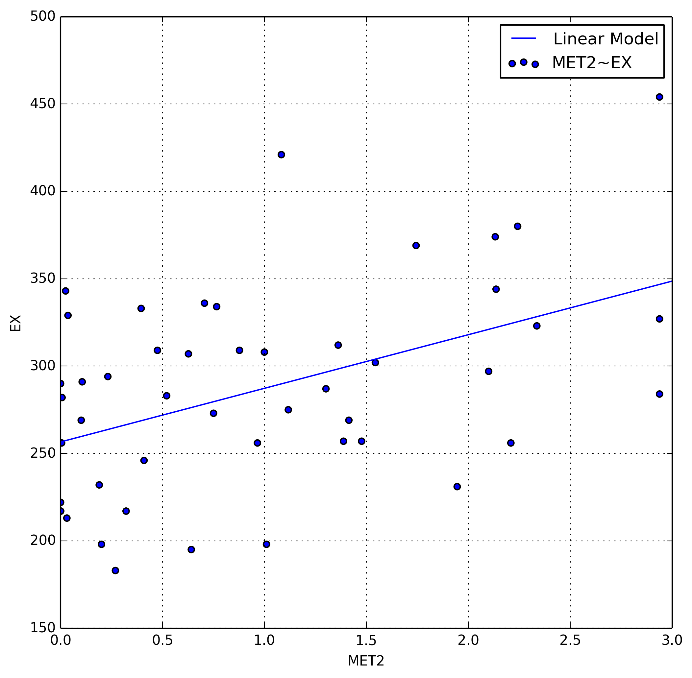

# Statistical Methods Notes

<iframe src="/college/notes/StatisticalMethods/StatisticalMethods.pdf"
        style="width: 100%; height: 40em;">
</iframe>

# Takehome Midterm

<iframe src="/college/notes/StatisticalMethods/m2.pdf"
        style="width: 100%; height: 40em;">
</iframe>

# APPM4570 Takehome Final

It is January of 1963, and President Kennedy has hired you as the Chief
Statistician for the White House! Your first task is to analyze and report state
expenditures across the country. You feel ready for the challenge, since you
studied so hard in your statistical methods class. On day one, JFK hands you an
important data set that contains information on the 48 states in the contiguous
U.S. describing per capita state and local public expenditures associated with
state demographic and economic characteristics in 1960 2 . The data set is found
in the file “stateExpenditures.txt”. )

You are told that you need to quantify how per capita state and local
expenditures can be explained and
predicted by:

* The economic ability index
* The percentage of the population living in a metropolitan area
* The percentage change in the population between 1950 and 1960
* The percentage of the population aged 5-19 years
* The percentage of the population over 65 years old
* Whether the state is located in the western part of the United States or not

The variables available in the data set are labeled as follows:

* EX: Per capita state and local public expenditures ($)
* ECAB: Economic ability index, in which income, retail sales, and the value of
output (manufactures, mineral, and agricultural) per capita are equally weighted
* MET: Percentage of population living in standard metropolitan areas
* GROW: Percent change in population, 1950-1960
* YOUNG: Percent of population aged 5-19 years
* OLD: Percent of population over 65 years of age
* WEST: Western state (1) or not (0)

Keep in mind that the president does not know how to interpret linear model
output, and he wants answers in terms of things that are easily read and
understood. Therefore, when analyzing your models, be sure your answers are
friendly for a general audience, but include enough technical information that
your statistics professor believes you know what you’re talking about.

# Preliminaries

    %pylab inline
    %load_ext rmagic
    
    from IPython.display import display, Math, Latex
    
    matplotlib.rcParams['figure.figsize'] = (8,8)
    rcParams['savefig.dpi'] = 300

    Populating the interactive namespace from numpy and matplotlib

    import pandas as pd
    import numpy as np
    import scipy.stats as stats
    import statsmodels.formula.api as sm
    import matplotlib as mp
    import matplotlib.pyplot as plt
    import pandas.tools.plotting as pp
    import sklearn as sk
    
    data = pd.read_csv('./stateExpenditures.csv')  # Import our data
    
    data['ECAB'] = data['ECAB'] - min(data['ECAB'])     # Standardize Range
    data['YOUNG'] = data['YOUNG'] - min(data['YOUNG'])  # Standardize Range
    data['OLD'] = data['OLD'] - min(data['OLD'])        # Standardize Range
    data['MET-unst'] = data['MET']     # Save MET as unstandardized
    data['MET'] = ((data['MET'] - data['MET'].mean()) /
                    np.sqrt(data['MET'].cov(data['MET'])))  # Standardize values
    
    data.describe()

<table border="1" class="dataframe">
  <thead>
    <tr style="text-align: right;">
      <th></th>
      <th>EX</th>
      <th>ECAB</th>
      <th>MET</th>
      <th>GROW</th>
      <th>YOUNG</th>
      <th>OLD</th>
      <th>WEST</th>
      <th>MET-unst</th>
    </tr>
  </thead>
  <tbody>
    <tr>
      <th>count</th>
      <td>  48.000000</td>
      <td>  48.000000</td>
      <td> 4.800000e+01</td>
      <td> 48.000000</td>
      <td> 48.000000</td>
      <td> 48.00000</td>
      <td> 48.000000</td>
      <td> 48.000000</td>
    </tr>
    <tr>
      <th>mean</th>
      <td> 286.645833</td>
      <td>  39.354167</td>
      <td> 4.440892e-16</td>
      <td> 18.729167</td>
      <td>  4.114583</td>
      <td>  3.81250</td>
      <td>  0.500000</td>
      <td> 46.168750</td>
    </tr>
    <tr>
      <th>std</th>
      <td>  58.794807</td>
      <td>  22.252831</td>
      <td> 1.000000e+00</td>
      <td> 18.874749</td>
      <td>  2.148526</td>
      <td>  1.63936</td>
      <td>  0.505291</td>
      <td> 26.938797</td>
    </tr>
    <tr>
      <th>min</th>
      <td> 183.000000</td>
      <td>   0.000000</td>
      <td>-1.713839e+00</td>
      <td> -7.400000</td>
      <td>  0.000000</td>
      <td>  0.00000</td>
      <td>  0.000000</td>
      <td>  0.000000</td>
    </tr>
    <tr>
      <th>25%</th>
      <td> 253.500000</td>
      <td>  28.000000</td>
      <td>-8.192181e-01</td>
      <td>  6.975000</td>
      <td>  2.400000</td>
      <td>  2.55000</td>
      <td>  0.000000</td>
      <td> 24.100000</td>
    </tr>
    <tr>
      <th>50%</th>
      <td> 285.500000</td>
      <td>  37.900000</td>
      <td>-6.960222e-04</td>
      <td> 14.050000</td>
      <td>  4.000000</td>
      <td>  4.05000</td>
      <td>  0.500000</td>
      <td> 46.150000</td>
    </tr>
    <tr>
      <th>75%</th>
      <td> 324.000000</td>
      <td>  47.700000</td>
      <td> 8.837161e-01</td>
      <td> 22.675000</td>
      <td>  5.625000</td>
      <td>  5.02500</td>
      <td>  1.000000</td>
      <td> 69.975000</td>
    </tr>
    <tr>
      <th>max</th>
      <td> 454.000000</td>
      <td> 147.600000</td>
      <td> 1.497144e+00</td>
      <td> 77.800000</td>
      <td>  8.900000</td>
      <td>  6.50000</td>
      <td>  1.000000</td>
      <td> 86.500000</td>
    </tr>
  </tbody>
</table>

8 rows × 8 columns

# Part One

## Question 1

**Make scatter plots of the continuous covariates, both against each other and
against the outcome (expenditures). Does the relationship between the
independent variables and the dependent variables appear to be linear? Do there
appear to be independent variables that are collinear?**

    sc_matrix = pp.scatter_matrix(data[['EX', 'ECAB', 'MET',
                                    'GROW', 'YOUNG', 'OLD', 'WEST']],
                                  alpha=0.7)

We can use `pandas` built in `scatter_matrix` method to plot all random
variables against each other. When examining this plot we notice several linear
relationships immediately, which we can enumerate.

* `EX` vs. `ECAB`
* `EX` vs. `GROW`
* `EX` vs. `YOUNG`

This is good, as it indicates a good chance that we will be able to create a
linear model to predict our dependent variable, in this case `EX`.

We also notice some collinearity with our variables, listed below.

* `ECAB` vs. `MET`
* `ECAB` vs. `GROW`
* `ECAB` vs. `YOUNG`
* `ECAB` vs. `OLD`
* `MET` vs. `GROW`
* `YOUNG` vs. `OLD`

This collinearity is bad, as it will affect any regression we perform. We will
later take steps to remove these collinear variables.

## Question 2

**Fit the following model, converting any variables as you see necessary so that
the intercept can be interpreted in a meaningful way, and so that variables with
a large range are standardized:**

\begin{equation}
    \begin{aligned}
        Y_i =& \beta_0 + \beta_1 \text{ECAB} + \beta_2 \text{MET} + \beta_3
\text{GROW} +\\
                &\beta_4 \text{YOUNG} + \beta_5 \text{OLD} + \beta_6 \text{WEST}
+ \epsilon_i
    \end{aligned}
\end{equation}

**Write out the estimated regression model. What do you notice about the
significance of the parameters in this model?**

We've already standardized the range of several of the variables, as well
standardizing `MET` to the standard normal distribution. Using the Ordinary
Least Squares method of linear regression we can create our linear model.

    # Multiple linear regression formula
    multi_regression = sm.ols(formula='''EX ~ ECAB + MET + GROW +
                              YOUNG + OLD + WEST''', data=data).fit()
    multi_regression.summary()

<table class="simpletable">
<caption>OLS Regression Results</caption>
<tr>
  <th>Dep. Variable:</th>           <td>EX</td>        <th>  R-squared:         </th> <td>   0.599</td>
</tr>
<tr>
  <th>Model:</th>                   <td>OLS</td>       <th>  Adj. R-squared:    </th> <td>   0.541</td>
</tr>
<tr>
  <th>Method:</th>             <td>Least Squares</td>  <th>  F-statistic:       </th> <td>   10.22</td>
</tr>
<tr>
  <th>Date:</th>             <td>Wed, 07 May 2014</td> <th>  Prob (F-statistic):</th> <td>6.63e-07</td>
</tr>
<tr>
  <th>Time:</th>                 <td>09:21:23</td>     <th>  Log-Likelihood:    </th> <td> -241.20</td>
</tr>
<tr>
  <th>No. Observations:</th>      <td>    48</td>      <th>  AIC:               </th> <td>   496.4</td>
</tr>
<tr>
  <th>Df Residuals:</th>          <td>    41</td>      <th>  BIC:               </th> <td>   509.5</td>
</tr>
<tr>
  <th>Df Model:</th>              <td>     6</td>      <th>                     </th>     <td> </td>   
</tr>
<tr>
  <th>Covariance Type:</th>      <td>nonrobust</td>    <th>                     </th>     <td> </td>   
</tr>
</table>
<table class="simpletable">
<tr>
      <td></td>         <th>coef</th>     <th>std err</th>      <th>t</th>      <th>P>|t|</th> <th>[95.0% Conf. Int.]</th> 
</tr>
<tr>
  <th>Intercept</th> <td>  236.9162</td> <td>   67.850</td> <td>    3.492</td> <td> 0.001</td> <td>   99.890   373.942</td>
</tr>
<tr>
  <th>ECAB</th>      <td>    1.4185</td> <td>    0.430</td> <td>    3.298</td> <td> 0.002</td> <td>    0.550     2.287</td>
</tr>
<tr>
  <th>MET</th>       <td>  -17.7837</td> <td>    9.499</td> <td>   -1.872</td> <td> 0.068</td> <td>  -36.967     1.399</td>
</tr>
<tr>
  <th>GROW</th>      <td>    0.5716</td> <td>    0.425</td> <td>    1.345</td> <td> 0.186</td> <td>   -0.287     1.430</td>
</tr>
<tr>
  <th>YOUNG</th>     <td>   -6.6747</td> <td>    7.481</td> <td>   -0.892</td> <td> 0.377</td> <td>  -21.782     8.433</td>
</tr>
<tr>
  <th>OLD</th>       <td>   -1.8551</td> <td>    7.137</td> <td>   -0.260</td> <td> 0.796</td> <td>  -16.268    12.558</td>
</tr>
<tr>
  <th>WEST</th>      <td>   35.4723</td> <td>   13.771</td> <td>    2.576</td> <td> 0.014</td> <td>    7.661    63.284</td>
</tr>
</table>
<table class="simpletable">
<tr>
  <th>Omnibus:</th>       <td> 0.723</td> <th>  Durbin-Watson:     </th> <td>   2.349</td>
</tr>
<tr>
  <th>Prob(Omnibus):</th> <td> 0.697</td> <th>  Jarque-Bera (JB):  </th> <td>   0.524</td>
</tr>
<tr>
  <th>Skew:</th>          <td> 0.253</td> <th>  Prob(JB):          </th> <td>   0.770</td>
</tr>
<tr>
  <th>Kurtosis:</th>      <td> 2.927</td> <th>  Cond. No.          </th> <td>    602.</td>
</tr>
</table>

We immediately notice that the most significant parameter is `WEST`, followed by
`MET`, followed by `YOUNG`. This makes some sense, as `WEST` is restricted to
values $\left\{ 0, 1 \right\}$.

## Question 3

**Closely examine the relationship between the percentage of the population
living in a metropolitan area and the dependent variable. Does this relationship
appear to be linear? Add a term to the model you created in part (2) to
compensate for this non-linearity (justify your thinking), and then write out
your estimated model. Does this model seem better than the previous model? Why
or why not?**

Let's examine this plot a little closer by adding a linear and quadratic
regression line between `MET` and `EX` using `scipy` for our linear regression
and `numpy` for our quadratic regression.

    # New two-var linear regression line
    ex_met_regression = sm.ols(formula='EX ~ MET', data=data).fit().params
    ex_met_regression['MET2'] = 0
    # New two-var quadratic regression line
    ex_met_quad       = np.polyfit(data['MET'], data['EX'], 2)[::-1]
    
    pd.DataFrame({'Linear Model':ex_met_regression,
                  'Quadratic Model':ex_met_quad})

<table border="1" class="dataframe">
  <thead>
    <tr style="text-align: right;">
      <th></th>
      <th>Linear Model</th>
      <th>Quadratic Model</th>
    </tr>
  </thead>
  <tbody>
    <tr>
      <th>Intercept</th>
      <td> 286.645833</td>
      <td> 255.121129</td>
    </tr>
    <tr>
      <th>MET</th>
      <td>   2.659590</td>
      <td>   7.676721</td>
    </tr>
    <tr>
      <th>MET2</th>
      <td>   0.000000</td>
      <td>  32.195443</td>
    </tr>
  </tbody>
</table>

3 rows × 2 columns

Now we'll plot our two regression lines along with the scatter plot of `EX ~
MET`.

    fig, ax = plt.subplots()
    x       = np.arange(-2, 3, 0.01)
    ax.scatter(data['MET'], data['EX'],
               label='EX~MET')  # EX~MET scatter
    # Linear Regresssion Line
    ax.plot(x, ex_met_regression[0] + 
            ex_met_regression[1] * x,
            label=(r'Linear Regression'
                   '\n'
                   r'$\hat{\beta}_1 \cdot x + \hat{\beta}_0$'))
    # Quadratic Regresssion Line
    ax.plot(x, ex_met_quad[2] * x**2 +
            ex_met_quad[1] * x + ex_met_quad[0],
            label=(r'Quadratic Regression'
                   '\n'
                   r'$\hat{\beta}_2\cdot x^2+\hat{\beta}_1\cdot x+\hat{\beta}_0$'))
    handles, labels = ax.get_legend_handles_labels()
    ax.legend(handles, labels)
    ax.grid(True, which='both')
    plt.xlabel('MET')
    plt.ylabel('EX')
    plt.xlim((-2,2))
    plt.ylim((150, 500))
    plt.show()

We immediately notice that our regression is *not* linear, and in fact appears
to be quadratic. When we compare our two models, one linear and one quadratic,
the quadratic model appears to fit the data much better.

\begin{equation}
    \begin{aligned}
        f(x) &=& 32.1954 \cdot x^2 + 7.6767 \cdot x + 255.1211& \qquad \to
\text{Quadratic}\\
        f(x) &=& 2.6595 \cdot x + 286.6458& \qquad \to \text{Linear}
    \end{aligned}
\end{equation}

We can add a new column to our data, in this case $\text{MET}^2$, which we'll
call `MET2`. Since we've shown a quadratic model to fit this particular
variable, we can add a squared version of it to our dataset. We can now plot
`EX~MET2` do demonstrate the now linear relationship between the two random
variables.

    # Add variable to data
    data['MET2'] = pd.Series(data['MET']**2, index=data.index)
    
    # New linear regression
    ex_met2 = np.polyfit(data['MET2'], data['EX'], 1)
    
    fig, ax = plt.subplots()
    ax.scatter(data['MET2'], data['EX'], label='MET2~EX')
    x = np.arange(0, 3.5)
    ax.plot(x, ex_met2[0] * x + ex_met2[1], label='Linear Model')
    ax.grid(True, which='both')
    ax.set_xlabel('MET2')
    ax.set_ylabel('EX')
    handles, labels = ax.get_legend_handles_labels()
    ax.legend(handles, labels)
    plt.xlim((0, 3))
    plt.show()

We also examine the adjusted coefficients of determination for both our linear
and quadratic model which is defined as

\begin{equation}
\bar R^2 = {R^{2}-(1-R^{2}){p \over n-p-1} }
\end{equation}

    %R -i data -o quadr2 quadr2 <- summary(lm(EX ~ MET + MET2, data=data))$adj.r.squared
    %R -o linr2 linr2 <- summary(lm(EX ~ MET, data=data))$adj.r.squared
    
    print('Quadratic R2:  ', quadr2[0])
    print('Linear R2:    ', linr2[0])

    Quadratic R2:   0.198787097218
    Linear R2:     -0.0196484323278

Note, our quadratic model is an order of magnitude better at explaining the
relationship between the two variables. This essentially boils down to the fact
that we *should* favor the quadratic model over the linear one in the future.

## Question 4

**Self-performed model selection: starting with the full model created in part
(2): remove the predictor with the highest p-value, and re-calculate the model
without that predictor. Continue this process until there are no predictors left
with p-values greater than 0.05. Write out your final estimated model. Do you
think that this model is better than the full model? Why or why not?**

We've already calculated our p-values for our multiple regression, so we can
examine values that exceed 0.05.

    sm.ols(formula=('EX ~ ECAB + MET + MET2 + GROW + YOUNG +'
                    'OLD + WEST'), data=data).fit().pvalues

    Intercept    0.015912
    ECAB         0.000749
    MET          0.586313
    MET2         0.001332
    GROW         0.074371
    YOUNG        0.931018
    OLD          0.534383
    WEST         0.008192
    dtype: float64

We can now remove the fields with greater p-values one at a time, examining the
p-values as we go. First is `YOUNG`.

    sm.ols(formula='''EX ~ ECAB + MET + MET2 + GROW + OLD + WEST''',
           data=data).fit().pvalues

    Intercept    6.434445e-11
    ECAB         2.144302e-05
    MET          4.074601e-01
    MET2         7.624931e-04
    GROW         6.430896e-02
    OLD          3.042440e-01
    WEST         3.719836e-03
    dtype: float64

Next is `MET`

    sm.ols(formula='''EX ~ ECAB + MET2 + GROW + OLD + WEST''',
           data=data).fit().pvalues

    Intercept    1.953933e-11
    ECAB         1.934543e-05
    MET2         2.193928e-04
    GROW         9.082126e-02
    OLD          3.421252e-01
    WEST         4.504071e-04
    dtype: float64

Next is `OLD`

    sm.ols(formula='''EX ~ ECAB + MET2 + GROW + WEST''',
           data=data).fit().pvalues

    Intercept    4.954987e-19
    ECAB         7.617470e-06
    MET2         2.400175e-04
    GROW         1.523282e-01
    WEST         4.430367e-04
    dtype: float64

Next is `Grow`

    purged_multi_regression = sm.ols(formula='''EX ~ ECAB + MET2 + WEST''',
                                     data=data).fit()
    purged_multi_regression.summary()

<table class="simpletable">
<caption>OLS Regression Results</caption>
<tr>
  <th>Dep. Variable:</th>           <td>EX</td>        <th>  R-squared:         </th> <td>   0.663</td>
</tr>
<tr>
  <th>Model:</th>                   <td>OLS</td>       <th>  Adj. R-squared:    </th> <td>   0.640</td>
</tr>
<tr>
  <th>Method:</th>             <td>Least Squares</td>  <th>  F-statistic:       </th> <td>   28.88</td>
</tr>
<tr>
  <th>Date:</th>             <td>Wed, 07 May 2014</td> <th>  Prob (F-statistic):</th> <td>1.77e-10</td>
</tr>
<tr>
  <th>Time:</th>                 <td>09:21:28</td>     <th>  Log-Likelihood:    </th> <td> -237.04</td>
</tr>
<tr>
  <th>No. Observations:</th>      <td>    48</td>      <th>  AIC:               </th> <td>   482.1</td>
</tr>
<tr>
  <th>Df Residuals:</th>          <td>    44</td>      <th>  BIC:               </th> <td>   489.6</td>
</tr>
<tr>
  <th>Df Model:</th>              <td>     3</td>      <th>                     </th>     <td> </td>   
</tr>
<tr>
  <th>Covariance Type:</th>      <td>nonrobust</td>    <th>                     </th>     <td> </td>   
</tr>
</table>
<table class="simpletable">
<tr>
      <td></td>         <th>coef</th>     <th>std err</th>      <th>t</th>      <th>P>|t|</th> <th>[95.0% Conf. Int.]</th> 
</tr>
<tr>
  <th>Intercept</th> <td>  184.9759</td> <td>   12.072</td> <td>   15.323</td> <td> 0.000</td> <td>  160.646   209.306</td>
</tr>
<tr>
  <th>ECAB</th>      <td>    1.5199</td> <td>    0.236</td> <td>    6.444</td> <td> 0.000</td> <td>    1.045     1.995</td>
</tr>
<tr>
  <th>MET2</th>      <td>   22.5489</td> <td>    5.888</td> <td>    3.829</td> <td> 0.000</td> <td>   10.682    34.416</td>
</tr>
<tr>
  <th>WEST</th>      <td>   39.5505</td> <td>   10.191</td> <td>    3.881</td> <td> 0.000</td> <td>   19.012    60.089</td>
</tr>
</table>
<table class="simpletable">
<tr>
  <th>Omnibus:</th>       <td> 1.897</td> <th>  Durbin-Watson:     </th> <td>   2.613</td>
</tr>
<tr>
  <th>Prob(Omnibus):</th> <td> 0.387</td> <th>  Jarque-Bera (JB):  </th> <td>   1.261</td>
</tr>
<tr>
  <th>Skew:</th>          <td>-0.095</td> <th>  Prob(JB):          </th> <td>   0.532</td>
</tr>
<tr>
  <th>Kurtosis:</th>      <td> 2.229</td> <th>  Cond. No.          </th> <td>    119.</td>
</tr>
</table>

And we finally obtain our model with large p-values removed containing *only*
`ECAB`, `MET2`, and `WEST`. We can create another scatter plot to show only our
selected variables.

    sc_matrix = pp.scatter_matrix(data[['EX', 'ECAB', 'MET2', 'WEST']],
                                  alpha=0.7)

This model is more accurate than our previous model as we've removed all
variables that are either collinear or don't have enough of an impact on `EX`.
Using only these variables we can much more accurately represent the changes in
`EX`.

## Question 5

**Perform a hypothesis test to determine if the predictors removed from the full
model from part (3) to create the model in (4) should be kept in the model.
Provide the hypothesis, perform the test, and state the conclusions and
p-values. Be sure to provide your answer in terms of the original problem.**

* We first establish our Null and Alternate Hypotheses. The subsequent test is
then performed using the residual sum of squares for each model. For these
hypotheses, $\beta_j$ is the coefficient of the variable that was removed from
our model in part 4.

\begin{equation*}
    \begin{cases}
        H_0 \to Y_l \to \text{All $\beta_j$ are equal to 0}\\
        H_\alpha \to Y_k \to \text{At least one $\beta_j$ is not zero}
    \end{cases}
\end{equation*}

* We can now perform the test necessary, but we first need our test statistic,
$f$, which has $F$ distribution. This is found by the following equation.

\begin{equation}
    \frac{\left( \text{SSE}_l - \text{SSE}_k \right) / (k - l)}
    {\text{SSE}_k / \left[ n - (k + 1) \right]}
\end{equation}

    k = 7   # Establish constants
    l = 3
    n = 48

We use `R` to determine our $\sum {\left( y_i - \hat{y_i} \right)}^2$, or our
residual sum of squares for each model.

    %%R -i data -o sse
    fit_full <- lm(EX ~ ECAB + MET + MET2 + GROW
                   + YOUNG + OLD + WEST, data=data)
    fit_small <- lm(EX ~ ECAB + MET2 + WEST, data=data)
    sse <- c(deviance(fit_full), deviance(fit_small))

Finally we implement our equation.

    f = (((sse[1] - sse[0]) / (k - l)) /
         (sse[0] / (n - (k + 1))))
    print('Test Statistic:', f)

    Test Statistic: 0.909796312571

* We can now compare our value of $f$ with $F_{\alpha, k - l, n - (k + 1)}$. We
reject $H_0$ if $f$ is greater than or equal to our $F$ distribution using a
confidence level of $\alpha = 0.05$.

    F = stats.f.ppf(0.95, k - l, n - (k + 1))
    print('Do we Reject?', f >= F)

    Do we Reject? False

* Therefore we now know that we should use our purged model, as it better
explains the variation in `EX`. We also examine the p-values to make sure that
our test statistic is reasonable.

    p = stats.f.cdf(f, k - l, n - (k + 1))
    print('P-Value: ', p)

    P-Value:  0.532449100876

Since our p-value is above $0.1$ there is no presumption against the null
hypothesis, and our calculated test stastic is reasonable.

## Question 6

**Software-performed model selection: Use a built-in model selection routine on
the full model from part (2). You may pick whatever routine you would like, but
you must provide a short description of the routine and how it performs model
selection. Write out the estimated regression model that the routine selects as
best. Does this model match the model from part (4)? If not, do you think this
model is better or worse? Why? Notice that this portion is worth the most points
in this section, so be very thorough with your answer.**

We will use `R` for this part, as the libraries available to `python` are a
little less developed. The tool in question is called `stepAIC` from the `MASS`
package which iterates through our data, eliminating collinear variables as it
goes.

In order to find the best combination of variables we need to maximize $R^2$,
but minimize the amount of variables. We are primarily interested in three
parameters:

1. $R^2_k \to$ The coefficient of multiple determination explains how much
variation in `EX` is explained by the current model with $k$ variables.
2. $\text{MSE}_k \to \frac{\text{SSE}_k}{n - k - 1} \to$ The mean squared error
for the given model, which we wish to minimize. This consideration is considered
equivalent to the consideration of the adjusted $R^2_k$.
3. $C_k \to \frac{\text{SSE}_k}{s^2} + 2(k + 1) - n \to$ This somewhat abstract
criteria must be minimized.

There are two ways two select the proper variables, forward and backward
selection.

* Forward Selection
    1. Start with all variables, eliminate one at a time
* Backward Selection
    1. Start with no variables, add one by one

    %%R -i data
    library('MASS')
    df <- data.frame(ex=data[[1]], ecab=data[[2]], 
                     met=data[[3]], grow=data[[4]], 
                     young=data[[5]], old=data[[6]],
                     west=data[[7]], met2=data[[10]])
    fit <- lm(ex~ecab+met+grow+young+old+west+met2,data=df)
    step <- stepAIC(fit, direction='both')
    step$anova

    Start:  AIC=349.68
    ex ~ ecab + met + grow + young + old + west + met2
    
            Df Sum of Sq   RSS    AIC
    - young  1       9.5 50165 347.69
    - met    1     377.4 50532 348.04
    - old    1     492.5 50648 348.15
    <none>               50155 349.68
    - grow   1    4209.3 54364 351.55
    - west   1    9707.9 59863 356.17
    - met2   1   14932.8 65088 360.19
    - ecab   1   16709.3 66864 361.48
    
    Step:  AIC=347.69
    ex ~ ecab + met + grow + old + west + met2
    
            Df Sum of Sq   RSS    AIC
    - met    1     857.1 51022 346.50
    - old    1    1324.4 51489 346.94
    <none>               50165 347.69
    + young  1       9.5 50155 349.68
    - grow   1    4422.9 54587 349.75
    - west   1   11582.4 61747 355.66
    - met2   1   16187.1 66352 359.11
    - ecab   1   28164.1 78329 367.08
    
    Step:  AIC=346.5
    ex ~ ecab + grow + old + west + met2
    
            Df Sum of Sq   RSS    AIC
    - old    1    1121.6 52143 345.55
    <none>               51022 346.50
    + met    1     857.1 50165 347.69
    - grow   1    3639.3 54661 347.81
    + young  1     489.2 50532 348.04
    - west   1   17611.8 68633 358.74
    - met2   1   19873.9 70896 360.29
    - ecab   1   28168.2 79190 365.60
    
    Step:  AIC=345.55
    ex ~ ecab + grow + west + met2
    
            Df Sum of Sq   RSS    AIC
    <none>               52143 345.55
    - grow   1    2574.9 54718 345.86
    + old    1    1121.6 51022 346.50
    + met    1     654.2 51489 346.94
    + young  1     144.3 51999 347.41
    - west   1   17562.1 69705 357.48
    - met2   1   19468.0 71611 358.77
    - ecab   1   31375.9 83519 366.16
    Stepwise Model Path 
    Analysis of Deviance Table
    
    Initial Model:
    ex ~ ecab + met + grow + young + old + west + met2
    
    Final Model:
    ex ~ ecab + grow + west + met2
    
    
         Step Df    Deviance Resid. Df Resid. Dev      AIC
    1                               40   50155.02 349.6803
    2 - young  1    9.514664        41   50164.54 347.6894
    3   - met  1  857.107838        42   51021.64 346.5026
    4   - old  1 1121.551966        43   52143.19 345.5463

This yields a final model of

\begin{equation}
    \text{EX} = \hat{\beta}_0 +
                \hat{\beta}_1 \text{ECAB} +
                \hat{\beta}_2 \text{GROW} +
                \hat{\beta}_3 \text{WEST} +
                \hat{\beta}_4 \text{MET2}
\end{equation}

Which is better than our previous models as it examines all combinations of the
variables.

## Question 7

**Between the models created in part (4) and part (6), pick your favorite. Check
the assumptions of this model. Does it seem that this model has satisfied these
assumptions?**

I really like the model I created in part (6), which I'll restate here just
because it's my favorite.

\begin{equation}
    \text{EX} = \hat{\beta}_0 +
                \hat{\beta}_1 \text{ECAB} +
                \hat{\beta}_2 \text{GROW} +
                \hat{\beta}_3 \text{WEST} +
                \hat{\beta}_4 \text{MET2}
\end{equation}

Which looks like the following.

    purged_multi_regression = sm.ols(formula='''EX ~ ECAB + GROW + MET2 + WEST''',
                                     data=data).fit()
    purged_multi_regression.summary()

<table class="simpletable">
<caption>OLS Regression Results</caption>
<tr>
  <th>Dep. Variable:</th>           <td>EX</td>        <th>  R-squared:         </th> <td>   0.679</td>
</tr>
<tr>
  <th>Model:</th>                   <td>OLS</td>       <th>  Adj. R-squared:    </th> <td>   0.649</td>
</tr>
<tr>
  <th>Method:</th>             <td>Least Squares</td>  <th>  F-statistic:       </th> <td>   22.75</td>
</tr>
<tr>
  <th>Date:</th>             <td>Wed, 07 May 2014</td> <th>  Prob (F-statistic):</th> <td>3.81e-10</td>
</tr>
<tr>
  <th>Time:</th>                 <td>09:21:52</td>     <th>  Log-Likelihood:    </th> <td> -235.88</td>
</tr>
<tr>
  <th>No. Observations:</th>      <td>    48</td>      <th>  AIC:               </th> <td>   481.8</td>
</tr>
<tr>
  <th>Df Residuals:</th>          <td>    43</td>      <th>  BIC:               </th> <td>   491.1</td>
</tr>
<tr>
  <th>Df Model:</th>              <td>     4</td>      <th>                     </th>     <td> </td>   
</tr>
<tr>
  <th>Covariance Type:</th>      <td>nonrobust</td>    <th>                     </th>     <td> </td>   
</tr>
</table>
<table class="simpletable">
<tr>
      <td></td>         <th>coef</th>     <th>std err</th>      <th>t</th>      <th>P>|t|</th> <th>[95.0% Conf. Int.]</th> 
</tr>
<tr>
  <th>Intercept</th> <td>  183.4190</td> <td>   11.969</td> <td>   15.325</td> <td> 0.000</td> <td>  159.282   207.556</td>
</tr>
<tr>
  <th>ECAB</th>      <td>    1.3404</td> <td>    0.264</td> <td>    5.087</td> <td> 0.000</td> <td>    0.809     1.872</td>
</tr>
<tr>
  <th>GROW</th>      <td>    0.4452</td> <td>    0.306</td> <td>    1.457</td> <td> 0.152</td> <td>   -0.171     1.061</td>
</tr>
<tr>
  <th>MET2</th>      <td>   23.4206</td> <td>    5.845</td> <td>    4.007</td> <td> 0.000</td> <td>   11.633    35.209</td>
</tr>
<tr>
  <th>WEST</th>      <td>   38.4123</td> <td>   10.094</td> <td>    3.806</td> <td> 0.000</td> <td>   18.057    58.768</td>
</tr>
</table>
<table class="simpletable">
<tr>
  <th>Omnibus:</th>       <td> 0.407</td> <th>  Durbin-Watson:     </th> <td>   2.735</td>
</tr>
<tr>
  <th>Prob(Omnibus):</th> <td> 0.816</td> <th>  Jarque-Bera (JB):  </th> <td>   0.556</td>
</tr>
<tr>
  <th>Skew:</th>          <td> 0.014</td> <th>  Prob(JB):          </th> <td>   0.757</td>
</tr>
<tr>
  <th>Kurtosis:</th>      <td> 2.473</td> <th>  Cond. No.          </th> <td>    132.</td>
</tr>
</table>

There are four assumptions of the model which we can examine.

1. Linearity of the relationship between dependent and independent variables
2. Independence of the errors (no serial correlation)
3. Homoscedasticity (constant variance) of the errors
    1. versus time
    2. versus the predictions (or versus any independent variable)
4. Normality of the error distribution.

We will examine each assumption individually using diagnostic plots.

**Linearity**

For linearity we will plot the `Observed Values~Predicted Values` and the
`Residuals~Predicted Values`. We first use `R` to determine the residuals for
our model, as well as our fitted values, $\hat{y}$.

    %R -i data fit <- lm(EX ~ ECAB + GROW + WEST + MET2, data=data)
    %R -o r,yh r <- residuals(fit); yh <- fitted(fit)

    array([ 246.76589624,  265.58001954,  293.53320353,  304.27903757,
            285.84578381,  312.66313097,  311.60135975,  310.44023448,
            280.64162961,  296.3931407 ,  278.63149143,  220.431476  ,
            285.06956775,  283.60906205,  263.26293335,  305.9126729 ,
            252.91690939,  224.7764192 ,  214.2564556 ,  210.75435475,
            232.5036399 ,  205.91479801,  210.74112334,  261.47566014,
            241.04280851,  267.60454393,  280.42857451,  286.98677517,
            286.52948096,  312.20562753,  301.31370148,  283.12186639,
            290.46107077,  324.61519378,  257.72998807,  261.70705142,
            297.63520969,  289.10405759,  319.42226914,  299.60756465,
            345.46831432,  388.40416046,  340.29536166,  296.34157683,
            297.57903212,  283.81829211,  479.66794847,  369.90953046])

We can now use diagnostic plots on these determined values.

    fig, ax = plt.subplots(2, 1)
    ax[0].scatter(data['EX'], yh, label=r'EX~$\hat{y}$')
    ax[0].plot(np.arange(100, 600), np.arange(100, 600),
               'k--', label=r'$y=x$')
    ax[1].scatter(yh, r, label=r'$\hat{y}$~Residuals')
    ax[1].plot(np.arange(100, 600), np.zeros(500),
               'k--', label=r'$y=0$')
    ax[0].set_xlabel('Observed Values')
    ax[0].set_ylabel('Predicted Values')
    ax[1].set_ylabel('Residuals')
    ax[1].set_xlabel('Predicted Values')
    ax[0].grid(True, which='both')
    ax[1].grid(True, which='both')
    handles, labels = ax[0].get_legend_handles_labels()
    ax[0].legend(handles, labels)
    handles, labels = ax[1].get_legend_handles_labels()
    ax[1].legend(handles, labels)
    plt.show()

In our first plot our data follows a diagonal line. This is good as it show a
strong linear relationship between our predictions and our observations. In the
perfect world this would be a direct 1-1 correspondence, as the line $y=x$ is
ideal.

In the second plot our values are for the most part centered around a horizontal
line. Again, this is good as it shows that our residuals are static and normally
distributed.

**Independence**

For independence we will examine the scatter matrix and examine our variables.

    sc_matrix = pp.scatter_matrix(data[['EX', 'ECAB', 'GROW', 'MET2', 'WEST']],
                                  alpha=0.7)

By examining our scatter matrix we can determine that for the most part only our
dependent and independent variables have a linear relation. This is good, as it
shows we've removed variables that have a linear relationship between other
variables.

**Homoscedasticity**

We will examine `Residuals~Time` and `Residuals~Predicted Value`.

    fig, ax = plt.subplots(2, 1)
    ax[0].plot(np.arange(0, 48), r, label='Residuals over Time')
    ax[0].plot(np.arange(0, 49), np.zeros(49),
               'k--', label=r'$y=0$')
    ax[1].scatter(yh, r, label=r'$\hat{y}$~Residuals')
    ax[1].plot(np.arange(100, 600), np.zeros(500),
               'k--', label=r'$y=0$')
    ax[0].set_xlabel('"Time"')
    ax[0].set_ylabel('Residuals')
    ax[1].set_ylabel('Residuals')
    ax[1].set_xlabel('Predicted Values')
    ax[0].grid(True, which='both')
    ax[1].grid(True, which='both')
    ax[0].set_ylim((-120, 120))
    handles, labels = ax[0].get_legend_handles_labels()
    ax[0].legend(handles, labels)
    handles, labels = ax[1].get_legend_handles_labels()
    ax[1].legend(handles, labels)
    plt.show()

Our first plot is good as it shows a steady range of residuals that aren't
growing larger or smaller. Our second plot on the other hand shows our residuals
growing larger (more spread out) as our predicted values increase. This is bad.

**Normality**

We will create a normal probability plot of the residuals by first standardizing
and then plotting.

    fig, ax = plt.subplots()
    std_res = (r - mean(r)) / np.std(r)
    ax.hist(std_res, bins=15, label='Standardized Residuals')
    x = np.arange(-2, 2, 0.01)
    normal = lambda x: stats.norm.pdf(x)
    ax.plot(x, 15 * normal(x), 'r-', linewidth=3,
            label='Normal Distribution Curve')
    handles, labels = ax.get_legend_handles_labels()
    ax.legend(handles, labels)
    plt.show()

We note that we only have 48 datapoints, and as a result our data does not look
very normal. That being said, for only having 48 datapoints we are lucky to have
a distribution that is as normally distributed as this one is.

## Question 8

**Write out the estimate of your favorite model, and interpret all the
parameters. Be sure to provide interpretations in terms of the original problem,
including the original scale of the dependent and independent variables.**

This is my favorite model. I'm putting it here again just to emphasize that this
is *my favorite model*.

\begin{equation}
    \text{EX} = \hat{\beta}_0 +
                \hat{\beta}_1 \text{ECAB} +
                \hat{\beta}_2 \text{GROW} +
                \hat{\beta}_3 \text{WEST} +
                \hat{\beta}_4 \text{MET2}
\end{equation}

* $\hat{\beta}_0$ is the intercept. This term tells us when all other terms are
zero what to expect `EX` to be.
* $\left\{ \hat{\beta}_1, \ldots, \hat{\beta}_4 \right\}$ are the slope
parameters for our independent variables. These terms determine how quickly `EX`
changes based on the changes expressed in our variables.

We can rewrite my favorite model with actual values.

    %R -i data coefficients(lm(EX~ECAB+GROW+WEST+MET2,data=data))

    array([ 183.41900335,    1.34036834,    0.44523992,   38.41226602,
             23.42057379])

Yielding the below equation which can also be written as a function of four
variables.

\begin{equation}
\begin{aligned}
    \text{EX} &=& 183.4190 + 1.3403 \cdot \text{ECAB} +
                0.4452 \cdot \text{GROW} + 38.4122 \cdot \text{WEST} +
                23.4205 \cdot \text{MET2}\\
     f(w, x, y, z) &=& 183.4190 + 1.3403 \cdot w +
                0.4452 \cdot x + 38.4122 \cdot y +
                23.4205 \cdot z\\
\end{aligned}
\end{equation}

If we become more specific about the details of our model, we see that when
`ECAB = GROW = WEST = MET2 = 0` our dependent variable, `EX`, is equal to
$183.4190$. Based on the values of our slope parameters we also see that as (for
instance) `MET2` increases by one, `EX` increases by $23.4205$.

## Question 9

**Using your favorite model, are there any outlying observations? You can use an
automated routine to find these if they exist. If you do find one or more
outliers, re-run your favorite model without it/them. What do you notice? Do you
think it is okay to remove this observation?**

In order to find all outliers, we need to determine what exactly an outlier is.
For this problem, we'll define an outlier as a value that is more than 2
standard deviations away from the mean. We need to find these values.

    dep_var = np.array(data['EX'])
    upper = mean(dep_var) + 2 * np.std(dep_var)
    lower = mean(dep_var) - 2 * np.std(dep_var)
    outliers = np.where(np.logical_or(upper < dep_var,
                                      lower > dep_var))
    print('Outliers:', dep_var[outliers])

    Outliers: [454 421]

We can now clean our data from these nasty outliers.

    clean_data = data.drop(outliers[0])

And recreate our linear model.

    purged_multi_regression = sm.ols(formula='''EX ~ ECAB + GROW + MET2 + WEST''',
                                     data=clean_data).fit()
    purged_multi_regression.summary()

<table class="simpletable">
<caption>OLS Regression Results</caption>
<tr>
  <th>Dep. Variable:</th>           <td>EX</td>        <th>  R-squared:         </th> <td>   0.641</td>
</tr>
<tr>
  <th>Model:</th>                   <td>OLS</td>       <th>  Adj. R-squared:    </th> <td>   0.606</td>
</tr>
<tr>
  <th>Method:</th>             <td>Least Squares</td>  <th>  F-statistic:       </th> <td>   18.30</td>
</tr>
<tr>
  <th>Date:</th>             <td>Wed, 07 May 2014</td> <th>  Prob (F-statistic):</th> <td>1.07e-08</td>
</tr>
<tr>
  <th>Time:</th>                 <td>09:22:07</td>     <th>  Log-Likelihood:    </th> <td> -221.55</td>
</tr>
<tr>
  <th>No. Observations:</th>      <td>    46</td>      <th>  AIC:               </th> <td>   453.1</td>
</tr>
<tr>
  <th>Df Residuals:</th>          <td>    41</td>      <th>  BIC:               </th> <td>   462.2</td>
</tr>
<tr>
  <th>Df Model:</th>              <td>     4</td>      <th>                     </th>     <td> </td>   
</tr>
<tr>
  <th>Covariance Type:</th>      <td>nonrobust</td>    <th>                     </th>     <td> </td>   
</tr>
</table>
<table class="simpletable">
<tr>
      <td></td>         <th>coef</th>     <th>std err</th>      <th>t</th>      <th>P>|t|</th> <th>[95.0% Conf. Int.]</th> 
</tr>
<tr>
  <th>Intercept</th> <td>  168.0192</td> <td>   14.224</td> <td>   11.813</td> <td> 0.000</td> <td>  139.294   196.744</td>
</tr>
<tr>
  <th>ECAB</th>      <td>    1.7780</td> <td>    0.330</td> <td>    5.383</td> <td> 0.000</td> <td>    1.111     2.445</td>
</tr>
<tr>
  <th>GROW</th>      <td>    0.6445</td> <td>    0.284</td> <td>    2.268</td> <td> 0.029</td> <td>    0.071     1.218</td>
</tr>
<tr>
  <th>MET2</th>      <td>   18.3173</td> <td>    5.579</td> <td>    3.283</td> <td> 0.002</td> <td>    7.050    29.585</td>
</tr>
<tr>
  <th>WEST</th>      <td>   39.6696</td> <td>    9.464</td> <td>    4.192</td> <td> 0.000</td> <td>   20.557    58.782</td>
</tr>
</table>
<table class="simpletable">
<tr>
  <th>Omnibus:</th>       <td> 0.033</td> <th>  Durbin-Watson:     </th> <td>   2.576</td>
</tr>
<tr>
  <th>Prob(Omnibus):</th> <td> 0.984</td> <th>  Jarque-Bera (JB):  </th> <td>   0.043</td>
</tr>
<tr>
  <th>Skew:</th>          <td> 0.003</td> <th>  Prob(JB):          </th> <td>   0.979</td>
</tr>
<tr>
  <th>Kurtosis:</th>      <td> 2.850</td> <th>  Cond. No.          </th> <td>    141.</td>
</tr>
</table>

We notice that our model has changed somewhat, and that our outlying predictions
have now been removed. In this case this decision is a good one, as those two
datapoints skewed our resulting linear model. However we also see that while our
$R^2$ has remained the same, our adjusted $R^2$ has dropped, which indicates
that our model may not be as good as we'd like.

# Part Two

As we discussed in class, the multiple linear regression model:

\begin{equation*}
    \begin{aligned}
        Y_i = \beta_0 + \beta_1 x_{i,1} + \beta_2 x_{i,2} + \cdots \beta_p
x_{i,p} + \epsilon_i \qquad i = 1, \ldots, n
    \end{aligned}
\end{equation*}

is commonly expressed in an alternative way:

\begin{equation}
    \begin{aligned}
        &Y& &=& &\mathbf{X}& &\beta& &+& &\epsilon&\\
        &\begin{pmatrix}
            Y_1\\
            Y_2\\
            \vdots\\
            Y_n
        \end{pmatrix}_{n \times 1}&
        &=&
        &\begin{pmatrix}
            1 & x_{1,1} & x_{1,2} & \cdots & x_{1,p}\\
            1 & x_{2,1} & x_{2,2} & \cdots & x_{2,p}\\
            \vdots & \vdots & \vdots & \ddots & \vdots\\
            1 & x_{n,1} & x_{n,2} & \cdots & x_{n,p}\\
        \end{pmatrix}_{n \times p}&
        &\begin{pmatrix}
            \beta_0\\
            \beta_1\\
            \vdots\\
            \beta_p\\
        \end{pmatrix}_{p \times 1}&
        &+&
        &\begin{pmatrix}
            \epsilon_1\\
            \epsilon_2\\
            \vdots\\
            \epsilon_n\\
        \end{pmatrix}_{n \times 1}&
    \end{aligned}
\end{equation}

In this notation, $Y$ is a vector containing the response values for all $n$
observations. The matrix $X$ is called the
'design matrix', with the $i$th row containing the $p$ independent variables for
the $i$th observation, and a '1' in
the first column for the intercept. We can obtain estimates of the linear
regression parameters by minimizing the least
squares equation, which results in:

\begin{equation*}
    \begin{aligned}
        \hat{\beta} = {\left( X^\prime X \right)}^{-1} X^\prime Y
    \end{aligned}
\end{equation*}

We can also use these vectors and matrices to calculate fitted values,
residuals, SSE, MSE, etc.

## Question 1

**Write a function that, when given $X$ and $Y$, the parameter estimates and
associated values for a linear model are calculated. (Hint: Double-check that
your function works by comparing the results of your function to the results you
got in part one)**

**Include this function in the main portion of your write-up. Be sure it is well
annotated so that I can clearly see what is calculated at each step.**

**This function should return:**

* **A table that includes the estimate, standard error, t-statistic, and p-value
for each parameter in the
    model.**
* **The SSE of the model**
* **The $R^2$ and $R^2_a$ for the model**
* **The F-statistic for the model**

    # Input: X => nxp Matrix of observations
    #        format: [[x0], [x1], ...]
    #        Y => nx1 Matrix of responses
    #        names => List of variable names
    def multi_linear_regression(Y, X, names=None):
        X1  = np.insert(X, 0, 1, axis=1)  # Insert 1 into first column
        n   = len(X1)                     # Number of observations
        p   = len(X1[0])                  # Number of independent vars
        X1t = np.transpose(X1)            # format: [[rv0], [rv1], ...]
    
        if not names:
            names = ['Var%i' % i for i in range(p - 1)]
        # Calculate beta estimates (coefficients)
        # ((X'.X)^-1).X'.Y
        b_hat = np.dot(np.dot(np.linalg.inv(np.dot(np.transpose(X1), X1)),
                      np.transpose(X1)), Y)
        
        # Simple regresssion line function
        regression_line = lambda x: sum(b_hat * x)
        
        # Generate estimates for values
        y_hat = np.array([regression_line(X1[i]) for i in range(n)])
        
        # Find residuals
        residuals = Y - y_hat
        
        # Calculate Terms
        sse = sum(residuals**2)
        sst = sum((Y - mean(Y))**2)
        ssr = sst - sse
        r2  = ssr / sst
        r2a = 1 - (((n - 1) /
                    (n - p)) * (sse / sst))
        mse = sse / (n - p)
        msr = ssr / (p - 1)
        f   = msr / mse
        f_stat = stats.f.pdf(f, p, n - (p + 1))
        
        # Standard Error
        std_err = np.sqrt(mse * np.diag(np.linalg.inv(np.dot(X1t, X1))))
        
        # t-Statistic
        t = b_hat / std_err
        
        # P Values
        p = 2 * (1 - stats.t.cdf(np.abs(t), n - (p + 1)))
        # Formatting
        results = ({'sse':sse, 'sst':sst, 'ssr':ssr,
                    'sigma^2':mse, 'r2':r2, 'r2a':r2a,
                    'f':f, 'P(f)':f_stat},
                    pd.DataFrame({'Names':['Intercept'] + names,
                                 'coefficients':b_hat,
                                 'Std. Err.':std_err,
                                 't':t, 'p > |t|':p}))
        return results
    #multi_linear_regression(data['EX'].values,
    #                        data[['ECAB', 'MET', 'MET2',
    #                              'GROW', 'YOUNG', 'OLD',
    #                              'WEST']].values)
    #                        names=['ECAB', 'MET', 'MET2',
    #                         'GROW', 'YOUNG', 'OLD',
    #                         'WEST'])

## Question 2

**Instead of including MET in the model with a squared term, we can create a
categorical variable MET-categ that denotes which level MET each state is in by
dividing MET up into units of 15:**

\begin{equation*}
    \begin{aligned}
        \text{MET-categ} =
        \begin{cases}
            1 \quad \text{if } \text{MET} < 15\\
            2 \quad \text{if } 15 \le \text{MET} < 30\\
            3 \quad \text{if } 30 \le \text{MET} < 45\\
            4 \quad \text{if } 45 \le \text{MET} < 60\\
            5 \quad \text{if } 60 \le \text{MET} < 75\\
            6 \quad \text{if } 75 \le \text{MET}
        \end{cases}
    \end{aligned}
\end{equation*}

**Using your favorite model from Part One, remove any MET terms from that model,
and add in MET-categ. Write out your model as in first equation, using the
actual values in the data set, giving the $\beta$ parameters meaningful names.
You only need to write out the first and last 5 observations (10 total) from the
data.**

We first add `MET-categ` to our data.

    data['MET-categ'] = np.floor(data['MET-unst'] / 15 + 1)

We can now display our linear regression matrix as in the first equation.

\begin{equation}
\begin{pmatrix}256.00\\ 275.00\\ 327.00\\ 297.00\\ 256.00\\ \vdots\\307.00\\
333.00\\ 343.00\\ 421.00\\ 380.00\\
    \end{pmatrix}_{48 \times 1}=
    \begin{pmatrix}
        1 & 28.10 & 6.90 & 0.00 & 2.00 & \\1 & 36.90 & 14.70 & 0.00 & 2.00 & \\1
& 29.60 & 3.70 & 0.00 & 1.00 & \\1 & 50.10 & 10.20 & 0.00 & 6.00 & \\1 & 37.50 &
1.00 & 0.00 & 6.00 & \\
        \vdots & \vdots & \vdots & \vdots & \vdots\\
        1 & 35.10 & 28.70 & 1.00 & 5.00 & \\1 & 43.00 & 19.90 & 1.00 & 5.00 &
\\1 & 40.60 & 15.70 & 1.00 & 4.00 & \\1 & 147.60 & 77.80 & 1.00 & 5.00 & \\1 &
55.20 & 48.50 & 1.00 & 6.00 & \\
    \end{pmatrix}_{48 \times 5}
    \begin{pmatrix}
        \hat{\beta}_\text{Intercept}\\\hat{\beta}_\text{ECAB}\\
        \hat{\beta}_\text{GROW}\\\hat{\beta}_\text{WEST}\\
        \hat{\beta}_\text{MET-categ}\\
    \end{pmatrix}_{5 \times 1}+
    \begin{pmatrix}
        \epsilon_1\\
        \epsilon_2\\
        \vdots\\
        \epsilon_n\\
    \end{pmatrix}_{48 \times 1}
\end{equation}

    rows = ['' for i in range(13)]
    model_data = list(data[['ECAB', 'GROW', 'WEST', 'MET-categ']])
    for item in list(data['EX'])[0:5]:  # Format Y
        rows[0] += '%.2f\\\\ ' % item
    for item in list(data['EX'])[-5:]:
        rows[1] += '%.2f\\\\ ' % item
    
    for i in range(5):  # Format X
        for item in list(data[['ECAB', 'GROW',
                               'WEST', 'MET-categ']].ix[i]):
            rows[i + 2] += '%.2f & ' % item
    for i in range(1, 6):
        for item in list(data[['ECAB', 'GROW',
                               'WEST', 'MET-categ']].ix[42 + i]):
            rows[i + 6] += '%.2f & ' % item
    
    matrix = r'''\begin{pmatrix}%s\vdots\\%s
        \end{pmatrix}_{48 \times 1}=
        \begin{pmatrix}
            1 & %s\\1 & %s\\1 & %s\\1 & %s\\1 & %s\\
            \vdots & \vdots & \vdots & \vdots & \vdots\\
            1 & %s\\1 & %s\\1 & %s\\1 & %s\\1 & %s\\
        \end{pmatrix}_{48 \times 5}
        \begin{pmatrix}
            \hat{\beta}_\text{Intercept}\\\hat{\beta}_\text{ECAB}\\
            \hat{\beta}_\text{GROW}\\\hat{\beta}_\text{WEST}\\
            \hat{\beta}_\text{MET-categ}\\
        \end{pmatrix}_{5 \times 1}+
        \begin{pmatrix}
            \epsilon_1\\
            \epsilon_2\\
            \vdots\\
            \epsilon_n\\
        \end{pmatrix}_{48 \times 1}
    ''' % (rows[0], rows[1],
                         rows[2], rows[3], rows[4], rows[5], rows[6],
                         rows[7], rows[8], rows[9], rows[10], rows[11])

## Question 3

**Use the function you created in step (1) to calculate the estimated regression
model. Report all aspects of the model that were returned to you by your
function: the parameter estimate table, the correlation coefficient values, and
the F-statistic.**

This is straightforward.

    terms, model = multi_linear_regression(data['EX'].values,
                            data[['ECAB', 'GROW', 'WEST', 'MET-categ']].values,
                            names=['ECAB', 'GROW', 'WEST', 'MET-categ'])
    print(model)
    terms

           Names  Std. Err.  coefficients       p > |t|          t
    0  Intercept  18.158466    220.363238  2.442491e-15  12.135564
    1       ECAB   0.304961      1.719265  1.316829e-06   5.637651
    2       GROW   0.361237      0.497959  1.753524e-01   1.378485
    3       WEST  12.952280     29.590170  2.745698e-02   2.284553
    4  MET-categ   4.162586     -6.954300  1.022239e-01  -1.670668
    
    [5 rows x 5 columns]

    {'sigma^2': 1563.8668433796986,
     'f': 15.222636330013227,
     'sse': 67246.27426532704,
     'r2': 0.58610285596700817,
     'ssr': 95224.704901339617,
     'r2a': 0.54760079605696244,
     'P(f)': 1.34863008582356e-08,
     'sst': 162470.97916666666}

## Question 4

**Write down your estimated model. Interpret each parameter in terms of the
original units of the problem.**

We can now use our linear regression performed in the last problem to establish
our estimated model.

\begin{equation}
\text{EX} = 220.363 + 1.719 \cdot \text{ECAB} +
            0.498 \cdot \text{GROW} + 29.590 \cdot \text{WEST} +
            -6.954 \cdot \text{MET-categ}
\end{equation}

    est_model = r'''\text{EX} = %.3f + %.3f \cdot \text{ECAB} +
                %.3f \cdot \text{GROW} + %.3f \cdot \text{WEST} +
                %.3f \cdot \text{MET-categ}
    ''' % (list(model['coefficients'])[0],
           list(model['coefficients'])[1],
           list(model['coefficients'])[2],
           list(model['coefficients'])[3],
           list(model['coefficients'])[4])

We immediately notice that our coefficients differ from before, however our
interpretation of the model is largely the same. In this case, $220.363$ is our
intercept, meaning when all other variables are zero our `EX` is equal to about
$220$. One interesting thing to note about this new model however is our new
`MET-categ` variable and its coefficient. In this model the coefficient for this
variable is negative, which means that as we go from category to category, our
`EX` actually decreases in value.

## Question 5

**Compare this model to your favorite model from Part One. Do we gain or lose
information by converting a continuous covariate into a categorical covariate?
Which model do you think is best and why? Be thorough in your answer - remember
that you are reporting to the POTUS!**

If we compare our new model with the introduced `MET-categ` variable we can
compare a couple different parameters to get a feel for the accuracy of each
model.

We first examine our adjusted $R^2$ and see that while our old model had a value
of about $0.64$, our new model only has a value of about $0.54$. This indicates
that our previous model using `MET2` was actually *more* accurate than our new
model.

Now we can examine our models a little more closely by looking at how `MET`
differs between the two. In the first model we introduced a squared version of
the standardized `MET` variable in order to account for the quadratic
relationship between the two. In our new model on the other hand we instead
ignore the quadratic relationship altogether and instead establish a categorical
parameter that groups states based on their 'level'. While this simplifies
calculations and interpretations somewhat, it also detracts from the model for
two reasons: firstly because it *does not* take into account our quadratic
relationship, and secondly because our model now doesn't explain the model
nearly as well.

Based on all of this, I heartily recommend the model that was established by
`stepAIC` in Part One. This model, which has form

\begin{equation}
\begin{aligned}
    \text{EX} = 183.4190 + 1.3403 \cdot \text{ECAB} +
                0.4452 \cdot \text{GROW} + 38.4122 \cdot \text{WEST} +
                23.4205 \cdot \text{MET2}
\end{aligned}
\end{equation}

Accurately describes the quadratic relationship between `MET` and `EX`, as well
as correctly describing 60% of the variance in `EX`. I understand that while 60%
may sound like a very low percent of data described, it is actually the highest
percentage out of any model we created.

Given we only have 48 datapoints it is a little hard to adequately describe the
data, and we are lucky that we found a model that is as good as the one we've
created. However, given how little data we analyzed it must be stated that our
linear model will not be very good at predicting behavior.
