Creating one-dimensional maps is a very easy and straightforward process that can be used to explore chaotic behavior.

Given some function $latex f(x)$ we take an initial value $latex x\_0$ and use the iterative process

$$ x\_{n+1} = f\\left(x\_n\\right) $$

One popular map to explore is the [Logistic Map](https://en.wikipedia.org/wiki/Logistic_map), defined as

$$ x\_{n+1} = \\mu x\_n (1 - x\_n) $$

# Cobweb Diagrams

We can construct [Cobweb Diagrams](https://en.wikipedia.org/wiki/Cobweb_plot) using our logistic map and the diagonal $latex y=x$. These diagrams are made by "bouncing" around between our map and the diagonal to construct "cobwebs".

The logistic map expresses chaotic behavior for certain values of $latex \\mu$. We can examine "orbits" of this system by looking at what values the map bounces around to. A cobweb diagram is a good way to see these "orbits".

We can find the parameter values at which the stable period $latex 2^1$, $latex 2^2$, and $latex 2^3$ orbits are first created and label these $latex \\mu\_1$, $latex \\mu\_2$, $latex \\mu\_3$. We'll use [Cython](http://cython.org/) for this process as we need to quickly evaluate a large amount of iterations.

```
%%cython -a -c=-O3
import numpy as np
cimport numpy as np

cimport cython

@cython.boundscheck(False) # turn off bounds-checking
@cython.wraparound(False)  # turn off negative index wrapping
def cobweb(f, int n=100, int start=0, float initial=0.5):
    """ Generate the path for a cobweb diagram """
    cdef np.ndarray[np.float64_t, ndim=2] web = np.zeros((n, 2),
                                                         dtype=np.float64)
    web[0, 0] = initial
    web[0, 1] = initial
    cdef int state = 1
    cdef np.ndarray[np.int64_t, ndim=1] vals = np.arange(1, n)
    for i in vals:
        if state:
            web[i, 0] = web[i - 1, 0]
            web[i, 1] = f(web[i - 1, 0])
        else:
            web[i, 0] = web[i - 1, 1]
            web[i, 1] = web[i - 1, 1]
        state ^= 1
    return web[start:]
```

Now we can use this function to find our cobwebs and plot.

```
x = np.linspace(0, 1, 100)
button = ipywidgets.Button(description='Save as File')
@ipywidgets.interact(mu=(1, 4, 0.01))
def plot(mu=3):
    f = lambda x: mu * x * (1 - x)
    web = cobweb(f, n=1000)
    fig = plt.figure(figsize=(8, 8))
    ax = fig.add_axes([0.1, 0.1, 0.8, 0.8])
    ax.plot(x, x)
    ax.plot(x, f(x))
    ax.plot(web[:, 0], web[:, 1], linewidth=0.5)
    plt.show()
    display(button)
    button.on_click(lambda b: fig.savefig(f'logistic_cobweb.png'))
```

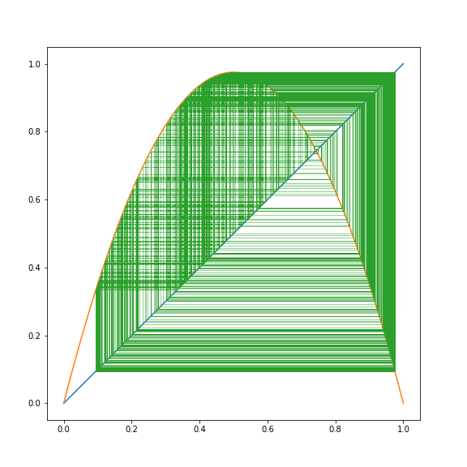

And here they are.

```
x = np.linspace(0, 1, 100)
web1 = cobweb(lambda x: 3.069946 * x * (1 - x), n=1000, start=100)
web2 = cobweb(lambda x: 3.449945 * x * (1 - x), n=1000, start=500)
web3 = cobweb(lambda x: 3.549946 * x * (1 - x), n=1000, start=500)

plt.figure(figsize=(6, 6))
plt.plot(x, x)
plt.plot(x, 3.069946 * x * (1 - x), 'b-')
plt.plot(x, 3.449945 * x * (1 - x), 'g-')
plt.plot(x, 3.549946 * x * (1 - x), 'r-')
plt.plot(web1[:, 0], web1[:, 1], 'b-', linewidth=0.5, label=r'$\mu_1$')
plt.plot(web2[:, 0], web2[:, 1], 'g-', linewidth=0.5, label=r'$\mu_2$')
plt.plot(web3[:, 0], web3[:, 1], 'r-', linewidth=0.5, label=r'$\mu_3$')
plt.legend(loc=0)
plt.savefig('logistic_orbits.png')
```

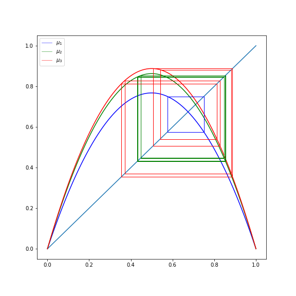

# Bifurcation Diagrams

We've already noted that the accuracy of finding these bifurcation points was low, let's instead examine a bifurcation diagram. A bifurcation diagram is essentially a probabilistic view of our map for different values of $latex \\mu$. For the following plots, the $latex x$-axis is differing values of $latex \\mu$, and the $latex y$-axis is a large number of plotted values after the transient.

```
%%cython -a -c=-O3

import numpy as np
cimport numpy as np
cimport cython

@cython.boundscheck(False) # turn off bounds-checking
@cython.wraparound(False)  # turn off negative index wrapping
def bifurcation(np.int64_t precision=1000,
                np.int64_t keep=500,
                np.int64_t num_compute=10000,
                np.float64_t xmin=0,
                np.float64_t xmax=4,
                np.float64_t ymin=0,
                np.float64_t ymax=1):
    """ Acquire bifurcation points for varying mu for logistic map """
    cdef np.ndarray[np.float64_t, ndim=1] mu = np.linspace(xmin, xmax,
                                                precision, dtype=np.float64)
    cdef np.float64_t x = 0.5  # unimportant initial x val
    cdef np.int64_t i, j, k
    cdef np.ndarray[np.float64_t, ndim=2] points = np.zeros((len(mu) * keep, 2),
                                                            dtype=np.float64)
    k = 0
    for i in np.arange(len(mu), dtype=np.int64):
        for j in range(num_compute):
            x = mu[i] * x * (1 - x)
            if j > (num_compute - keep): # we throw away the transient
                points[k, 0] = mu[i]
                points[k, 1] = x
                k += 1
    return points
```

The full bifurcation diagram for the logistic map follows.

```
points = bifurcation(xmin=1, xmax=4)
plt.figure(figsize=(12, 4))
plt.plot(points[:, 0], points[:, 1], ',', color='k', alpha=0.8)
plt.xlim(1, 4)
plt.savefig('logistic_bifurcation.png')
```

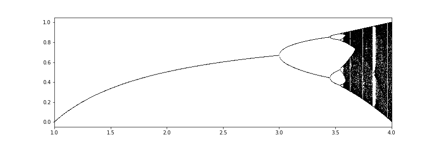

Now that we can plot the bifurcation diagram, let's examine the first several bifurcations.

```
mu_vals = np.array([3,
                    3.45,
                    3.544,
                    3.5645,
                    3.56875,
                    3.5697,
                    3.5698925,
                    3.569934,
                    3.56994316,
                    3.5699452,
                    3.569945646])

def plot_bifurcation(fig, axarr, index, x, y, xmin, xmax,
                     ymin, ymax, precision, keep, num):
    points = bifurcation(precision=precision, xmin=xmin,
                         xmax=xmax, keep=keep, num_compute=num)
    axarr[x, y].plot(points[:, 0], points[:, 1], ',', color='k', alpha=0.8)
    axarr[x, y].set_xlim(xmin, xmax)
    axarr[x, y].set_ylim(ymin, ymax)
    axarr[x, y].set_title(r'${1} < \mu_{0} < {2}$, $2^{0}$ cycle'.format(
                            index, xmin, xmax))
    axarr[x, y].set_yticks([])
    for i, mu in enumerate(mu_vals):
        axarr[x, y].plot(np.ones(10) * mu,
                         np.linspace(0, 1, 10), 'r-', alpha=0.25)
        axarr[x, y].annotate(i + 1, xy=(mu, ymax-(0.05 * (ymax - ymin))),
                             color='red')

fig, axarr = plt.subplots(3, 3, figsize=(12, 12))
plot_bifurcation(fig, axarr, 1, 0, 0, 2.9, 3.5, 0.4, 1, 500, 100, 1000)
plot_bifurcation(fig, axarr, 2, 0, 1, 3.4, 3.6, 0.8, 0.9, 500, 500, 5000)
plot_bifurcation(fig, axarr, 2, 0, 2, 3.53, 3.6, 0.8, 0.9, 500, 500, 5000)
plot_bifurcation(fig, axarr, 3, 1, 0, 3.56, 3.58, 0.888, 0.896, 500, 500, 5000)
plot_bifurcation(fig, axarr, 4, 1, 1, 3.568, 3.575, 0.889, 0.894, 1000, 500, 5000)
plot_bifurcation(fig, axarr, 5, 1, 2, 3.5695, 3.571, 0.890, 0.892, 1200, 500, 5000)
plot_bifurcation(fig, axarr, 6, 2, 0, 3.5698, 3.57, 0.8903, 0.8905, 1500, 500, 10000)
plot_bifurcation(fig, axarr, 7, 2, 1, 3.56992, 3.56997, 0.8903, 0.89045, 1500, 2000, 10_000)
plot_bifurcation(fig, axarr, 8, 2, 2, 3.56994, 3.56995, 0.89041, 0.89043, 1_000, 50_000, 100_000)
plt.tight_layout()
plt.savefig('logistic_bifurcation_points.png')
```

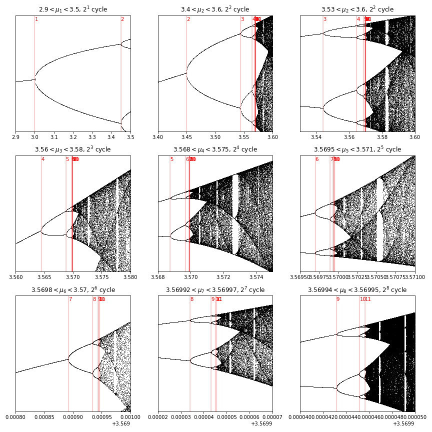

So what are these values that we've found? Let's record them.

```
points = bifurcation(xmin=1, xmax=4, precision=3000,
                     num_compute=20000, keep=100)
plt.figure(figsize=(12, 4))
plt.plot(points[:, 0], points[:, 1], ',',
         color='k', alpha=0.8)
for mu in mu_vals:
    plt.plot(np.ones(10) * mu, np.linspace(0, 1, 10),
             'r-', alpha=0.25)
plt.xlim(2.9, 4)
plt.savefig('logistic_bifurcation_fullpoints.png')
```

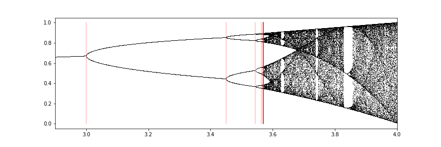

We can plot our cobweb diagrams with these more accurate values.

```
x = np.linspace(0, 1, 100)
fig, axarr = plt.subplots(3, 3, figsize=(12, 12))
for i in range(9):
    axarr[int(i / 3), i % 3].plot(x, x)
    mu = mu_vals[i]
    f = lambda x: mu * x * (1 - x)
    axarr[int(i / 3), i % 3].plot(x, f(x), alpha=1)
    web = cobweb(f, n=1000, start=800)
    axarr[int(i / 3), i % 3].plot(web[:, 0],
                                  web[:, 1],
                                  linewidth=0.5)
    axarr[int(i / 3), i % 3].set_title(r'$\mu = {}$'.format(mu))
plt.savefig('logistic_bifurcation_cobwebs.png')
```

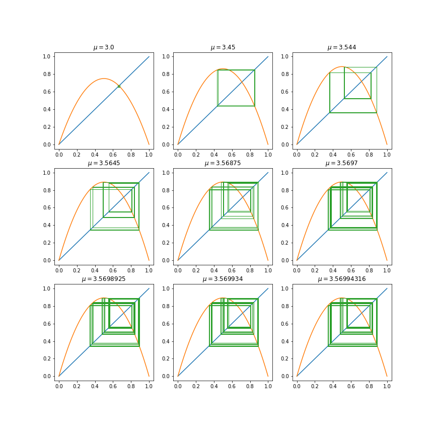

We could keep recording these values if we wanted, as this will keep going infinitely, and appears to be approaching $latex \\mu\_\\infty \\approx 3.57$.

# Period 3 and 5 Orbits

We found all powers of $latex 2^n$, but we haven't found any odd-numbered orbits. Let's track these down.

```
%%cython -a -c=-O3

import numpy as np
cimport numpy as np
cimport cython
from libc.math cimport exp

cdef float map_func(float mu, float x):
    return mu * x * (1 - x)

@cython.boundscheck(False) # turn off bounds-checking
@cython.wraparound(False)  # turn off negative index wrapping
def bifurcation(np.int64_t precision=1000, np.int64_t keep=500, np.int64_t num_compute=10000,
                np.float64_t xmin=0, np.float64_t xmax=4, np.float64_t ymin=0, np.float64_t ymax=1):
    """ Acquire bifurcation points for varying mu for map """
    cdef np.ndarray[np.float64_t, ndim=1] mu = np.linspace(xmin, xmax, precision, dtype=np.float64)
    cdef np.float64_t x = 0.5
    cdef np.int64_t i, j, k
    cdef np.ndarray[np.float64_t, ndim=2] points = np.zeros((len(mu) * keep, 2), dtype=np.float64)
    k = 0
    for i in range(len(mu)):
        for j in range(num_compute):
            x = map_func(mu[i], x)
            if j > (num_compute - keep): # we throw away the transient
                points[k, 0] = mu[i]
                points[k, 1] = x
                k += 1
    return points
```

Now we can perform the same process to find the odd-numbered orbits. I'm not doing 9 different levels of this, because they're hard to find, and it's tedious work.

```
mu_vals = np.array([3.84, 3.74, 3.702, 3.68725])

def plot_bifurcation(fig, axarr, index, x, y, xmin, xmax, ymin, ymax, precision, keep, num):
    points = bifurcation(precision=precision, xmin=xmin, xmax=xmax, keep=keep, num_compute=num)
    axarr[x, y].plot(points[:, 0], points[:, 1], ',', color='k', alpha=0.8)
    axarr[x, y].set_xlim(xmin, xmax)
    axarr[x, y].set_ylim(ymin, ymax)
    axarr[x, y].set_title(r'${1} < \mu_{0} < {2}$, ${3}$ cycle'.format(index, xmin, xmax, 2 * index + 1))
    axarr[x, y].set_yticks([])
    for i, mu in enumerate(mu_vals):
        axarr[x, y].plot(np.ones(10) * mu, np.linspace(0, 1, 10), 'r-', alpha=0.25)

fig, axarr = plt.subplots(2, 2, figsize=(8, 8))
plot_bifurcation(fig, axarr, 1, 0, 0, 3.8, 3.9, 0, 1, 500, 200, 2000)
plot_bifurcation(fig, axarr, 2, 0, 1, 3.735, 3.75, 0.1, 1, 500, 500, 5000)
plot_bifurcation(fig, axarr, 2, 1, 0, 3.7, 3.705, 0.2, 1, 500, 500, 5000)
plot_bifurcation(fig, axarr, 3, 1, 1, 3.687, 3.6875, 0.2, 1, 500, 300, 5000)
plt.tight_layout()
plt.savefig('logistic_bifurcations_odd.png')
```

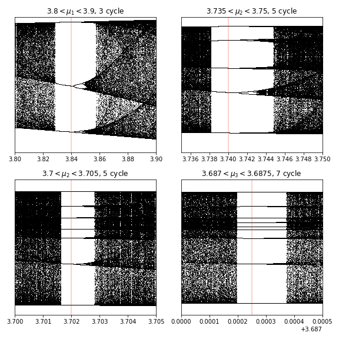

We can see that at each level of odd-numbered orbits, there's an additional bifurcation series made up of $latex n \\cdot 2 m$, where $latex n$ is the number of the initial bifurcation $latex (3, 5, 7, 9, \\ldots)$, and $latex m$ is the next number in the series. This is especially clear for $latex n=3$. In other words, each odd numbered bifurcation follows the same pattern that the base-$latex 2$ orbits do, they increase exponentially, while converging to a number, and the devolve into chaos as soon as you're outside their fixed orbit values.

This means that for any $latex n$, there are an infinite number of corresponding bifurcations.

```
points = bifurcation(xmin=3.825, xmax=3.859)
plt.figure(figsize=(12, 4))
plt.plot(points[:, 0], points[:, 1], ',', color='k', alpha=0.8)
plt.plot(np.ones(10) * mu_vals[0], np.linspace(0, 1, 10), 'r-', alpha=0.25)
plt.xlim(3.825, 3.859)
plt.savefig('logistic_bifurcation_odd_zoomed.png')
```

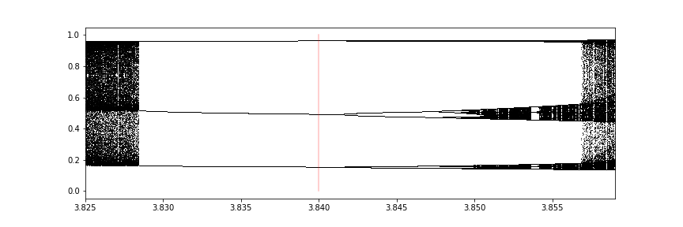

To show where these values actually occur in the entire bifurcation plot, we can plot our red lines.

```
points = bifurcation(xmin=1, xmax=4, precision=3000, num_compute=20000, keep=100)
plt.figure(figsize=(12, 4))
plt.plot(points[:, 0], points[:, 1], ',', color='k', alpha=0.8)
for mu in mu_vals:
    plt.plot(np.ones(10) * mu, np.linspace(0, 1, 10), 'r-', alpha=0.5)
plt.xlim(2.9, 4)
plt.savefig('logistic_bifurcation_odd_full.png')
```

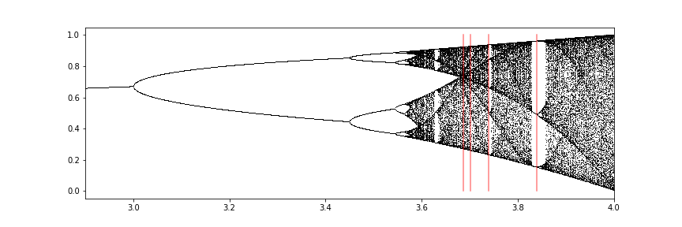

It seems that these odd-numbered orbits approach the supercritical point at around around $latex 3.6$.

Let's look at the implications of these orbits on our cobweb diagram. We need to rewrite our cobweb function slightly, as it's not precise enough.

```
%%cython -a -c=-O3
import numpy as np
cimport numpy as np

cdef f(np.float64_t mu, np.float64_t x, int n):
    cdef int i
    cdef np.float64_t x0 = x
    for i in range(n):
        x0 = mu * x0 * (1 - x0)
    return x0

def cobweb(np.float64_t mu, int n=1, int num=100, int keep=100, np.float64_t initial = 0.5):
    """ Generate the path for a cobweb diagram """
    cdef np.ndarray[np.float64_t, ndim=2] web = np.zeros((keep, 2))
    cdef np.float64_t x = initial
    cdef np.float64_t y = initial
    cdef int offset = num - keep
    cdef int state = 1
    if num == keep:
        offset = num - keep + 1
    for i in range(1, num):
        if state:
            y = f(mu, x, n)
        else:
            x = y
        state ^= 1
        if i >= offset:
            web[i - offset, 0] = x
            web[i - offset, 1] = y
    return web
```

Here's an interactive version to play with.

```
x = np.linspace(0, 1, 5000)

def f(x, mu, n):
    x1 = x
    for i in range(n):
        x1 = mu * x1 * (1 - x1)
    return x1

button = ipywidgets.Button(description='Save as File')
@ipywidgets.interact(mu=(2.5, 4, 0.01), n=(1, 5, 1))
def plot(mu=3.74, n=3): 
    fig = plt.figure(figsize=(6, 6))
    plt.plot(x, x)
    plt.plot(x, f(x, mu, n))
    web = cobweb(mu, n=n, num=1000, keep=999)
    plt.plot(web[:, 0], web[:, 1], linewidth=0.5)
    plt.show()
    display(button)
    button.on_click(lambda b: fig.savefig(f'logistic_N_cobweb.png'))
```

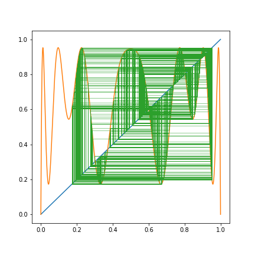

Here are our $latex \\mu$ values with $latex f(x)$.

```
x = np.linspace(0, 1, 5000)
n = 1

def f(x, mu, n):
    x1 = x
    for i in range(n):
        x1 = mu * x1 * (1 - x1)
    return x1

fig, axarr = plt.subplots(2, 2, figsize=(8, 8))
for index, i, j in [(i, int(i / 2), i % 2) for i in range(4)]:
    axarr[i, j].plot(x, x)
    axarr[i, j].plot(x, f(x, mu_vals[index], n))
    web = cobweb(mu_vals[index], n=n, num=5000, keep=1000, initial=0.8)
    axarr[i, j].plot(web[:, 0], web[:, 1], linewidth=0.5)
    axarr[i, j].set_title(r'$\mu_{}$={}, {} cycle'.format(index + 1, mu_vals[index], (index + 1) * 2 + 1))
plt.tight_layout()
plt.savefig('logistic_N_odd_cycles_cobweb.png')
```

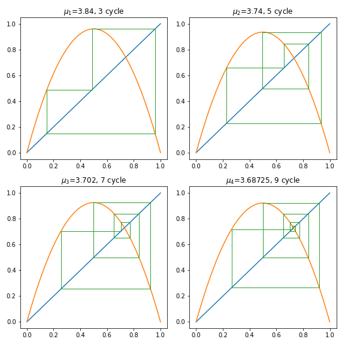

We can clearly see that we have period $latex \\{3, 5, 7, 9\\}$ cycles here, but if we plot with $latex n=3$ we obtain something else entirely.

```
x = np.linspace(0, 1, 5000)
n = 3

def f(x, mu, n):
    x1 = x
    for i in range(n):
        x1 = mu * x1 * (1 - x1)
    return x1

fig, axarr = plt.subplots(2, 2, figsize=(8, 8))
for index, i, j in [(i, int(i / 2), i % 2) for i in range(4)]:
    axarr[i, j].plot(x, x)
    axarr[i, j].plot(x, f(x, mu_vals[index], n))
    web = cobweb(mu_vals[index], n=n, num=5000, keep=1000, initial=0.8)
    axarr[i, j].plot(web[:, 0], web[:, 1], linewidth=0.5)
    axarr[i, j].set_title(r'$\mu_{}$={}, {} cycle'.format(index + 1, mu_vals[index], (index + 1) * 2 + 1))
plt.tight_layout()
plt.savefig('logistic_n_3_odd_webs.png')
```

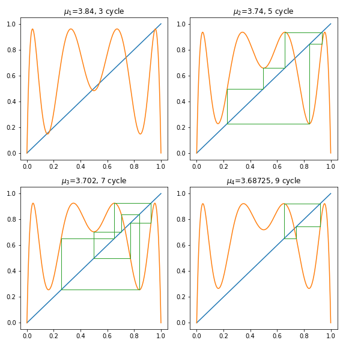

In the $latex f^{3}$ case, since we're plotting $latex f(f(f(x)))$, our period 3 or bit becomes a fixed point, and all orbits that are share a root of $latex 3$ become the previous orbit. So in this case our period 3 orbit becomes a period 0 (fixed point) orbit, and our period $latex 9$ orbit becomes our period 3 orbit.

# Download

Please download the notebook and run it locally! It's quite fun to play around with the interactive plots. [Download here](http://dataleek.io/wp-content/uploads/2017/11/APPM%203010%20-%20One%20Dimensional%20Dynamical%20Systems.ipynb)
