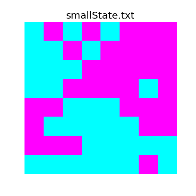

# Presentation

Adapted as a talk for the [Boulder Python Meetup](http://boulderpython.org). [Download archive here](https://github.com/TheDataLeek/politicalboundaries).

_Press the space-bar to proceed to the next slide. [See here for a brief tutorial](http://lab.hakim.se/reveal-js/)_

<iframe src="/presentations/politicalboundaries/politicalboundaries.slides.html" style="width: 100%; height: 25em;"></iframe>

<details>
    <summary style="border: 1px solid #eee; padding: 3px">Expand Code</summary>
    <script src="https://gist.github.com/TheDataLeek/e1d8af7ad976398bc8a5afcb5cf68c78.js"></script>
</details>

# Writeup

In this writeup we'll discuss two algorithms, simulated annealing and genetic algorithms, and show how they can be applied to the problem of drawing political boundaries while avoiding gerrymandering.

This writeup is [available on GitHub](https://gitlab.com/thedataleek/politicalboundaries), or [my personal website](http://www.dataleek.io).

[Slides for this post are also available here](http://dataleek.io/presentations/politicalboundaries/politicalboundaries.slides.html)

# Table of Contents

1. [Table of Contents](#table-of-contents)
2. \[An Introduction to Simulated Annealing and Genetic Algorithms\](#an-introduction-to-simulated-annealing-and-gene tic-algorithms)
    
    1. [What is a Fitness Function?](#what-is-a-fitness-function)
    2. [What is Simulated Annealing?](#what-is-simulated-annealing)
    3. [What are Genetic Algorithms?](#what-are-genetic-algorithms)
3. [Drawing Political District Boundaries](#drawing-political-district-boundaries)
    
    1. [Procedure](#procedure)
        
        1. [Overall Structure](#overall-structure)
            
            1. [Some Quick Notes](#some-quick-notes)
        2. [Helpful Code](#helpful-code)
            
            1. [Finding Neighbors of a Point](#finding-neighbors-of-a-point)
            2. [Determining if a District is Valid](#determining-if-a-district-is-valid)
            3. [Finding District Neighbors](#finding-district-neighbors)
            4. [Fitness Function](#fitness-function)
        3. [Generating Random Solutions](#generating-random-solutions)
        4. [Simulated Annealing](#simulated-annealing)
            
            1. [Mutations](#mutations)
            2. [A Better Starting Point](#a-better-starting-point)
        5. [Genetic Algorithm](#genetic-algorithm)
            
            1. [Combining Solutions](#combining-solutions)
4. [Using Provided Code](#using-provided-code)
5. [Next Steps](#next-steps)

# An Introduction to Simulated Annealing and Genetic Algorithms

First let's talk about our algorithms.

[Simulated Annealing](https://en.wikipedia.org/wiki/Simulated_annealing) and [Genetic Algorithms](https://en.wikipedia.org/wiki/Genetic_algorithm) are both methods of finding solutions to problems through simulations. In a nutshell, basically testing a large amount of semi-random solutions, looking at random combinations of our solutions, and then keeping the best that we encounter.

The benefit of these algorithms is that we can relatively quickly approximate a good solution without much computation time. Our solution won't be "the best" unless we get extraordinarily lucky, however it will be a good approximation.

## What is a Fitness Function?

Let's look at what [the wikipedia page](https://en.wikipedia.org/wiki/Fitness_function) says on the matter.

> A fitness function is a particular type of objective function that is used to summarise, as a single figure of merit, how close a given design solution is to achieving the set aims.

In other words, it's a single number that basically tells us how "good" of a solution we have. For our genetic algorithm and simulated annealing approach we'll want to maximize this number, thereby maximizing how "good" our solutions are.

## What is Simulated Annealing?

Simulated annealing can be defined as follows.

1. Generate a random solution
2. Generate a "neighboring solution" to our generated solution
3. Keep whichever is better, or (with decaying probability) take the new one regardless
4. Go back to 2

Incomplete python code for this is below.

```
def simulated_annealing(g):
    s, c = generate_solution(g)
    T = 1
    Tmin = 1e-9
    alpha = 0.99
    k = 1
    i = 0
    while T > Tmin:
        sp, cp = generate_solution_neighbor(g, s, c)
        DE = cp - c
        if DE < 0:
            s = sp
            c = cp
        elif random.random() < math.exp(-DE / (k * T)):
            s = sp
            c = cp
        T *= alpha
        i += 1
    print(s, c, i)
```

## What are Genetic Algorithms?

Genetic algorithms are very similar, and the algorithm can be defined as follows.

1. Randomly generate an initial population of solutions
2. Use our solution population to generate some large number of children (note, these children should inherit properties from their parents)
3. Keep the best of our total population
4. Go back to 2

Again, incomplete code is below.

```
for i in range(10):
    print(f'Starting with {get_value(solutions)}')
    new_solutions = gen_new(solutions)
    print(f'Birthed {get_value(new_solutions)}')
    full_solutions = solutions + new_solutions
    solutions = get_top3(full_solutions)
    print(f'Evolved to {get_value(solutions)}')
    print('---')
```

# Drawing Political District Boundaries

Now that we know what these monsters are, we can dig into how they can be applied to solving a system.

Let's say we're interested in determining how to section off a two-party system of voters into "equal" districts, for some definition of equal. Our system is defined in a provided file that simply denotes, for every index, the type of voter in that location. It looks like this

```
D R D R D R R R
D D R D R R R R
D D D R R R R R
D D R R R R D R
R R D D D R R R
R D D D D D R R
R R R D D D D D
D D D D D D R D
```

Which can be plotted for readability.



And our other (larger) state looks like the following.


This pattern will continue for the rest of the writeup, I'll talk about (and show) the smaller version first, and then follow up with the larger version.

## Procedure

So in the context of our problem, we can examine how the code actually works.

### Overall Structure

The structure is as follows:

- `main` is responsible for running and calling everything
- `genetic_algorithm` uses a genetic approach to solve the problem
- `simulated_annealing` likewise uses simulated annealing
- Each solution uses a `System` instance which keeps track of the system state
- Each solution is an instance of a `Solution` which also keeps track of its particular state
- Each district is a `Mask` which provides an ease of access through abstraction.

```
▼ Mask : class
   +__init__ : function
   -__str__ : function
  ▼+get_labels : function
     +unlabelled : function
   +is_valid : function
   +location : function
   +make_valid : function
   +overlap : function
   +parse_list : function
   +parse_locations : function
   +size : function

▼ Solution : class
   -__eq__ : function
   -__getitem__ : function
   +__init__ : function
   -__ne__ : function
   -__str__ : function
   +combine : function
   +copy : function
   +fill : function
   +generate_random_solution : function
   +get_district_neighbors : function
   +get_filtered_district_neighbors : function
   +get_full_openspots : function
   +get_neighbors : function
   +get_random_openspot : function
   +get_solution : function
   +height : function
   +is_valid : function
   +majorities : function
   +majority : function
   +mutate : function
   +show : function
   +summary : function
   +value : function
   +width : function

▼ System : class
   -__getitem__ : function
   +__init__ : function
   +_name_arr : function
   +_read_file : function
   +empty_state : function
   +height : function
   +stats : function
   +width : function

▼+animate_history : function
   +update_plot : function

▼+generate_report_assets : function
   +update : function

 +genetic_algorithm : function

 +get_args : function

 +get_good_start : function

 +main : function

 +simulated_annealing : function

▼ variables
    FIGSIZE
    OUTDIR
```

So basically how this works is we read in the file, creating a `System` instance, and then create an empty `Solution` instance to keep track of our changes.

#### Some Quick Notes

- There's a lot of code here, and to be honest, it's more than is really necessary. The reason for it however, is so that I can abstract away the more complicated parts and just say something like `solution.mutate()` instead of digging into how or why the mutation algorithm works. This abstraction is why the code to do simulated annealing is so terse, abstraction makes algorithms terse.
- All indexing starts from the upper left point, which is at `(0, 0)`, and all indices are `(y, x)` pairs.
- There's a hierarchy of the code, our system is represented by a `System` object, and each solution is represented by a `Solution` object, which consists of several `Mask` objects that provide a direct interface to each district.
- I like properties, so if something looks like it might be doing something complicated under the hood (like the `value` function), it probably is.

### Helpful Code

While solving this problem, there are a couple sub-problems that we need to consider and solve.

#### Finding Neighbors of a Point

Our first big problem is how we find neighbors of a single point. For any `(y, x)` pair we can express its neighbors using the following algorithm.

1. Iterate over range(-1, 2) for both x and y
2. For each loop, accept (y + yi, x + xi) if the following conditions hold:
    
    - y + yi is within the range of the field
    - x + xi is within our domain of the field
    - xi and yi are not both equal to zero

In python, this is expressed as

```
neighbors = [(y0 + y, x0 + x)
             for x in range(-1, 2)
             for y in range(-1, 2)
             if (0 <= y0 + y < self.height) and
             (0 <= x0 + x < self.width) and
             not (x == 0 and y == 0)]
```

#### Determining if a District is Valid

One of the problems we need to solve is to know if any given district we have is valid. In our case, valid simply means having a [single connected component](https://en.wikipedia.org/wiki/Connected_component_(graph_theory)), which we can determine using [connected component labelling](https://en.wikipedia.org/wiki/Connected-component_labeling). The easiest version of this (which is in the implementation) is just examining a single component at a time, and the algorithm is as follows (from wikipedia):

> 1. Start from the first pixel in the image. Set "curlab" (short for "current label") to 1. Go to (2).
> 2. If this pixel is a foreground pixel and it is not already labelled, then give it the label "curlab" and add it as the first element in a queue, then go to (3). If it is a background pixel or it was already labelled, then repeat (2) for the next pixel in the image.
> 3. Pop out an element from the queue, and look at its neighbours (based on any type of connectivity). If a neighbour is a foreground pixel and is not already labelled, give it the "curlab" label and add it to the queue. Repeat (3) until there are no more elements in the queue.
> 4. Go to (2) for the next pixel in the image and increment "curlab" by 1.

Which is implemented in our code as the following.

```
class Mask(object):
...

    def get_labels(self):
        curlab = 1
        labels = np.zeros(self.mask.shape)
        q = queue.Queue()
        def unlabelled(i, j):
            return self.mask[i, j] == 1 and labels[i, j] == 0
        for i in range(self.height):
            for j in range(self.width):
                if unlabelled(i, j):
                    labels[i, j] = curlab
                    q.put((i, j))
                    while not q.empty():
                        y0, x0 = q.get()
                        neighbors = [(y0 + y, x0 + x)
                                     for x in range(-1, 2)
                                     for y in range(-1, 2)
                                     if (0 <= y0 + y < self.height) and
                                     (0 <= x0 + x < self.width) and
                                     not (x == 0 and y == 0)]
                        for ii, jj in neighbors:
                            if unlabelled(ii, jj):
                                labels[ii, jj] = curlab
                                q.put((ii, jj))
                    curlab += 1
        return curlab, labels
...
```

#### Finding District Neighbors

Another huge problem is we have to find all neighbors of a given district. This is incredible similar to the Connected Component Labelling process above.

The basic algorithm is as follows.

1. Get a random spot inside the given district
2. Add this spot to a Queue
3. Initialize an empty labelling array (as with connected component labelling)
4. While the queue is not empty, get an new `(y, x)` pair.
5. If the point falls within the district, get all of the point's neighbors, add them to the queue, and go back to (4)
6. If the point does not fall into the district, add it to the list of district neighbors.

```
class Solution(object):
...
    def get_district_neighbors(self, i):
        y, x = self.get_random_openspot(i)
        q = queue.Queue()
        q.put((y, x))
        edges = []
        labels = np.zeros(self.full_mask.shape)
        labels[y, x] = 1
        while not q.empty():
            y, x = q.get()
            if self.full_mask[y, x] == i:
                for yi, xi in self.get_neighbors(y, x):
                    if labels[yi, xi] == 0:
                        q.put((yi, xi))
                        labels[yi, xi] = 1
            else:
                edges.append((y, x))
        return edges
...
```

#### Fitness Function

Taking a step back from the code and considering the real world, let's think about what we'd ideally like to emphasize in a political districting system.

- We'd want districts to be homogeneous, i.e. each district is comprised of either all Republican or all Democrat voters.
- We want our district ratios to approximately match our population ratios. By this I mean, if we have 52% Republican voters in the general population, 52% of the districts should have a Republican majority, and vice-versa for the Democrat population.
- We'd want to avoid [gerrymandering](https://en.wikipedia.org/wiki/Gerrymandering), which is the practice of shaping voting districts such that a certain political party has an unfair advantage. A real world example of the sort of district we'd like to avoid looks like this (which is in Texas) 
- We want all districts to be around the same population size, i.e. there are an equal number (within reason) of voters in each district.

We can design our fitness function to meet these criteria. The final fitness function that we use emphasizes the following qualities in its assessment.

1. Validity of solution
2. Make sure the ratio of `R` to `D` majority districts matches the ratio of `R` to `D` in the general population.
3. Make sure each district is as homogeneous as possible
4. Reduce the value of the district if its size isn't close to the "ideal size", which is `total_size / num_districts`. This is our attempt to reduce the "squiggliness" of a district, however it's not perfect and squiggly districts still pop up.
5. We also take into account that in non-homogeneous districts voters that aren't affiliated with the majority party might be swayed by targeted campaigns. To this effect we account each non-affiliated "zone" with a weight of -0.9 instead of -1.
6. Finally, we can also minimize edge length as well as trying to keep each district the same size. This will result in hopefully ideal districts

```
class Solution(object):

...

    @property
    def value(self):
        value = 0
        if not self.is_valid:  # if we don't have a valid solution, return 0
            return 0
        # Make sure the number of districts tries to match population
        # distribution within 10%
        size, stats = self.system.stats
        for k, v in self.majorities.items():
            if np.abs((float(v) / self.numdistricts) - stats[k]) >= 0.1:
                return 0
        district_size = int(self.width * self.height / self.numdistricts)
        # Sum up values of each district
        for i in range(1, self.numdistricts + 1):
            values = self.system.matrix[self[i].mask.astype(bool)]
            if len(values) == 0:
                value = 0
                return value
            else:
                # District value is simply abs(num_red - num_blue)
                subvalue = np.abs(len(values[values == 0]) - len(values[values == 1]))
                size_bonus = 0.25 * np.abs(len(values) - district_size)
                if subvalue < len(values):
                    # For any non-uniform values, add 10% their value to account
                    # for independent voter turnout
                    subvalue += (len(values) - subvalue) * 0.1
                value += subvalue
                value -= size_bonus
                # Minimize neighbors (same as minimizing edge length)
                value += -0.1 * len(self.get_district_neighbors(i))
        return value

...
```

### Generating Random Solutions

This algorithm is very straightforward.

1. Generate a number of "spawn points" equal to the number of districts.
2. Fill.

The fill algorithm is also straightforward.

1. Set a list of available districts.
2. While there are any non-set points, pick a random district, `i`, from the list of available districts.
3. Get a list of all neighbors of the district, but filter to only 0-valued entries.
4. If no such neighbors exist, remove this district from the list of available districts.
5. Otherwise pick a neighbor at random and set it to `i`.
6. Loop back to (2).

```
class Solution(object):

...

    def generate_random_solution(self, history=False):
        solution_history = [self.copy()]
        for i in range(1, self.numdistricts + 1):
            y, x = self.get_random_openspot(0)
            self.full_mask[y, x] = i
            if history:
                solution_history.append(self.copy())
        solution_history += self.fill(keep_history=history)
        if history:
            return solution_history

    def fill(self, keep_history=False):
        districts = list(range(1, self.numdistricts + 1))
        history = []
        while (self.full_mask == 0).any():
            try:
                i = districts[random.randint(0, len(districts) - 1)]
            except ValueError:
                # So here's a neat bug... Sometimes if there's a zero in the
                # corner, get filtered won't find it. So this code is here to
                # forcibly fix this problem.
                for j in range(1, self.numdistricts):
                    if len(self.get_filtered_district_neighbors(j, [0])) != 0:
                        districts = [j]
                        i = j
                        break
            neighbors = self.get_filtered_district_neighbors(i, [0])
            if len(neighbors) == 0:
                districts.remove(i)
            else:
                y, x = neighbors[random.randint(0, len(neighbors) - 1)]
                self.full_mask[y, x] = i
                if keep_history:
                    history.append(self.copy())
        return history

...
```

We can see how this looks for our two different state sizes.


### Simulated Annealing

Now that we can do all of that, let's talk about simulated annealing. The basic algorithm is as follows.

1. Generate a random solution
2. Generate a solution neighbor
3. If the new solution is better than the old, set the current solution to the new one.
4. If the solution is worse, but `random.random() < math.exp(dv / (k * T))`, where `dv` is the difference between solution values, `k` is a set constant, and `T` is the current iteration value, accept it.

```
def simulated_annealing(system, numdistricts, precision, animate, makegif):
    solution = get_good_start(system, numdistricts)
    history = [solution]  # Keep track of our history
    k = 0.8  # Larger k => more chance of randomly accepting
    Tvals = np.arange(1, 1e-12, -1.0 / precision)
    print('Running Simulated Annealing with k={:0.03f}, alpha={:0.05f}'\
            .format(k, 1.0 / precision))
    for i, T in tqdm(enumerate(Tvals), total=len(Tvals)):
        new_solution = solution.copy()  # copy our current solution
        new_solution.mutate()  # Mutate the copy
        dv = new_solution.value - solution.value  # Look at delta of values
        # If it's better, or random chance, we accept it
        if dv > 0 or random.random() < math.exp(dv / (k * T)):
            solution = new_solution
            history.append(new_solution)
```

To show how choice of `k` effects the algorithm, we can plot this.


The entire process looks like this:


Which has the following final solution.


And for the large system,


Which has the following final solution.


#### Mutations

Much of simulated annealing rests on being able to find a valid neighboring solution to our current solution. We do this through a process I call "mutation", which simply flips a zone from one district to another, based on some randomness and criteria to make the new solution valid.

The general algorithm can be thought of as follows.

1. Find all district neighbors
2. Pick a neighboring point at random.
3. If the neighboring point's district has at least size 2, set this neighboring point to our district.
4. Otherwise, pick a different neighboring point.

```
class Solution(object):

...

    def mutate(self):
        i = np.random.randint(1, self.numdistricts)
        y, x = self.get_random_openspot(i)
        if y is None:
            raise IndexError('No open spots? Something is real bad')
        traversed = set()
        q = queue.Queue()
        q.put((y, x))
        while not q.empty():
            y, x = q.get()
            if (y, x) not in traversed:
                traversed.add((y, x))

                if (self.full_mask[y, x] != i and
                        self[self.full_mask[y, x]].size > 1):
                    old_value = self.full_mask[y, x]
                    self.full_mask[y, x] = i
                    if not self.is_valid:  # make sure new mutation is valid
                        # If not, reset and start over
                        self.full_mask[y, x] = old_value
                    else:
                        break

                for ii, jj in self.get_neighbors(y, x):
                    q.put((ii, jj))

...
```

Which can be visualized as follows.


#### A Better Starting Point

Instead of naively choosing just one random solution to start with simulated annealing, we can instead generate many initial random solutions, and then pick the best for our algorithm.

This has the advantage of starting off from a better place, and theoretically have less "distance to climb".

### Genetic Algorithm

This algorithm is also straightforward, and is generally as follows.

1. Generate a set of random "parent" solutions.
2. From our parents, generate a large set of "children" solutions.
3. Sort the entire population by their value.
4. Set our parents to be the "best" of the current population, discard the rest.
5. Go back to (2).

```
def genetic_algorithm(system, numdistricts, precision, animate, makegif):
    # Start with random initial solution space (3)
    solutions = [Solution(system, numdistricts) for _ in range(3)]
    for s in solutions:
        s.generate_random_solution()  # Initialize our solutions
    top_history = []  # Keep history of our top solution from each "frame"
    for i in tqdm(range(precision)):
        new_solutions = []
        for _ in range(10):  # Create 10 children per frame
            s1, s2 = np.random.choice(solutions, size=2)
            # Randomly combine two parents
            new_solutions.append(s1.combine(s2))
        # Combine everything, giving 13 total solutions
        full_solutions = new_solutions + solutions
        # Keep the top 3 for next generation
        solutions = [_[0] for _ in
                     sorted([(s, s.value) for s in full_solutions],
                            key=lambda tup: -tup[1])[:3]]
        # Only record top from generation, and only if it's changed
        if len(top_history) == 0 or solutions[0] != top_history[-1]:
            top_history.append(solutions[0])
```

The entire process looks like this:


Which has the following final solution.


And for the large system,


Which has the following final solution.


#### Combining Solutions

As simulated annealing relies on `mutate()` to narrow down on a good solution, the genetic algorithm relies on `combine()` to take two solutions and generate a "child" solution.

We can think of the code as follows.

1. Shuffle our two parents in an array.
2. Shuffle a list of districts.
3. Set a cursor that points to the first parent in the array.
4. Iterate through our districts with variable `i`
5. For the current district, find all points of the parent that our cursor is pointing to.
6. Get all "open" (i.e. set to 0) points for our child solution
7. For every point that matches between these two sets, make a new bitmask.
8. If this bitmask is valid (i.e. one connected component), set all point in this child solution to our current district
9. Otherwise, make the district valid and set the bits in the child solution
10. Flip the cursor

The algorithm behind making a district valid is easy, if we have more than one connected component in a given district, pick one at random and discard the other connected components.

```
class Solution(object):

...

    def combine(self, other_solution, keep_history=False):
        """
        Look at both solutions, alternate between them randomly, and try to
        basically inject one side at a time. Afterwards fill the gaps in with
        fill()
        """
        new_solution = Solution(self.system, self.numdistricts)
        # Randomly order parents to choose from
        pick_order = [self, other_solution]
        random.shuffle(pick_order)
        # Randomly order districts to choose from
        districts = list(range(1, self.numdistricts + 1))
        random.shuffle(districts)
        cursor = 0  # alternates between parents
        history = [new_solution.copy()]
        for i in districts:
            parent_locations = pick_order[cursor][i].location
            open_locations = new_solution.get_full_openspots(0)
            district = Mask()
            # We make every child valid
            district.parse_locations(self.height, self.width,
                                     [(y, x) for y, x in parent_locations
                                      if [y, x] in open_locations])
            if not district.is_valid:
                district.make_valid()
            for y, x in district.location:
                new_solution.full_mask[y, x] = i
            cursor ^= 1
            if keep_history:
                history.append(new_solution.copy())
        for i in range(1, self.numdistricts + 1):
            y, x = new_solution.get_random_openspot(i)
            if y is None:
                y, x = new_solution.get_random_openspot(0)
                new_solution.full_mask[y, x] = i
                if keep_history:
                    history.append(new_solution.copy())
        history += new_solution.fill(keep_history=True)
        if random.random() < 0.1:
            new_solution.mutate()
            history.append(new_solution.copy())
        if keep_history:
            return new_solution, history
        return new_solution
```

Which can be visualized as follows.


# Final Thoughts

Both of these approaches can be applied to solve incredibly complex problems with varying degrees of success, and much of their success hinges on how effective your evaluation of a given solution fitness' is.

We also realize that any given "final solution" is somewhat unique, or at the very least hard to obtain again. If we visualize our solution space as a two-dimensional plane, with each solution having some value, then a final solution that we find is merely one of these peaks, so a re-run will not necessarily yield the same solution again.

To get around this, we could theoretically run the code thousands of times, with different seeds each time, and then pick the best out of all runs.

# Using Provided Code

If you're a TA, this is straightforward! After installed the required libraries (again check [the repository](https://github.com/thedataleek/politicalboundaries)) just run

```
python3.6 ./politicalboundaries.py $FILE_TO_RUN
```

If you want to dig a little deeper, use the `-h` flag to see what it can do, but here's a short list as well.

- Use Simulated Annealing on the file
- Use the Genetic Algorithm on the file
- Set the number of districts for either solution type
- Set the precision (number of runs) for either algorithm
- Animate the solution process
- Create gifs of the solution process (otherwise just `.mp4`)
- Generate report (`README.md`) assets.
- Do all of the above in one go.

```
┬─[zoe@fillory:~/Dropbox/classwork/2016b/csci3202/hw5]
╰─>$ ./politicalboundaries.py -h
usage: politicalboundaries.py [-h] [-a] [-g] [-n NUMDISTRICTS] [-z] [-p PRECISION]
                         [-r] [-j] [-F]
                         F

positional arguments:
  F                     File to load

optional arguments:
  -h, --help            show this help message and exit
  -a, --annealing       Use Simulated Annealing Algorithm?
  -g, --genetic         Use Genetic Algorithm?
  -n NUMDISTRICTS, --numdistricts NUMDISTRICTS
                        Number of districts to form. Defaults to the width of
                        the system
  -z, --animate         Animate algorithms?
  -p PRECISION, --precision PRECISION
                        Tweak precision, lower is less. In a nutshell, how
                        many loops to run.
  -r, --report          Generate all assets for the report
  -j, --gif             Generate gif versions of animations?
  -F, --full            Generate everything. Report assets, SA, and GA.
```

# Next Steps

I want to do more for this project but I'm limited in the time I have. I do have a couple of ideas for next steps however.

- Parallelizing - Instead of just running simulations on a single thread, we could theoretically spin up a bunch of different threads and run simulations on them simultaneously, only keeping the best of all trials.
- Real Data - It would be amazing to take the approaches used in this writeup and apply it to real-world political data. A topic for a different blog post!
