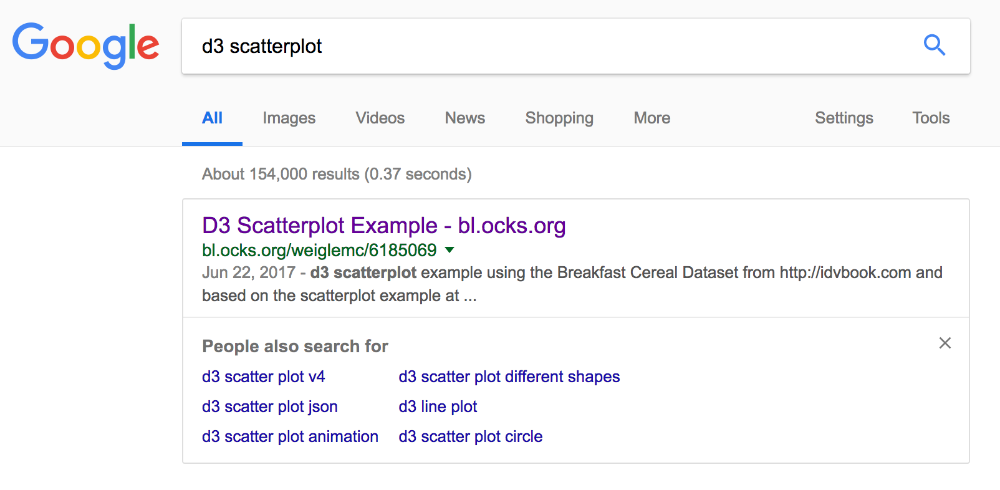
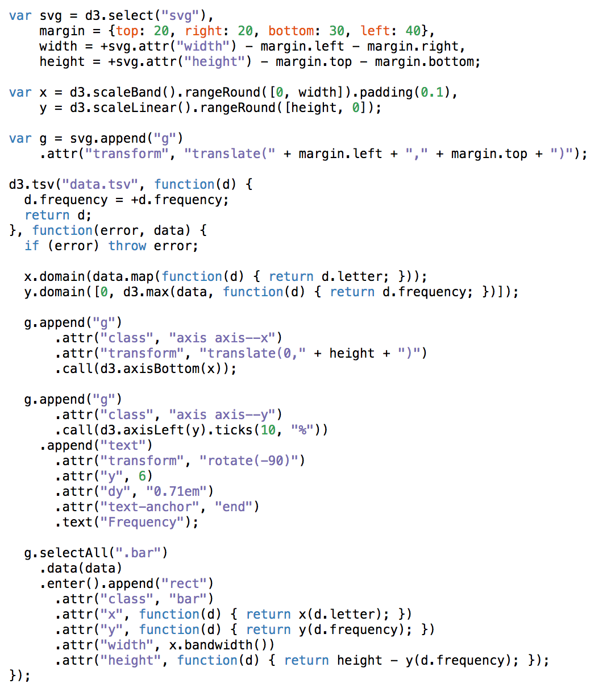

# Establishing Reusable Code
## Zoë Farmer

*Made with ES6, D3, Jupyter, Reveal.js*

# Who am I

* My name is Zoë Farmer
* CU graduate with a BS in Applied Math and a CS Minor
* I'm a co-coordinator of the Boulder Python Meetup
* I'm a big fan of open source software
* http://www.dataleek.io
* @TheDataLeek, github.com/thedataleek, gitlab.com/thedataleek
* D3 Data Visualizer at Talus Analytics - http://www.talusanalytics.com

# What's the problem?

* D3 doesn't have the popularity of Node, Angular, Python, `<insert popular framework here>`, etc.
* Documentation can be sparse.
* Most of us (myself included) learn from terse [bl.ocks.org](https://bl.ocks.org) demos.
* Because of this, most D3 code tends to be *write-only*.

### TL;DR -- D3 doesn't lend itself to reuse

# Example - Scatterplot



# And the code?

http://bl.ocks.org/weiglemc/6185069



# So what can we do?

* Use classes
* Separate interaction from drawing
* Write with reuse in mind

# Use Classes
```javascript
class Chart {
    constructor(selector, params={}) {
        this.selector = selector;
        this.svg = d3.select(selector).append('svg');
        this.chart = this.svg.append('g').classed('chart', true);
        this.params = params; 
    }
    newGroup(name) {
        if (this[name]) { this[name].remove() }
        this[name] = this.chart.append('g').classed(name, true);
    }
}
class Bar extends Chart { ... }
```

# Separate Interaction 

* Add invisible clickable elements
* You can make them bigger than your data
    * Helpful for small elements
    * Intuitive for user
    * Don't need to worry (for the most part) about binding interactions to elements

# Write with reuse in mind

* Most charts share 75% of their code with something you've probably already done.
* Use similar (preferably the same) data format for each method
* Write generic methods that you can reuse

```javascript
class Bar extends Chart {
...
    drawBars(data) {
        this.newGroup('bars');
        this.bars
            .selectAll('rect')
            .data(data)
            .enter()
            .append('rect')
            .attr('transform', d => `translate(${this.xScale(d.key)})`)
            .attr('width', this.xScale.bandwidth())
            .attr('height', d => this.yScale(d.value))
            .attr('fill', d => d.properties.fill)....
    }
...
}
```

# Takehome

* Use classes
* Separate interaction from drawing
* Write with reuse in mind

It's more work up front for each chart, but it will pay dividends.

# Questions?

Buy me a beer, or bug me at
* [dataleek.io](https://dataleek.io)
* [@TheDataLeek](https://twitter.com/thedataleek)


```python

```
