```python
import numpy as np
import matplotlib.pyplot as plt
import pandas as pd
import re
import seaborn
import datetime as dt
from wordcloud import WordCloud

import heapq
import collections

import nltk
from nltk.stem import SnowballStemmer
from nltk.tokenize import TreebankWordTokenizer

import stemming
from stemming import porter2

import sklearn
from sklearn.feature_extraction.text import CountVectorizer
from sklearn.feature_extraction.text import TfidfTransformer
from sklearn.feature_extraction.text import TfidfVectorizer
from sklearn.linear_model import SGDClassifier
from sklearn.model_selection import GridSearchCV
from sklearn.pipeline import Pipeline
from sklearn.cluster import KMeans

import scipy
import scipy.interpolate as sc_int
import scipy.sparse as sc_sp

from pprint import pprint

from time import time

from IPython.display import display
```


```python
# %matplotlib inline
```

# Evolve Interview Project

## Zoë Farmer


*Press the space-bar to proceed to the next slide. [See here for a brief tutorial](http://lab.hakim.se/reveal-js/)*

## Who am I?

* My name is Zoë Farmer
* Recent CU graduate with a BS in Applied Math and a CS Minor
* Co-coordinator of the Boulder Python Meetup
* Big fan of open source software
* http://www.dataleek.io
* [@thedataleek](http://www.twitter.com/thedataleek)
* [git(hub|lab).com/thedataleek](http://github.com/thedataleek)

## General Tooling Overview

* Everything is in Python3.6
* I use `jupyter`, `pandas`, `numpy`, `matplotlib`, `scikit-learn`, `nltk`, and `scipy`.
* Some code has been skipped for brevity. See [this link](http://www.gitlab.com/thedataleek/evolve_interview) for full code.
* Development performed with Jupyter Notebook, this notebook is available at the above link.
* Presentation powered by Reveal.js

<div>
    <div style="display: inline-block; width: 16%;"></div>
    <div style="display: inline-block; width: 20%;"></div>
    <div style="display: inline-block; width: 12%;"></div>
    <div style="display: inline-block; width: 18%;"></div>
    <div style="display: inline-block; width: 12%;"></div>
    <div style="display: inline-block; width: 8%;"></div>
</div>

# The Data

## What is it?

A year of data about Boston scraped from AirBnB that contains 2 datasets

* listing details
* calendar information

## (1) Listings - details about locations

Our first dataset is a large number of listings and associated descriptions.


```python
listing_data = pd.read_csv('./ListingsAirbnbScrapeExam.csv')
```


```python
len(listing_data)
```


    3585


```python
', '.join(listing_data.columns)
```


    'id, name, summary, space, description, experiences_offered, neighborhood_overview, notes, transit, access, interaction, house_rules, host_name, host_since, host_location, host_about, host_response_time, host_response_rate, host_acceptance_rate, host_is_superhost, host_neighbourhood, host_listings_count, host_total_listings_count, host_verifications, host_has_profile_pic, host_identity_verified, street, neighbourhood_cleansed, city, state, zipcode, market, smart_location, country_code, country, latitude, longitude, is_location_exact, property_type, room_type, accommodates, bathrooms, bedrooms, beds, bed_type, amenities, square_feet, price, weekly_price, monthly_price, security_deposit, cleaning_fee, guests_included, extra_people, minimum_nights, maximum_nights, calendar_updated, has_availability, availability_30, availability_60, availability_90, availability_365, calendar_last_scraped, number_of_reviews, first_review, last_review, review_scores_rating, review_scores_accuracy, review_scores_cleanliness, review_scores_checkin, review_scores_communication, review_scores_location, review_scores_value, requires_license, license, jurisdiction_names, instant_bookable, cancellation_policy, require_guest_profile_picture, require_guest_phone_verification, calculated_host_listings_count, reviews_per_month'


## (2) Calendar Data - location occupancy by date

Our second dataset is a set of listings by date, occupancy, and price.

* We want to parse these fields
    * datestrings to be formatted as python `datetime` objects
    * price field to be floats


```python
price_re = '^ *\$([0-9]+\.[0-9]{2}) *$'
def price_converter(s):
    match = re.match(price_re, s)
    if match:
        return float(match[1])
    else:
        return np.nan
```


```python
calendar_data = pd.read_csv(
    './CalendarAirbnbScrapeExam.csv',
    converters={
        'available': lambda x: True if x == 'f' else False,
        'price': price_converter
    }
)
calendar_data['filled'] = ~calendar_data['available']
calendar_data['date'] = pd.to_datetime(calendar_data['date'],
                                       infer_datetime_format=True)
```


```python
calendar_data.head(1)
```


<div>
<style>
    .dataframe thead tr:only-child th {
        text-align: right;
    }

    .dataframe thead th {
        text-align: left;
    }

    .dataframe tbody tr th {
        vertical-align: top;
    }
</style>
<table border="1" class="dataframe">
  <thead>
    <tr style="text-align: right;">
      <th></th>
      <th>listing_id</th>
      <th>date</th>
      <th>available</th>
      <th>price</th>
      <th>filled</th>
    </tr>
  </thead>
  <tbody>
    <tr>
      <th>0</th>
      <td>12147973</td>
      <td>2017-09-05</td>
      <td>True</td>
      <td>NaN</td>
      <td>False</td>
    </tr>
  </tbody>
</table>
</div>


# Dataset Merge

We want to combine datasets

* Let's calculate the number of nights occupied per listing and add to the listing data.
* Average/standard deviation price per night

But let's first make sure the datasets overlap.


```python
listing_keys = set(listing_data.id)
calendar_keys = set(calendar_data.listing_id)
difference = listing_keys.difference(calendar_keys)
print(f'# Listing Keys: {len(listing_keys)}')
print(f'# Calendar Keys: {len(calendar_keys)}')
print(f'# Difference: {len(difference)}')
```

    # Listing Keys: 3585
    # Calendar Keys: 2872
    # Difference: 713


They don't, in fact we're missing information on about 700 listings.

For our `num_filled` column let's establish the assumption that a `NaN` value stands for "unknown".

## Groupby

We can simply `sum()` our `available` and `filled` boolean fields. This will give us a total number of nights occupied (or available).

Note, in the final aggregated sum these two fields sum to 365.


```python
fill_dates = calendar_data\
    .groupby('listing_id')[['available', 'filled', 'price']]\
    .agg({
        'available': 'sum',
        'filled': 'sum',
        'price': ['mean', 'std']
    })
fill_dates['listing_id'] = fill_dates.index
```


```python
fill_dates.head()
```


<div>
<style>
    .dataframe thead tr:only-child th {
        text-align: right;
    }

    .dataframe thead th {
        text-align: left;
    }

    .dataframe tbody tr th {
        vertical-align: top;
    }
</style>
<table border="1" class="dataframe">
  <thead>
    <tr>
      <th></th>
      <th>available</th>
      <th>filled</th>
      <th colspan="2" halign="left">price</th>
      <th>listing_id</th>
    </tr>
    <tr>
      <th></th>
      <th>sum</th>
      <th>sum</th>
      <th>mean</th>
      <th>std</th>
      <th></th>
    </tr>
    <tr>
      <th>listing_id</th>
      <th></th>
      <th></th>
      <th></th>
      <th></th>
      <th></th>
    </tr>
  </thead>
  <tbody>
    <tr>
      <th>5506</th>
      <td>21.0</td>
      <td>344.0</td>
      <td>147.267442</td>
      <td>17.043196</td>
      <td>5506</td>
    </tr>
    <tr>
      <th>6695</th>
      <td>41.0</td>
      <td>324.0</td>
      <td>197.407407</td>
      <td>17.553300</td>
      <td>6695</td>
    </tr>
    <tr>
      <th>6976</th>
      <td>46.0</td>
      <td>319.0</td>
      <td>65.000000</td>
      <td>0.000000</td>
      <td>6976</td>
    </tr>
    <tr>
      <th>8792</th>
      <td>117.0</td>
      <td>248.0</td>
      <td>154.000000</td>
      <td>0.000000</td>
      <td>8792</td>
    </tr>
    <tr>
      <th>9273</th>
      <td>1.0</td>
      <td>364.0</td>
      <td>225.000000</td>
      <td>0.000000</td>
      <td>9273</td>
    </tr>
  </tbody>
</table>
</div>


## Left Join

Now we merge with our original dataset using a left join.


```python
combined_data = listing_data.merge(
    fill_dates,
    how='left',
    left_on='id',
    right_on='listing_id'
)
combined_data.rename(
    columns={
        ('available', 'sum'): 'available',
        ('filled', 'sum'): 'filled',
        ('price', 'mean'): 'avg_price',
        ('price', 'std'): 'std_price'
    },
    inplace=True
)
```

    /home/zoe/.local/lib/python3.6/site-packages/pandas/core/reshape/merge.py:551: UserWarning: merging between different levels can give an unintended result (1 levels on the left, 2 on the right)
      warnings.warn(msg, UserWarning)


```python
# make sure that merge worked the way we want it to
for key in listing_data.id:
    combined_val = combined_data[combined_data.id == key][['available']].values
    fill_val = fill_dates[fill_dates.listing_id == key][['available']].values
    try:
        assert combined_val == fill_val
    except AssertionError:
        if np.isnan(combined_val[0, 0]) and len(fill_val) == 0:
            continue
        else:
            print(key, combined_val, fill_val)
            raise
for key in difference:
    assert np.isnan(combined_data[combined_data.id == key][['available']].values[0, 0])
    assert len(fill_dates[fill_dates.listing_id == key]) == 0
```


```python
combined_data[['id', 'name', 'available', 'avg_price', 'std_price']].head(10)
```


<div>
<style>
    .dataframe thead tr:only-child th {
        text-align: right;
    }

    .dataframe thead th {
        text-align: left;
    }

    .dataframe tbody tr th {
        vertical-align: top;
    }
</style>
<table border="1" class="dataframe">
  <thead>
    <tr style="text-align: right;">
      <th></th>
      <th>id</th>
      <th>name</th>
      <th>available</th>
      <th>avg_price</th>
      <th>std_price</th>
    </tr>
  </thead>
  <tbody>
    <tr>
      <th>0</th>
      <td>12147973</td>
      <td>Sunny Bungalow in the City</td>
      <td>365.0</td>
      <td>NaN</td>
      <td>NaN</td>
    </tr>
    <tr>
      <th>1</th>
      <td>3075044</td>
      <td>Charming room in pet friendly apt</td>
      <td>6.0</td>
      <td>67.813370</td>
      <td>4.502791</td>
    </tr>
    <tr>
      <th>2</th>
      <td>6976</td>
      <td>Mexican Folk Art Haven in Boston</td>
      <td>46.0</td>
      <td>65.000000</td>
      <td>0.000000</td>
    </tr>
    <tr>
      <th>3</th>
      <td>1436513</td>
      <td>Spacious Sunny Bedroom Suite in Historic Home</td>
      <td>267.0</td>
      <td>75.000000</td>
      <td>0.000000</td>
    </tr>
    <tr>
      <th>4</th>
      <td>7651065</td>
      <td>Come Home to Boston</td>
      <td>31.0</td>
      <td>79.000000</td>
      <td>0.000000</td>
    </tr>
    <tr>
      <th>5</th>
      <td>12386020</td>
      <td>Private Bedroom + Great Coffee</td>
      <td>307.0</td>
      <td>75.000000</td>
      <td>0.000000</td>
    </tr>
    <tr>
      <th>6</th>
      <td>5706985</td>
      <td>New Lrg Studio apt 15 min to Boston</td>
      <td>21.0</td>
      <td>111.755814</td>
      <td>18.403439</td>
    </tr>
    <tr>
      <th>7</th>
      <td>2843445</td>
      <td>"Tranquility" on "Top of the Hill"</td>
      <td>0.0</td>
      <td>75.000000</td>
      <td>0.000000</td>
    </tr>
    <tr>
      <th>8</th>
      <td>753446</td>
      <td>6 miles away from downtown Boston!</td>
      <td>18.0</td>
      <td>59.363112</td>
      <td>3.629618</td>
    </tr>
    <tr>
      <th>9</th>
      <td>849408</td>
      <td>Perfect &amp; Practical Boston Rental</td>
      <td>258.0</td>
      <td>252.925234</td>
      <td>31.012992</td>
    </tr>
  </tbody>
</table>
</div>


## Neighborhood Statistics

Now that we've added those columns to the listing data, we can start to get neighborhood-specific statistics.


```python
valid_combined = combined_data[~combined_data['available'].isnull()]
neighborhood_stats = valid_combined\
    .groupby('neighbourhood_cleansed')\
    .agg({
        'avg_price': 'mean',
        'std_price': 'mean'
    }
)
neighborhood_stats.sort_values('avg_price', inplace=True)
neighborhood_stats.plot(kind='bar', figsize=(12, 6))
plt.title('Neighborhood Price and Standard Deviation')
plt.xlabel('Neighborhood')
plt.ylabel('Cost (Dollars)')
plt.tight_layout()
plt.savefig('./evolve_interview/neighborhood_stats.png')
```

    /home/zoe/.local/lib/python3.6/site-packages/matplotlib/pyplot.py:523: RuntimeWarning: More than 20 figures have been opened. Figures created through the pyplot interface (`matplotlib.pyplot.figure`) are retained until explicitly closed and may consume too much memory. (To control this warning, see the rcParam `figure.max_open_warning`).
      max_open_warning, RuntimeWarning)


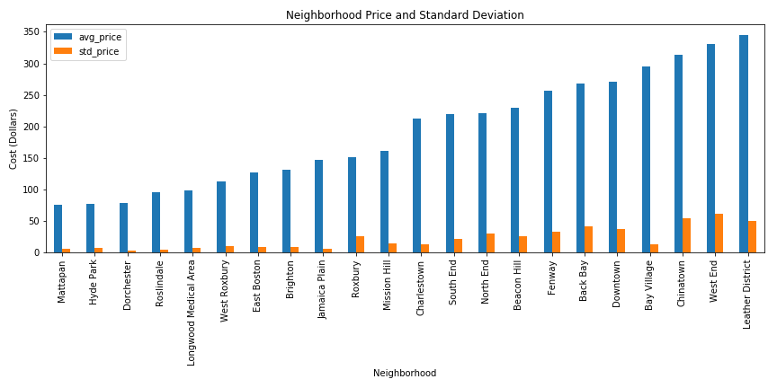

# Seasonal Trends

We have a year of data, let's examine how seasons effect occupancy.

We can take a naive approach and simply `groupby` each date and plot the number of dates filled. 


```python
calendar_data.groupby('date')[['filled']].sum().plot(figsize=(12, 6))
plt.title('Total Occupancy per Day')
plt.xlabel('Date')
plt.ylabel('Total Occupancy')
plt.tight_layout()
plt.savefig('./evolve_interview/naive_occupancy.png')
```

    /home/zoe/.local/lib/python3.6/site-packages/matplotlib/pyplot.py:523: RuntimeWarning: More than 20 figures have been opened. Figures created through the pyplot interface (`matplotlib.pyplot.figure`) are retained until explicitly closed and may consume too much memory. (To control this warning, see the rcParam `figure.max_open_warning`).
      max_open_warning, RuntimeWarning)


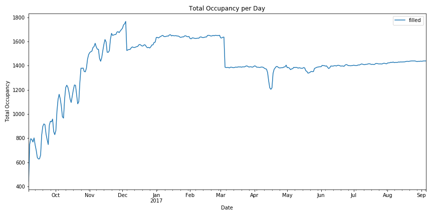

## Let's do better

This chart has some irregularities and is a little unclear about the type of trends we're looking for.

Let's look at only the listings that are filled each day of the year, and look at their prices as the year goes by.

We'll refer to these as "indicator listings".


```python
days_filled = calendar_data.groupby('listing_id')[['filled']].sum()
top_listings = days_filled[days_filled.filled == 365].index
```


```python
print(f'Original Datasize: {len(calendar_data.listing_id.unique())}.')
print(f'Pruned Datasize: {len(top_listings)}')
```

    Original Datasize: 2872.
    Pruned Datasize: 81


This shrinks our dataset by a lot, but that's ok.

We're looking for indicator listings, not the entire dataset.


```python
pruned_calendar_data = calendar_data[
    calendar_data['listing_id'].isin(top_listings)
]
```

## Plotting our Busy Listings


```python
plt.figure(figsize=(12, 6))
for lid in top_listings:
    cdata = pruned_calendar_data[pruned_calendar_data.listing_id == lid]
    cdata = cdata.sort_values('date')
    plt.plot(cdata.date, cdata.price)
plt.xlabel('Date')
plt.ylabel('Price')
plt.title('Occupied Listing Price per Day')
plt.tight_layout()
plt.savefig('./evolve_interview/all_filled.png')
```

    /home/zoe/.local/lib/python3.6/site-packages/matplotlib/pyplot.py:523: RuntimeWarning: More than 20 figures have been opened. Figures created through the pyplot interface (`matplotlib.pyplot.figure`) are retained until explicitly closed and may consume too much memory. (To control this warning, see the rcParam `figure.max_open_warning`).
      max_open_warning, RuntimeWarning)


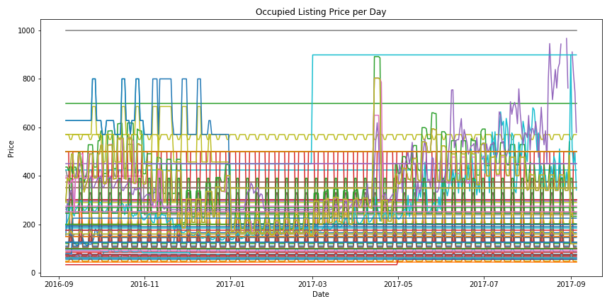

## Reducing Noise

This chart has too much noise and the trends are even less clear.

* Remove all listings with low standard deviation
    * $10 < \sigma < 200$
* Also cut out all listings that only have a few unique values
    * $\left\lvert \left\{ X \right\}\right\rvert > 10$
* Periodicity is the enemy of seasonal trends


```python
listing_price_deviations = pruned_calendar_data.groupby('listing_id')[['price']].std()
listing_price_deviations.rename(columns={'price': 'stddev'}, inplace=True)
listing_price_deviations = listing_price_deviations[
    np.logical_and(
        listing_price_deviations.stddev > 10,
        listing_price_deviations.stddev < 200
    )
]
listing_periodicity = pruned_calendar_data.groupby('listing_id')[['price']].nunique()
listing_periodicity.rename(columns={'price': 'num_unique'}, inplace=True)
listing_periodicity = listing_periodicity[
    listing_periodicity.num_unique > 10
]
sensitive_listings = listing_price_deviations.join(listing_periodicity, how='inner')
```


```python
sensitive_listings
```


<div>
<style>
    .dataframe thead tr:only-child th {
        text-align: right;
    }

    .dataframe thead th {
        text-align: left;
    }

    .dataframe tbody tr th {
        vertical-align: top;
    }
</style>
<table border="1" class="dataframe">
  <thead>
    <tr style="text-align: right;">
      <th></th>
      <th>stddev</th>
      <th>num_unique</th>
    </tr>
    <tr>
      <th>listing_id</th>
      <th></th>
      <th></th>
    </tr>
  </thead>
  <tbody>
    <tr>
      <th>5455004</th>
      <td>139.340961</td>
      <td>108</td>
    </tr>
    <tr>
      <th>6119918</th>
      <td>128.657169</td>
      <td>216</td>
    </tr>
    <tr>
      <th>8827268</th>
      <td>155.416406</td>
      <td>189</td>
    </tr>
    <tr>
      <th>14421304</th>
      <td>128.396181</td>
      <td>96</td>
    </tr>
    <tr>
      <th>14421403</th>
      <td>127.944730</td>
      <td>105</td>
    </tr>
    <tr>
      <th>14421692</th>
      <td>127.944730</td>
      <td>105</td>
    </tr>
  </tbody>
</table>
</div>


```python
sensitive_listings = sensitive_listings.index
sensitive_calendar_data = calendar_data[calendar_data['listing_id'].isin(sensitive_listings)]
```


```python
plt.figure(figsize=(12, 6))
for lid in sensitive_listings:
    cdata = sensitive_calendar_data[sensitive_calendar_data.listing_id == lid]
    cdata = cdata.sort_values('date')
    label = combined_data[combined_data.id == lid].name.values[0]
    plt.plot(cdata.date, cdata.price, label=label)
plt.legend(loc=0)
plt.title('Indicator Listing Prices by Day')
plt.xlabel('Date')
plt.ylabel('Price')
plt.tight_layout()
plt.savefig("./evolve_interview/indicators.png")
```

    /home/zoe/.local/lib/python3.6/site-packages/matplotlib/pyplot.py:523: RuntimeWarning: More than 20 figures have been opened. Figures created through the pyplot interface (`matplotlib.pyplot.figure`) are retained until explicitly closed and may consume too much memory. (To control this warning, see the rcParam `figure.max_open_warning`).
      max_open_warning, RuntimeWarning)


## Plotting our Indicator Listings

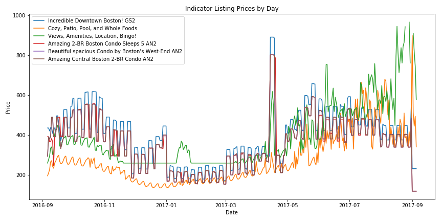


```python
fig, axarr = plt.subplots(2, 1, figsize=(16, 12))
for lid in sensitive_listings:
    cdata = sensitive_calendar_data[sensitive_calendar_data.listing_id == lid]
    cdata = cdata.sort_values('date')
    label = combined_data[combined_data.id == lid].name.values[0]
    axarr[0].plot(cdata.date.values, cdata.price.values, label=label)
axarr[0].legend(loc=0)
axarr[0].set_title('Indicator Listings')
axarr[0].set_xlabel('Date')
axarr[0].set_ylabel('Price')

fill_dates = calendar_data.groupby('date')[['filled']].sum()
axarr[1].plot(fill_dates.index.values, fill_dates.filled.values)
axarr[1].set_title('Total Occupancy')
axarr[1].set_xlabel('Date')
axarr[1].set_ylabel('Occupancy')

plt.tight_layout()
plt.savefig("./evolve_interview/indicators_occupancy.png")
```

    /home/zoe/.local/lib/python3.6/site-packages/matplotlib/pyplot.py:523: RuntimeWarning: More than 20 figures have been opened. Figures created through the pyplot interface (`matplotlib.pyplot.figure`) are retained until explicitly closed and may consume too much memory. (To control this warning, see the rcParam `figure.max_open_warning`).
      max_open_warning, RuntimeWarning)


## Combining Naive Occupancy and Indicator Listings

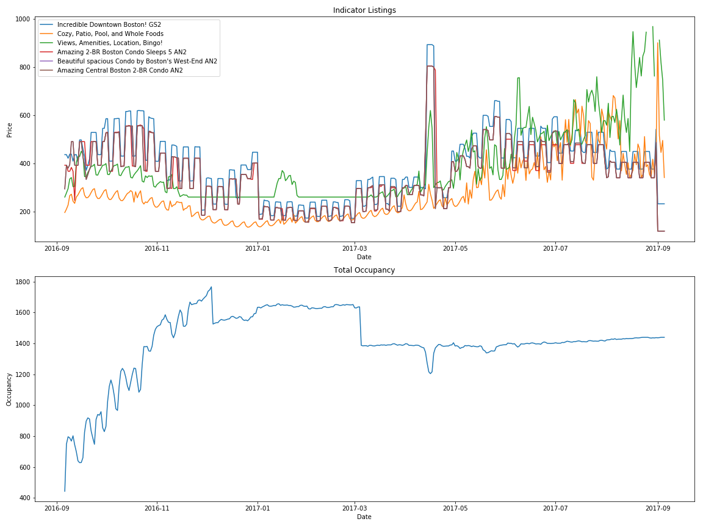

## What does this tell us?

* Winter was the busy season for 2016-2017
    * Most likely because of family/holidays
    * Also the cheapest
* Summers are expensive
* Memorial Day Weekend is expensive (the spike in the middle)
    * [See this event guide for details](http://www.boston-discovery-guide.com/boston-event-calendar-may.html)
* The start of MIT school year is expensive (spike at the right side)
    * [See the academic calendar for more info](http://web.mit.edu/registrar/calendar/)
* Visit Boston between New Years and March for the cheapest rates.
* Weekends are more expensive than weekdays, but this doesn't influence occupancy.
* Our naive approach looks weird in Fall 2016 due to AirBnB's increased activity in the area
    * [See here for 2016 article](http://www.bostonherald.com/news/local_coverage/2016/10/airbnb_leaving_no_room_for_rentals)
* [According](https://www.bostonglobe.com/business/2017/08/06/cambridge-set-vote-ordinance-regulate-airbnb/61Wc1phpViVbYv3x7ORMaI/story.html) to [a ton](https://www.bostonglobe.com/business/2017/10/05/housing-advocates-say-airbnb-rentals-are-replacing-chinatown-apartments/Z9KwIgppY89rHbbflvKC6H/story.html) of [news sources](http://www.wbur.org/bostonomix/2017/08/08/cambridge-short-term-rental-rules), this was an year of protest for AirBnB. This is probably skewing the data
    

These are good preliminary results, but for more accurate results we'd want several years to reduce influence of increased activity, year specific events, legal actions, etc.

# Neighborhood Specific Seasonal Trends

Let's dig into any seasonal trends we can find on a neighboorhood basis.


```python
full_combined_data = listing_data.merge(
    calendar_data,
    how='inner',
    left_on='id',
    right_on='listing_id'
)
```

Let's plot each neighborhood by their average price and fill-rate per day.


```python
full_combined_data = full_combined_data[~full_combined_data.available.isnull()]
```


```python
neighborhood_data = full_combined_data\
    .groupby(['neighbourhood_cleansed', 'date'])\
    .agg({'filled': 'sum', 'price_y': 'mean'})
neighborhood_data = neighborhood_data.unstack(level=0)
```


```python
neighborhood_data[['filled']].plot(
    figsize=(12, 8),
    legend=False
)

plt.ylabel('Occupancy')

plt.title('Neighborhood Occupancy')
plt.savefig('./evolve_interview/neighborhood_filled.png')

neighborhood_data[['price_y']].plot(
    figsize=(12, 8),
    legend=False
)

plt.ylabel('Price')

plt.title('Neighborhood Average Price')
plt.savefig('./evolve_interview/neighborhood_price.png')
```

    /home/zoe/.local/lib/python3.6/site-packages/matplotlib/pyplot.py:523: RuntimeWarning: More than 20 figures have been opened. Figures created through the pyplot interface (`matplotlib.pyplot.figure`) are retained until explicitly closed and may consume too much memory. (To control this warning, see the rcParam `figure.max_open_warning`).
      max_open_warning, RuntimeWarning)


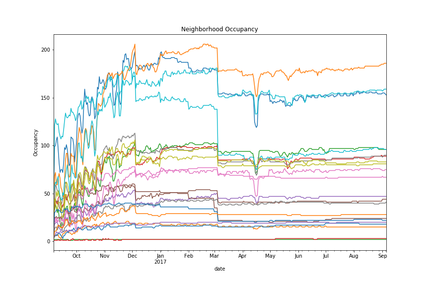

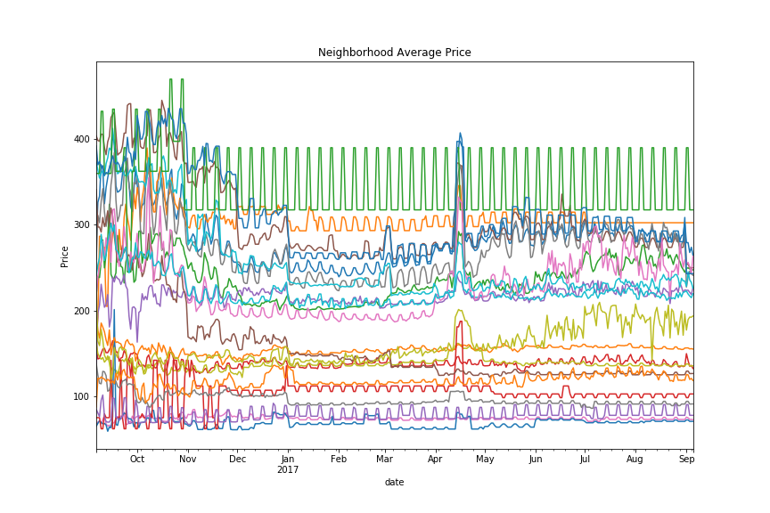

## What does this tell us?

* As with before, Memorial Day Weekend stands out as a spike in pricing and a drop in occupancy
* Weekends are more expensive
* December and March 1st have a huge drop in occupancy and pricing
* Not every seasonal trend affects every neighborhood! Some are immune (or do the opposite) of the average trend.

As with before, we'd ideally want more data to make more accurate observations.

# Examining Neighborhoods

Let's also see if we can pull out neighbor features.

Some listings don't have neighborhood descriptions, so let's skip those.


```python
valid_desc_data = combined_data[combined_data.neighborhood_overview.notnull()].copy()
neighborhood_labels = valid_desc_data.neighbourhood_cleansed.unique()
```


```python
neighborhood_labels
```


    array(['Roslindale', 'Jamaica Plain', 'Mission Hill',
           'Longwood Medical Area', 'Bay Village', 'Leather District',
           'Chinatown', 'North End', 'Roxbury', 'South End', 'Back Bay',
           'East Boston', 'Charlestown', 'West End', 'Beacon Hill', 'Downtown',
           'Fenway', 'Brighton', 'West Roxbury', 'Hyde Park', 'Mattapan',
           'Dorchester', 'South Boston Waterfront', 'South Boston', 'Allston'], dtype=object)


## How many listings per neighborhood?


```python
valid_desc_data.groupby('neighbourhood_cleansed').agg('size').sort_values()
```


    neighbourhood_cleansed
    Leather District             5
    Longwood Medical Area        6
    Mattapan                    14
    Hyde Park                   15
    Bay Village                 19
    West Roxbury                24
    West End                    32
    South Boston Waterfront     41
    Roslindale                  42
    Chinatown                   46
    Charlestown                 53
    Mission Hill                58
    East Boston                 87
    North End                   88
    Roxbury                     92
    Brighton                   105
    Downtown                   108
    South Boston               114
    Beacon Hill                131
    Dorchester                 144
    Allston                    146
    Fenway                     148
    Back Bay                   181
    South End                  225
    Jamaica Plain              246
    dtype: int64


```python
top5_neighborhoods = list(valid_desc_data.groupby('neighbourhood_cleansed').agg('size').sort_values().tail(5).index)
top5_listings = valid_desc_data[valid_desc_data.neighbourhood_cleansed.isin(top5_neighborhoods)]
for key, group in top5_listings.groupby('neighbourhood_cleansed'):
    plt.figure()
    text = '\n'.join(group.neighborhood_overview.values)

    wordcloud = WordCloud(width=1600, height=1200).generate(text)
    plt.figure(figsize=(16, 12))
    plt.imshow(wordcloud, interpolation='bilinear')
    plt.title(key)
    plt.axis("off")
    plt.savefig(f'./evolve_interview/{"_".join(key.lower().split(" "))}_words.png')
```

    /home/zoe/.local/lib/python3.6/site-packages/matplotlib/pyplot.py:523: RuntimeWarning: More than 20 figures have been opened. Figures created through the pyplot interface (`matplotlib.pyplot.figure`) are retained until explicitly closed and may consume too much memory. (To control this warning, see the rcParam `figure.max_open_warning`).
      max_open_warning, RuntimeWarning)


## Where are these neighborhoods?


## Top 5 Neighborhoods

Let's only take the top 5 neighborhoods with the most listings.


```python
top5_neighborhoods
```


    ['Allston', 'Fenway', 'Back Bay', 'South End', 'Jamaica Plain']


Now let's make a word cloud for each neighborhood based on the most common words in their descriptions.

## Allston

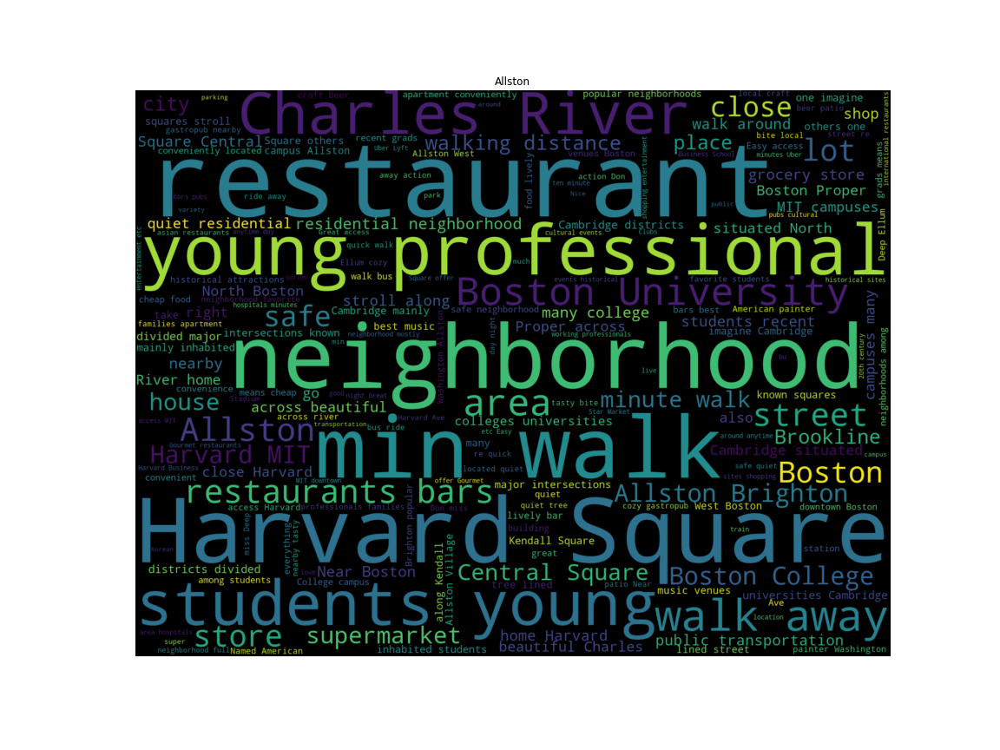

## Fenway

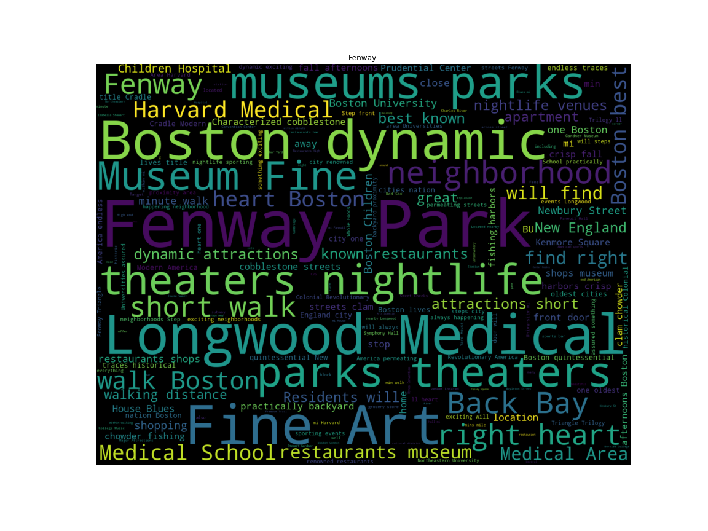

## Back Bay

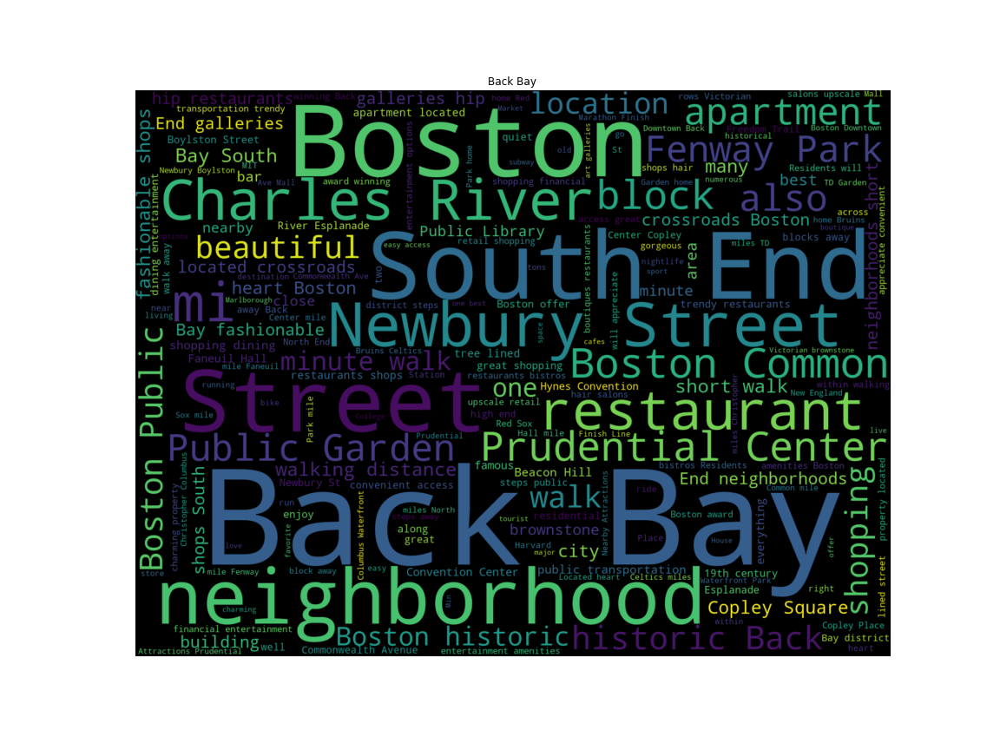

## South End

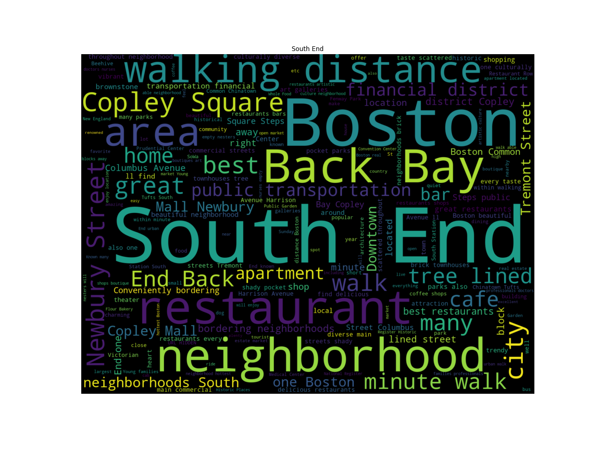

## Jamaica Plain

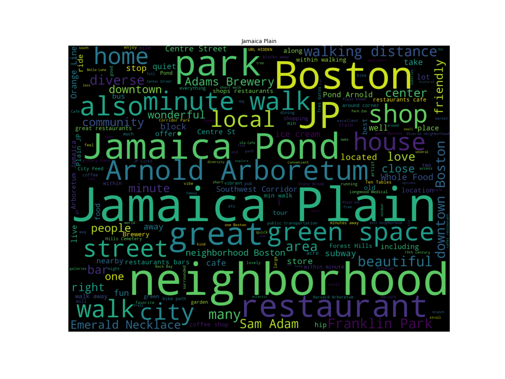

# Feature Extraction

Wordclouds are pretty, but also fairly crude. Let's take a deeper dive into these top 5 neighborhoods.


```python
top5_fulltext = top5_listings[['neighbourhood_cleansed',
                               'neighborhood_overview']]
top5_fulltext.head(3)
```


<div>
<style>
    .dataframe thead tr:only-child th {
        text-align: right;
    }

    .dataframe thead th {
        text-align: left;
    }

    .dataframe tbody tr th {
        vertical-align: top;
    }
</style>
<table border="1" class="dataframe">
  <thead>
    <tr style="text-align: right;">
      <th></th>
      <th>neighbourhood_cleansed</th>
      <th>neighborhood_overview</th>
    </tr>
  </thead>
  <tbody>
    <tr>
      <th>59</th>
      <td>Jamaica Plain</td>
      <td>The neighborhood is complete with all shops, r...</td>
    </tr>
    <tr>
      <th>60</th>
      <td>Jamaica Plain</td>
      <td>Downtown Jamaica Plain is a delight with plent...</td>
    </tr>
    <tr>
      <th>61</th>
      <td>Jamaica Plain</td>
      <td>the neighborhood is exactly that ... a neighbo...</td>
    </tr>
  </tbody>
</table>
</div>


## Term Frequency - Inverse Document Frequency

From [Wikipedia](https://en.wikipedia.org/wiki/Tf%E2%80%93idf),

> tf–idf, short for term frequency–inverse document frequency, is a numerical statistic that is intended to reflect how important a word is to a document in a collection or corpu

In essence, the product of "how common a word is in the corpus" and "inverse of how frequently the term appears in the document set".

Using this concept we can construct a document matrix, where each row represents a document in the corpus, and each column represents a word that appeared.

The big difference between this approach and our wordcloud approach from earlier which just relies on raw frequency is that this takes into account the overall frequency of the word in the entire document set.

## Scikit-Learn

`sklearn` provides several vectorizers, including a tf-idf vectorizer.

We give it a tokenizing regular expression in order to prune less relevant tokens (a token is just a unit of semantic meaning, in this case we only want words longer than 3 characters).


```python
valid_word = '[A-Za-z_]'
vect = TfidfVectorizer(
    token_pattern=f'(?u)\\b{valid_word}{{5,}}\\b'
)
stemmer = porter2
tokenizer = TreebankWordTokenizer()
```


```python
top5_cleantext = np.empty(len(top5_fulltext), dtype=object)
for i, text in enumerate(top5_fulltext.values[:, 1]):
    splittext = [x for x in text.split(' ')
                 if (len(x) > 3 and
                     not x[0].isupper())]
    top5_cleantext[i] = (' '.join(stemmer.stem(word) for word in tokenizer.tokenize(' '.join(splittext))))
```

We're going to feed this all of the listing descriptions from our top 5 neighborhoods and aggregate later.


```python
fit = vect.fit(top5_cleantext)
X = vect.fit_transform(top5_cleantext)
```

The shape of this document matrix, $946 \times 1599$, indicates there are $946$ documents, and $1599$ tokens.

This matrix is incredibly sparse however (only about 0.5% full), since not every token appears in every document.


```python
X.shape
```


    (946, 1599)


```python
X.astype(bool).sum() / (946 * 3019)
```


    0.0049293165834142748


## Using tf-idf

Now that we have our document matrix, let's use it to figure out the most important words per document.


```python
neighborhood_docs = {i: name for i, name in enumerate(top5_fulltext.values[:, 0])}
vocab = {v: k for k, v in fit.vocabulary_.items()}
words = {x: [] for x in set(top5_fulltext.values[:, 0])}
for (document, index), val in sc_sp.dok_matrix(X).items():
    n = neighborhood_docs[document]
    word = vocab[index]
    heapq.heappush(words[n], (val, word))
summary = ''
for neighborhood, wordlist in words.items():
    wordlist = wordlist[::-1]
    final_list = []
    for val, word in wordlist:
        if len(final_list) > 15:
            break
        if word not in final_list:
            final_list.append(word)
    summary += (f'{neighborhood}:\n\t{", ".join(final_list)}\n\n')
```


```python
print(summary)
```

    South End:
    	distanc, yourself, brownston, locat, young, across, years, wrought, would, worlds, world, wonder, discov, within, dinner, beauti
    
    Fenway:
    	dynam, young, museum, attract, years, would, worth, worri, wonder, anyth, women, without, within, multicultur, moist, modern
    
    Back Bay:
    	hospit, years, convention, wrong, convent, worth, appreci, homes, block, histori, wonder, histor, within, conveni, almost, window
    
    Jamaica Plain:
    	zagat, yummi, lucki, youth, yourself, younger, distanc, young, along, longer, locations, burger, locat, would, worth, worst
    
    Allston:
    	minut, youth, decid, younger, blocks, culture, young, block, anywher, activ, cultur, biking, between, midst, world, midnight
    
    


## What does this tell us?

* Stemming (converting words to their "base" form) is tricky, and innacurate
* Tf-Idf emphasizes words that appear in fewer documents
    * This gives us a better summary instead of just seeing "Boston" for every neighborhood
* The advantage this provides over just word frequencies is that we see the important things that aren't mentioned frequently.
* South End:
	* Located in a good spot, younger crowd, good restaurants, "deeper beauty".
* Fenway
	* Younger crowd, has museums, multicultural, modern.
* Back Bay:
	* Hospital access, conventions here, high value, historical districts
* Jamaica Plain:
	* Lots of zagat-reviewed restaurants, good food here, younger crowd.
* Allston:
	* Younger crowd, access to outdoors activities (biking, etc.), active nightlife.

# Conclusions

## Seasonal Trends


* Winter was the busy season for 2016-2017
    * Most likely because of family/holidays
    * Also the cheapest
* Summers are expensive
* Memorial Day Weekend is expensive (the spike in the middle)
    * [See this event guide for details](http://www.boston-discovery-guide.com/boston-event-calendar-may.html)
* The start of MIT school year is expensive (spike at the right side)
    * [See the academic calendar for more info](http://web.mit.edu/registrar/calendar/)
* Visit Boston between New Years and March for the cheapest rates.
* Weekends are more expensive than weekdays, but this doesn't influence occupancy.
* Our naive approach looks weird in Fall 2016 due to AirBnB's increased activity in the area
    * [See here for 2016 article](http://www.bostonherald.com/news/local_coverage/2016/10/airbnb_leaving_no_room_for_rentals)
* [According](https://www.bostonglobe.com/business/2017/08/06/cambridge-set-vote-ordinance-regulate-airbnb/61Wc1phpViVbYv3x7ORMaI/story.html) to [a ton](https://www.bostonglobe.com/business/2017/10/05/housing-advocates-say-airbnb-rentals-are-replacing-chinatown-apartments/Z9KwIgppY89rHbbflvKC6H/story.html) of [news sources](http://www.wbur.org/bostonomix/2017/08/08/cambridge-short-term-rental-rules), this was an year of protest for AirBnB. This is probably skewing the data
  


* As with before, Memorial Day Weekend stands out as a spike in pricing and a drop in occupancy
* Weekends are more expensive
* December and March 1st have a huge drop in occupancy and pricing
* Not every seasonal trend affects every neighborhood! Some are immune (or do the opposite) of the average trend.

## Neighborhoods

The Leather District, West End, and Chinatown are the most expensive places to live.


* South End:
	* Located in a good spot, younger crowd, good restaurants, "deeper beauty".
* Fenway
	* Younger crowd, has museums, multicultural, modern.
* Back Bay:
	* Hospital access, conventions here, high value, historical districts
* Jamaica Plain:
	* Lots of zagat-reviewed restaurants, good food here, younger crowd.
* Allston:
	* Younger crowd, access to outdoors activities (biking, etc.), active nightlife.

# Questions?

* [zoe@dataleek.io](mailto:zoe@dataleek.io)
* [https://gitlab.com/thedataleek/evolve_interview](https://gitlab.com/thedataleek/evolve_interview)


```python

```
