# Political Boundaries and Simulations

## Zoë Farmer

# Who am I?

* My name is Zoë Farmer
* I'm a recent CU graduate with a BS in Applied Math and a CS Minor
* I'm a co-coordinator of the Boulder Python Meetup
* I'm a big fan of open source software
* I'm looking for work (pls hire me)
* Co-Founder of [Nidhogg Consulting LLC](nidhogg.io)
* http://www.dataleek.io
* [@TheDataLeek](http://www.twitter.com/thedataleek)
* [github.com/thedataleek](http://github.com/thedataleek)
* [gitlab.com/thedataleek](http://gitlab.com/thedataleek)

# What are we talking about?

In this presentation I'll discuss two numerical approaches to solving political boundaries while striving to avoid gerrymandering.

This is mainly an exploration, and since the final results can be finnicky, this analysis should be taken with a grain of salt...

Slides, code, and images are available here if you want to follow along.

http://bit.ly/2xvaHnX

or

http://dataleek.io/presentations/politicalboundaries

# Our Algorithms

We're talking about two different numerical methods that obtain "close-enough" solutions.

Closed form solutions aren't always possible to obtain, so we can get one that's numerically close to solving our hard problem.

* [Simulated Annealing](https://en.wikipedia.org/wiki/Simulated_annealing)
    * Minor permutations in a given solution until we find a solution that's slightly better, and repeat.
* [Genetic Algorithm](https://en.wikipedia.org/wiki/Genetic_algorithm)
    * Create a ton of random solutions, have them "combine" and take the best of their children.

# Simulated Annealing

1. Generate a random solution
2. Generate a "neighboring solution" to our generated solution
3. Keep whichever is better, or (with decaying probability) take the new one regardless
4. Go back to 2 or eventually stop

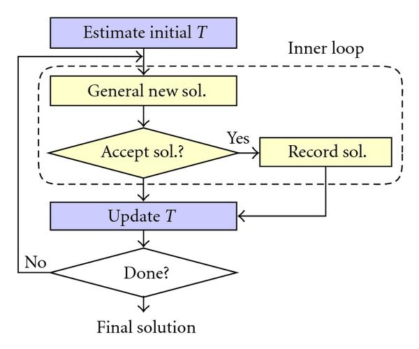

# Genetic Algorithm

1. Randomly generate an initial population of solutions
2. Use our solution population to generate some large number of children (note,
   these children should inherit properties from their parents). Add mutation to avoid inbreeding.
3. Keep the best of our total population
4. Go back to 2 or eventually stop

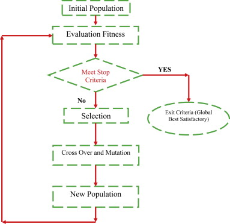

# Why Python?

* Entire codebase is in Python3.6
    * f-strings are slick
    * Typing is nifty
    * Faster
    * Backwards compatible with Python3.5, so we can use pypy if we want
* Numerical analysis is great in python
    * Bindings to fortran libs => very fast
    * Easy to work with/code in
    * Offers many advanced math capabilities (FFT, ODE, etc.)

# Libraries

    # stdlib imports
    import sys       # exits and calls
    import os        # path manipulation
    import argparse  # argument handling
    import math      # exponent - faster than numpy for this
    import random    # built-in random func
    import re        # dynamically pull out algo names
    import queue     # used for SCC labelling

    # typing
    from typing import Union

    # third-party imports
    import numpy as np                       # heavy lifting
    import matplotlib.pyplot as plt          # visualization
    import matplotlib.animation as animation # animation
    from moviepy import editor               # More gif
    from tqdm import tqdm                    # Progress bars are nice
    from halo import Halo                    # Spinner

# Drawing Political District Boundaries

How can this be applied to political boundaries?

Assumptions:
* 2 parties
* Rectangular areas
* Provided in a specific format
* These examples are in $8\times8$ grid, with 8 districts.
* Equal density squares, not population. "Voting Units"
```
D R D R D R R R
D D R D R R R R
D D D R R R R R
D D R R R R D R
R R D D D R R R
R D D D D D R R
R R R D D D D D
D D D D D D R D
```

Which can be plotted for readability.

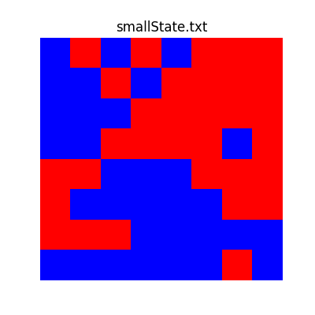

# Related Problems to Solve First

## Finding Neighbors of a Point

Our first big problem is how we find neighbors of a single point. For any `(y, x)` pair we can express its neighbors using the following algorithm.

1. Iterate over range(-1, 2) for both x and y
2. For each loop, accept (y + yi, x + xi) if the following conditions hold:
    * y + yi is within the range of the field
    * x + xi is within our domain of the field
    * xi and yi are not both equal to zero

## Determining if a District is Valid

How do we determine valid solutions?

* Connected squares (diagonals count)
* Think of these as single connected components
* We can use [connected component labelling](https://en.wikipedia.org/wiki/Connected-component_labeling). (from wikipedia)

## Valid Solutions?

* Made up of valid districts
* No missing (not accounted for) squares
* All districts accounted for.

## Finding District Neighbors

* Need to find all neighbors of a given district
* Super similar to connected component labelling

The basic algorithm is as follows.

1. Get a random spot inside the given district
2. Add this spot to a Queue
3. Initialize an empty labelling array (as with connected component labelling)
4. While the queue is not empty, get an new `(y, x)` pair.
5. If the point falls within the district, get all of the point's neighbors, add them to the queue, and go back to (4)
6. If the point does not fall into the district, add it to the list of district neighbors.

## Fitness Functions

For both these algorithms we talk about their "value", which in this case is determined with a fitness function.
> A fitness function is a particular type of objective function that is used to summarise, as a single figure of merit, how close a given design solution is to achieving the set aims. (wikipedia)

TL;DR a single number that basically tells us how "good" of a solution we have.

Taking a step back from the code and considering the real world, let's think about what we'd ideally like to emphasize in a political districting system.

* We'd want districts to be homogeneous.
    * Either want a district to be all `R` or all `D`.
* We want our district ratios to approximately match our population ratios.
    * If our population is 50% `R`, we want 50% `R` majority districts
* We'd want to avoid [gerrymandering](https://en.wikipedia.org/wiki/Gerrymandering)
<div style="display: inline-flex;">
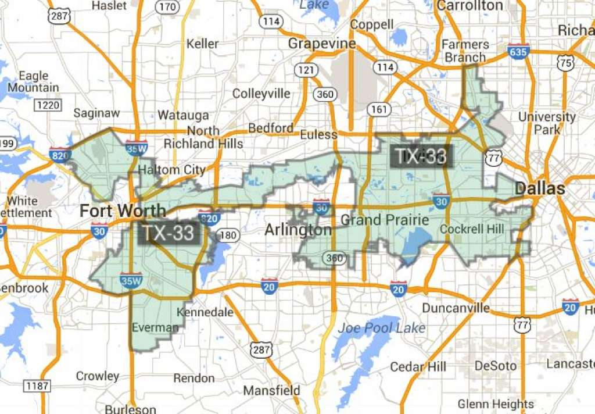
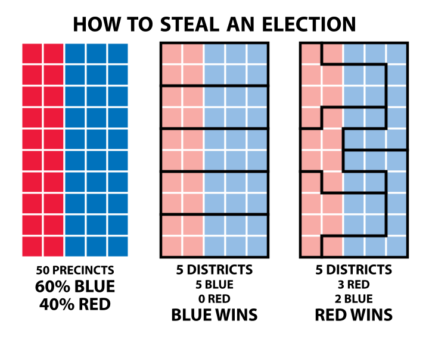
</div>

* We want all districts to be around the same population size.
    * In our example, $8 \times 8$ grid would mean that each district should be around 8 squares.

Translated to our code these priorities become

1. Validity of solution
2. Make sure the ratio of `R` to `D` majority districts matches the ratio of `R` to `D` in the general population.
3. Make sure each district is as homogeneous as possible
4. Reduce the value of the district if its size isn't close to the "ideal size", which is `total_size / num_districts`.
5. We also take into account that in non-homogeneous districts voters that aren't affiliated with the majority party might be swayed by targeted campaigns. To this effect we account each non-affiliated "zone" with a weight of -0.9 instead of -1.
6. Finally, we can also minimize edge length as well as trying to keep each district the same size. This will result in hopefully ideal districts

## Generating Random Solutions

This algorithm is very straightforward.

1. Generate a number of "spawn points" equal to the number of districts.
2. Fill.

The fill algorithm is also straightforward.

1. Set a list of available districts.
2. While there are any non-set points, pick a random district, `i`, from the list of available districts.
3. Get a list of all neighbors of the district, but filter to only 0-valued entries.
4. If no such neighbors exist, remove this district from the list of available districts.
5. Otherwise pick a neighbor at random and set it to `i`.
6. Loop back to (2).

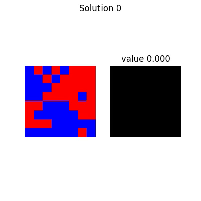

# Simulated Annealing

Recall:

1. Generate a random solution
2. Generate a solution neighbor
3. If the new solution is better than the old, set the current solution to the new one.
4. Sometimes accept a worse solution

## Mutations

Simulated Annealing relies on "mutating" solutions via the following algorithm.

1. Find all district neighbors
2. Pick a neighboring point at random.
3. If the neighboring point's district has at least size 2, set this neighboring point to our district.
4. Otherwise, pick a different neighboring point.

Which can be visualized as follows.

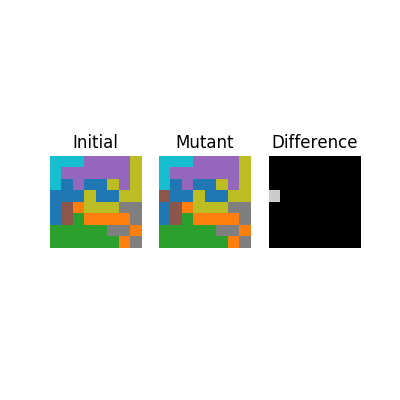

The entire process looks like this:


Which has the following final solution.

<div style="display: inline-flex;">

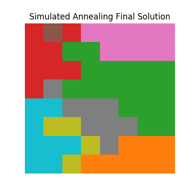
</div>

# Genetic Algorithms

Recall:

1. Randomly generate an initial population of solutions
2. Use our solution population to generate some large number of children (note,
   these children should inherit properties from their parents)
3. Keep the best of our total population
4. Go back to 2 or eventually stop

# Mutations

1. Shuffle the parents
2. Shuffle the districts
3. Overlay and connect similar districts to create a child

Which can be visualized as follows.

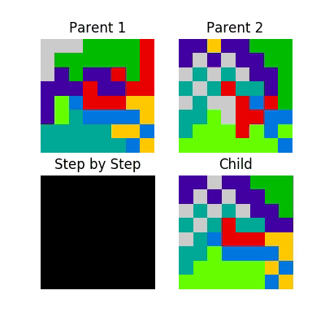

This process looks like this

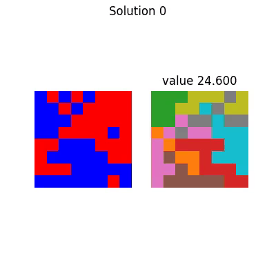

With corresponding final solution

<div style="display: inline-flex;">

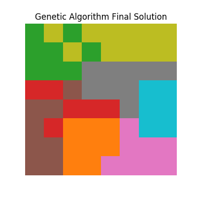
</div>

# Comparisons

<div style="display: inline-flex;">
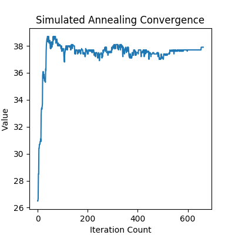
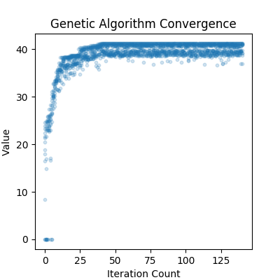
</div>

<div style="display: inline-flex;">


</div>

# Final Thoughts

* They're both unique approaches that can be applied to incredibly complex problems
* However much of their success hinges on the effectiveness of your fitness function
* Any given "final solution" is somewhat unique, or at the very least improbable to obtain again

# Using the Code (Live Demo?)

This is straightforward! After installing the required libraries (check [the repository](https://gitlab.com/thedataleek/politicalboundaries)) just run

```bash
$ python3.6 ./politicalboundaries.py $FILE_TO_RUN
```

If you want to dig a little deeper, use the `-h` flag to see what it can do, but
here's a short list as well.

* Use Simulated Annealing on the file
* Use the Genetic Algorithm on the file
* Set the number of districts for either solution type
* Set the precision (number of runs) for either algorithm
* Animate the solution process
* Create gifs of the solution process (otherwise just `.mp4`)
* Generate report (`README.md`) assets.
* Do all of the above in one go.

# Next Steps

I want to do more for this project but I'm limited in the time I have. I do have
a couple of ideas for next steps however.

* Generalizing for more than 2 parties
* Testing Robustness against hostile inputs
* Parallelizing - Instead of just running simulations on a single thread, we could theoretically spin up a bunch of different threads and run simulations on them simultaneously, only keeping the best of all trials.
* Real Data - It would be amazing to take the approaches used in this writeup and apply it to real-world political data.

# Questions?

* Follow me on Twitter [@TheDataLeek](https://twitter.com/thedataleek)
* Check out slides on my website, [http://dataleek.io](http://dataleek.io)

# Appendix

# Simulated Annealing


```python
def simulated_annealing(system, numdistricts, precision, animate, makegif):
    """
    Perform simulated annealing on our system with a series of progressively
    improving solutions.
    """
    solution = get_good_start(system, numdistricts)
    history = [solution]  # Keep track of our history
    k = 0.25  # Larger k => more chance of randomly accepting
    Tvals = np.arange(1, 1e-12, -1.0 / precision)
    print(f'Running Simulated Annealing with k={k:0.03f}, alpha={1.0 / precision:0.05f}')
    for i, T in tqdm(enumerate(Tvals), total=len(Tvals)):
        new_solution = solution.copy()  # copy our current solution
        new_solution.mutate()  # Mutate the copy
        # TODO: Speed this up by keeping current value
        dv = new_solution.value - solution.value  # Look at delta of values
        # If it's better, or random chance, we accept it
        if dv > 0 or random.random() < math.exp(dv / (k * T)):
            solution = new_solution
            history.append(new_solution)

    solution.count = len(Tvals)
    solution.algo = 'Simulated Annealing'
    print(solution)
    print(solution.summary())

    if animate:
        animate_history(system.filename, system.matrix,
                        history, solution.numdistricts,
                        makegif)
```

# Genetic Algorithm


```python
def genetic_algorithm(system, numdistricts, precision, animate, makegif):
    """
    Use a genetic algorithm to find a good solution to our district problem
    """
    # Start with random initial solution space (3)
    solutions = [Solution(system, numdistricts) for _ in range(3)]
    for s in solutions:
        s.generate_random_solution()  # Initialize our solutions
    top_history = []  # Keep history of our top solution from each "frame"
    for i in tqdm(range(precision)):
        new_solutions = []
        for _ in range(10):  # Create 10 children per frame
            s1, s2 = np.random.choice(solutions, size=2)
            # Randomly combine two parents
            new_solutions.append(s1.combine(s2))
        # Combine everything, giving 13 total solutions
        full_solutions = new_solutions + solutions
        # Keep the top 3 for next generation
        solutions = [_[0] for _ in
                     sorted([(s, s.value) for s in full_solutions],
                            key=lambda tup: -tup[1])[:3]]
        # Only record top from generation, and only if it's changed
        if len(top_history) == 0 or solutions[0] != top_history[-1]:
            top_history.append(solutions[0])

    solution = top_history[-1]
    solution.count = precision
    solution.algo = 'Genetic Algorithm'
    print(solution)
    print(solution.summary())

    if animate:
        animate_history(system.filename, system.matrix,
                        top_history, solution.numdistricts,
                        makegif)
```

## How much does choice of `k` impact solution selection?

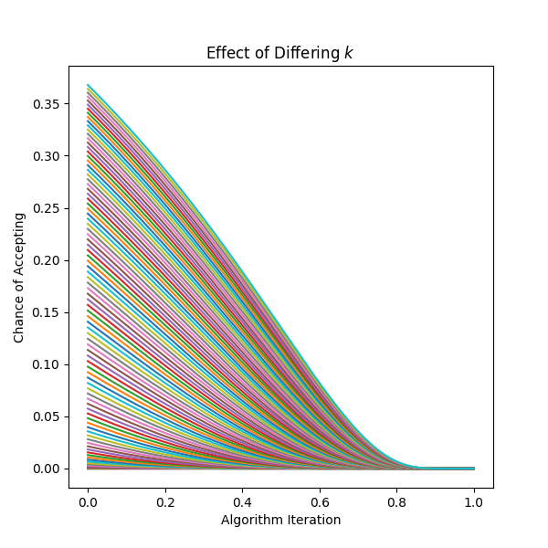

## Code Structure

    ▼ Mask : class
       +__init__ : function
       -__str__ : function
      ▼+get_labels : function
         +unlabelled : function
       +is_valid : function
       +location : function
       +make_valid : function
       +overlap : function
       +parse_list : function
       +parse_locations : function
       +size : function

    ▼ Solution : class
       -__eq__ : function
       -__getitem__ : function
       +__init__ : function
       -__ne__ : function
       -__str__ : function
       +combine : function
       +copy : function
       +fill : function
       +generate_random_solution : function
       +get_district_neighbors : function
       +get_filtered_district_neighbors : function
       +get_full_openspots : function
       +get_neighbors : function
       +get_random_openspot : function
       +get_solution : function
       +height : function
       +is_valid : function
       +majorities : function
       +majority : function
       +mutate : function
       +show : function
       +summary : function
       +value : function
       +width : function

    ▼ System : class
       -__getitem__ : function
       +__init__ : function
       +_name_arr : function
       +_read_file : function
       +empty_state : function
       +height : function
       +stats : function
       +width : function

    ▼+animate_history : function
       +update_plot : function

    ▼+generate_report_assets : function
       +update : function

     +genetic_algorithm : function

     +get_args : function

     +get_good_start : function

     +main : function

     +simulated_annealing : function

    ▼ variables
        FIGSIZE
        OUTDIR


```python

```
