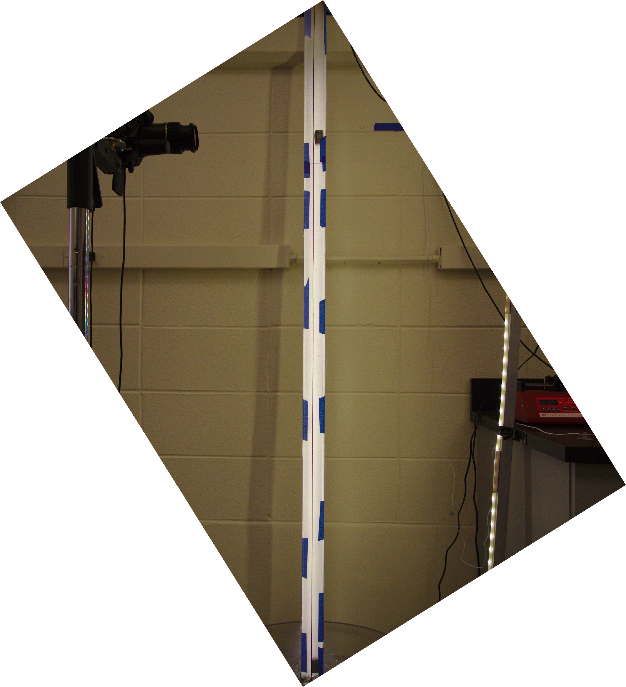
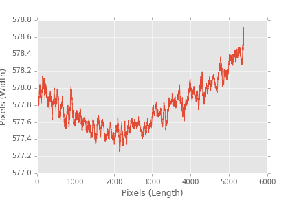
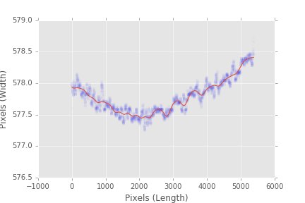
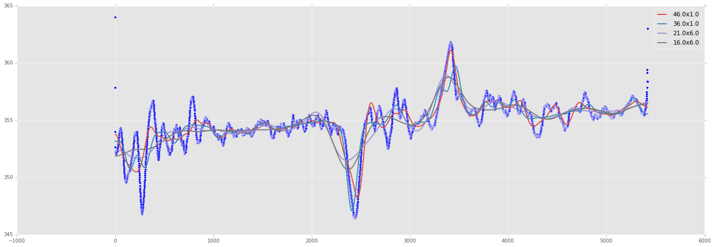
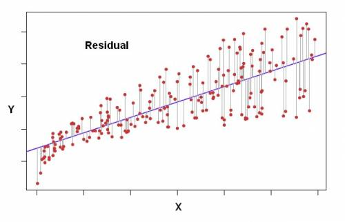
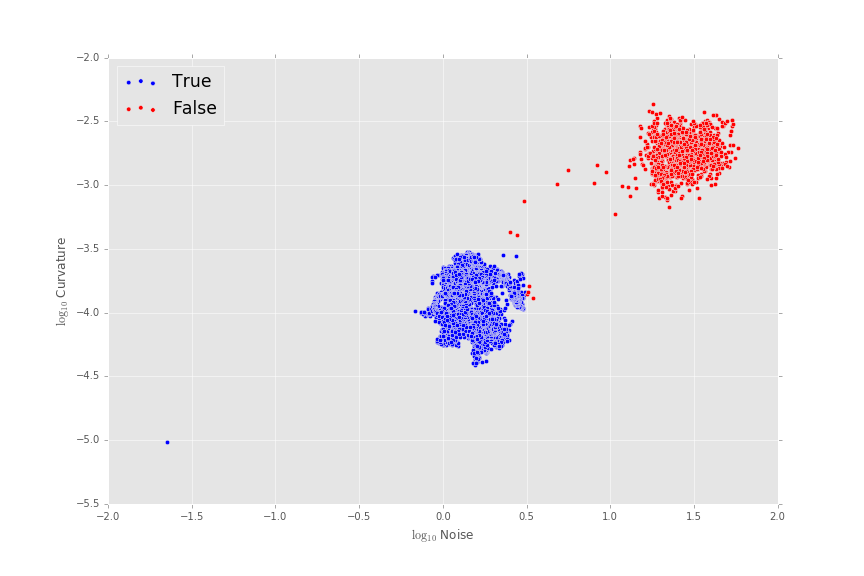
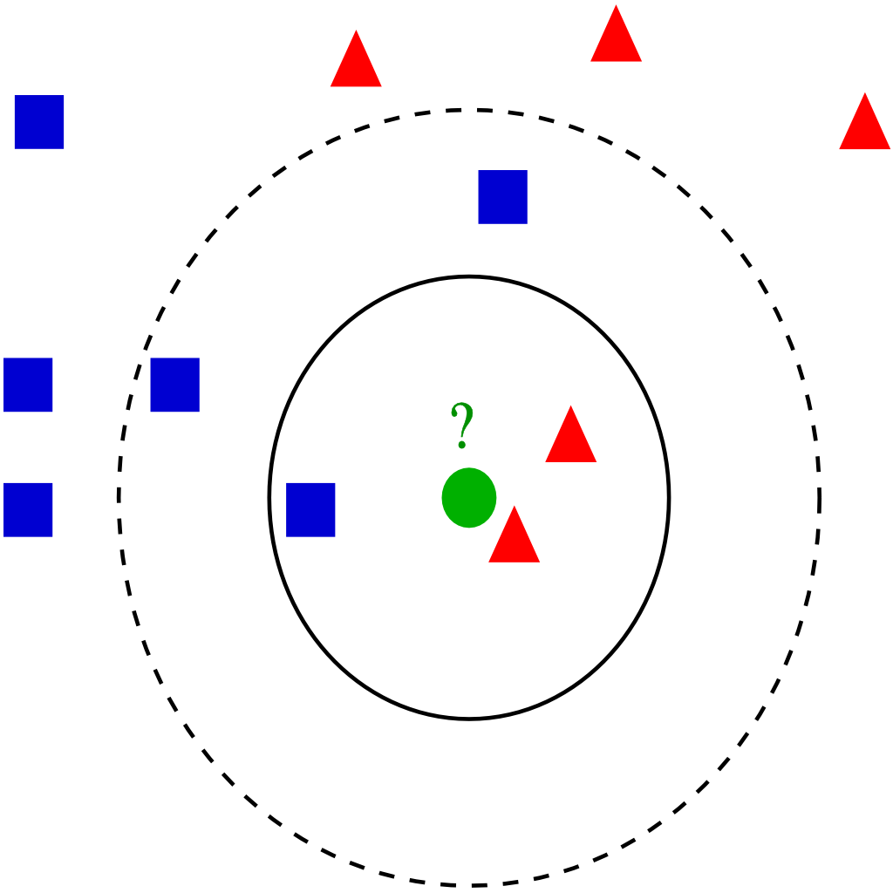
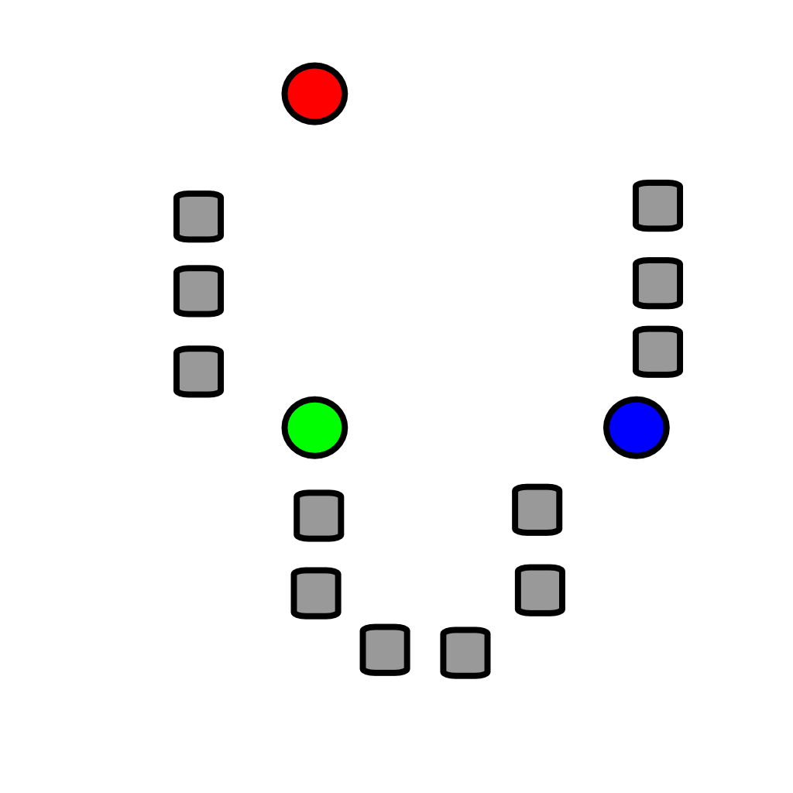
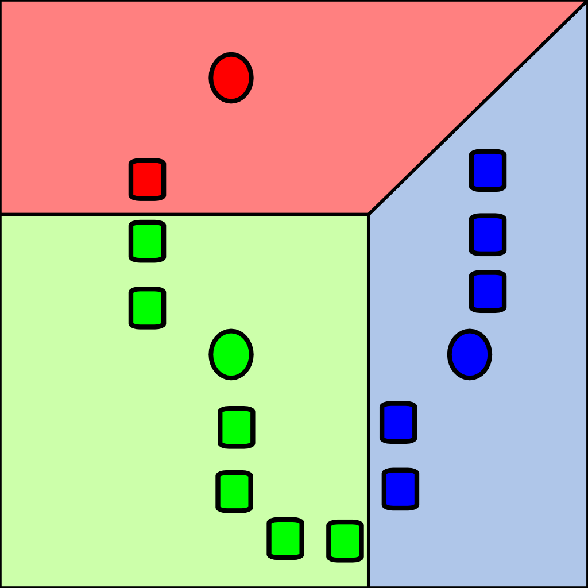

```{r, echo=FALSE}
library(png)
```

# Parameterization and Analysis of Conduit Edges in a Dynamic Superfluid

## Zoe Farmer

# Conduit Image 



# Motivation for Curvature Problem
How **Straight** is our conduit?

Can we use the data?

Will our results be skewed by an overly curved conduit?

How do we quantify straightness?

# Solution Outline

1. Find a fit to an arbitrary dataset.
2. Plot the **Curvature** and **Average Residual** of each line on the plane.
3. Use [Classification Algorithms](https://en.wikipedia.org/wiki/Category:Classification_algorithms) to determine the *space of non-curvy lines*.

# General Timeseries Fit

* We can average the left and right edges of our conduit to get the timeseries.




# General Timeseries Fit (cont)

* Using the regression model

\begin{align*}
h(x) &= \beta_1 + \beta_2 x + \beta_3 f_1(x) + \cdots + \beta_i f_i(x)\\
f_i(x) &= \beta e^{-{(s(x - i))}^2}
\end{align*}

* With some black magic we can find the "best parameters". This is not a focus of this presentation, and it resides in the appendix.
* Once we have accurate fits of each dataset, we can determine the *curvature*, and the *average residual*.
    * Curvature
    * Mean Residual
    
# Example Fit



# Black Magic

In essence, to determine what parameters work the best for our line fitting, we can examine the standard deviation of the residuals for each dataset, and pick a fit that has a *low standard deviation*, as we want a fit that works for as many different situations as possible.

# Black Magic (cont)



# Curvature

\begin{align*}
\frac{1}{n \cdot \text{scale}} \cdot \sqrt{\int_a^b {\left( s^{\prime\prime}(x)\right)}^2 \, dx}
\end{align*}

Derived from properties of the second derivative

Still a work in progress, as the scaling is a little off.

# Mean Residual

\begin{align*}
\overline{\lvert \mathbf{r} \rvert}
\end{align*}



# Mean Residual (cont)

* Which we can plot, and color based on whether or not the data was used.
* We can immediately see clustering in this initial visualization, and now we can use various classification algorithms to determine our "space" of usable datasets.

# Full Data Plot



# [Nearest Neighbor Classification](https://en.wikipedia.org/wiki/K-nearest_neighbors_algorithm)

([Python implementation reference link](http://scikit-learn.org/stable/modules/neighbors.html))

For some dataset of $n$ points with form

\begin{align*}
\left(\vec{x}_1, \vec{y}_1\right), \ldots, \left(\vec{x}_n, \vec{y}_n\right)
\end{align*}

with $\vec{x}_i$ as $p$-dimensional vectors, and $\vec{y}_i$ as $-1$ or $1$, depending on the class the vector belongs to, the "nearest neighbors" of the vector "vote" on what class it should belong to. Distance in this case can be determined by a variety of norms, with the most common being the basic Euclidean norm.

# Helpful Image



# Pros

* Fast
* Easy to understand
* Low error rate for large datasets
* Good for irregular decision boundaries

# Cons

* Vulnerable to skewed distributions
    * Can be fixed with distance weights
* Value of $k$ can be hard to determine accurately
* Need dimension reduction for high-dimensionality datasets

# With Conduit Dataset


# [Support Vector Machines](https://en.wikipedia.org/wiki/Support_vector_machine) for Linear Kernels

([Python implementation reference link](http://scikit-learn.org/stable/modules/svm.html))

For some dataset of $n$ points with form

\begin{align*}
\left(\vec{x}_1, \vec{y}_1\right), \ldots, \left(\vec{x}_n, \vec{y}_n\right)
\end{align*}

with $\vec{x}_i$ as $p$-dimensional vectors, and $\vec{y}_i$ as $-1$ or $1$, depending on the class the vector belongs to, we wish to find the hyperplane that "best" divides these two classes.

# Helpful Example


# Hard Margin

For linearly separable datasets (as pictured previously), we can define 2 hyperplanes and maximize the region between them, called the "margin".

The hyperplanes can be defined as $\vec{w} \cdot \vec{x} - b = \left\{\begin{array}{c}-1\\1\end{array}\right\}$

The distance between these hyperplanes can be defined as $\frac{2}{\lVert \vec{w} \rVert}$, and since we wish to maximize this value, we need to minimize $\lVert \vec{w} \rVert$. We do not want any datapoints to fall within this margin, so we add the following constraints:

* $\vec{w} \cdot \vec{x}_i - b \ge 1$ if $y_i = 1$
* $\vec{w} \cdot \vec{x}_i - b \le -1$ if $y_i = -1$

Which can be written as $y_i \left(\vec{w} \cdot \vec{x}_i - b\right) \ge 1, \, \forall i$.

Note, by the nature of how these hyperplanes are defined, the points closest to the boundary have the most effect on its position.

# TL;DR

Find the line that best divides the two sets of points based on maximizing the distance between the line and the points.

# Soft Margin

For datasets that *are not* linearly separable, we introduce the *hinge loss* function, defined as

\begin{align*}
\max{\left(0, 1 - y_i \left(\vec{w}\cdot\vec{x}_i+b\right)
\right)}
\end{align*}

This function is $0$ if the constraints above are satisfied (in other words, if the given $x_i$ is on the correct side of the margin).

We now wish to minimize

\begin{align*}
\left[\frac 1 n \sum_{i=1}^n \max\left(0, 1 - y_i(w\cdot x_i + b)\right) \right] + \lambda\lVert w \rVert^2,
\end{align*}

This will attempt to linearly separate non-linearly separable datasets, but will still act as a Hard Margin optimizer if they are linearly separable.

# TL;DR

Same thing as a linearly separable dataset, except instead of finding the line of best separation, find the line that maximizes separation.

# Non-Linear Kernels

For non-linear kernels, the same process is used, except a non-linear kernel function replaces each dot product.


# Pros

* Amazing for image classification
* Fantastic for protein recognition
* Great for handwriting

# Cons

* Have to have fully labelled dataset
* Only applicable to two-class sets, multiclass is hard (need to reduce number of classes)
* Tricky to understand

# Application of SVM


# Unsupervised Learning

Again, this is the process of determining structure of unlabeled data. This technique is closely related to basic statistics which also sometimes try to determine qualities of unlabeled data.

# [$k$-Means](https://en.wikipedia.org/wiki/K-means_clustering)

([Python implementation reference link](http://docs.scipy.org/doc/scipy/reference/cluster.vq.html))

One such technique for determining the structure of unlabeled data is $k$-means, which tries to sort $n$ vectors into $k$ sets.

# Helpful Images




# $k$-Means Algorithm

Alternate between these two steps:

* Assign each vector to the cluster whose mean yields the least within-cluster sum of squares (Euclidean Distance)
* Calculate the new means to be the centroids of each new cluster

# Pros

* Efficient for fixed $k$ and $d$ (dimension). Solvable in $O\left(n^{dk+1} \log n\right)$.

# Cons

* NP-Hard problem
* Assumes clusters are of similar size
* Assumes spherical clusters

# Reinforcement Learning

Having an algorithm let loose in an environment and learning from its mistakes and failures.

Inspired from psychology.

# Questions?

# References and Links

* https://github.com/google/deepdream
* https://github.com/cmusatyalab/openface
* https://en.wikipedia.org/wiki/Supervised_learning
* https://en.wikipedia.org/wiki/Unsupervised_learning
* https://en.wikipedia.org/wiki/Reinforcement_learning
* https://en.wikipedia.org/wiki/Category:Classification_algorithms
* https://en.wikipedia.org/wiki/K-nearest_neighbors_algorithm

# References and Links

* http://scikit-learn.org/stable/modules/neighbors.html
* https://en.wikipedia.org/wiki/Support_vector_machine
* http://scikit-learn.org/stable/modules/svm.html
* https://en.wikipedia.org/wiki/K-means_clustering
* http://docs.scipy.org/doc/scipy/reference/cluster.vq.html
* https://www.youtube.com/watch?v=qv6UVOQ0F44

*Presentation made with the Jupyter Notebook and RStudio*
