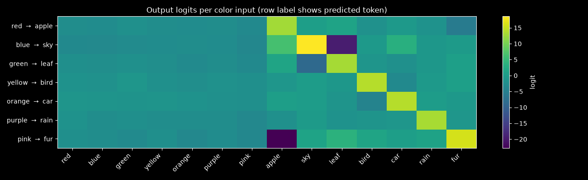
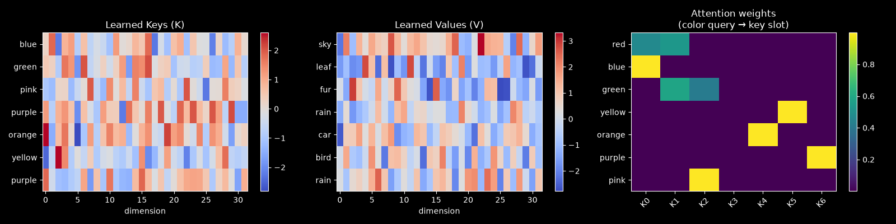
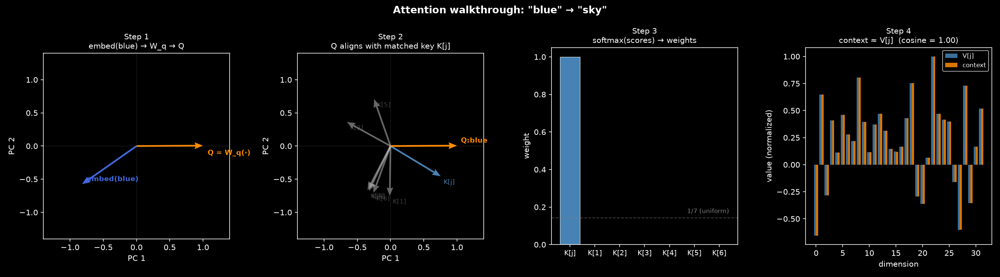

```python
import random
import marimo as mo
import torch
import torch.nn as nn
import numpy as np
import polars
import matplotlib.pyplot as plt
```

# Attention as a Soft Lookup Table

Attention is the mechanism behind every modern language model. Most explanations present it as
part of the full transformer architecture, alongside multi-head projections, residual connections,
and positional encodings, which makes it hard to see what the core operation does on its own.

Here we build a small model that uses attention to learn a mapping between color words and nouns.
Given `red`, predict `apple`. Given `blue`, predict `sky`.

Attention computes similarity between a query vector and a set of key vectors, uses those
similarities as weights, and returns a weighted sum of value vectors.

## The Task

Our vocabulary has 14 tokens: 7 color words (indices 0–6) and 7 nouns (7–13). Each training
example is a `(color_index, noun_index)` pair sampled uniformly from the seven associations
below. The model takes a color index and must output a probability distribution over all 14
tokens, with the correct noun having the highest probability.

```python
pairs = {
    "red": "apple",
    "blue": "sky",
    "green": "leaf",
    "yellow": "bird",
    "orange": "car",
    "purple": "rain",
    "pink": "fur",
}
```

```python
token_lookup = {
    x: i for i, x in enumerate(list(pairs.keys()) + list(pairs.values()))
}
lookup_token = {i: x for x, i in token_lookup.items()}
vocab_size = len(token_lookup)
n_pairs = len(pairs)
encoded_pairs = [(token_lookup[k], token_lookup[v]) for k, v in pairs.items()]
```

We also need to define a function to sample arbitrary batches from the training pairs (we can generate arbitrary pairs for training given our low-cardinality).

```python
def sequence(batch_size: int = 1024):
    items = [random.choice(encoded_pairs) for i in range(batch_size)]
    return torch.tensor(items, dtype=int)
```

```python
sequence(batch_size=5)
```

## The Math

Scaled dot-product attention is defined as:

$$\text{Attention}(Q, K, V) = \text{softmax}\!\left(\frac{QK^\top}{\sqrt{d_k}}\right) V$$

**Q**, **K**, and **V** stand for **Q**uery, **K**ey, and **V**alue — borrowed from information retrieval. Q is the
query (what we want to retrieve), K contains the keys that index each memory slot, and V
contains the values to be returned.

**Dot-product similarity.** $$QK^\top \in \mathbb{R}^n$$ gives a score for how well the query
matches each of the $$n$$ keys.

**Scaling by $$\sqrt{d_k}$$.** Dot products in high-dimensional spaces tend to grow large, which
pushes softmax into saturation — gradients vanish and learning stalls. Dividing by $$\sqrt{d_k}$$
keeps scores in a usable range regardless of embedding dimension.

**Softmax** converts scores to attention weights $$\alpha \in \mathbb{R}^n$$ that sum to 1:

$$\alpha_i = \frac{\exp\!\left(Q K_i^\top / \sqrt{d_k}\right)}{\displaystyle\sum_j \exp\!\left(Q K_j^\top / \sqrt{d_k}\right)}$$

**Retrieval** is a weighted sum of value rows:

$$\text{context} = \sum_i \alpha_i V_i$$

If $$\alpha$$ were one-hot, this would be a hard lookup returning exactly $$V_j$$. Softmax makes
it a differentiable blend instead. Training pushes $$\alpha$$ toward one-hot.

There's a geometric interpretation as well - two vectors pointing in the same
direction have a high dot product; two perpendicular vectors have a dot product of zero. The
model exploits this directly: it learns to point each color's query in the direction of its
paired key, and away from all the others. After training, the 'red' query and its matched K
row are nearly parallel; the 'red' query and any other K row are nearly orthogonal. Softmax
turns that directional alignment into a near-winner-take-all selection.
<!---->
## The Architecture

In a standard transformer, K and V are projections of the input sequence. Here there is no
sequence. Instead, $$K \in \mathbb{R}^{7 \times d}$$ and $$V \in \mathbb{R}^{7 \times d}$$ are
free `nn.Parameter` tensors — a learned 7-slot associative memory. The forward pass is:

1. The input color index goes through `nn.Embedding` to get a $$d$$-dimensional vector.
2. A linear projection $$W_q$$ maps it to a query $$Q \in \mathbb{R}^d$$.
3. $$Q$$ is compared against all 7 rows of $$K$$ by scaled dot product, producing 7 scores.
4. Softmax converts scores to attention weights over the 7 slots.
5. The weighted sum of $$V$$ rows gives a context vector, which a final linear layer decodes to logits.

The model has to learn two things at once: fill each $$(K_i, V_i)$$ slot with a useful
representation of one pair, and learn $$W_q$$ such that each color produces a query that aligns
with the right key.

Nothing in the architecture enforces that K[i] and V[i] correspond to the same pair — that
coupling is entirely enforced by the loss. If slot 3 consistently attracts 'red' queries but
V[3] decodes to the wrong noun, cross-entropy stays high and gradients push V[3] toward
'apple' in the same backward pass that's strengthening K[3]'s alignment with the 'red' query.
K and V converge together to a consistent slot assignment. The failure mode is two colors
converging on the same slot: K[i] gets pulled in two directions at once, neither pair fits
cleanly, and loss stays elevated on both.

```python
class AttentionModel(nn.Module):
    def __init__(self, ndim: int = 16):
        super().__init__()
        self.ndim = ndim
        self.embedding = nn.Embedding(vocab_size, ndim)
        self.W_q = nn.Linear(ndim, ndim)
        self.K = nn.Parameter(torch.randn(n_pairs, ndim))
        self.V = nn.Parameter(torch.randn(n_pairs, ndim))
        self.out = nn.Linear(ndim, vocab_size)

    def forward(self, x):
        # x: [batch] — color token indices
        # embedded: [batch, ndim]
        embedded = self.embedding(x)
        # q: [batch, ndim] — learned query projection
        q = self.W_q(embedded)
        # scores: [batch, n_pairs] — similarity to each key, scaled
        scores = (q @ self.K.T) / (self.ndim**0.5)
        # weights: [batch, n_pairs] — soft selection (→ one-hot after training)
        weights = scores.softmax(dim=-1)
        # context: [batch, ndim] — retrieved value vector
        context = weights @ self.V
        # result: [batch, vocab_size] — logits over vocabulary
        result = self.out(context)
        return result
```

```python
mo.mermaid("""
flowchart LR
X["x"] --> EMB["Embedding<br/>vocab_size × ndim"]
EMB --> WQ["W_q"]
WQ --> Q["Q  [batch, ndim]"]
Q --> SCORES["Q @ K^T / sqrt ndim<br/>[batch, n_pairs]"]
K["K  [n_pairs, ndim]<br/>nn.Parameter"] --> SCORES
SCORES --> W["softmax<br/>weights  [batch, n_pairs]"]
W --> CTX["context = weights @ V<br/>[batch, ndim]"]
V["V  [n_pairs, ndim]<br/>nn.Parameter"] --> CTX
CTX --> OUT["out  Linear"]
OUT --> L["logits  [batch, vocab_size]"]
L --> LOSS["CrossEntropyLoss"]
T["target noun idx"] --> LOSS
""")
```

## Training

```python
epochs = 10_000
batch_size = 512
lr = 1e-3
ndim = 32
```

```python
mo.md(rf"""
We minimize cross-entropy between the model's output logits and the target noun index using
Adam (lr={lr:.0e}), running {epochs:,} epochs at batch size {batch_size:,}. Each batch is sampled uniformly from
the 7 pairs.

The task has a perfect solution: a permutation matrix of attention weights, with each color
mapped to one dedicated key slot whose value decodes to the right noun. Loss should reach near
zero. The visualizations below show what the model learns.
""")
```

```python
model = AttentionModel(ndim=ndim).to("cpu")
optimizer = torch.optim.Adam(model.parameters(), lr=lr)
loss_func = nn.CrossEntropyLoss()
for i in range(epochs):
    optimizer.zero_grad()
    next_batch = sequence(batch_size=batch_size)
    outputs = model(next_batch[:, 0])
    loss = loss_func(outputs, next_batch[:, 1])
    loss.backward()
    optimizer.step()
```

## Results

```python
test_results = []
attention_weights = []
with torch.no_grad():
    for k in pairs.keys():
        x = torch.tensor(token_lookup[k])
        test_results.append(model(x).numpy())
        q = model.W_q(model.embedding(x))
        w = (q @ model.K.T / model.ndim**0.5).softmax(dim=-1)
        attention_weights.append(w.numpy())
test_results = np.array(test_results)
attention_weights = np.array(attention_weights)
```

```python
def build_inference_demo_plot():
    image_file = mo.notebook_dir() / "attention_inference_demo.png"
    color_names = list(pairs.keys())
    vocab_labels = [lookup_token[i] for i in range(len(lookup_token))]
    predicted_idx = np.argmax(test_results, axis=1)

    fig, ax = plt.subplots(figsize=(13, 4))
    im = ax.imshow(test_results, aspect="auto", cmap="viridis")
    ax.set_yticks(range(len(color_names)))
    ax.set_yticklabels(
        [
            f"{c}  →  {lookup_token[predicted_idx[i]]}"
            for i, c in enumerate(color_names)
        ]
    )
    ax.set_xticks(range(len(vocab_labels)))
    ax.set_xticklabels(vocab_labels, rotation=45, ha="right")
    ax.set_title(
        "Output logits per color input (row label shows predicted token)"
    )
    fig.colorbar(im, ax=ax, label="logit")
    plt.tight_layout()
    plt.savefig(image_file)
    return image_file

mo.image(build_inference_demo_plot())
```



Each row shows output logits for one color input after training. The row label shows the
predicted noun (argmax). Colors are in the left half of the x-axis (indices 0–6), nouns in
the right half (7–13). A trained model should have high logit values concentrated on exactly
one noun per row. Diffuse logits or wrong predictions mean the model hasn't converged — try
more epochs.

```python
def build_k_v_plots():
    image_file = mo.notebook_dir() / "attention_k_v_plot.png"
    color_names = list(pairs.keys())
    noun_names = list(pairs.values())
    # label each memory slot by whichever color attended to it most
    dominant = [int(np.argmax(attention_weights[:, i])) for i in range(7)]
    key_labels = [color_names[d] for d in dominant]
    value_labels = [noun_names[d] for d in dominant]

    fig, axarr = plt.subplots(1, 3, figsize=(16, 4))

    im0 = axarr[0].imshow(
        model.K.detach().numpy(), aspect="auto", cmap="coolwarm"
    )
    axarr[0].set_title("Learned Keys (K)")
    axarr[0].set_yticks(range(7))
    axarr[0].set_yticklabels(key_labels)
    axarr[0].set_xlabel("dimension")
    fig.colorbar(im0, ax=axarr[0])

    im1 = axarr[1].imshow(
        model.V.detach().numpy(), aspect="auto", cmap="coolwarm"
    )
    axarr[1].set_title("Learned Values (V)")
    axarr[1].set_yticks(range(7))
    axarr[1].set_yticklabels(value_labels)
    axarr[1].set_xlabel("dimension")
    fig.colorbar(im1, ax=axarr[1])

    im2 = axarr[2].imshow(attention_weights, aspect="auto", cmap="viridis")
    axarr[2].set_title("Attention weights\n(color query → key slot)")
    axarr[2].set_yticks(range(len(color_names)))
    axarr[2].set_yticklabels(color_names)
    axarr[2].set_xticks(range(7))
    axarr[2].set_xticklabels([f"K{i}" for i in range(7)], rotation=45)
    fig.colorbar(im2, ax=axarr[2])

    plt.tight_layout()
    plt.savefig(image_file)
    return image_file


mo.image(build_k_v_plots())
```


**Attention weights (right).** Each row is a color, each column a key slot. After training,
this should look close to a permutation matrix — each color attending almost entirely to one
slot, with no two colors sharing a key. This is attention functioning as a hard lookup table.

**Keys and values (left, center).** Each row is labeled by its dominant color or noun, based
on which color attends to it most. The specific values matter less than the structure: keys
need to be spread far enough apart in $$\mathbb{R}^d$$ that queries can distinguish them, and
values need to carry enough signal for the output layer to decode the right noun.

```python
def build_geometry_plots():
    image_file = mo.notebook_dir() / "attention_geometry.png"

    color_names = list(pairs.keys())
    blue_color_idx = color_names.index("blue")

    with torch.no_grad():
        emb_blue = model.embedding(torch.tensor(token_lookup["blue"])).numpy()
        q_blue = model.W_q(
            model.embedding(torch.tensor(token_lookup["blue"]))
        ).numpy()

    K = model.K.detach().numpy()
    V = model.V.detach().numpy()

    j = int(np.argmax(attention_weights[blue_color_idx]))

    scores = q_blue @ K.T / (K.shape[1] ** 0.5)
    exp_scores = np.exp(scores - scores.max())
    weights = exp_scores / exp_scores.sum()
    context = weights @ V

    # shared PCA basis from embedding, query, and all keys
    all_vecs = np.vstack([emb_blue[np.newaxis], q_blue[np.newaxis], K])
    _, _, Vt = np.linalg.svd(all_vecs, full_matrices=False)
    proj = all_vecs @ Vt[:2].T

    def unit_rows(M):
        return M / np.linalg.norm(M, axis=1, keepdims=True).clip(1e-8)

    units = unit_rows(proj)
    emb_u, q_u, k_u = units[0], units[1], units[2:]

    fig, axes = plt.subplots(1, 4, figsize=(18, 5))
    qkw = dict(
        angles="xy",
        scale_units="xy",
        scale=1,
        width=0.009,
        headwidth=4,
        headlength=5,
    )

    # Step 1: embed(blue) → W_q → Q
    ax = axes[0]
    ax.quiver(0, 0, emb_u[0], emb_u[1], color="royalblue", **qkw)
    ax.quiver(0, 0, q_u[0], q_u[1], color="darkorange", **qkw)
    ax.annotate(
        "embed(blue)",
        emb_u,
        xytext=(6, 4),
        textcoords="offset points",
        fontsize=9,
        color="royalblue",
        fontweight="bold",
    )
    ax.annotate(
        "Q = W_q(·)",
        q_u,
        xytext=(6, -12),
        textcoords="offset points",
        fontsize=9,
        color="darkorange",
        fontweight="bold",
    )
    ax.set_xlim(-1.4, 1.4)
    ax.set_ylim(-1.4, 1.4)
    ax.set_aspect("equal")
    ax.axhline(0, color="gray", lw=0.5, alpha=0.3)
    ax.axvline(0, color="gray", lw=0.5, alpha=0.3)
    ax.set_title("Step 1\nembed(blue) → W_q → Q", fontsize=10)
    ax.set_xlabel("PC 1")
    ax.set_ylabel("PC 2")

    # Step 2: Q vs all key vectors
    ax = axes[1]
    for i in range(7):
        is_match = i == j
        c = "steelblue" if is_match else "#cccccc"
        alpha = 1.0 if is_match else 0.5
        scale = 0.88 if is_match else 0.75
        ax.quiver(
            0,
            0,
            k_u[i, 0] * scale,
            k_u[i, 1] * scale,
            color=c,
            alpha=alpha,
            **qkw,
        )
        label = "K[j]" if is_match else f"K[{i}]"
        ax.annotate(
            label,
            k_u[i] * scale,
            xytext=(4, -10),
            textcoords="offset points",
            fontsize=8,
            color=c if is_match else "gray",
            alpha=alpha,
        )
    ax.quiver(0, 0, q_u[0], q_u[1], color="darkorange", zorder=5, **qkw)
    ax.annotate(
        "Q:blue",
        q_u,
        xytext=(5, 4),
        textcoords="offset points",
        fontsize=9,
        color="darkorange",
        fontweight="bold",
    )
    ax.set_xlim(-1.4, 1.4)
    ax.set_ylim(-1.4, 1.4)
    ax.set_aspect("equal")
    ax.axhline(0, color="gray", lw=0.5, alpha=0.3)
    ax.axvline(0, color="gray", lw=0.5, alpha=0.3)
    ax.set_title("Step 2\nQ aligns with matched key K[j]", fontsize=10)
    ax.set_xlabel("PC 1")
    ax.set_ylabel("PC 2")

    # Step 3: softmax attention weights
    ax = axes[2]
    slot_labels = ["K[j]" if i == j else f"K[{i}]" for i in range(7)]
    bar_colors = ["steelblue" if i == j else "#cccccc" for i in range(7)]
    ax.bar(
        range(7), weights, color=bar_colors, edgecolor="white", linewidth=0.5
    )
    ax.set_xticks(range(7))
    ax.set_xticklabels(slot_labels, fontsize=9)
    ax.set_ylabel("weight")
    ax.set_ylim(0, 1.05)
    ax.axhline(1 / 7, color="gray", linestyle="--", alpha=0.5, linewidth=1)
    ax.annotate(
        "1/7 (uniform)",
        xy=(6.4, 1 / 7 + 0.025),
        fontsize=8,
        color="gray",
        ha="right",
    )
    ax.set_title("Step 3\nsoftmax(scores) → weights", fontsize=10)

    # Step 4: context ≈ V[j]
    ax = axes[3]
    v_slot = V[j]
    v_max = max(
        float(np.abs(v_slot).max()), float(np.abs(context).max()), 1e-8
    )
    v_norm = v_slot / v_max
    ctx_norm = context / v_max
    cos = float(
        np.dot(context, v_slot)
        / np.clip(np.linalg.norm(context) * np.linalg.norm(v_slot), 1e-8, None)
    )
    x = np.arange(len(v_slot))
    ax.bar(
        x - 0.2,
        v_norm,
        width=0.4,
        color="steelblue",
        alpha=0.85,
        label="V[j]",
    )
    ax.bar(
        x + 0.2,
        ctx_norm,
        width=0.4,
        color="darkorange",
        alpha=0.85,
        label="context",
    )
    ax.set_xlabel("dimension")
    ax.set_ylabel("value (normalized)")
    ax.set_title(f"Step 4\ncontext ≈ V[j]  (cosine = {cos:.2f})", fontsize=10)
    ax.legend(fontsize=8)

    fig.suptitle(
        'Attention walkthrough: "blue" → "sky"', fontweight="bold", fontsize=13
    )
    plt.tight_layout()
    plt.savefig(image_file, dpi=150)
    return image_file


mo.image(build_geometry_plots())
```



Each panel traces one forward pass through the attention mechanism for the input "blue".
All vector directions are shown in a shared 2D PCA projection.

**Step 1** — The embedding lookup gives a $$d$$-dimensional vector for "blue" (blue arrow).
$$W_q$$ projects it to the query $$Q$$ (orange arrow). The direction changes: $$W_q$$ is a learned
rotation and scaling whose job is to point $$Q$$ toward the right key.

**Step 2** — $$Q$$ (orange) is plotted alongside all 7 key vectors (gray). The matched key $$K[j]$$
is the slot that "blue" attends to most. After training, $$Q$$ and $$K[j]$$ are nearly
collinear — high dot product, low dot product with everything else.

**Step 3** — Scaling by $$1/\sqrt{d}$$ and applying softmax turns the raw scores into
weights. A well-trained model produces a near-one-hot distribution: almost
all weight on the single matched slot, near-zero everywhere else. The dashed line marks
uniform (1/7) for reference.

**Step 4** — Throughout, $$j$$ denotes the matched slot: $$j = \arg\max_i \, \alpha_i$$.

$$V \in \mathbb{R}^{7 \times d}$$ is a free `nn.Parameter` matrix — a learned
memory bank with one row per slot. Nothing in the architecture prescribes what those rows
contain; they are initialized randomly and shaped entirely by gradient descent.

The context vector is:

$$\text{context} = \sum_{i=0}^{6} \alpha_i \, V_i$$

When $$\alpha$$ is near-one-hot (Step 3), almost all weight is on slot $$j$$, so nearly
every other $$V_i$$ is multiplied by $$\approx 0$$. What survives is $$\approx V[j]$$.

Why does $$V[j]$$ encode "sky"? Cross-entropy loss. Every time "blue" is the input, the
model attends to slot $$j$$ and returns $$V[j]$$ as context. The output linear layer then
has to decode that context to a high logit for "sky". If $$V[j]$$ doesn't support that
decoding, the loss stays high and gradients push $$V[j]$$ in a direction that does.
$$K[j]$$ and $$V[j]$$ are separate parameters but they converge together: $$K[j]$$
becomes the address that "blue" queries, $$V[j]$$ becomes the content that decodes to the
paired noun.

The two bars in the plot show that the retrieved context (orange) and $$V[j]$$ (blue)
are nearly identical — the cosine similarity in the title confirms it. The small residual
comes from the non-zero weight on the other slots.
<!---->
## Takeaway

The main difference between attention and a regular linear layer is that attention is
input-dependent. A linear layer applies the same weights regardless of input. Attention uses
the input to generate a query first, then uses that query to decide what to retrieve.

In a full transformer, this runs across many heads and positions, with K and V derived from
other tokens rather than stored as free parameters. But the computation —
$$\text{softmax}(QK^\top / \sqrt{d})V$$ — is the same.
