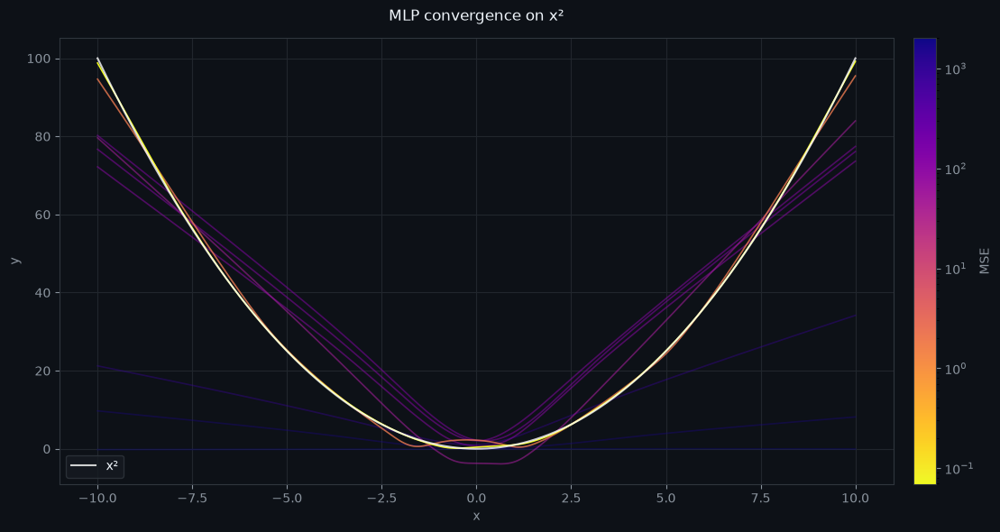

```python {.marimo}
import marimo as mo
import numpy as np
import matplotlib.pyplot as plt
from matplotlib.colors import LogNorm
import matplotlib.cm as cm
import torch
import torch.nn as nn
```

# MLP Function Approximation

A **Multi-Layer Perceptron** (MLP) is a feedforward neural network: a stack of linear
transformations interleaved with nonlinear activations. This notebook trains one to approximate
$f(x) = x^2$ and visualises the full convergence trajectory across training.

```python {.marimo}
domain = np.linspace(-10, 10, 1000)
func = lambda x: x**2
D = torch.Tensor(domain.reshape(-1, 1))
target = torch.Tensor(func(domain).reshape(-1, 1))
```

## Target Function

We want to learn $f : \mathbb{R} \to \mathbb{R}$, specifically $f(x) = x^2$, sampled at
1000 points over $[-10, 10]$. It is smooth, symmetric, and requires a nonlinear model to fit —
a single linear layer can only represent it as a constant.

```python {.marimo}
class Model(nn.Module):
    def __init__(self, dim: int = 64):
        super().__init__()
        self.dim = dim
        self.unit = nn.Sequential(
            nn.Linear(1, dim),
            nn.GELU(),
            nn.Linear(dim, dim * 4),
            nn.GELU(),
            nn.Linear(dim * 4, dim),
            nn.GELU(),
            nn.Linear(dim, 1),
        )

    def forward(self, x):
        y = self.unit(x)
        return y


models = []
for epochs in [0, 10, 20, 30, 40, 50, 100, 200, 500]:
    model = Model().to("cpu")
    models.append([model, epochs])
    optimizer = torch.optim.Adam(model.parameters(), lr=1e-3)
    criterion = nn.MSELoss()
    for i in range(epochs):
        optimizer.zero_grad()
        outputs = model(D)
        loss = criterion(outputs, target)
        loss.backward()
        optimizer.step()
```

## Architecture

The network maps a scalar $x$ through four linear layers with GELU activations,
with layer widths $1 \to d \to 4d \to d \to 1$ and $d = 64$:

$$x \;\xrightarrow{\,W_1\,}\; \text{GELU} \;\xrightarrow{\,W_2\,}\; \text{GELU} \;\xrightarrow{\,W_3\,}\; \text{GELU} \;\xrightarrow{\,W_4\,}\; \hat{y}$$

The 4× middle expansion mirrors the MLP sub-layer in transformer blocks.
**GELU** (Gaussian Error Linear Unit) smoothly gates each neuron by the probability that
it would survive a Gaussian noise mask:

$$\text{GELU}(x) = x \cdot \Phi(x)$$

where $\Phi$ is the standard-normal CDF. Unlike ReLU, GELU is smooth everywhere and has
nonzero gradient for negative inputs, which empirically benefits deep networks.

## Training

We minimise **mean squared error**:

$$\mathcal{L} = \frac{1}{N} \sum_{i=1}^{N} \bigl(\hat{y}_i - y_i\bigr)^2$$

Gradients flow back through every layer via the chain rule. The **Adam** optimiser
maintains per-parameter first and second moment estimates to adaptively scale each update:

$$m_t = \beta_1 m_{t-1} + (1-\beta_1)\,g_t \qquad v_t = \beta_2 v_{t-1} + (1-\beta_2)\,g_t^2$$

$$\theta_t \leftarrow \theta_{t-1} - \frac{\alpha}{\sqrt{\hat{v}_t}+\varepsilon}\,\hat{m}_t$$

Ten independent models are trained for $\{0,\,10,\,20,\,30,\,40,\,50,\,100,\,200,\,500\}$
epochs to capture the full convergence trajectory from random init to convergence.
<!---->
## Convergence Visualisation

Each line below is an independently trained model, coloured by its final MSE on a **log scale** —
errors span several orders of magnitude between an untrained network and a converged one:

- **Bright** (yellow end of `plasma`): low MSE, well-converged
- **Dark + faded** (purple end): high MSE, untrained or early training

The white line is the ground truth $f(x) = x^2$.

```python {.marimo}
fig, ax = plt.subplots(figsize=(12, 6))
bg = "#0d1117"
fig.patch.set_facecolor(bg)
ax.set_facecolor(bg)

preds, errors = [], []
for m, _ in models:
    p = m(D).detach().numpy().reshape(-1)
    preds.append(p)
    errors.append(float(np.mean((p - func(domain)) ** 2)))

errors_arr = np.array(errors)
cmap = plt.cm.plasma_r
norm_c = LogNorm(vmin=errors_arr.min(), vmax=errors_arr.max())

for (_, e), pred, err in zip(models, preds, errors):
    t = float(norm_c(err))
    alpha = 0.35 + 0.65 * (1.0 - t)
    ax.plot(domain, pred, color=cmap(t), linewidth=1.2, alpha=alpha)

ax.plot(
    domain,
    func(domain),
    color="white",
    linewidth=1.5,
    alpha=0.8,
    label="x²",
    zorder=10,
)

for spine in ax.spines.values():
    spine.set_color("#30363d")
ax.tick_params(colors="#8b949e")
ax.set_xlabel("x", color="#8b949e")
ax.set_ylabel("y", color="#8b949e")
ax.set_title("MLP convergence on x²", color="#f0f6fc", pad=14)
ax.grid(True, color="#21262d", linewidth=0.8)

sm = cm.ScalarMappable(cmap=cmap, norm=norm_c)
sm.set_array([])
cbar = fig.colorbar(sm, ax=ax, pad=0.02)
cbar.set_label("MSE", color="#8b949e")
cbar.ax.tick_params(colors="#8b949e")
cbar.outline.set_edgecolor("#30363d")

ax.legend(facecolor="#161b22", edgecolor="#30363d", labelcolor="#f0f6fc")
plt.tight_layout()
plt.show()
```


