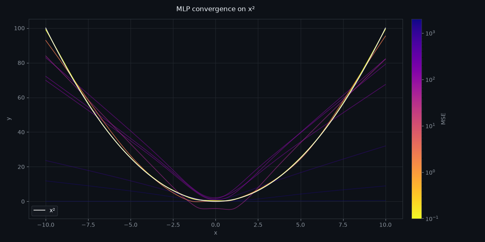
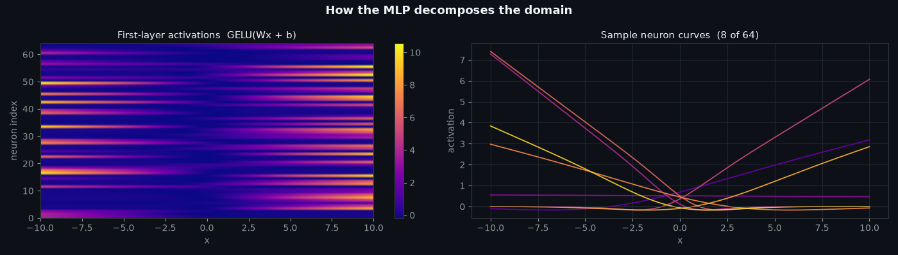
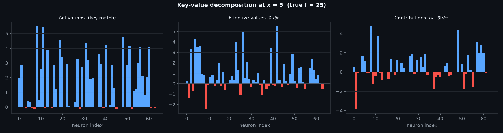
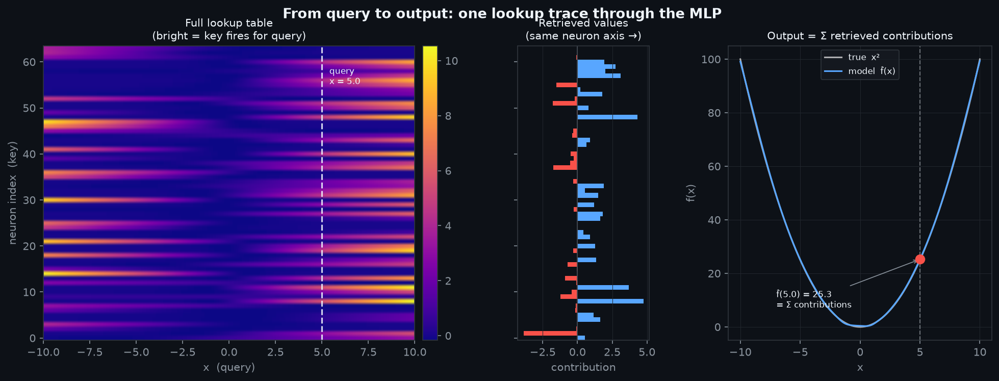

```python
import marimo as mo
import numpy as np
import matplotlib.pyplot as plt
from matplotlib.colors import LogNorm
import matplotlib.cm as cm
import torch
import torch.nn as nn
```

# MLP Function Approximation

A **Multi-Layer Perceptron** (MLP) is a feedforward neural network: a stack of linear
transformations interleaved with nonlinear activations. This notebook trains one to approximate
$$f(x) = x^2$$ and visualises the full convergence trajectory across training.

```python
domain = np.linspace(-10, 10, 1000)
func = lambda x: x**2
D = torch.Tensor(domain.reshape(-1, 1))
target = torch.Tensor(func(domain).reshape(-1, 1))
```

## Target Function

We want to learn $$f : \mathbb{R} \to \mathbb{R}$$, specifically $$f(x) = x^2$$, sampled at
1000 points over $$[-10, 10]$$. It is smooth, symmetric, and requires a nonlinear model to fit —
a single linear layer can only represent it as a constant.

```python
class Model(nn.Module):
    def __init__(self, dim: int = 64):
        super().__init__()
        self.dim = dim
        self.unit = nn.Sequential(
            nn.Linear(1, dim),
            nn.GELU(),
            nn.Linear(dim, dim * 4),
            nn.GELU(),
            nn.Linear(dim * 4, dim),
            nn.GELU(),
            nn.Linear(dim, 1),
        )

    def forward(self, x):
        y = self.unit(x)
        return y

models = []
for epochs in [0, 10, 20, 30, 40, 50, 100, 200, 500]:
    model = Model().to("cpu")
    models.append([model, epochs])
    optimizer = torch.optim.Adam(model.parameters(), lr=1e-3)
    criterion = nn.MSELoss()
    for i in range(epochs):
        optimizer.zero_grad()
        outputs = model(D)
        loss = criterion(outputs, target)
        loss.backward()
        optimizer.step()
```

## Architecture

The network maps a scalar $$x$$ through four linear layers with GELU activations,
with layer widths $$1 \to d \to 4d \to d \to 1$$ and $$d = 64$$:

$$x \;\xrightarrow{\,W_1\,}\; \text{GELU} \;\xrightarrow{\,W_2\,}\; \text{GELU} \;\xrightarrow{\,W_3\,}\; \text{GELU} \;\xrightarrow{\,W_4\,}\; \hat{y}$$

The 4× middle expansion mirrors the MLP sub-layer in transformer blocks.
**GELU** (Gaussian Error Linear Unit) smoothly gates each neuron by the probability that
it would survive a Gaussian noise mask:

$$\text{GELU}(x) = x \cdot \Phi(x)$$

where $$\Phi$$ is the standard-normal CDF. Unlike ReLU, GELU is smooth everywhere and has
nonzero gradient for negative inputs, which empirically benefits deep networks.

## Training

We minimise **mean squared error**:

$$\mathcal{L} = \frac{1}{N} \sum_{i=1}^{N} \bigl(\hat{y}_i - y_i\bigr)^2$$

Gradients flow back through every layer via the chain rule. The **Adam** optimiser
maintains per-parameter first and second moment estimates to adaptively scale each update:

$$m_t = \beta_1 m_{t-1} + (1-\beta_1)\,g_t \qquad v_t = \beta_2 v_{t-1} + (1-\beta_2)\,g_t^2$$

$$\theta_t \leftarrow \theta_{t-1} - \frac{\alpha}{\sqrt{\hat{v}_t}+\varepsilon}\,\hat{m}_t$$

Ten independent models are trained for $$\{0,\,10,\,20,\,30,\,40,\,50,\,100,\,200,\,500\}$$
epochs to capture the full convergence trajectory from random init to convergence.
<!---->
## Convergence Visualisation

Each line below is an independently trained model, coloured by its final MSE on a **log scale** —
errors span several orders of magnitude between an untrained network and a converged one:

- **Bright** (yellow end of `plasma`): low MSE, well-converged
- **Dark + faded** (purple end): high MSE, untrained or early training

The white line is the ground truth $$f(x) = x^2$$.

```python
def build_convergence_visualization():
    img_file = mo.notebook_dir() / "mlp_convergence.png"
    fig, ax = plt.subplots(figsize=(12, 6))
    bg = "#0d1117"
    fig.patch.set_facecolor(bg)
    ax.set_facecolor(bg)

    preds, errors = [], []
    for m, _ in models:
        p = m(D).detach().numpy().reshape(-1)
        preds.append(p)
        errors.append(float(np.mean((p - func(domain)) ** 2)))

    errors_arr = np.array(errors)
    cmap = plt.cm.plasma_r
    norm_c = LogNorm(vmin=errors_arr.min(), vmax=errors_arr.max())

    for (_, e), pred, err in zip(models, preds, errors):
        t = float(norm_c(err))
        alpha = 0.35 + 0.65 * (1.0 - t)
        ax.plot(domain, pred, color=cmap(t), linewidth=1.2, alpha=alpha)

    ax.plot(
        domain,
        func(domain),
        color="white",
        linewidth=1.5,
        alpha=0.8,
        label="x²",
        zorder=10,
    )

    for spine in ax.spines.values():
        spine.set_color("#30363d")
    ax.tick_params(colors="#8b949e")
    ax.set_xlabel("x", color="#8b949e")
    ax.set_ylabel("y", color="#8b949e")
    ax.set_title("MLP convergence on x²", color="#f0f6fc", pad=14)
    ax.grid(True, color="#21262d", linewidth=0.8)

    sm = cm.ScalarMappable(cmap=cmap, norm=norm_c)
    sm.set_array([])
    cbar = fig.colorbar(sm, ax=ax, pad=0.02)
    cbar.set_label("MSE", color="#8b949e")
    cbar.ax.tick_params(colors="#8b949e")
    cbar.outline.set_edgecolor("#30363d")

    ax.legend(facecolor="#161b22", edgecolor="#30363d", labelcolor="#f0f6fc")
    plt.tight_layout()
    plt.savefig(img_file)

    return img_file

mo.image(build_convergence_visualization(), width=500)
```
{: .code-collapsed}


## MLP as a Key-Value Store

An MLP is a lookup table baked into weight matrices. Each neuron in the first hidden layer
stores two things:

- A **key** — the direction $$(w_i, b_i)$$ in input space where it fires. The neuron's pivot
  is the point $$x_i^* = -b_i / w_i$$ where its pre-activation crosses zero.
- An **effective value** — what it contributes downstream when active. For deeper networks
  this value is the neuron's influence on the output, mediated by all subsequent layers.

A forward pass is a retrieval:

1. **Query.** The input $$x$$ is the query.
2. **Match.** $$\text{GELU}(W_1 x + b_1)$$ scores how well each key matches — near-zero for
   neurons whose pivot is far from $$x$$, positive for those tuned nearby.
3. **Retrieve.** The remaining layers combine the activations of matching neurons and their
   stored values to produce the output.

This is the same structure as attention's $$\text{softmax}(QK^\top / \sqrt{d})\,V$$. The
difference is that MLP keys are fixed row vectors in $$W_1$$, not separately learned parameters
queried by a distinct projection. The selection is also dense — many neurons fire
simultaneously — where softmax sharpens toward one-hot. But the underlying operation is
the same: match a query to stored keys, retrieve a weighted sum of their values.

The heatmap below is the full **memory access pattern**: bright cells mean neuron $$i$$ (key)
fires for input $$x$$ (query). Each row is a neuron remembering a region of the domain;
each column is a query activating the neurons whose keys cover it.

```python
best_model = models[-1][0]
with torch.no_grad():
    acts = best_model.unit[:2](D).numpy()  # [1000, 64], first Linear + GELU

def build_activation_plot():
    img_file = mo.notebook_dir() / "mlp_activations.png"
    bg = "#0d1117"
    fig, axes = plt.subplots(1, 2, figsize=(14, 4))
    fig.patch.set_facecolor(bg)

    ax = axes[0]
    ax.set_facecolor(bg)
    im = ax.imshow(
        acts.T,
        aspect="auto",
        cmap="plasma",
        extent=[domain[0], domain[-1], 0, 64],
    )
    ax.set_xlabel("x", color="#8b949e")
    ax.set_ylabel("neuron index", color="#8b949e")
    ax.set_title(
        "First-layer activations  GELU(Wx + b)", color="#f0f6fc", fontsize=11
    )
    ax.tick_params(colors="#8b949e")
    for spine in ax.spines.values():
        spine.set_color("#30363d")
    cb = fig.colorbar(im, ax=ax)
    cb.ax.tick_params(colors="#8b949e")
    cb.outline.set_edgecolor("#30363d")

    ax = axes[1]
    ax.set_facecolor(bg)
    sample_idx = np.linspace(0, 63, 8, dtype=int)
    colors = plt.cm.plasma(np.linspace(0.2, 0.92, 8))
    for idx, c in zip(sample_idx, colors):
        ax.plot(domain, acts[:, idx], color=c, linewidth=1.3, alpha=0.9)
    ax.axhline(0, color="#30363d", linewidth=0.8)
    ax.set_xlabel("x", color="#8b949e")
    ax.set_ylabel("activation", color="#8b949e")
    ax.set_title(
        "Sample neuron curves  (8 of 64)", color="#f0f6fc", fontsize=11
    )
    ax.tick_params(colors="#8b949e")
    ax.grid(True, color="#21262d", linewidth=0.8)
    for spine in ax.spines.values():
        spine.set_color("#30363d")

    fig.suptitle(
        "How the MLP decomposes the domain",
        color="#f0f6fc",
        fontweight="bold",
        fontsize=13,
    )
    plt.tight_layout()
    plt.savefig(img_file)
    return img_file

mo.image(build_activation_plot(), width=900)
```
{: .code-collapsed}


### Decomposition at a Query Point

For a specific input $$x^*$$, we can decompose the output into per-neuron contributions.
The gradient $$\partial f / \partial a_i$$ tells us how much the output would change if
neuron $$i$$ became slightly more active — this is the neuron's **effective value** at
that operating point. Multiplying by the activation gives the contribution: $a_i \cdot
\partial f / \partial a_i$.

The three panels below show this decomposition for $$x^* = 5$$ (true $$f = 25$$):
which neurons fired (left), what value each carries at that point (centre),
and the final contribution each neuron makes to the output (right).

```python
def build_decomposition_plot():
    img_file = mo.notebook_dir() / "mlp_decomposition.png"
    best_model = models[-1][0]

    x_star = torch.tensor([[5.0]])
    a = best_model.unit[:2](x_star)
    a_var = a.detach().clone().requires_grad_(True)
    best_model.unit[2:](a_var).backward()

    acts = a_var.detach().numpy()[0]  # [64] key-match scores
    vals = a_var.grad.numpy()[0]  # [64] effective values ∂f/∂aᵢ
    contribs = acts * vals  # [64] per-neuron contributions

    bg = "#0d1117"
    fig, axes = plt.subplots(1, 3, figsize=(15, 4))
    fig.patch.set_facecolor(bg)
    ni = np.arange(64)

    for ax, data, title in zip(
        axes,
        [acts, vals, contribs],
        [
            "Activations  (key match)",
            "Effective values  ∂f/∂aᵢ",
            "Contributions  aᵢ · ∂f/∂aᵢ",
        ],
    ):
        ax.set_facecolor(bg)
        bar_colors = ["#58a6ff" if v >= 0 else "#f85149" for v in data]
        ax.bar(ni, data, color=bar_colors, width=1.0, linewidth=0)
        ax.axhline(0, color="#484f58", linewidth=0.8)
        ax.set_xlabel("neuron index", color="#8b949e")
        ax.set_title(title, color="#f0f6fc", fontsize=10)
        ax.tick_params(colors="#8b949e")
        ax.grid(True, axis="y", color="#21262d", linewidth=0.5)
        for spine in ax.spines.values():
            spine.set_color("#30363d")

    fig.suptitle(
        "Key-value decomposition at x = 5  (true f = 25)",
        color="#f0f6fc",
        fontweight="bold",
        fontsize=12,
    )
    plt.tight_layout()
    plt.savefig(img_file, dpi=150)
    return img_file

mo.image(build_decomposition_plot(), width=900)
```
{: .code-collapsed}


**Activations (left)** — the key-match scores: how strongly each neuron fires for the
query $$x = 5$$. Only neurons whose pivot is near 5 activate; those tuned to $$x < 0$$ or
the far positive tail are near zero. These are the "addresses" that lit up.

**Effective values (centre)** — $$\partial f / \partial a_i$$: how much the output
increases if neuron $$i$$ activates slightly more. Some neurons push the output up (blue),
some pull it down (red). The sign and magnitude come entirely from the layers that follow
the first hidden layer — this is the "content" each neuron has learned to store.

**Contributions (right)** — the product $$a_i \cdot \partial f / \partial a_i$$: the actual
influence each neuron exerts on the prediction. Neurons that didn't fire contribute nothing,
regardless of their stored value. Only the keys that matched the query are retrieved,
and their summed contributions reconstruct $$f(5) = 25$$.

This is the lookup in action: for each query, the network silently ignores most of its
stored memory and reads only the slots whose keys match.
<!---->
### Putting It Together

The three panels below form a single lookup trace, read left to right. The heatmap is the
full memory; the probe line is the query; the contribution bars share the same neuron axis
as the heatmap so you can trace directly from a bright/dark cell to its bar; and the
function curve shows where the summed contributions land.

```python
def build_stitching_plot():
    img_file = mo.notebook_dir() / "mlp_stitching.png"
    best_model = models[-1][0]
    X_STAR = 5.0

    with torch.no_grad():
        acts_full = best_model.unit[:2](D).numpy()  # [1000, 64]
        preds = best_model(D).numpy().reshape(-1)

    a = best_model.unit[:2](torch.tensor([[X_STAR]]))
    a_var = a.detach().clone().requires_grad_(True)
    out = best_model.unit[2:](a_var)
    out_val = out.item()
    out.backward()
    contribs = a_var.detach().numpy()[0] * a_var.grad.numpy()[0]  # [64]

    bg = "#0d1117"
    fig = plt.figure(figsize=(16, 5))
    fig.patch.set_facecolor(bg)
    gs = fig.add_gridspec(1, 3, width_ratios=[3, 1, 2], wspace=0.3)

    # --- heatmap with probe ---
    ax0 = fig.add_subplot(gs[0])
    ax0.set_facecolor(bg)
    im = ax0.imshow(
        acts_full.T,
        aspect="auto",
        cmap="plasma",
        extent=[domain[0], domain[-1], -0.5, 63.5],
        origin="lower",
    )
    ax0.axvline(
        X_STAR, color="#f0f6fc", linewidth=1.5, linestyle="--", alpha=0.85
    )
    ax0.text(
        X_STAR + 0.4,
        59,
        f"query\nx = {X_STAR}",
        color="#f0f6fc",
        fontsize=8,
        va="top",
    )
    ax0.set_xlabel("x  (query)", color="#8b949e")
    ax0.set_ylabel("neuron index  (key)", color="#8b949e")
    ax0.set_title(
        "Full lookup table\n(bright = key fires for query)",
        color="#f0f6fc",
        fontsize=10,
    )
    ax0.tick_params(colors="#8b949e")
    for sp in ax0.spines.values():
        sp.set_color("#30363d")
    cb = fig.colorbar(im, ax=ax0, fraction=0.04, pad=0.02)
    cb.ax.tick_params(colors="#8b949e")
    cb.outline.set_edgecolor("#30363d")

    # --- contributions bar (horizontal, same y-axis = neuron index) ---
    ax1 = fig.add_subplot(gs[1])
    ax1.set_facecolor(bg)
    ni = np.arange(64)
    bar_colors = ["#58a6ff" if c >= 0 else "#f85149" for c in contribs]
    ax1.barh(ni, contribs, color=bar_colors, height=1.0, linewidth=0)
    ax1.axvline(0, color="#484f58", linewidth=0.8)
    ax1.set_ylim(-0.5, 63.5)
    ax1.set_xlabel("contribution", color="#8b949e")
    ax1.set_title(
        f"Retrieved values\n(same neuron axis →)", color="#f0f6fc", fontsize=10
    )
    ax1.tick_params(colors="#8b949e")
    ax1.set_yticklabels([])
    ax1.grid(True, axis="x", color="#21262d", linewidth=0.5)
    for sp in ax1.spines.values():
        sp.set_color("#30363d")

    # --- function curve with output point ---
    ax2 = fig.add_subplot(gs[2])
    ax2.set_facecolor(bg)
    ax2.plot(
        domain,
        domain**2,
        color="white",
        linewidth=1.5,
        alpha=0.65,
        label="true  x²",
    )
    ax2.plot(
        domain, preds, color="#58a6ff", linewidth=1.5, label="model  f̂(x)"
    )
    ax2.axvline(
        X_STAR, color="#f0f6fc", linewidth=1.0, linestyle="--", alpha=0.4
    )
    ax2.scatter([X_STAR], [out_val], color="#f85149", s=70, zorder=6)
    ax2.annotate(
        f"f̂({X_STAR}) = {out_val:.1f}\n= Σ contributions",
        xy=(X_STAR, out_val),
        xytext=(X_STAR - 12, out_val - 18),
        color="#f0f6fc",
        fontsize=8,
        arrowprops=dict(arrowstyle="->", color="#8b949e", lw=0.8),
    )
    ax2.set_xlabel("x", color="#8b949e")
    ax2.set_ylabel("f(x)", color="#8b949e")
    ax2.set_title(
        "Output = Σ retrieved contributions", color="#f0f6fc", fontsize=10
    )
    ax2.tick_params(colors="#8b949e")
    ax2.legend(
        facecolor="#161b22",
        edgecolor="#30363d",
        labelcolor="#f0f6fc",
        fontsize=8,
    )
    ax2.grid(True, color="#21262d", linewidth=0.5)
    for sp in ax2.spines.values():
        sp.set_color("#30363d")

    fig.suptitle(
        "From query to output: one lookup trace through the MLP",
        color="#f0f6fc",
        fontweight="bold",
        fontsize=13,
    )
    plt.savefig(img_file, dpi=150, bbox_inches="tight")
    return img_file

mo.image(build_stitching_plot(), width=950)
```
{: .code-collapsed}


**Left — the memory.** The full activation heatmap, unchanged from above. Every row is a
stored key (a neuron), every column is a query ($$x$$ value). The dashed probe line at
$$x = 5$$ selects one column — the set of neurons that fire for this specific input.

**Centre — what was retrieved.** The horizontal bars show each neuron's contribution at
$$x = 5$$, with the neuron axis shared with the heatmap so you can trace directly from a
bright cell to its bar. A neuron whose row is dark at the probe line contributes nothing;
a bright row's bar tells you how much that neuron adds (blue) or subtracts (red) from the
final answer.

**Right — the output.** The model's learned curve closely tracks $$x^2$$. The red dot is
$$\hat{f}(5)$$ — its y-coordinate is the sum of all the bars in the centre panel. The
network computed a function value by reading a column from memory, weighting by stored
values, and summing.
