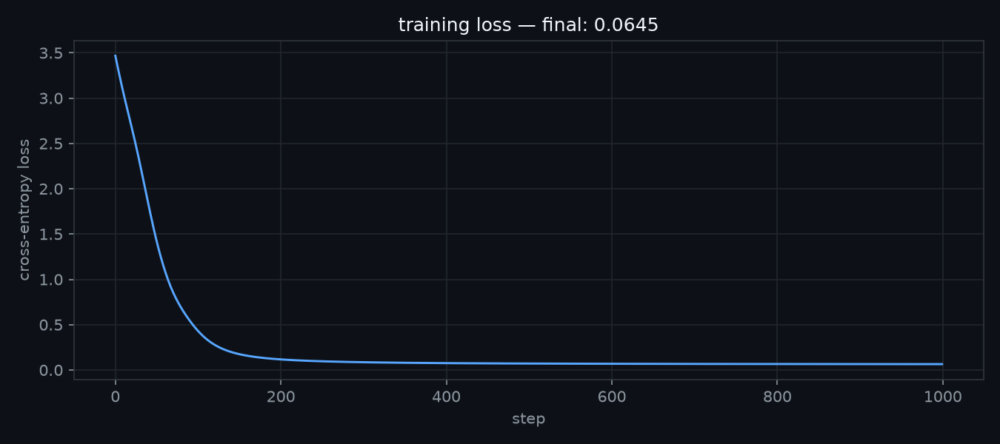
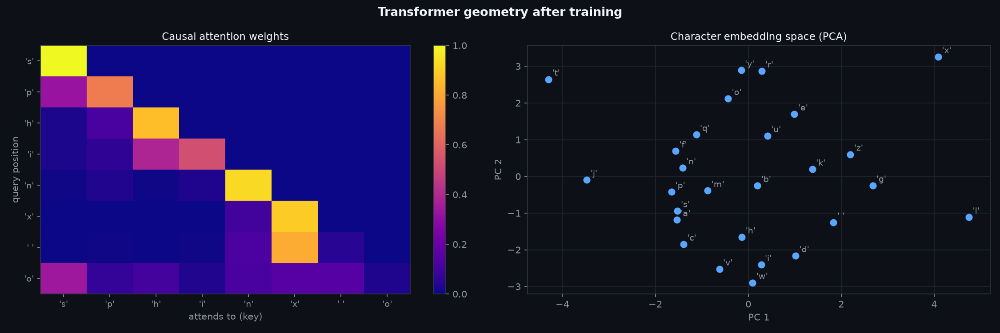
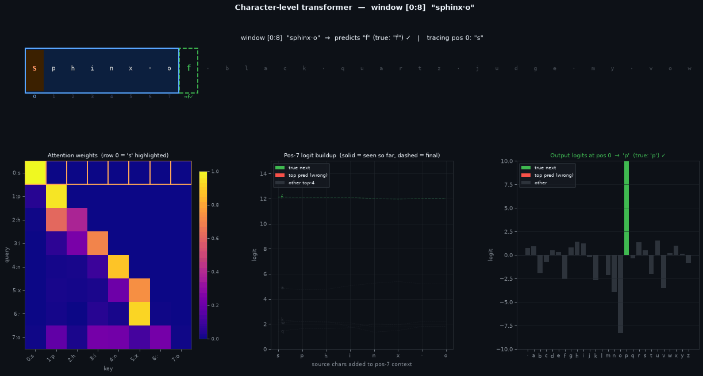

```python
import marimo as mo
import torch
import torch.nn as nn
import numpy as np
import matplotlib.pyplot as plt
import torch.nn.functional as F
```

# Character-Level Transformer

A **transformer** is a sequence-to-sequence model built from two alternating sub-layers:
self-attention (which lets each position read from past positions) and a position-wise
feed-forward network (which processes each position independently after the information has
been mixed).

Here we train a single-layer transformer to predict the next character in a cyclic sequence —
the phrase "sphinx of black quartz judge my vow" repeated indefinitely. Given the preceding
8 characters, predict the 9th. The task is toy-sized, but it exercises every part of the
architecture: token embeddings, positional encodings, causal masking, residual connections,
and layer normalisation.
<!---->
## The Task

The training corpus is one phrase — "sphinx of black quartz judge my vow" — repeated
cyclically. This is a pangram: it contains all 26 letters of the alphabet plus a space,
giving a vocabulary of 27 tokens. The phrase is 35 characters long.

The model receives a sliding window of 8 consecutive characters and must predict the next
character at every position simultaneously. This is **causal next-token prediction**: for
each position $$t$$ in the window, predict $$x_{t+1}$$ using only $$x_0 \ldots x_t$$. The loss
is cross-entropy averaged over positions $$0 \ldots T-2$$.

Because the phrase is only 35 characters, there are exactly 35 distinct 8-grams in the
cyclic sequence — none repeat. The task therefore has a perfect solution: the model only
needs to memorise which character follows each unique 8-gram. The theoretical minimum
loss is 0. In practice the model is small (32 dimensions, 1 layer) and only trained for
1000 steps, so it will not fully converge — but the loss trajectory shows it learning fast.

A random model predicts uniformly over 27 characters, giving cross-entropy
$$\log 27 \approx 3.30$$. Any loss well below that means the model has learned structure.

```python
phrase = "sphinx of black quartz judge my vow"
token_lookup = {c: i for i, c in enumerate(sorted(list(set(phrase))))}
lookup_token = {i: c for c, i in token_lookup.items()}
n_letters = len(token_lookup)
```

```python
def sequence(batch_size: int = 128):
    return torch.tensor(
        [token_lookup[phrase[i % len(phrase)]] for i in range(batch_size)],
        dtype=int,
    )
```

```python
sequence()
```

```python
class BasicTransformer(nn.Module):
    def __init__(self, ndim: int = 32, sequence_length: int = 8):
        super().__init__()
        self.ndim = ndim

        # lookup table mapping each character index to a learned ndim-dimensional vector
        self.embedding = nn.Embedding(n_letters, ndim)
        # lookup table mapping each position index (0..seq_len-1) to a learned ndim vector;
        # added to token embeddings so the model can distinguish same token at different positions
        self.position_embedding = nn.Embedding(sequence_length, ndim)

        # Q projection: "what is this token looking for?" — transforms each token into query space
        self.W_q = nn.Linear(ndim, ndim)
        # K projection: "what does this token have to offer?" — transforms each token into key space
        self.W_k = nn.Linear(ndim, ndim)
        # V projection: the actual content retrieved when a query matches a key
        self.W_v = nn.Linear(ndim, ndim)

        # mixes the attended values before they are added back into the residual stream
        self.attn_projection = nn.Linear(ndim, ndim)
        # normalizes each token vector to zero mean and unit variance after the attention residual add
        self.norm1 = nn.LayerNorm(ndim)

        # feed-forward layer, post-attention
        self.ffn = nn.Sequential(
            # expand to 4x width — standard transformer convention
            nn.Linear(ndim, ndim * 4),
            # smooth nonlinearity; lets the FFN represent nonlinear functions
            nn.GELU(),
            # project back down to match the residual stream dimension
            nn.Linear(ndim * 4, ndim),
        )

        # normalizes after the FFN residual add, same role as norm1
        self.norm2 = nn.LayerNorm(ndim)

        # projects each position's ndim vector to a logit over every character in the vocabulary
        self.out = nn.Linear(ndim, n_letters)

        # upper-triangular boolean mask: True at position [i,j] where j > i (future tokens);
        # registered as a buffer so it moves to the right device with the model but is not a trainable parameter
        self.register_buffer(
            "causal_mask",
            torch.triu(
                torch.ones(sequence_length, sequence_length), diagonal=1
            ).bool(),
        )

    def forward(self, x):
        # x: [B, T] integer token indices
        # tokens: [B, T, ndim] — dense vector per token
        tokens = self.embedding(x)
        # positions: [T, ndim] — one vector per position slot
        positions = self.position_embedding(torch.arange(x.shape[1]))
        # embedded_x: [B, T, ndim] — fuse what the token is with where it is
        embedded_x = tokens + positions

        # Q: [B, T, ndim] — what each position is querying for
        Q = self.W_q(embedded_x)
        # K: [B, T, ndim] — what each position advertises as its content
        K = self.W_k(embedded_x)
        # V: [B, T, ndim] — what each position actually delivers if selected
        V = self.W_v(embedded_x)

        # scores: [B, T, T] — entry [b, i, j] scores how much position i wants to attend to position j
        scores = (Q @ K.transpose(-2, -1)) / (self.ndim**0.5)
        # replace scores where j > i with -inf so softmax assigns them exactly zero weight
        scores = scores.masked_fill(self.causal_mask, float("-inf"))
        # convert scores to a probability distribution over visible positions; each row sums to 1
        weights = scores.softmax(dim=-1)  # [B, T, T]
        # each position's output is a weighted blend of all value vectors it was allowed to see
        attn = weights @ V  # [B, T, ndim]

        # project attention output, add it back to the input (residual), then normalize;
        # the residual lets gradients flow directly to the embedding layer, bypassing attention
        attn_x = self.norm1(embedded_x + self.attn_projection(attn))
        # apply FFN to each position independently, add residual, normalize;
        # FFN does not mix information across positions — that already happened in attention
        attn_x = self.norm2(attn_x + self.ffn(attn_x))

        # result: [B, T, n_letters] — one logit vector per position
        result = self.out(attn_x)

        return result
```

## Architecture

The model has three stages, each wrapped in a residual connection and layer normalisation.

**Token + position embedding.** Each character index maps to a learned $$d$$-dimensional vector
via `nn.Embedding`. A second embedding adds a position vector so the model can distinguish
the same character at different sequence positions. The two are summed:

$$e_t = \text{embed}(x_t) + \text{pos}(t)$$

**Causal self-attention.** Three linear projections ($$W_q$$, $$W_k$$, $$W_v$$) map each position's
embedding to a query, key, and value. The attention score between positions $$i$$ and $$j$$ is:

$$A_{ij} = \frac{Q_i \cdot K_j}{\sqrt{d}}$$

A causal mask sets $$A_{ij} = -\infty$$ for $$j > i$$ before softmax, so position $$i$$ can only
draw from positions $$0 \ldots i$$. The output $$\sum_j \alpha_{ij} V_j$$ is projected, added
back to the embedding (residual), and normalised.

**Feed-forward network.** Each position's vector is passed independently through a two-layer
MLP with $$4\times$$ hidden expansion and GELU activation — identical structure to the MLP
notebook. The FFN does not mix positions; that already happened in attention.

A final linear layer maps each position's $$d$$-vector to logits over the character vocabulary.
The loss is cross-entropy at positions $$0 \ldots T-2$$ predicting tokens $$1 \ldots T-1$$.
<!---->
## Training

We minimise cross-entropy between the model's predictions at positions $$0 \ldots T-2$$ and
the true next tokens at positions $$1 \ldots T-1$$:

$$\mathcal{L} = -\frac{1}{T-1} \sum_{t=0}^{T-2} \log p_\theta(x_{t+1} \mid x_0, \ldots, x_t)$$

The optimizer is **Adam** (lr = 1e-3). Each step draws a fresh batch of 64 windows of
length 8, sampled cyclically from the phrase. Because the phrase is only 35 characters
and we draw 512 tokens per step, every window is seen many times per epoch — this is a
memorisation task, not a generalisation one.

**What to expect.** The loss starts near $$\log 27 \approx 3.30$$ (uniform random over the
27-token vocabulary) and should fall quickly as the model learns the most predictable
transitions — characters that are almost always followed by one specific character.
Perfectly fitting all 35 distinct 8-grams would require more capacity and steps than this
setup provides, so the final loss will be above 0 but well below 3.30.

```python
SEQ_LEN = 8
BATCH_SIZE = 64
N_STEPS = 1000

model = BasicTransformer()
optimizer = torch.optim.Adam(model.parameters(), lr=1e-3)

losses = []
for step in range(N_STEPS):
    flat = sequence(BATCH_SIZE * SEQ_LEN)
    x = flat.reshape(BATCH_SIZE, SEQ_LEN)

    logits = model(x)  # [B, T, n_letters]
    loss = F.cross_entropy(
        logits[:, :-1].reshape(-1, n_letters),
        x[:, 1:].reshape(-1),
    )

    optimizer.zero_grad()
    loss.backward()
    optimizer.step()
    losses.append(loss.item())
```

```python
def build_loss_curve():
    img_file = mo.notebook_dir() / "transformer_loss_curve.png"
    bg = "#0d1117"
    fig, ax = plt.subplots(figsize=(9, 4))
    fig.patch.set_facecolor(bg)
    ax.set_facecolor(bg)
    ax.plot(losses, color="#58a6ff", linewidth=1.4)
    ax.set_xlabel("step", color="#8b949e")
    ax.set_ylabel("cross-entropy loss", color="#8b949e")
    ax.set_title(f"training loss — final: {losses[-1]:.4f}", color="#f0f6fc")
    ax.tick_params(colors="#8b949e")
    ax.grid(True, color="#21262d", linewidth=0.8)
    for spine in ax.spines.values():
        spine.set_color("#30363d")
    plt.tight_layout()
    plt.savefig(img_file, dpi=150)
    return img_file

mo.image(build_loss_curve(), width=500)
```


The curve starts high and drops rapidly in the first ~200 steps as the model picks up
the most common transitions, then flattens as it runs into the capacity limit of a single
attention head at 32 dimensions. The final loss reflects how many of the 35 8-grams the
model has successfully memorised: each correctly predicted transition contributes 0 to
the loss; each uncertain one contributes proportionally to its remaining entropy.

If the curve plateaus above ~2.0 the model has barely learned anything — try more steps
or a larger `ndim`. If it reaches below ~1.0 it has learned most of the predictable
structure in the phrase.
<!---->
## Geometry After Training

Two views into what the model has learned: what each position attends to in a sample sequence,
and where the model has placed each character in embedding space.

```python
def build_geometry_plots():
    img_file = mo.notebook_dir() / "transformer_geometry.png"
    SEQ_LEN = 8

    # extract attention weights for one sample sequence
    flat = sequence(SEQ_LEN)
    x = flat.unsqueeze(0)  # [1, T]
    with torch.no_grad():
        tokens = model.embedding(x)
        positions = model.position_embedding(torch.arange(SEQ_LEN))
        embedded_x = tokens + positions
        Q = model.W_q(embedded_x)
        K = model.W_k(embedded_x)
        scores = (Q @ K.transpose(-2, -1)) / (model.ndim**0.5)
        scores = scores.masked_fill(model.causal_mask, float("-inf"))
        attn_weights = scores.softmax(dim=-1)[0].numpy()  # [T, T]
    seq_chars = [repr(lookup_token[int(flat[i])]) for i in range(SEQ_LEN)]

    # PCA of character embeddings
    emb = model.embedding.weight.detach().numpy()  # [n_letters, ndim]
    emb_c = emb - emb.mean(0)
    _, _, Vt = np.linalg.svd(emb_c, full_matrices=False)
    proj = emb_c @ Vt[:2].T  # [n_letters, 2]
    char_labels = [repr(lookup_token[i]) for i in range(n_letters)]

    bg = "#0d1117"
    fig, axes = plt.subplots(1, 2, figsize=(15, 5))
    fig.patch.set_facecolor(bg)

    # --- left: causal attention heatmap ---
    ax = axes[0]
    ax.set_facecolor(bg)
    im = ax.imshow(attn_weights, cmap="plasma", vmin=0, vmax=1, aspect="auto")
    ax.set_xticks(range(SEQ_LEN))
    ax.set_xticklabels(seq_chars, fontsize=9, color="#8b949e")
    ax.set_yticks(range(SEQ_LEN))
    ax.set_yticklabels(seq_chars, fontsize=9, color="#8b949e")
    ax.set_xlabel("attends to (key)", color="#8b949e")
    ax.set_ylabel("query position", color="#8b949e")
    ax.set_title("Causal attention weights", color="#f0f6fc", fontsize=11)
    for spine in ax.spines.values():
        spine.set_color("#30363d")
    ax.tick_params(colors="#8b949e")
    cb = fig.colorbar(im, ax=ax)
    cb.ax.tick_params(colors="#8b949e")
    cb.outline.set_edgecolor("#30363d")

    # --- right: character embedding PCA ---
    ax = axes[1]
    ax.set_facecolor(bg)
    ax.scatter(proj[:, 0], proj[:, 1], color="#58a6ff", s=45, zorder=3)
    for i, c in enumerate(char_labels):
        ax.annotate(
            c,
            (proj[i, 0], proj[i, 1]),
            xytext=(4, 4),
            textcoords="offset points",
            fontsize=9,
            color="#8b949e",
        )
    ax.set_xlabel("PC 1", color="#8b949e")
    ax.set_ylabel("PC 2", color="#8b949e")
    ax.set_title(
        "Character embedding space (PCA)", color="#f0f6fc", fontsize=11
    )
    ax.grid(True, color="#21262d", linewidth=0.8)
    for spine in ax.spines.values():
        spine.set_color("#30363d")
    ax.tick_params(colors="#8b949e")

    fig.suptitle(
        "Transformer geometry after training",
        color="#f0f6fc",
        fontweight="bold",
        fontsize=13,
    )
    plt.tight_layout()
    plt.savefig(img_file, dpi=150)
    return img_file

mo.image(build_geometry_plots(), width=750)
```
{: .code-collapsed}


**Causal attention (left).** Each cell $$[i, j]$$ is the weight that query position $$i$$
places on key position $$j$$ after training. The upper triangle is structurally zero — the
causal mask sets those scores to $$-\infty$$ before softmax, so the model cannot attend to
future tokens. What remains in the lower triangle encodes a learned strategy: which past
positions does each position find useful for predicting the next character?

A strong diagonal means each position mostly attends to itself — the token at position $$i$$
is the best predictor of the token at $$i+1$$, so the model routes information straight
through without mixing. Off-diagonal concentration in the lower-left means positions are
reaching back further into context — the model has found that an earlier character (not
just the immediate predecessor) is most informative for some transitions. Both patterns
can coexist within the same attention head across different positions.

**Character embedding geometry (right).** The 27 learned character embeddings projected
to their first two principal components. Because the phrase is a pangram, every character
appears at least once. Characters that appear in similar left- and right-neighbour contexts
tend to be placed nearby — gradient descent pulls together characters whose embedding
must produce similar query-key-value behaviour to minimise loss.

The space character often sits apart: it is the only character that can follow any word
without constraint, and every word boundary produces a space, so its distributional
context is unlike any letter. Letters that only appear once in the phrase (like `q`, `x`,
`z`) tend to sit at the periphery, their embeddings shaped by a single context window
rather than many overlapping ones.
<!---->
### Sliding Window

The animation below shows the model reading the phrase from left to right. An 8-character
window slides across all 28 positions in the phrase; within each window, the traced position
sweeps from left to right through all 8 slots.

Each frame fixes one window and one traced position. The top strip shows the full phrase —
the window is boxed in blue, the currently traced character is highlighted in orange. The
bottom panels show what the model computes for that position.

```python
def build_sequence_trace_gif():
    img_file = mo.notebook_dir() / "transformer_trace.gif"
    SEQ_LEN = 8
    phrase_len = len(phrase)
    n_windows = phrase_len - SEQ_LEN  # 27 windows so target char always in bounds
    bg = "#0d1117"
    frames = []

    for win_start in range(n_windows):
        win_chars = [phrase[win_start + i] for i in range(SEQ_LEN)]
        flat = torch.tensor(
            [token_lookup[phrase[win_start + i]] for i in range(SEQ_LEN)],
            dtype=torch.long,
        )
        x = flat.unsqueeze(0)

        with torch.no_grad():
            tok = model.embedding(x)
            pos_emb = model.position_embedding(torch.arange(SEQ_LEN))
            emb = tok + pos_emb
            Q = model.W_q(emb)
            K = model.W_k(emb)
            V = model.W_v(emb)
            scores = (Q @ K.transpose(-2, -1)) / (model.ndim**0.5)
            scores = scores.masked_fill(model.causal_mask, float("-inf"))
            attn_w = scores.softmax(dim=-1)
            attn_o = attn_w @ V
            s1 = model.norm1(emb + model.attn_projection(attn_o))
            s2 = model.norm2(s1 + model.ffn(s1))
            logits_all = model.out(s2)[0]

        attn_w_np = attn_w[0].numpy()
        logits_np = logits_all.numpy()
        V_np = V[0].numpy()
        emb_np = emb[0].numpy()

        # position-7 prediction is the window's actual inference output
        target_char = phrase[win_start + SEQ_LEN]
        target_true_idx = token_lookup[target_char]
        pos7_pred_idx = int(np.argmax(logits_np[SEQ_LEN - 1]))
        pos7_correct = pos7_pred_idx == target_true_idx
        target_col = "#3fb950" if pos7_correct else "#f85149"
        target_display = "·" if target_char == " " else target_char
        pos7_pred_display = (
            "·" if lookup_token[pos7_pred_idx] == " " else lookup_token[pos7_pred_idx]
        )

        # buildup for position 7 (full context) — computed once per window
        buildup_full = []
        emb_7 = torch.from_numpy(emb_np[SEQ_LEN - 1].astype(np.float32))
        for k in range(SEQ_LEN):
            cum_val = torch.from_numpy(
                (attn_w_np[SEQ_LEN - 1, :k + 1, None] * V_np[:k + 1]).sum(0).astype(np.float32)
            )
            with torch.no_grad():
                s1_p = model.norm1(emb_7 + model.attn_projection(cum_val))
                s2_p = model.norm2(s1_p + model.ffn(s1_p))
                buildup_full.append(model.out(s2_p).numpy())
        buildup_full = np.array(buildup_full)  # [8, n_letters]

        # line specs fixed for the window: based on position-7's final prediction
        ranked = np.argsort(buildup_full[-1])[::-1]
        highlight = {target_true_idx, pos7_pred_idx}
        others = [i for i in ranked if i not in highlight][:4]
        line_specs = (
            [(target_true_idx, "#3fb950", 2.2)]
            + ([(pos7_pred_idx, "#f85149", 2.2)] if pos7_pred_idx != target_true_idx else [])
            + [(i, "#2d333b", 0.9) for i in others]
        )

        for T in range(SEQ_LEN):
            true_idx = token_lookup[phrase[(win_start + T + 1) % phrase_len]]
            pred_idx = int(np.argmax(logits_np[T]))
            logits_t = logits_np[T]

            fig = plt.figure(figsize=(17, 9))
            fig.patch.set_facecolor(bg)
            gs = fig.add_gridspec(
                2, 3,
                height_ratios=[1, 3.2],
                hspace=0.48, wspace=0.35,
                top=0.88, bottom=0.09, left=0.05, right=0.97,
            )

            # ── top strip: full phrase with sliding window ─────────
            ax_p = fig.add_subplot(gs[0, :])
            ax_p.set_facecolor(bg)
            ax_p.set_xlim(-0.5, phrase_len - 0.5)
            ax_p.set_ylim(-0.85, 0.75)
            ax_p.axis("off")

            ax_p.add_patch(Rectangle(
                (win_start - 0.48, -0.62), SEQ_LEN - 0.04, 1.22,
                linewidth=2.0, edgecolor="#58a6ff", facecolor="#0c1f3e", zorder=1,
            ))
            ax_p.add_patch(Rectangle(
                (win_start + T - 0.46, -0.57), 0.92, 1.12,
                linewidth=0, facecolor="#3b2000", zorder=2,
            ))
            ax_p.add_patch(Rectangle(
                (win_start + SEQ_LEN - 0.48, -0.62), 0.96, 1.22,
                linewidth=1.8, edgecolor=target_col, facecolor="none",
                linestyle="--", zorder=4,
            ))

            for i, c in enumerate(phrase):
                in_win = win_start <= i < win_start + SEQ_LEN
                is_traced = i == win_start + T
                is_target = i == win_start + SEQ_LEN
                if is_traced:
                    col, sz, wt = "#ffa657", 13, "bold"
                elif is_target:
                    col, sz, wt = target_col, 13, "bold"
                elif in_win:
                    col, sz, wt = "#e6edf3", 11, "normal"
                else:
                    col, sz, wt = "#484f58", 10, "normal"
                ax_p.text(
                    i, 0.05, "·" if c == " " else c,
                    ha="center", va="center",
                    color=col, fontsize=sz, fontweight=wt,
                    fontfamily="monospace", zorder=3,
                )

            for k in range(SEQ_LEN):
                ax_p.text(
                    win_start + k, -0.72, str(k),
                    ha="center", va="center",
                    color="#58a6ff" if k == T else "#2d4f7c",
                    fontsize=7.5, zorder=3,
                )
            ax_p.text(
                win_start + SEQ_LEN, -0.72,
                f"→{pos7_pred_display}{'✓' if pos7_correct else '✗'}",
                ha="center", va="center",
                color=target_col, fontsize=7.5, fontweight="bold", zorder=3,
            )

            win_str = "".join("·" if c == " " else c for c in win_chars)
            traced_c = "·" if win_chars[T] == " " else win_chars[T]
            ax_p.set_title(
                f'window [{win_start}:{win_start + SEQ_LEN}]  "{win_str}"'
                f'  →  predicts "{pos7_pred_display}" (true: "{target_display}") {"✓" if pos7_correct else "✗"}'
                f'   |   tracing pos {T}: "{traced_c}"',
                color="#f0f6fc", fontsize=11, pad=5,
            )

            # ── bottom left: full 8×8 attention heatmap ───────────
            ax_a = fig.add_subplot(gs[1, 0])
            ax_a.set_facecolor(bg)
            im = ax_a.imshow(attn_w_np, cmap="plasma", vmin=0, vmax=1, aspect="auto")
            for c in range(SEQ_LEN):
                ax_a.add_patch(Rectangle(
                    (c - 0.5, T - 0.5), 1, 1,
                    fill=False, edgecolor="#ffa657", lw=1.8, zorder=5,
                ))
            tick_labels = [
                f"{k}:{'·' if win_chars[k] == ' ' else win_chars[k]}"
                for k in range(SEQ_LEN)
            ]
            ax_a.set_xticks(range(SEQ_LEN))
            ax_a.set_xticklabels(tick_labels, fontsize=9, color="#8b949e", rotation=45, ha="right")
            ax_a.set_yticks(range(SEQ_LEN))
            ax_a.set_yticklabels(tick_labels, fontsize=9, color="#8b949e")
            ax_a.set_xlabel("key", color="#8b949e", fontsize=9)
            ax_a.set_ylabel("query", color="#8b949e", fontsize=9)
            ax_a.set_title(
                f"Attention weights  (row {T} = '{traced_c}' highlighted)",
                color="#f0f6fc", fontsize=10,
            )
            ax_a.tick_params(colors="#8b949e")
            for sp in ax_a.spines.values():
                sp.set_color("#30363d")
            cb = fig.colorbar(im, ax=ax_a, fraction=0.046, pad=0.04)
            cb.ax.tick_params(colors="#8b949e", labelsize=8)
            cb.outline.set_edgecolor("#30363d")

            # ── bottom middle: context buildup (position 7, fixed axes) ──
            ax_b = fig.add_subplot(gs[1, 1])
            ax_b.set_facecolor(bg)
            xs_full = np.arange(SEQ_LEN)
            for vocab_i, lc, lw in line_specs:
                # dashed reference — full 8-step final state
                ax_b.plot(xs_full, buildup_full[:, vocab_i],
                          color=lc, lw=max(lw * 0.5, 0.6), linestyle="--", alpha=0.35, zorder=2)
                # solid line growing left to right as T increases
                ax_b.plot(xs_full[:T + 1], buildup_full[:T + 1, vocab_i],
                          color=lc, lw=lw, zorder=3)
                # label at the current leading edge
                char_lbl = "·" if lookup_token[vocab_i] == " " else lookup_token[vocab_i]
                ax_b.annotate(
                    char_lbl, (T, buildup_full[T, vocab_i]),
                    xytext=(5, 0), textcoords="offset points",
                    fontsize=8, color=lc, va="center",
                )
            ax_b.set_xticks(xs_full)
            ax_b.set_xticklabels(
                ["·" if c == " " else c for c in win_chars],
                fontsize=9, color="#8b949e",
            )
            ax_b.set_xlim(-0.3, SEQ_LEN - 0.7)
            ax_b.set_ylim(0, 15)
            ax_b.set_xlabel("source chars added to pos-7 context", color="#8b949e", fontsize=9)
            ax_b.set_ylabel("logit", color="#8b949e", fontsize=9)
            ax_b.set_title(
                "Pos-7 logit buildup  (solid = seen so far, dashed = final)",
                color="#f0f6fc", fontsize=10,
            )
            ax_b.axhline(0, color="#30363d", lw=0.8)
            ax_b.tick_params(colors="#8b949e")
            ax_b.grid(True, color="#21262d", lw=0.5)
            for sp in ax_b.spines.values():
                sp.set_color("#30363d")
            ax_b.legend(
                handles=[
                    Patch(facecolor="#3fb950", label="true next"),
                    Patch(facecolor="#f85149", label="top pred (wrong)"),
                    Patch(facecolor="#2d333b", label="other top-4"),
                ],
                loc="upper left",
                fontsize=8, facecolor="#161b22", edgecolor="#30363d", labelcolor="#f0f6fc",
            )

            # ── bottom right: final output logits ─────────────────
            ax_l = fig.add_subplot(gs[1, 2])
            ax_l.set_facecolor(bg)
            bar_colors = [
                "#3fb950" if i == true_idx else
                "#f85149" if i == pred_idx and i != true_idx else
                "#2d333b"
                for i in range(n_letters)
            ]
            ax_l.bar(range(n_letters), logits_t, color=bar_colors, linewidth=0)
            ax_l.set_xticks(range(n_letters))
            ax_l.set_xticklabels(
                ["·" if lookup_token[i] == " " else lookup_token[i] for i in range(n_letters)],
                fontsize=9, color="#8b949e",
            )
            ax_l.axhline(0, color="#30363d", lw=0.8)
            pred_c = "·" if lookup_token[pred_idx] == " " else lookup_token[pred_idx]
            true_c = "·" if lookup_token[true_idx] == " " else lookup_token[true_idx]
            correct = pred_idx == true_idx
            ax_l.set_title(
                f"Output logits at pos {T}  →  '{pred_c}'  (true: '{true_c}') "
                + ("✓" if correct else "✗"),
                color="#3fb950" if correct else "#f85149", fontsize=10,
            )
            ax_l.set_ylim(-10, 10)
            ax_l.set_ylabel("logit", color="#8b949e", fontsize=9)
            ax_l.tick_params(colors="#8b949e")
            ax_l.grid(True, axis="y", color="#21262d", lw=0.5)
            for sp in ax_l.spines.values():
                sp.set_color("#30363d")
            ax_l.legend(
                handles=[
                    Patch(facecolor="#3fb950", label="true next"),
                    Patch(facecolor="#f85149", label="top pred (wrong)"),
                    Patch(facecolor="#2d333b", label="other"),
                ],
                loc="upper left",
                fontsize=8, facecolor="#161b22", edgecolor="#30363d", labelcolor="#f0f6fc",
            )

            fig.suptitle(
                f'Character-level transformer  —  window [{win_start}:{win_start + SEQ_LEN}]  "{win_str}"',
                color="#f0f6fc", fontweight="bold", fontsize=12,
            )

            buf = io.BytesIO()
            plt.savefig(buf, format="png", bbox_inches="tight", dpi=75)
            buf.seek(0)
            frames.append(Image.open(buf).convert("RGB"))
            buf.close()
            plt.close(fig)

    frames[0].save(
        img_file,
        save_all=True,
        append_images=frames[1:],
        loop=0,
        duration=300,
        format="GIF",
    )
    return img_file

mo.image(build_sequence_trace_gif(), width=950)
```
{: .code-collapsed}


**Top strip — phrase with sliding window.** The full 35-character phrase is shown as a
fixed ruler. The solid blue box marks the 8-character input window; the orange highlight
marks the currently traced character. The dashed box immediately to the right of the window
is the inference target — the 9th character the window must predict. It is coloured green
when position 7's argmax matches it and red when it does not; the annotation below shows
what the model actually predicted. Position indices 0–7 below the window tell you where in
the context each character sits.

**Bottom-left — causal attention heatmap.** The full 8×8 attention weight matrix for the
current window. Row $$i$$ is the softmax distribution that position $$i$$ uses to blend past
value vectors; column $$j$$ is how much weight that position places on position $$j$$. The
upper triangle is always zero — the causal mask prevents any position from seeing tokens
that come after it. The orange box follows the traced position row-by-row as the inner
sweep advances. The matrix itself is static within a window and only changes when the
window slides.

**Bottom-middle — position-7 logit buildup.** This panel always shows position 7 — the
last slot in the window, which makes the final next-character prediction. The x-axis is
the 8 source characters; both axes are fixed for the entire window so nothing jumps
between inner frames. The **dashed** lines are the complete 8-step trajectory (computed
once per window): they show where each character's logit ends up after the full context
has been assembled. The **solid** lines grow from left to right one step per frame,
tracing how much of that trajectory has been "explained" so far. When the solid green line
reaches the dashed green endpoint, position 7 has incorporated all available context and
committed to its prediction.

**Bottom-right — output logits.** The logit vector at the currently traced position after
the complete forward pass. Green marks the true next character; red marks the top
prediction when it is wrong. A tall isolated green bar means the model is confident and
correct; a flat distribution means it is uncertain.
