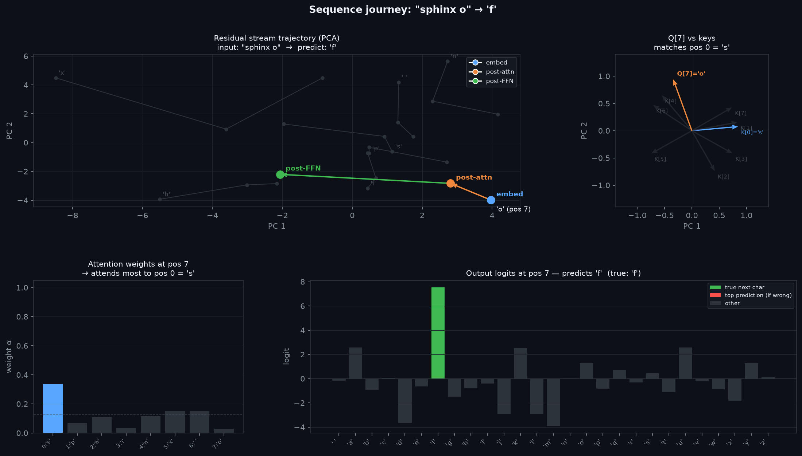

```python
import marimo as mo
import torch
import torch.nn as nn
import numpy as np
import matplotlib.pyplot as plt
import torch.nn.functional as F
```

# Character-Level Transformer

A **transformer** is a sequence-to-sequence model built from two alternating sub-layers:
self-attention (which lets each position read from past positions) and a position-wise
feed-forward network (which processes each position independently after the information has
been mixed).

Here we train a single-layer transformer to predict the next character in a cyclic sequence —
the phrase "sphinx of black quartz judge my vow" repeated indefinitely. Given the preceding
8 characters, predict the 9th. The task is toy-sized, but it exercises every part of the
architecture: token embeddings, positional encodings, causal masking, residual connections,
and layer normalisation.
<!---->
## The Task

The training corpus is one phrase — "sphinx of black quartz judge my vow" — repeated
cyclically. This is a pangram: it contains all 26 letters of the alphabet plus a space,
giving a vocabulary of 27 tokens. The phrase is 35 characters long.

The model receives a sliding window of 8 consecutive characters and must predict the next
character at every position simultaneously. This is **causal next-token prediction**: for
each position $$t$$ in the window, predict $$x_{t+1}$$ using only $$x_0 \ldots x_t$$. The loss
is cross-entropy averaged over positions $$0 \ldots T-2$$.

Because the phrase is only 35 characters, there are exactly 35 distinct 8-grams in the
cyclic sequence — none repeat. The task therefore has a perfect solution: the model only
needs to memorise which character follows each unique 8-gram. The theoretical minimum
loss is 0. In practice the model is small (32 dimensions, 1 layer) and only trained for
1000 steps, so it will not fully converge — but the loss trajectory shows it learning fast.

A random model predicts uniformly over 27 characters, giving cross-entropy
$$\log 27 \approx 3.30$$. Any loss well below that means the model has learned structure.

```python
phrase = "sphinx of black quartz judge my vow"
token_lookup = {c: i for i, c in enumerate(sorted(list(set(phrase))))}
lookup_token = {i: c for c, i in token_lookup.items()}
n_letters = len(token_lookup)
```

```python
def sequence(batch_size: int = 128):
    return torch.tensor(
        [token_lookup[phrase[i % len(phrase)]] for i in range(batch_size)],
        dtype=int,
    )
```

```python
sequence()
```

```python
class BasicTransformer(nn.Module):
    def __init__(self, ndim: int = 32, sequence_length: int = 8):
        super().__init__()
        self.ndim = ndim

        # lookup table mapping each character index to a learned ndim-dimensional vector
        self.embedding = nn.Embedding(n_letters, ndim)
        # lookup table mapping each position index (0..seq_len-1) to a learned ndim vector;
        # added to token embeddings so the model can distinguish same token at different positions
        self.position_embedding = nn.Embedding(sequence_length, ndim)

        # Q projection: "what is this token looking for?" — transforms each token into query space
        self.W_q = nn.Linear(ndim, ndim)
        # K projection: "what does this token have to offer?" — transforms each token into key space
        self.W_k = nn.Linear(ndim, ndim)
        # V projection: the actual content retrieved when a query matches a key
        self.W_v = nn.Linear(ndim, ndim)

        # mixes the attended values before they are added back into the residual stream
        self.attn_projection = nn.Linear(ndim, ndim)
        # normalizes each token vector to zero mean and unit variance after the attention residual add
        self.norm1 = nn.LayerNorm(ndim)

        # feed-forward layer, post-attention
        self.ffn = nn.Sequential(
            # expand to 4x width — standard transformer convention
            nn.Linear(ndim, ndim * 4),
            # smooth nonlinearity; lets the FFN represent nonlinear functions
            nn.GELU(),
            # project back down to match the residual stream dimension
            nn.Linear(ndim * 4, ndim),
        )

        # normalizes after the FFN residual add, same role as norm1
        self.norm2 = nn.LayerNorm(ndim)

        # projects each position's ndim vector to a logit over every character in the vocabulary
        self.out = nn.Linear(ndim, n_letters)

        # upper-triangular boolean mask: True at position [i,j] where j > i (future tokens);
        # registered as a buffer so it moves to the right device with the model but is not a trainable parameter
        self.register_buffer(
            "causal_mask",
            torch.triu(
                torch.ones(sequence_length, sequence_length), diagonal=1
            ).bool(),
        )

    def forward(self, x):
        # x: [B, T] integer token indices
        # tokens: [B, T, ndim] — dense vector per token
        tokens = self.embedding(x)
        # positions: [T, ndim] — one vector per position slot
        positions = self.position_embedding(torch.arange(x.shape[1]))
        # embedded_x: [B, T, ndim] — fuse what the token is with where it is
        embedded_x = tokens + positions

        # Q: [B, T, ndim] — what each position is querying for
        Q = self.W_q(embedded_x)
        # K: [B, T, ndim] — what each position advertises as its content
        K = self.W_k(embedded_x)
        # V: [B, T, ndim] — what each position actually delivers if selected
        V = self.W_v(embedded_x)

        # scores: [B, T, T] — entry [b, i, j] scores how much position i wants to attend to position j
        scores = (Q @ K.transpose(-2, -1)) / (self.ndim**0.5)
        # replace scores where j > i with -inf so softmax assigns them exactly zero weight
        scores = scores.masked_fill(self.causal_mask, float("-inf"))
        # convert scores to a probability distribution over visible positions; each row sums to 1
        weights = scores.softmax(dim=-1)  # [B, T, T]
        # each position's output is a weighted blend of all value vectors it was allowed to see
        attn = weights @ V  # [B, T, ndim]

        # project attention output, add it back to the input (residual), then normalize;
        # the residual lets gradients flow directly to the embedding layer, bypassing attention
        attn_x = self.norm1(embedded_x + self.attn_projection(attn))
        # apply FFN to each position independently, add residual, normalize;
        # FFN does not mix information across positions — that already happened in attention
        attn_x = self.norm2(attn_x + self.ffn(attn_x))

        # result: [B, T, n_letters] — one logit vector per position
        result = self.out(attn_x)

        return result
```

## Architecture

The model has three stages, each wrapped in a residual connection and layer normalisation.

**Token + position embedding.** Each character index maps to a learned $$d$$-dimensional vector
via `nn.Embedding`. A second embedding adds a position vector so the model can distinguish
the same character at different sequence positions. The two are summed:

$$e_t = \text{embed}(x_t) + \text{pos}(t)$$

**Causal self-attention.** Three linear projections ($$W_q$$, $$W_k$$, $$W_v$$) map each position's
embedding to a query, key, and value. The attention score between positions $$i$$ and $$j$$ is:

$$A_{ij} = \frac{Q_i \cdot K_j}{\sqrt{d}}$$

A causal mask sets $$A_{ij} = -\infty$$ for $$j > i$$ before softmax, so position $$i$$ can only
draw from positions $$0 \ldots i$$. The output $$\sum_j \alpha_{ij} V_j$$ is projected, added
back to the embedding (residual), and normalised.

**Feed-forward network.** Each position's vector is passed independently through a two-layer
MLP with $$4\times$$ hidden expansion and GELU activation — identical structure to the MLP
notebook. The FFN does not mix positions; that already happened in attention.

A final linear layer maps each position's $$d$$-vector to logits over the character vocabulary.
The loss is cross-entropy at positions $$0 \ldots T-2$$ predicting tokens $$1 \ldots T-1$$.
<!---->
## Training

We minimise cross-entropy between the model's predictions at positions $$0 \ldots T-2$$ and
the true next tokens at positions $$1 \ldots T-1$$:

$$\mathcal{L} = -\frac{1}{T-1} \sum_{t=0}^{T-2} \log p_\theta(x_{t+1} \mid x_0, \ldots, x_t)$$

The optimizer is **Adam** (lr = 1e-3). Each step draws a fresh batch of 64 windows of
length 8, sampled cyclically from the phrase. Because the phrase is only 35 characters
and we draw 512 tokens per step, every window is seen many times per epoch — this is a
memorisation task, not a generalisation one.

**What to expect.** The loss starts near $$\log 27 \approx 3.30$$ (uniform random over the
27-token vocabulary) and should fall quickly as the model learns the most predictable
transitions — characters that are almost always followed by one specific character.
Perfectly fitting all 35 distinct 8-grams would require more capacity and steps than this
setup provides, so the final loss will be above 0 but well below 3.30.

```python
SEQ_LEN = 8
BATCH_SIZE = 64
N_STEPS = 1000

model = BasicTransformer()
optimizer = torch.optim.Adam(model.parameters(), lr=1e-3)

losses = []
for step in range(N_STEPS):
    flat = sequence(BATCH_SIZE * SEQ_LEN)
    x = flat.reshape(BATCH_SIZE, SEQ_LEN)

    logits = model(x)  # [B, T, n_letters]
    loss = F.cross_entropy(
        logits[:, :-1].reshape(-1, n_letters),
        x[:, 1:].reshape(-1),
    )

    optimizer.zero_grad()
    loss.backward()
    optimizer.step()
    losses.append(loss.item())
```

```python
def build_loss_curve():
    img_file = mo.notebook_dir() / "transformer_loss_curve.png"
    bg = "#0d1117"
    fig, ax = plt.subplots(figsize=(9, 4))
    fig.patch.set_facecolor(bg)
    ax.set_facecolor(bg)
    ax.plot(losses, color="#58a6ff", linewidth=1.4)
    ax.set_xlabel("step", color="#8b949e")
    ax.set_ylabel("cross-entropy loss", color="#8b949e")
    ax.set_title(f"training loss — final: {losses[-1]:.4f}", color="#f0f6fc")
    ax.tick_params(colors="#8b949e")
    ax.grid(True, color="#21262d", linewidth=0.8)
    for spine in ax.spines.values():
        spine.set_color("#30363d")
    plt.tight_layout()
    plt.savefig(img_file, dpi=150)
    return img_file

mo.image(build_loss_curve(), width=500)
```


The curve starts high and drops rapidly in the first ~200 steps as the model picks up
the most common transitions, then flattens as it runs into the capacity limit of a single
attention head at 32 dimensions. The final loss reflects how many of the 35 8-grams the
model has successfully memorised: each correctly predicted transition contributes 0 to
the loss; each uncertain one contributes proportionally to its remaining entropy.

If the curve plateaus above ~2.0 the model has barely learned anything — try more steps
or a larger `ndim`. If it reaches below ~1.0 it has learned most of the predictable
structure in the phrase.
<!---->
## Geometry After Training

Two views into what the model has learned: what each position attends to in a sample sequence,
and where the model has placed each character in embedding space.

```python
def build_geometry_plots():
    img_file = mo.notebook_dir() / "transformer_geometry.png"
    SEQ_LEN = 8

    # extract attention weights for one sample sequence
    flat = sequence(SEQ_LEN)
    x = flat.unsqueeze(0)  # [1, T]
    with torch.no_grad():
        tokens = model.embedding(x)
        positions = model.position_embedding(torch.arange(SEQ_LEN))
        embedded_x = tokens + positions
        Q = model.W_q(embedded_x)
        K = model.W_k(embedded_x)
        scores = (Q @ K.transpose(-2, -1)) / (model.ndim**0.5)
        scores = scores.masked_fill(model.causal_mask, float("-inf"))
        attn_weights = scores.softmax(dim=-1)[0].numpy()  # [T, T]
    seq_chars = [repr(lookup_token[int(flat[i])]) for i in range(SEQ_LEN)]

    # PCA of character embeddings
    emb = model.embedding.weight.detach().numpy()  # [n_letters, ndim]
    emb_c = emb - emb.mean(0)
    _, _, Vt = np.linalg.svd(emb_c, full_matrices=False)
    proj = emb_c @ Vt[:2].T  # [n_letters, 2]
    char_labels = [repr(lookup_token[i]) for i in range(n_letters)]

    bg = "#0d1117"
    fig, axes = plt.subplots(1, 2, figsize=(15, 5))
    fig.patch.set_facecolor(bg)

    # --- left: causal attention heatmap ---
    ax = axes[0]
    ax.set_facecolor(bg)
    im = ax.imshow(attn_weights, cmap="plasma", vmin=0, vmax=1, aspect="auto")
    ax.set_xticks(range(SEQ_LEN))
    ax.set_xticklabels(seq_chars, fontsize=9, color="#8b949e")
    ax.set_yticks(range(SEQ_LEN))
    ax.set_yticklabels(seq_chars, fontsize=9, color="#8b949e")
    ax.set_xlabel("attends to (key)", color="#8b949e")
    ax.set_ylabel("query position", color="#8b949e")
    ax.set_title("Causal attention weights", color="#f0f6fc", fontsize=11)
    for spine in ax.spines.values():
        spine.set_color("#30363d")
    ax.tick_params(colors="#8b949e")
    cb = fig.colorbar(im, ax=ax)
    cb.ax.tick_params(colors="#8b949e")
    cb.outline.set_edgecolor("#30363d")

    # --- right: character embedding PCA ---
    ax = axes[1]
    ax.set_facecolor(bg)
    ax.scatter(proj[:, 0], proj[:, 1], color="#58a6ff", s=45, zorder=3)
    for i, c in enumerate(char_labels):
        ax.annotate(
            c,
            (proj[i, 0], proj[i, 1]),
            xytext=(4, 4),
            textcoords="offset points",
            fontsize=9,
            color="#8b949e",
        )
    ax.set_xlabel("PC 1", color="#8b949e")
    ax.set_ylabel("PC 2", color="#8b949e")
    ax.set_title(
        "Character embedding space (PCA)", color="#f0f6fc", fontsize=11
    )
    ax.grid(True, color="#21262d", linewidth=0.8)
    for spine in ax.spines.values():
        spine.set_color("#30363d")
    ax.tick_params(colors="#8b949e")

    fig.suptitle(
        "Transformer geometry after training",
        color="#f0f6fc",
        fontweight="bold",
        fontsize=13,
    )
    plt.tight_layout()
    plt.savefig(img_file, dpi=150)
    return img_file

mo.image(build_geometry_plots(), width=750)
```
{: .code-collapsed}


**Causal attention (left).** Each cell $$[i, j]$$ is the weight that query position $$i$$
places on key position $$j$$ after training. The upper triangle is structurally zero — the
causal mask sets those scores to $$-\infty$$ before softmax, so the model cannot attend to
future tokens. What remains in the lower triangle encodes a learned strategy: which past
positions does each position find useful for predicting the next character?

A strong diagonal means each position mostly attends to itself — the token at position $$i$$
is the best predictor of the token at $$i+1$$, so the model routes information straight
through without mixing. Off-diagonal concentration in the lower-left means positions are
reaching back further into context — the model has found that an earlier character (not
just the immediate predecessor) is most informative for some transitions. Both patterns
can coexist within the same attention head across different positions.

**Character embedding geometry (right).** The 27 learned character embeddings projected
to their first two principal components. Because the phrase is a pangram, every character
appears at least once. Characters that appear in similar left- and right-neighbour contexts
tend to be placed nearby — gradient descent pulls together characters whose embedding
must produce similar query-key-value behaviour to minimise loss.

The space character often sits apart: it is the only character that can follow any word
without constraint, and every word boundary produces a space, so its distributional
context is unlike any letter. Letters that only appear once in the phrase (like `q`, `x`,
`z`) tend to sit at the periphery, their embeddings shaped by a single context window
rather than many overlapping ones.
<!---->
### Sequence Journey

The plots above show static structure. This one traces the **dynamic journey**: how one
specific 8-character window travels through the network's residual stream — from
token+position embeddings, through attention, through the FFN — arriving at a predicted
next character.

The input is the first 8 characters of the phrase: **"sphinx o"** → predict **"f"**.
Position 7 is traced. It has access to all 7 preceding characters and must predict
what follows "o" in this context.

```python
def build_sequence_trace():
    img_file = mo.notebook_dir() / "transformer_trace.png"
    SEQ_LEN = 8
    T = TRACE_POS = SEQ_LEN - 1

    flat = torch.tensor(
        [token_lookup[phrase[i]] for i in range(SEQ_LEN)], dtype=torch.long
    )
    x = flat.unsqueeze(0)
    seq_chars = [repr(lookup_token[int(flat[i])]) for i in range(SEQ_LEN)]
    true_next = repr(phrase[SEQ_LEN])

    with torch.no_grad():
        tok = model.embedding(x)
        pos = model.position_embedding(torch.arange(SEQ_LEN))
        emb = tok + pos  # stage 0

        Q = model.W_q(emb)
        K = model.W_k(emb)
        V = model.W_v(emb)

        scores = (Q @ K.transpose(-2, -1)) / (model.ndim**0.5)
        scores = scores.masked_fill(model.causal_mask, float("-inf"))
        attn_w = scores.softmax(dim=-1)
        attn_o = attn_w @ V

        s1 = model.norm1(emb + model.attn_projection(attn_o))  # stage 1
        s2 = model.norm2(s1 + model.ffn(s1))  # stage 2
        logits_all = model.out(s2)[0]  # [T, n_letters]

    e0, e1, e2 = emb[0].numpy(), s1[0].numpy(), s2[0].numpy()
    Q_np, K_np = Q[0].numpy(), K[0].numpy()
    attn_row = attn_w[0, T].numpy()
    logits_t = logits_all[T].numpy()
    j = int(np.argmax(attn_row))

    # shared PCA for residual stream (all positions, all stages)
    all_r = np.vstack([e0, e1, e2])
    mu_r = all_r.mean(0)
    _, _, Vt_r = np.linalg.svd(all_r - mu_r, full_matrices=False)

    def rp(a):
        return (a - mu_r) @ Vt_r[:2].T

    p0, p1, p2 = rp(e0), rp(e1), rp(e2)

    # PCA for Q/K alignment
    qk = np.vstack([Q_np[T : T + 1], K_np])
    mu_qk = qk.mean(0)
    _, _, Vt_qk = np.linalg.svd(qk - mu_qk, full_matrices=False)

    def qkp(a):
        return (a - mu_qk) @ Vt_qk[:2].T

    def unit(v):
        return v / (np.linalg.norm(v) + 1e-8)

    def unitrows(M):
        return M / (np.linalg.norm(M, axis=1, keepdims=True) + 1e-8)

    q_u = unit(qkp(Q_np[T : T + 1])[0])
    k_u = unitrows(qkp(K_np)) * 0.85

    bg = "#0d1117"
    fig = plt.figure(figsize=(18, 9))
    fig.patch.set_facecolor(bg)
    gs = fig.add_gridspec(2, 3, hspace=0.48, wspace=0.32)

    # ── residual stream trajectory ──────────────────────────────────────
    ax = fig.add_subplot(gs[0, :2])
    ax.set_facecolor(bg)
    stage_cols = ["#58a6ff", "#f0883e", "#3fb950"]
    stage_labs = ["embed", "post-attn", "post-FFN"]

    for t in range(SEQ_LEN):
        if t == T:
            continue
        pts = np.stack([p0[t], p1[t], p2[t]])
        ax.plot(pts[:, 0], pts[:, 1], color="#2d333b", lw=1.0, zorder=1)
        ax.scatter(pts[:, 0], pts[:, 1], color="#2d333b", s=16, zorder=2)
        ax.annotate(
            seq_chars[t],
            p0[t],
            xytext=(4, 4),
            textcoords="offset points",
            fontsize=8,
            color="#484f58",
        )

    for (pa, pb), c in zip([(p0[T], p1[T]), (p1[T], p2[T])], stage_cols[1:]):
        ax.annotate(
            "",
            xy=pb,
            xytext=pa,
            arrowprops=dict(arrowstyle="->", color=c, lw=1.8),
        )
    for pt, c, lb in zip([p0[T], p1[T], p2[T]], stage_cols, stage_labs):
        ax.scatter(*pt, color=c, s=100, zorder=5)
        ax.annotate(
            lb,
            pt,
            xytext=(7, 5),
            textcoords="offset points",
            fontsize=9,
            color=c,
            fontweight="bold",
        )
    ax.annotate(
        f"{seq_chars[T]} (pos {T})",
        p0[T],
        xytext=(7, -15),
        textcoords="offset points",
        fontsize=9,
        color="#f0f6fc",
    )

    from matplotlib.lines import Line2D

    ax.legend(
        handles=[
            Line2D(
                [0],
                [0],
                marker="o",
                color="w",
                markerfacecolor=c,
                markersize=7,
                label=l,
            )
            for c, l in zip(stage_cols, stage_labs)
        ],
        fontsize=8,
        facecolor="#161b22",
        edgecolor="#30363d",
        labelcolor="#f0f6fc",
    )
    title_seq = "".join(c.strip("'") for c in seq_chars)
    ax.set_title(
        f'Residual stream trajectory (PCA)\ninput: "{title_seq}"  →  predict: {true_next}',
        color="#f0f6fc",
        fontsize=10,
    )
    ax.set_xlabel("PC 1", color="#8b949e")
    ax.set_ylabel("PC 2", color="#8b949e")
    ax.tick_params(colors="#8b949e")
    ax.grid(True, color="#21262d", lw=0.5)
    for sp in ax.spines.values():
        sp.set_color("#30363d")

    # ── Q vs K alignment ────────────────────────────────────────────────
    ax = fig.add_subplot(gs[0, 2])
    ax.set_facecolor(bg)
    qkw = dict(
        angles="xy",
        scale_units="xy",
        scale=1,
        width=0.008,
        headwidth=4,
        headlength=5,
    )
    for t in range(SEQ_LEN):
        is_j = t == j
        c = "#58a6ff" if is_j else "#2d333b"
        ax.quiver(
            0,
            0,
            k_u[t, 0],
            k_u[t, 1],
            color=c,
            alpha=1.0 if is_j else 0.6,
            **qkw,
        )
        lbl = f"K[{t}]={seq_chars[t]}" if is_j else f"K[{t}]"
        ax.annotate(
            lbl,
            k_u[t],
            xytext=(4, -10),
            textcoords="offset points",
            fontsize=7,
            color=c if is_j else "#484f58",
        )
    ax.quiver(0, 0, q_u[0], q_u[1], color="#f0883e", zorder=5, **qkw)
    ax.annotate(
        f"Q[{T}]={seq_chars[T]}",
        q_u,
        xytext=(5, 5),
        textcoords="offset points",
        fontsize=8,
        color="#f0883e",
        fontweight="bold",
    )
    ax.set_xlim(-1.4, 1.4)
    ax.set_ylim(-1.4, 1.4)
    ax.set_aspect("equal")
    ax.axhline(0, color="#21262d", lw=0.5)
    ax.axvline(0, color="#21262d", lw=0.5)
    ax.set_title(
        f"Q[{T}] vs keys\nmatches pos {j} = {seq_chars[j]}",
        color="#f0f6fc",
        fontsize=10,
    )
    ax.set_xlabel("PC 1", color="#8b949e")
    ax.set_ylabel("PC 2", color="#8b949e")
    ax.tick_params(colors="#8b949e")
    for sp in ax.spines.values():
        sp.set_color("#30363d")

    # ── attention weights at traced position ─────────────────────────────
    ax = fig.add_subplot(gs[1, 0])
    ax.set_facecolor(bg)
    ax.bar(
        range(SEQ_LEN),
        attn_row,
        color=["#58a6ff" if t == j else "#2d333b" for t in range(SEQ_LEN)],
        linewidth=0,
    )
    ax.set_xticks(range(SEQ_LEN))
    ax.set_xticklabels(
        [f"{t}:{seq_chars[t]}" for t in range(SEQ_LEN)],
        fontsize=7,
        color="#8b949e",
        rotation=45,
        ha="right",
    )
    ax.axhline(1 / SEQ_LEN, color="#484f58", linestyle="--", lw=0.8)
    ax.set_ylim(0, 1.05)
    ax.set_ylabel("weight α", color="#8b949e")
    ax.set_title(
        f"Attention weights at pos {T}\n→ attends most to pos {j} = {seq_chars[j]}",
        color="#f0f6fc",
        fontsize=10,
    )
    ax.tick_params(colors="#8b949e")
    ax.grid(True, axis="y", color="#21262d", lw=0.5)
    for sp in ax.spines.values():
        sp.set_color("#30363d")

    # ── output logits at traced position ────────────────────────────────
    ax = fig.add_subplot(gs[1, 1:])
    ax.set_facecolor(bg)
    pred_idx = int(np.argmax(logits_t))
    true_idx = token_lookup[phrase[SEQ_LEN]]
    ax.bar(
        range(n_letters),
        logits_t,
        color=[
            "#3fb950"
            if i == true_idx
            else "#f85149"
            if i == pred_idx
            else "#2d333b"
            for i in range(n_letters)
        ],
        linewidth=0,
    )
    ax.set_xticks(range(n_letters))
    ax.set_xticklabels(
        [repr(lookup_token[i]) for i in range(n_letters)],
        fontsize=8,
        color="#8b949e",
        rotation=45,
        ha="right",
    )
    ax.axhline(0, color="#30363d", lw=0.8)
    pred_char = repr(lookup_token[pred_idx])
    ax.set_title(
        f"Output logits at pos {T} — predicts {pred_char}  (true: {true_next})",
        color="#f0f6fc",
        fontsize=10,
    )
    ax.set_ylabel("logit", color="#8b949e")
    ax.tick_params(colors="#8b949e")
    ax.grid(True, axis="y", color="#21262d", lw=0.5)
    for sp in ax.spines.values():
        sp.set_color("#30363d")
    from matplotlib.patches import Patch

    ax.legend(
        handles=[
            Patch(facecolor="#3fb950", label="true next char"),
            Patch(facecolor="#f85149", label="top prediction (if wrong)"),
            Patch(facecolor="#2d333b", label="other"),
        ],
        fontsize=7,
        facecolor="#161b22",
        edgecolor="#30363d",
        labelcolor="#f0f6fc",
    )

    fig.suptitle(
        f'Sequence journey: "{title_seq}" → {true_next}',
        color="#f0f6fc",
        fontweight="bold",
        fontsize=13,
    )
    plt.savefig(img_file, dpi=150, bbox_inches="tight")
    return img_file

mo.image(build_sequence_trace(), width=950)
```
{: .code-collapsed}


**Top-left — residual stream trajectory.** Each position starts as a token+position
embedding (blue dot) and moves through representation space after attention (orange) and
after the FFN (green). Other positions appear as grey traces. The arrows on position 7's
trajectory show the direction and magnitude of each sublayer's contribution.

This is the **residual stream** perspective: attention and the FFN do not replace the
representation — they add to it. The model begins with "what character am I and where in
the sequence am I?" and each sublayer adds information on top of that. Attention adds
"what did the past tokens say," the FFN applies a non-linear function of the combined
context. The further the orange and green dots move from the blue dot, the larger the
sublayer's contribution relative to the original embedding.

**Top-right — Q vs K alignment.** The query vector Q[7] (orange) is plotted alongside
the key vectors K[0..7] (grey) in a shared 2D PCA projection, all normalized to unit
length to show direction only. Unlike the attention notebook where K is a fixed parameter
matrix, here every K[t] is derived from position t's own embedding — the keys change
with every input sequence. Q[7] should point closely toward the key of whichever past
position the model attends to most, confirming that attention is finding content
similarity between the current position and its context, not a fixed address.

**Bottom-left — attention weights at position 7.** The softmax distribution over all
reachable past positions. The tallest bar tells us which character position 7 found most
useful. This is one row of the full causal attention heatmap shown in the geometry plot
above — now with character labels so you can read directly which character was selected.

**Bottom-right — output logits.** The predicted character distribution after the full
forward pass through attention and FFN. The true next character is green. A large gap
between the highest logit and the rest means the residual stream converged cleanly toward
a single answer; a flat distribution means the model is uncertain about this transition.
