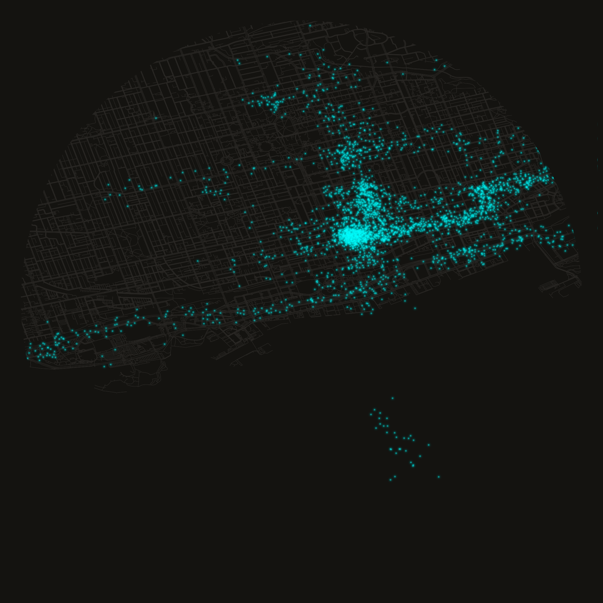
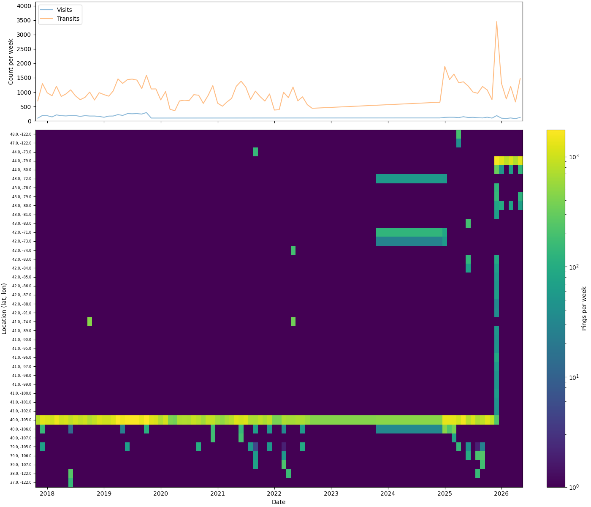
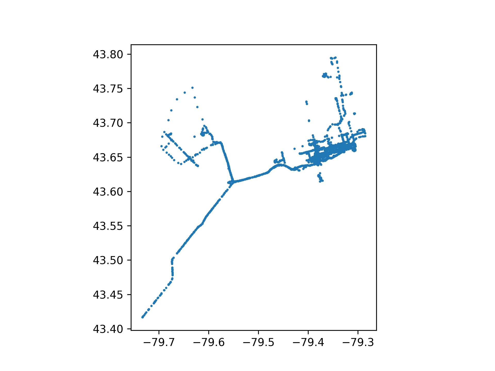

```python
# Import json for parsing the raw location history export
import json

# Import datetime for timestamp arithmetic
import datetime

# Import marimo itself (aliased mo) for UI elements and notebook helpers
import marimo as mo

# Import numpy for numeric array operations
import numpy as np

# Import polars for fast dataframe processing
import polars as pl

# Import pandas since geopandas/osmnx interop expects pandas dataframes
import pandas as pd

# Import geopandas for geometry-aware dataframes
import geopandas as gpd

# Import osmnx to fetch and plot OpenStreetMap road graphs
import osmnx as ox

# Import Point/box geometry constructors from shapely
from shapely.geometry import Point, box

# Import matplotlib's pyplot for plotting
import matplotlib.pyplot as plt

# Import LogNorm for log-scaled colour normalization in heatmaps
from matplotlib.colors import LogNorm

# Resolve the data directory relative to this notebook's location
DATA_DIR = mo.notebook_dir() / "data"
# Ensure the data directory exists, creating parents as needed
DATA_DIR.mkdir(exist_ok=True, parents=True)
# Path to the raw Google location history JSON export
DATA = DATA_DIR / "location-history.json"
# Directory for generated output images
OUTPUT_DIR = DATA_DIR / "output"
# Ensure the output directory exists
OUTPUT_DIR.mkdir(exist_ok=True, parents=True)
# Directory for cached intermediate parquet/graph files
CACHE_DIR = DATA_DIR / "cache"
# Ensure the cache directory exists
CACHE_DIR.mkdir(exist_ok=True, parents=True)

# Path to the circular header image rendered later in the notebook
header_file = OUTPUT_DIR / "toronto_header.png"
# Expose these names to other cells that declare them as parameters
```
{: .code-collapsed}

# Background & Context

In our tech-driven world, we all carry a surveillance device in our pocket. It's ubiquitous. We give them to children. They provide us with dopamine hits throughout the day as we connect with our trusted social bubble. These Star-Trek-esque communicator devices allow us to instantly communicate with anyone across the world, view unlimited hours of "content", and are the primary device via which our Attention Economy captures our human experience to translate to Marketable Dollars.

The human experience is characterized more and more every year by how we allow massive economic systems to control our attention and our navigation within these complex systems. We cling to this tiny screen in a vague effort to feel "in control" — even as human-induced climate change promises to destroy our children's future and the mechanisms to change _any of this_ remain so far beyond the average worker.

Our data and our privacy is increasingly beyond our grasp and our rights to navigate this technocratic dystopia weaken by the day based on decisions made by people like me in the tech industry, while we deliberate in soulless video conferences or by CEOs from the 0.1% in ill-fitting suits with dreams of fiefdom.

Google Maps might be the single most useful app on my phone. It's powered by the incredible [GPS system](https://perthirtysix.com/how-the-heck-does-gps-work), and I use it for virtually all day-to-day navigation. Google Maps also spies on your every move, your every search, your every interaction with each of their apps as a way to spoon-feed you advertisements that are "relevant" to increase the propensity that you engage with whatever company has fed you the most relevant ad.

Google Maps Timeline has its roots in [Google Latitude](https://en.wikipedia.org/wiki/Google_Latitude), a location-tracking service launched in 2009. When Google shut Latitude down in 2013, it folded Location History into Maps, and in July 2015 formalized it as ["Your Timeline"](https://maps.googleblog.com/2015/07/your-timeline-revisiting-world-that.html) — a private, opt-in diary of everywhere you'd been, stored in your Google Account in the cloud. In December 2023, [Google announced](https://blog.google/products/maps/updates-to-location-history-and-new-controls-coming-soon-to-maps/) it would move Timeline data off its servers and onto users' devices, a change enforced for all users by December 2024. The stated rationale was privacy: local storage means Google can no longer read your data, and notably can no longer respond to [geofence warrants](https://thehackernews.com/2024/06/google-maps-timeline-data-to-be-stored.html) — a law enforcement practice that had drawn significant legal scrutiny. The trade-off is that the web interface is gone entirely; Timeline now lives only in the mobile app.

Our data should be _our data_. We should not limit ourselves to huddling in closed gardens of meglomaniacal corporations. We can use this timeline data too.

```python
# Display the previously generated header image inline
mo.image(header_file, width=300)
```
{: .code-collapsed}


# Load Data

Exporting your own data depends on when you're reading this. In late 2024, Google moved Timeline storage off their servers and onto your device — a rare privacy-forward decision, though it also means [Google Takeout](https://takeout.google.com) no longer contains useful Timeline data for recent history. On Android, go to **Settings → Location → Location Settings → Timeline → Export Timeline data**. On iPhone, open Google Maps, tap your profile icon, go to **Your Timeline**, then the three-dot menu **→ Location and privacy settings → Export Timeline data** ([full walkthrough here](https://blog.dummzeuch.de/2025/09/07/how-to-export-google-maps-timeline/)). Either path produces a JSON file with the same structure used throughout this project. If you have an older Takeout export from before 2024, that works too — that's what I'm using here.

The google maps export is returned as raw JSON, loaded as a list of record objects with one of the two following structures, depending on if Google Maps determined the ping to come from a "visit" or a "timeline path" (i.e. actively traveling).

**Timeline Path**

```json
{
    "endTime": "ISO Timestamp",
    "startTime": "ISO Timestamp",
    "timelinePath": [
        {
            "point": "geo: <latitude>, <longitude>",
            "durationMinutesOffsetFromStartTime": "int"
        }, ...
    ]
}, ...
```

**Visit**

```json
{
    "visit": {
        "hierarchyLevel": "int"
        "topCandidate": {
            "probability": "float in [0, 1]"
            "semanticType": "string"
            "placeID": "string-id"
            "placeLocation": "geo: <latitude>, <longitude>"
        },
        "probability": "float in [0, 1]"
    }
}, ...
```

```python
# Read and parse the raw Google Takeout JSON export into a list of records
data = json.loads(DATA.read_text())
# Report how many raw records were parsed
mo.md(f"Parsed {len(data):,} raw records from location history JSON")
```

Since there are two different record structures, we'll handle them differently and concatenate together at the end.
<!---->
## Load Visits

First, materialize as a filtered python list and flatten the visit candidates into just selecting the first one and pulling out its coordinates directly.

```python
# Filter to just visit records and pull out the fields we need per visit
visits = [
    {
        "start": row.get("startTime"),
        "end": row.get("endTime"),
        "location": row["visit"]["topCandidate"]["placeLocation"],
    }
    for row in data
    if row.get("visit")
]
```

Now we can create our dataframe. The main transformations are parsing the ISO timestamps, extracting latitude and longitude from Google's `geo: lat, lon` string format, and computing duration from the difference between start and end times. Each row also gets a `"visit"` type label — we'll use this when combining with transit data to distinguish the two record types.

```python
# Build the visits dataframe: parse timestamps/coordinates, then compute duration and select final columns
vdf = (
    pl.DataFrame(visits)
    # Parse ISO start/end timestamps and split the "geo: lat, lon" string into parts
    .with_columns(
        start=pl.col("start").str.to_datetime(time_zone="utc"),
        end=pl.col("end").str.to_datetime(time_zone="utc"),
        point=pl.col("location").str.replace("geo:", "").str.split(","),
    )
    # Extract latitude/longitude, tag the row type, and derive visit duration
    .with_columns(
        latitude=pl.col("point").list.get(0).cast(float),
        longitude=pl.col("point").list.get(1).cast(float),
        type=pl.lit("visit"),
        duration_seconds=(pl.col("end") - pl.col("start")).dt.total_seconds().cast(int),
        timestamp=pl.col("start"),
    )
    # Assign a stable row id
    .with_row_index(name="id")
    # Keep only the columns shared with the transit dataframe for later concatenation
    .select(
        [
            "start",
            "end",
            "type",
            "duration_seconds",
            "timestamp",
            "latitude",
            "longitude",
            "id",
        ]
    )
)
# Report the visit count and date range
mo.md(f"Found {len(vdf):,} **visits** from {vdf['start'].min()} to {vdf['end'].max()}")
```

## Load Timeline

Order of operations here is the same: filter raw list into just timelines, then construct dataframe.

```python
# Filter raw records down to just timeline-path (transit) records
timeline = [row for row in data if row.get("timelinePath")]
```

One wrinkle: each timeline point is stored as a minute-offset from the segment's `startTime` rather than an absolute timestamp. We reconstruct the actual timestamps by adding those offsets back to the start.

```python
# Define a helper that reconstructs an absolute timestamp from a minute offset
def generate_offset_timestamp(record: dict):
    # Read the minute offset from the segment start
    offset = int(record["durationMinutesOffsetFromStartTime"])
    # Convert the offset into a timedelta
    offset_delta = datetime.timedelta(minutes=offset)
    # Add the offset to the segment's start time to get the absolute timestamp
    timestamp = record["start"] + offset_delta
    # Return the reconstructed timestamp
    return timestamp
```

```python
# Build the transit dataframe: parse timestamps, explode each segment into its individual path points, then derive fields
tdf = (
    pl.DataFrame(timeline)
    # Parse the segment-level start/end ISO timestamps
    .with_columns(
        start=pl.col("startTime").str.to_datetime(time_zone="utc"),
        end=pl.col("endTime").str.to_datetime(time_zone="utc"),
    )
    # Assign a stable row id per segment before exploding
    .with_row_index(name="id")
    # Expand each segment's list of path points into one row per point
    .explode("timelinePath")
    # Flatten the point/offset struct into top-level columns
    .unnest("timelinePath")
    # Split the "geo: lat, lon" string into parts
    .with_columns(point=pl.col("point").str.replace("geo:", "").str.split(","))
    # Reconstruct each point's absolute timestamp from its minute offset
    .with_columns(
        timestamp=pl.struct(["start", "durationMinutesOffsetFromStartTime"])
        .map_elements(generate_offset_timestamp, return_dtype=pl.Datetime)
        .dt.replace_time_zone("UTC"),
    )
    # Extract latitude/longitude, tag the row type, and set duration to zero (points, not intervals)
    .with_columns(
        latitude=pl.col("point").list.get(0).cast(float),
        longitude=pl.col("point").list.get(1).cast(float),
        type=pl.lit("transit"),
        duration_seconds=pl.lit(0).cast(int),
    )
    # Keep only the columns shared with the visits dataframe for later concatenation
    .select(
        [
            "start",
            "end",
            "type",
            "duration_seconds",
            "timestamp",
            "latitude",
            "longitude",
            "id",
        ]
    )
)
# Report the transit point count and date range
mo.md(f"Found {len(tdf):,} **transits** from {tdf['start'].min()} to {tdf['end'].max()}")
```

## Consolidate

With visits and transit points parsed separately, we stack them into a single chronologically-sorted dataframe. We also shift the coordinates forward by one row to get `prior_latitude` and `prior_longitude` per point — consecutive coordinate pairs used downstream for distance calculations and movement visualization.

```python
# Stack visits and transits, sort chronologically, and add prior-point columns for movement calculations
df = (
    vdf.vstack(tdf)
    # Consolidate the stacked chunks into a single contiguous block
    .rechunk()
    # Sort all points chronologically
    .sort("timestamp")
    # Shift latitude/longitude down one row to capture each point's predecessor
    .with_columns(
        prior_latitude=pl.col("latitude").shift(1),
        prior_longitude=pl.col("longitude").shift(1),
    )
)
```

```python
# Count visit rows
n_visits = len(vdf)
# Count transit rows
n_transits = len(tdf)
# Count the combined total
total = len(df)
# Report the breakdown
mo.md(
    f"{n_visits:,} visits + {n_transits:,} transit points = {total:,} total over the entire timeline"
)
```

## Event Timeline

Before saving, it's worth seeing the shape of the data. The top panel plots visit and transit counts per month. The bottom is a location heatmap — the top 40 most-visited one-degree grid squares over time, sorted south to north by latitude. Together they give a quick read on data density across time and space: where you were, and how often.

```python
# Path where the rendered event-timeline PNG will be saved
event_timeline_file = CACHE_DIR / "event_timeline.png"

# Define the function that builds and saves the two-panel event timeline plot
def build_event_timeline_plot():
    # Aggregate monthly visit/transit counts by type
    d = df.group_by_dynamic("timestamp", every="1mo", group_by=["type"]).agg(num=pl.len())
    # Isolate the monthly visit counts
    v = d.filter(pl.col("type") == "visit")
    # Isolate the monthly transit counts
    t = d.filter(pl.col("type") == "transit")

    # Build a monthly ping count per rounded-to-one-degree location bucket
    heat = (
        df.with_columns(
            location=pl.concat_str(
                [
                    pl.col("latitude").round(0).cast(str),
                    pl.lit(", "),
                    pl.col("longitude").round(0).cast(str),
                ]
            )
        )
        .group_by_dynamic("timestamp", every="1mo", group_by=["location"])
        .agg(num=pl.len())
    )
    # Determine the 40 most-visited locations overall
    top_locs = (
        heat.group_by("location")
        .agg(total=pl.col("num").sum())
        .sort("total", descending=True)
        .head(40)["location"]
        .to_list()
    )
    # Restrict the heatmap data to just those top locations
    heat = heat.filter(pl.col("location").is_in(top_locs))
    # Pivot so each location becomes a column and each month a row
    pivot = (
        heat.pivot(
            on="location",
            index="timestamp",
            values="num",
            aggregate_function="sum",
        )
        .fill_null(0)
        .sort("timestamp")
    )
    # Sort locations geographically south → north by latitude
    loc_cols = sorted(
        [c for c in pivot.columns if c != "timestamp"],
        key=lambda s: (float(s.split(",")[0]), float(s.split(",")[1])),
    )
    # Pull the month timestamps out as the x-axis
    timestamps = pivot["timestamp"].to_pandas()
    # Transpose to (locations, months) for pcolormesh
    matrix = pivot.select(loc_cols).to_numpy().T.astype(float)  # (n_locs, n_months)
    # Mask zero counts as NaN so they render as background instead of the colormap's zero colour
    matrix = np.where(matrix > 0, matrix, np.nan)

    # Create a two-row figure: top for counts over time, bottom for the location heatmap
    fig, ax = plt.subplots(
        2,
        1,
        figsize=(14, 12),
        sharex=True,
        height_ratios=[1, 3],
        constrained_layout=True,
    )
    # Plot the monthly visit count line
    ax[0].plot(v["timestamp"], v["num"], alpha=0.5, label="Visits")
    # Plot the monthly transit count line
    ax[0].plot(t["timestamp"], t["num"], alpha=0.5, label="Transits")
    # Show the legend distinguishing visits vs transits
    ax[0].legend(loc=0)
    # Give the count axis some headroom above the max value
    ax[0].set_ylim(0, d["num"].max() * 1.2)
    # Label the count axis
    ax[0].set_ylabel("Count per week")

    # Colour the heatmap's background to match the colormap's lowest value
    ax[1].set_facecolor(plt.cm.viridis(0.0))
    # Draw the location-by-month heatmap on a log colour scale
    im = ax[1].pcolormesh(
        timestamps,
        range(len(loc_cols)),
        matrix,
        shading="nearest",
        cmap="viridis",
        norm=LogNorm(vmin=1),
    )
    # Position one tick per location row
    ax[1].set_yticks(range(len(loc_cols)))
    # Label each row with its lat/lon bucket
    ax[1].set_yticklabels(loc_cols, fontsize=6)
    # Label the y-axis
    ax[1].set_ylabel("Location (lat, lon)")
    # Label the x-axis
    ax[1].set_xlabel("Date")
    # Add a colourbar explaining the heatmap scale
    plt.colorbar(im, ax=ax[1], label="Pings per week")

    # Save the finished figure to disk
    plt.savefig(event_timeline_file)
```

```python
# Render and save the event timeline plot
build_event_timeline_plot()
# Display the saved plot inline
mo.image(event_timeline_file, width=500)
```
{: .code-collapsed}


# Save

Write the consolidated dataframe to parquet for downstream notebooks. Parquet preserves column types — timestamp timezones and numeric precision survive the round-trip without re-parsing.

```python
# Persist the consolidated dataframe for downstream notebooks
df.write_parquet(CACHE_DIR / "all_locations.parquet")
```

# Visualization

Two outputs: a scatter plot of GPS pings clipped to a bounding box around Toronto, and the circular header image at the top of this page. Both are parameterized by bounding box size.

```python
# Path where the filtered-locations scatter plot will be saved
plotfile = OUTPUT_DIR / "filtered_locations.png"
# Path where the filtered locations dataframe will be cached
savefile = CACHE_DIR / "filtered_locations.parquet"

# Define the function that filters, clips, plots, and caches the locations dataframe
def build_locations_df(
    cutoff: str | None = None,
    dates: tuple[datetime.date, datetime.date] | None = None,
    size: str = "small",
):
    # Default to the full available date range when none is specified
    if dates is None:
        dates = (datetime.date(1970, 1, 1), datetime.date.today())
    # Filter rows by the chosen cutoff preset and/or explicit date range, then build point geometries
    locations_df: pd.DataFrame = (
        df.filter(
            (
                pl.when(cutoff == "moving")
                .then(pl.col("timestamp") >= MOVE_TO_TORONTO)
                .when(cutoff == "anniversary")
                .then(pl.col("timestamp") >= ANNIVERSARY)
                .otherwise(True)
            )
            & (pl.col("timestamp") >= dates[0])
            & (pl.col("timestamp") <= dates[1])
        )
        .with_columns(
            geometry=pl.struct(["latitude", "longitude"]).map_elements(
                lambda row: Point(row["longitude"], row["latitude"])
            ),
        )
        .to_pandas()
    )
    # Convert to a GeoDataFrame and clip to the chosen bounding box size
    locations_df: gpd.GeoDataFrame = set_bounds(
        gpd.GeoDataFrame(locations_df, crs="EPSG:4326"),
        size,
    )
    # Report how many points survived the bounding-box clip
    print(f"  Clipped to {size} bounding box → {len(locations_df):,} points in region")
    # Plot the filtered points as a simple scatter
    locations_df.plot(marker=".", markersize=5)
    # Save the scatter plot to disk
    plt.savefig(plotfile, dpi=300)

    # Cache the filtered dataframe for reuse without recomputation
    locations_df.to_parquet(savefile)
    # Return the filtered dataframe to the caller
    return locations_df
```
{: .code-collapsed}

## Bounding Boxes

Three sizes clip the data to progressively tighter views of Toronto: `big` covers the wider GTA footprint, `small` focuses on the urban core, and `tiny` draws a tight box around downtown. The selected bounds are also written to a cache file so downstream notebooks can use the same spatial extent without re-specifying it.

```python
# Path where the selected bounding box is cached for other notebooks to reuse
boundsfile = CACHE_DIR / "bounds.json"

# Define the function that clips a GeoDataFrame to a named bounding box size
def set_bounds(df: gpd.GeoDataFrame, size: str) -> gpd.GeoDataFrame:
    # Select the bounding box coordinates for the requested size
    match size:
        case "big":
            # Wider GTA-footprint bounding box
            BOUNDS_XMIN = -80.088959
            BOUNDS_XMAX = -78.770599
            BOUNDS_YMIN = 43.41502
            BOUNDS_YMAX = 43.888986
        case "small":
            # Urban-core bounding box
            BOUNDS_XMIN = -79.463167
            BOUNDS_XMAX = -79.298372
            BOUNDS_YMIN = 43.623215
            BOUNDS_YMAX = 43.682460
        case "tiny":
            # Tight downtown bounding box
            BOUNDS_XMIN = -79.554405
            BOUNDS_XMAX = -79.224815
            BOUNDS_YMIN = 43.606624
            BOUNDS_YMAX = 43.725088
        case _:
            # Reject any size string that isn't one of the three presets
            raise ValueError

    # Cache the chosen bounds to disk so downstream notebooks share the same spatial extent
    boundsfile.write_text(
        json.dumps(
            {
                "xmin": BOUNDS_XMIN,
                "xmax": BOUNDS_XMAX,
                "ymin": BOUNDS_YMIN,
                "ymax": BOUNDS_YMAX,
            }
        )
    )

    # Clip the dataframe to the bounding box and return it
    return df.cx[BOUNDS_XMIN:BOUNDS_XMAX, BOUNDS_YMIN:BOUNDS_YMAX]
```

```python
# UI control letting the user pick a manual start/end date range
date_range = mo.ui.date_range(
    start=df["start"].dt.date().min(),
    stop=df["end"].dt.date().max(),
)
# UI dropdown for choosing a preset cutoff (or none)
cutoff = mo.ui.dropdown(
    options=[None, "moving", "anniversary"],
    value=None,
    label="Cutoff",
)
# UI dropdown for choosing the bounding box size
size = mo.ui.dropdown(
    options=["tiny", "small", "big"],
    value="big",
    label="Size",
)

# Render the form combining all three controls and rebuild the locations dataframe whenever it changes
mo.md("""
**Select Filter Parameters**

Select _either_ a pre-set cutoff AND manually adjust the dates.
Both filters are automatically applied.

{cutoff}

{date_range}

{size}
""").batch(
    cutoff=cutoff,
    date_range=date_range,
    size=size,
).form(
    on_change=lambda values: build_locations_df(
        values["cutoff"],
        values["date_range"],
        values["size"],
    )
)
```

```python
# Display the filtered-locations scatter plot inline
mo.image(plotfile, width=500)
```
{: .code-collapsed}


```python
# Path where the downloaded OSM road graph is cached
osm_cache = CACHE_DIR / "toronto_header_osm_graph.graphml"

# Define the function that renders the circular downtown-Toronto header image
def build_toronto_header():
    # Square bounding box centred on downtown Toronto; circle centre shifted south 30% of diameter
    CX, CY = -79.39, 43.665 - 0.085 * 0.30
    # Half-width/height of the square bounding box in degrees
    HALF = 0.0425
    # Derive the box's north/south/east/west edges from the centre and half-size
    N, S, E, W = CY + HALF, CY - HALF, CX + HALF, CX - HALF
    # Background colour used for the page and the outside-circle mask
    BG = "#141310"

    # Reuse the cached OSM graph if available, otherwise download and cache it
    if osm_cache.exists():
        # Load the previously cached road graph
        G = ox.load_graphml(osm_cache)
        print(f"Loaded OSM graph from cache: {osm_cache.name}")
    else:
        # Download the road network within the bounding box
        G = ox.graph_from_bbox((W, S, E, N), network_type="all")
        # Cache the downloaded graph for future runs
        ox.save_graphml(G, osm_cache)
        print(f"Downloaded and cached OSM graph: {osm_cache.name}")

    # Create the square figure with the dark background colour
    fig, ax = plt.subplots(figsize=(10, 10), facecolor=BG)
    # Match the axes background to the figure background
    ax.set_facecolor(BG)

    # Draw the road network edges without markers at nodes
    ox.plot_graph(
        G,
        ax=ax,
        edge_color="#2a2825",
        edge_linewidth=0.4,
        node_size=0,
        show=False,
        close=False,
    )

    # Only pings within the bounding box (full dataset spans far beyond Toronto)
    pings = (
        df.filter(
            (pl.col("latitude") >= S)
            & (pl.col("latitude") <= N)
            & (pl.col("longitude") >= W)
            & (pl.col("longitude") <= E)
        )
        .select(["latitude", "longitude"])
        .to_pandas()
    )
    # Jitter each point ~60-90m so repeat visits to one spot spread into a soft cloud
    # instead of stacking into a single identifiable pixel; longitude jitter is scaled
    # by cos(latitude) so the spread is isotropic in meters, not degrees
    rng = np.random.default_rng(7)
    sigma_deg_lat = 0.0007
    sigma_deg_lon = sigma_deg_lat / np.cos(np.radians(pings["latitude"].mean()))
    jittered_lat = pings["latitude"] + rng.normal(0, sigma_deg_lat, len(pings))
    jittered_lon = pings["longitude"] + rng.normal(0, sigma_deg_lon, len(pings))

    # Layer many scatter passes at graduated sizes/opacities to build a soft glow effect;
    # no single small/high-alpha layer, so no point ever renders as a sharp pixel
    layers = [
        (60, 0.010),
        (40, 0.018),
        (26, 0.028),
        (17, 0.045),
        (11, 0.07),
        (7, 0.10),
        (4, 0.16),
        (2, 0.24),
        (1, 0.32),
    ]
    for sz, a in layers:
        ax.scatter(
            jittered_lon,
            jittered_lat,
            s=sz,
            alpha=a,
            color="cyan",
            linewidths=0,
            zorder=5,
        )

    # Circular crop: shapely difference paints the area outside the circle with background colour
    circle = Point(CX, CY).buffer(HALF * 0.95)
    # Compute the mask covering everything in the square except the circle
    mask = box(W, S, E, N).difference(circle)
    # Paint the mask over the plot to leave only the circular region visible
    gpd.GeoDataFrame(geometry=[mask]).plot(ax=ax, color=BG, zorder=20)

    # Constrain the view to the bounding box on the x-axis
    ax.set_xlim(W, E)
    # Constrain the view to the bounding box on the y-axis
    ax.set_ylim(S, N)
    # Keep a 1:1 aspect ratio so the circle isn't distorted
    ax.set_aspect("equal")
    # Hide axis ticks/labels/spines for a clean image
    ax.axis("off")
    # Remove all figure margins
    plt.subplots_adjust(0, 0, 1, 1)
    # Save the final image tightly cropped with the dark background preserved
    plt.savefig(header_file, dpi=200, bbox_inches="tight", facecolor=BG)
    # Close the figure to free memory
    plt.close(fig)
```
{: .code-collapsed}

```python
# Render and save the circular header image
build_toronto_header()
# Display the header image inline
mo.image(header_file, width=600)
```
{: .code-collapsed}

