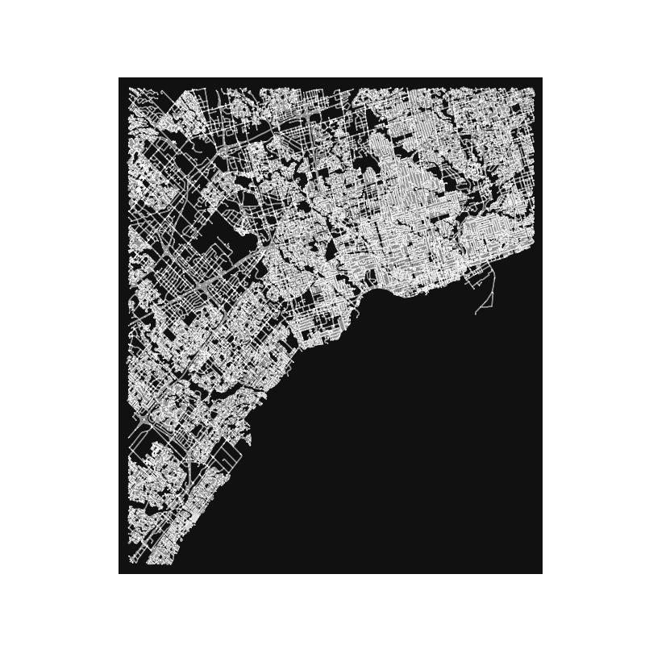
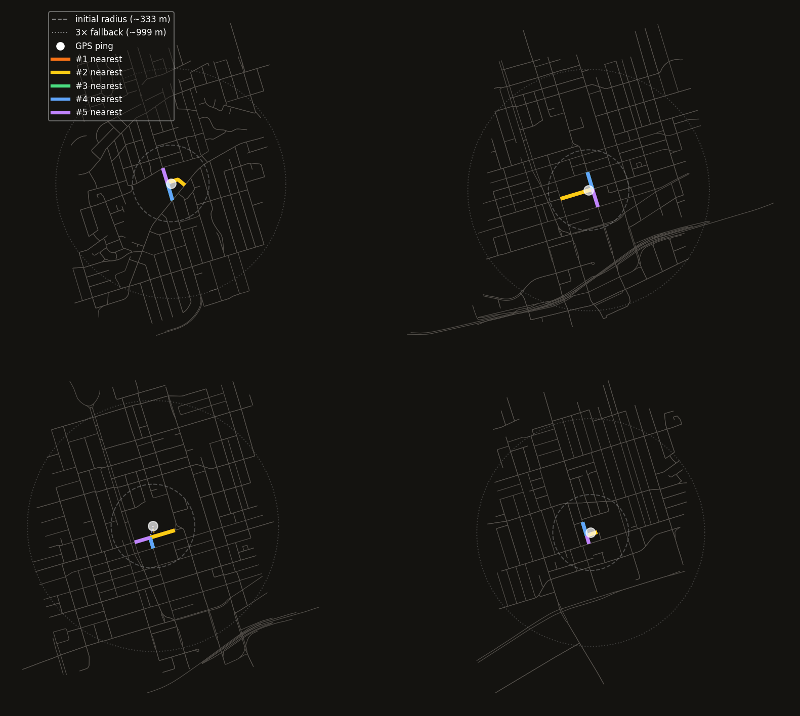
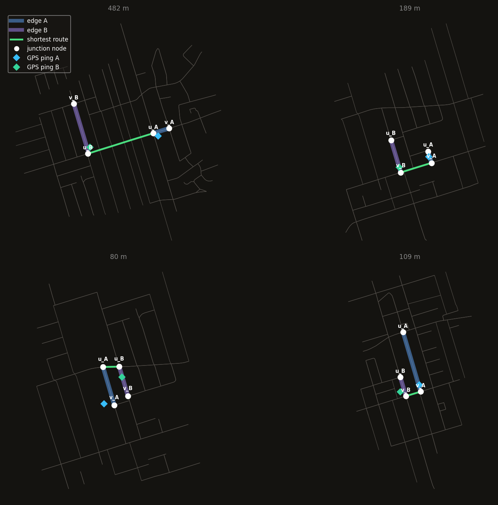
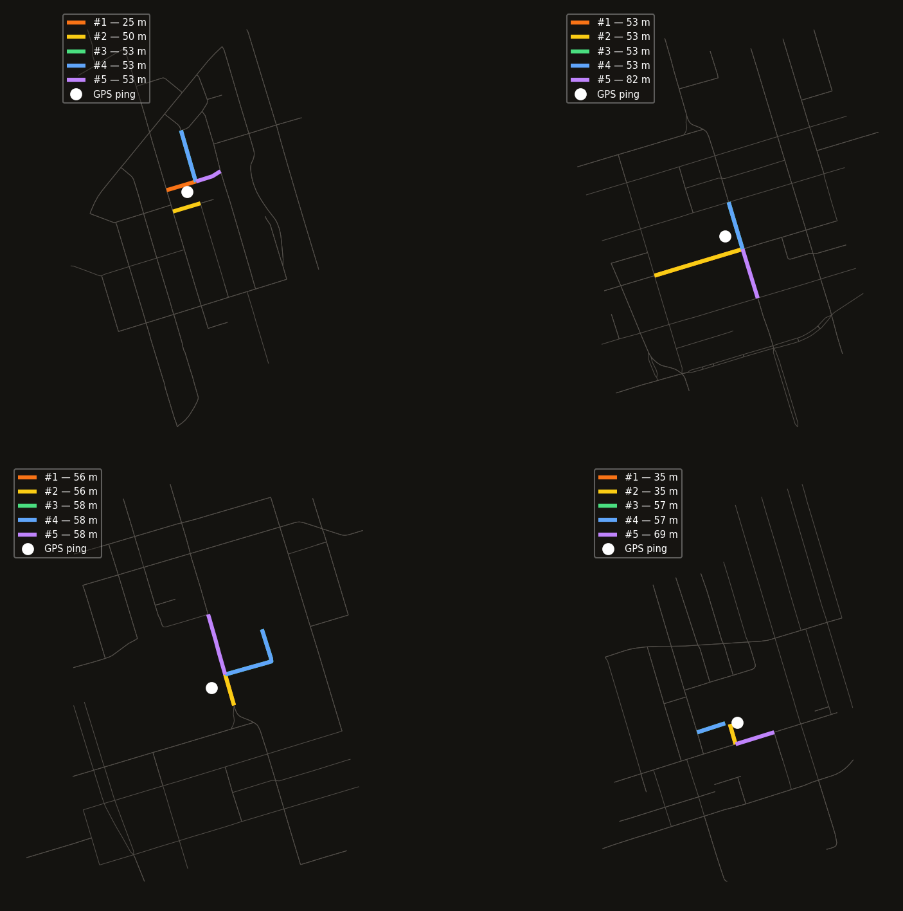
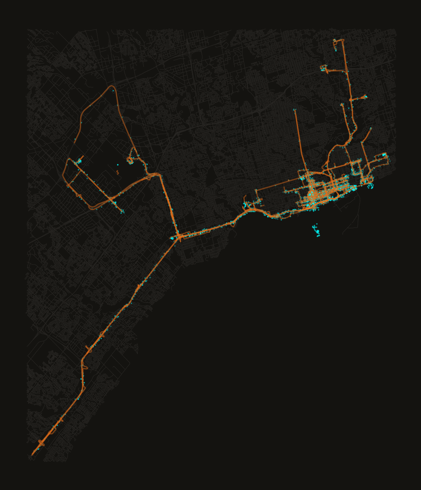
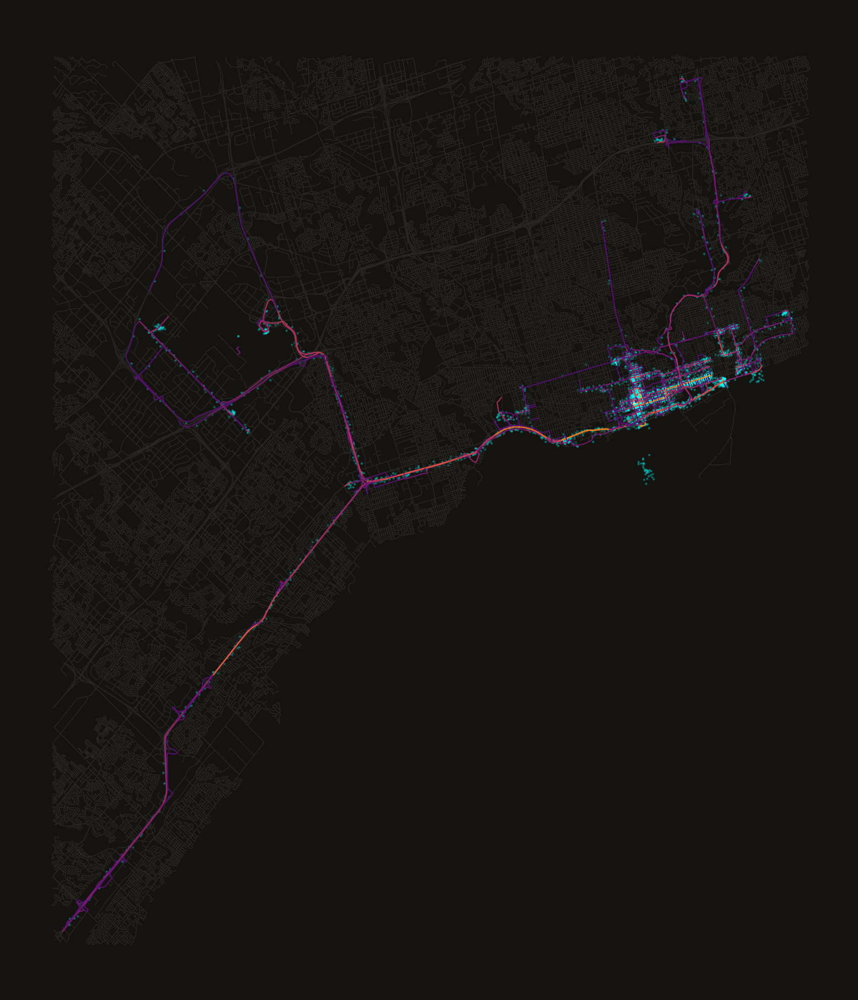

```python
# Import Path for filesystem path handling
from pathlib import Path

# Import multiprocessing for CPU count detection
import multiprocessing

# Import os for CPU count and file path helpers
import os

# Import warnings to silence a noisy geographic-CRS UserWarning
import warnings

# Import Counter to tally per-edge traversal counts
from collections import Counter

# Import multiprocess (pickles more than stdlib multiprocessing) for parallel map-matching
import multiprocess

# Import geopandas for geometry-aware dataframes
import geopandas as gpd

# Import marimo itself (aliased mo) for UI elements and notebook helpers
import marimo as mo

# Import numpy for numeric array operations
import numpy as np

# Import matplotlib's pyplot for plotting
import matplotlib.pyplot as plt

# Import networkx for graph algorithms and shortest-path routing
import networkx as nx

# Import osmnx to fetch, cache, and plot OpenStreetMap road graphs
import osmnx as ox

# Import Point/box geometry constructors from shapely
from shapely.geometry import Point, box

# Import STRtree for fast spatial nearest-neighbour queries over edge geometries
from shapely.strtree import STRtree

# Import tqdm for progress bars over long-running loops
from tqdm import tqdm

# Import pandas since geopandas/osmnx interop expects pandas dataframes
import pandas as pd

# Type alias describing an edge key as a tuple of three floats
EDGE = tuple[float, float, float]

# Suppress the "Geometry is in a geographic CRS" warning raised by distance ops in degrees
warnings.filterwarnings(
    "ignore", message="Geometry is in a geographic CRS", category=UserWarning
)
# Expose these names to other cells that declare them as parameters
```
{: .code-collapsed}

# Road Network

The [previous notebook](locations.py) turned a Google Timeline export into a clean,
chronological table of GPS pings. On its own, that table is just a scatter of dots —
it says roughly where I was, but not *how* I got there. Streets, one-way restrictions,
highway ramps: none of that lives in the raw data. To answer "which roads did I
actually drive" the pings need to be placed onto an actual road network and the path
between them reconstructed.

That happens in two stages here:

1. **Build a routable graph** of Toronto's roads from OpenStreetMap, simplified to
   junction-only nodes so each edge is a full road segment rather than every
   surveyed vertex along it.
2. **Map-match** each GPS ping onto that graph, sequentially, using the graph's own
   shortest-path distances as evidence for which road segment a ping actually
   belongs to.

The second stage is the interesting one. Snapping a ping to its single nearest road
is usually right, but wrong exactly where it matters most: near intersections,
highway interchanges, and anywhere two roads run close together, a few metres of GPS
noise is enough to snap a ping onto the wrong street entirely. Sequential map-matching
fixes this by scoring nearby candidate roads not just by GPS proximity, but by how
well each one connects to the road we were just on — a ping near an off-ramp gets
pulled toward the highway if that's where the route was already headed, rather than
toward whichever road happens to be a few metres closer.

Produces two cache files consumed by `plot.py`:
- `trimmed_roads.parquet` — all OSM edges in the area (background road layer)
- `road_stats.parquet` — traversed edges with per-segment traversal counts

The graph uses junction-only nodes so edges represent full road segments.
One-way streets and turn restrictions are enforced automatically.
<!---->
# Setup
<!---->
## Caching Setup

```python
# Resolve the data directory relative to this notebook's location
DATA_DIR: Path = mo.notebook_dir() / "data"
# Directory for cached intermediate parquet/graph files
CACHE_DIR: Path = DATA_DIR / "cache"
# Directory for generated output images
OUTPUT_DIR: Path = DATA_DIR / "output"
# Ensure the output directory exists
OUTPUT_DIR.mkdir(exist_ok=True, parents=True)
# Path to the cached OSM road graph GraphML file
osm_graph_file: Path = CACHE_DIR / "osm_graph.graphml"

# Privacy mask covering the whole Leslieville neighbourhood (Broadview Ave to
# Coxwell Ave, north past Gerrard St E, south to the rail corridor/lake), with
# a generous buffer on every side. Bounds come from public street names, not
# from any specific address, so the mask reads as "this neighbourhood is
# redacted" rather than pinpointing a location within it.
LESLIEVILLE_MASK = box(-79.3560, 43.6560, -79.3100, 43.6720)
```
{: .code-collapsed}

## Load GPS Ping Data

Reuses the `filtered_locations.parquet` cache written by the previous notebook —
already bounding-box-clipped and chronologically sortable, so no re-parsing of the
raw Timeline export is needed here.

```python
# Load the cached, bounding-box-filtered GPS pings and sort them chronologically
locations_df: gpd.GeoDataFrame = gpd.read_parquet(
    CACHE_DIR / "filtered_locations.parquet"
).sort_values("timestamp")
# Report how many pings were loaded
mo.md(f"{len(locations_df):,} location pings loaded from cache")
```
{: .code-collapsed}

## Build OSM Graph

OpenStreetMap is a crowd-sourced map of, among other things, every road on Earth,
tagged with the metadata routing needs: direction of travel, turn restrictions, road
class. [OSMnx](https://osmnx.readthedocs.io/) queries this data through the Overpass
API and returns it as a `networkx.MultiDiGraph` — nodes are junctions, edges are the
road segments between them.

We download only the road network within the bounding box of our GPS pings,
buffered by roughly a kilometre so routes near the edge of the data aren't
artificially clipped. The graph is simplified to junction-only nodes: OSM stores a
vertex for every surveyed point along a curving road, but a route can only plausibly
turn at a junction, so the intermediate vertices are collapsed into a single edge
geometry. One-way streets and turn restrictions come along for free — the graph is
directed, so `nx.shortest_path` will never route the wrong way down a one-way street.

Downloading is the slowest step in this notebook, so the graph is cached to GraphML
on first run and subsequent runs load from disk instantly. Delete `osm_graph.graphml`
to force a re-download — you'll need to if you change the bounding box size, since a
cached graph won't automatically grow to cover a larger area.

```python
# Danger-styled button that deletes the cached OSM graph file when clicked
mo.ui.run_button(
    kind="danger",
    label="Delete OSM Graph Cachefile? Do so if bounds have changed",
    on_change=lambda _: osm_graph_file.unlink(),
)

# Declare the graph type annotation up front
G: nx.MultiDiGraph

# Reuse the cached OSM graph if available, otherwise download and cache it
if osm_graph_file.exists():
    # Load the previously cached road graph
    G = ox.load_graphml(osm_graph_file)
    # Report that the graph came from cache
    mo.md(f"Loaded graph from cache: **{osm_graph_file.name}**")
else:
    # Buffer the pings' bounding box by ~1.1km so routes near the edge aren't clipped
    buffered = box(*locations_df.total_bounds).buffer(0.01)
    # Split the buffered box into its four bounding coordinates
    west, south, east, north = buffered.bounds
    # Download the drivable road network within the buffered bounding box
    G = ox.graph_from_bbox((west, south, east, north), network_type="drive")
    # Cache the downloaded graph for future runs
    ox.save_graphml(G, osm_graph_file)
    # Report that the graph was freshly downloaded
    mo.md("Downloaded and cached OSM graph")

# Count the junction nodes in the graph
n_nodes = G.number_of_nodes()
# Count the road segment edges in the graph
n_edges = G.number_of_edges()
# Report the graph's node and edge counts
mo.md(f"""
**Graph:** {n_nodes:,} junction nodes, {n_edges:,} road segment edges
""")

# Path where the raw OSM graph plot will be saved
raw_road_graph_plotfile = OUTPUT_DIR / "raw_osmnx_graph.png"

# Define the function that plots and saves the unprocessed road graph
def plot_raw_road_graph():
    # Draw the full graph with small node markers
    ox.plot.plot_graph(G, node_size=1)
    # Save the plot to disk
    plt.savefig(raw_road_graph_plotfile)

# Render and save the raw graph plot
plot_raw_road_graph()
# Display the saved plot inline
mo.image(raw_road_graph_plotfile, width=500)
```
{: .code-collapsed}


This is the full graph, before any GPS data has touched it — every line a road
segment, every implicit vertex a junction. It's the surface the map-matching below
walks on: dense in the grid downtown, sparser toward the highways and suburbs at the
edges of the bounding box.
<!---->
## Build Edge Spatial Index

Every GPS ping needs to be compared against the roads near it to find its closest
match. Toronto's road network has tens of thousands of edges, and a linear scan
against all of them, once per ping, once per candidate, doesn't scale to a dataset
with hundreds of thousands of pings. An
[STRtree](https://shapely.readthedocs.io/en/stable/strtree.html) — a Sort-Tile-Recursive
R-tree — indexes the edge geometries spatially so each query only inspects a small
neighbourhood, turning what would be a linear scan into a microsecond lookup.

We also pre-compute `best_edge_keys` and `best_edge_lengths` up front. OSM sometimes
stores multiple parallel edges between the same pair of junctions — a divided road
with separate carriageways, for instance, is two edges between the same two nodes.
Since routing only cares about reaching a junction, not which carriageway got us
there, we keep just the shortest edge per `(u, v)` pair for routing-distance lookups.

```python
# Convert the graph's edges into a GeoDataFrame indexed by (u, v, key)
edges_gdf: gpd.GeoDataFrame = ox.graph_to_gdfs(G, nodes=False)
# Build a spatial index over all edge geometries for fast nearest-edge queries
strtree: STRtree = STRtree(edges_gdf.geometry.values)

# Define the function that picks the shortest parallel edge per (u, v) node pair
def build_best_edges():
    # Map each (u, v) pair to the key of its shortest edge
    keys: dict[tuple[int, int], int] = {}
    # Map each (u, v) pair to its shortest edge's length
    lengths: dict[tuple[int, int], float] = {}
    # Walk every edge in the graph, tracking the shortest one seen per node pair
    for u, v, key, data in tqdm(
        G.edges(keys=True, data=True),
        ncols=100,
        desc="Calculating Best Edge Keys|Lengths",
    ):
        # Read the edge's length, defaulting to zero if missing
        length = float(data.get("length", 0.0))
        # The (u, v) pair this edge connects
        pair = (u, v)
        # Keep this edge if it's the first seen for the pair or shorter than the current best
        if pair not in lengths or length < lengths[pair]:
            lengths[pair] = length
            keys[pair] = key
    # Return the shortest-edge key and length lookups
    return keys, lengths

# Build the best-edge lookups once
best_edge_keys, best_edge_lengths = build_best_edges()

mo.md(rf"""
Found {len(best_edge_keys):,} best edge keys. {len(best_edge_lengths):,} best edge lengths
""")
```
{: .code-collapsed}

# Nearest-Edge Lookup

`get_k_nearest_edges` is the spatial query that every map-matching step depends on.
Given a GPS point, it returns the **k closest road edges** (as `(u, v, key)` tuples)
along with their straight-line offset distance in metres.

**How the search radius works:**

1. Buffer the point by `search_radius_deg` (~330 m) and query the STRtree.
2. If fewer than k edges are found, expand to 3× the radius and retry.
3. If still nothing, cast a wide 0.05° (~5.5 km) net as a last resort.

The expanding-radius strategy keeps the fast path fast (tiny buffer, few candidates)
while guaranteeing a result even in low-density areas like highway on-ramps or parks.

Distances are converted from degrees to metres by multiplying by 111 000 — a flat-earth
approximation accurate to < 0.3 % at Toronto's latitude.

```python
def get_k_nearest_edges(
    strtree: "STRtree",
    edges_gdf: "gpd.GeoDataFrame",
    point: "shapely.geometry.Point",
    k: int = 5,
    search_radius_deg: float = 0.003,
) -> "list[tuple[tuple[int, int, int], float]]":
    """Return [(edge_tuple, dist_m), ...] sorted nearest-first, length up to k."""
    # Query the spatial index for edges within the initial search radius
    indices = strtree.query(point.buffer(search_radius_deg))
    if len(indices) < k:
        # Too few candidates: retry with a 3x wider radius
        indices = strtree.query(point.buffer(search_radius_deg * 3))
    if len(indices) == 0:
        # Still nothing: cast a wide ~5.5km net as a last resort
        indices = strtree.query(point.buffer(0.05))
    if len(indices) == 0:
        # No edges found anywhere nearby
        return []
    # Pull out the candidate edge rows by index
    nearby = edges_gdf.iloc[indices]
    # Convert each candidate's distance from degrees to metres
    dists_m = nearby.geometry.distance(point) * 111_000
    # Attach the metre distances as a column for sorting
    nearby = nearby.assign(_dist_m=dists_m)
    # Keep only the k closest candidates
    top_k = nearby.nsmallest(min(k, len(nearby)), "_dist_m")
    # Pair each edge's (u, v, key) index with its distance in metres
    return [
        (tuple(idx), float(dist))
        for idx, dist in zip(top_k.index, top_k["_dist_m"])
    ]
```
{: .code-collapsed}

## Demo

```python
def build_nearest_edge_demo(
    CACHE_DIR,
    Point,
    edges_gdf,
    locations_df,
    np,
    plt,
    strtree,
):
    # Initial search radius in degrees (~330m)
    SEARCH_R = 0.003
    # Number of nearest candidate edges to show
    K = 5
    # Colour used for each candidate's rank, brightest/warmest for the closest
    colors = ["#f97316", "#facc15", "#4ade80", "#60a5fa", "#c084fc"]

    # Total number of GPS pings available
    n_pings = len(locations_df)
    # Pick four sample pings spread across the dataset's timeline
    sample_indices = [
        min(50, n_pings - 1),
        min(n_pings // 3, n_pings - 1),
        min(2 * n_pings // 3, n_pings - 1),
        min(n_pings - 50, n_pings - 1),
    ]

    # Create a 2x2 grid of panels, one per sample ping
    fig, axes = plt.subplots(2, 2, figsize=(14, 12), facecolor="#141310")
    # Tighten the spacing between panels
    fig.subplots_adjust(wspace=0.04, hspace=0.04)

    # Seeded RNG so the displayed (jittered) points are reproducible across runs
    rng = np.random.default_rng(11)

    # Jitter a point ~60-90m so the exact real-world location isn't shown; longitude jitter
    # is scaled by cos(latitude) to keep the offset isotropic in metres
    def jitter(point):
        sigma_deg_lat = 0.0007
        sigma_deg_lon = sigma_deg_lat / np.cos(np.radians(point.y))
        return Point(
            point.x + rng.normal(0, sigma_deg_lon),
            point.y + rng.normal(0, sigma_deg_lat),
        )

    for ax, demo_idx in zip(axes.flat, sample_indices):
        # Match the panel background to the figure background
        ax.set_facecolor("#141310")
        # Jitter the sample ping so the exact real-world location isn't shown
        ping = jitter(locations_df.geometry.iloc[demo_idx])
        # Look up this (jittered) point's k nearest candidate edges
        candidates = get_k_nearest_edges(strtree, edges_gdf, ping, k=K)

        # Padding around the ping used to crop the visible road window
        pad = SEARCH_R * 3.2
        # Roads within the cropped window around the ping
        window = edges_gdf.cx[
            ping.x - pad : ping.x + pad, ping.y - pad : ping.y + pad
        ]
        # Draw the background road network for this panel
        window.plot(ax=ax, linewidth=0.6, color="#524e49")

        # Draw both search-radius rings (initial and 3x fallback) around the ping
        for r, ls, alpha in [(SEARCH_R, "--", 0.5), (SEARCH_R * 3, ":", 0.35)]:
            # Angles spanning a full circle
            theta = np.linspace(0, 2 * np.pi, 256)
            # Scale the x-radius by latitude so the ring renders as a true circle in metres
            rx = r / np.cos(np.radians(ping.y))
            ax.plot(
                ping.x + rx * np.cos(theta),
                ping.y + r * np.sin(theta),
                linestyle=ls,
                color="#888",
                linewidth=1,
                alpha=alpha,
            )

        # Highlight each candidate edge and draw a line from the ping to its nearest point on it
        for i, ((u, v, k_key), dist_m) in enumerate(candidates):
            # Boolean mask selecting this candidate's row in the edges GeoDataFrame
            mask = (
                (edges_gdf.index.get_level_values(0) == u)
                & (edges_gdf.index.get_level_values(1) == v)
                & (edges_gdf.index.get_level_values(2) == k_key)
            )
            # Draw the candidate edge in its rank colour
            edges_gdf[mask].plot(ax=ax, linewidth=3.5, color=colors[i])
            # Project the ping onto the edge to find the closest point along it
            nearest_pt = (
                edges_gdf[mask]
                .geometry.iloc[0]
                .interpolate(edges_gdf[mask].geometry.iloc[0].project(ping))
            )
            # Draw a dotted line from the ping to that nearest point
            ax.plot(
                [ping.x, nearest_pt.x],
                [ping.y, nearest_pt.y],
                color=colors[i],
                linewidth=1,
                linestyle=":",
                alpha=0.7,
            )

        # Mark the GPS ping itself
        ax.plot(
            ping.x,
            ping.y,
            "o",
            color="white",
            markersize=9,
            zorder=6,
            alpha=0.7,
        )
        # Hide axis ticks/labels/spines for a clean panel
        ax.set_axis_off()

    # Build the legend entries: the two search rings, the ping marker, then one per candidate rank
    legend_items = [
        plt.Line2D(
            [0],
            [0],
            linestyle="--",
            color="#888",
            lw=1,
            label=f"initial radius (~{SEARCH_R * 111_000:.0f} m)",
        ),
        plt.Line2D(
            [0],
            [0],
            linestyle=":",
            color="#888",
            lw=1,
            label=f"3× fallback (~{SEARCH_R * 3 * 111_000:.0f} m)",
        ),
        plt.Line2D(
            [0],
            [0],
            marker="o",
            color="white",
            markersize=7,
            linestyle="none",
            label="GPS ping",
        ),
    ] + [
        plt.Line2D([0], [0], color=colors[i], lw=3, label=f"#{i + 1} nearest")
        for i in range(K)
    ]
    # Attach the legend to just the top-left panel
    axes[0, 0].legend(
        handles=legend_items,
        loc="upper left",
        fontsize=8,
        framealpha=0.45,
        facecolor="#1a1815",
        labelcolor="white",
    )

    # Path where this demo figure will be saved
    out = CACHE_DIR / "nearest_edge_demo.png"
    # Save the finished figure
    plt.savefig(out, dpi=150, bbox_inches="tight", facecolor="#141310")
    # Close the figure to free memory
    plt.close(fig)
    # Return the saved file's path
    return out

# Render and display the nearest-edge lookup demo figure inline
mo.image(
    build_nearest_edge_demo(
        CACHE_DIR, Point, edges_gdf, locations_df, np, plt, strtree
    ),
    width=900,
)
```
{: .code-collapsed}


Four sample pings, four different neighbourhoods of the road network. The dashed
rings show the search radius that produced each candidate list; the coloured lines
are the k nearest edges, ranked and labelled by GPS offset distance. Where the roads
are dense — a busy intersection, a highway interchange — several candidates sit
within a few metres of each other, and GPS proximity alone can't tell them apart.
That ambiguity is exactly what the routing-distance scoring in the next section
resolves.
<!---->
# Route Computation

`compute_route` finds the shortest path between two road *edges*, but a graph path
runs between *nodes*, not edges. Each OSM edge `(u, v, key)` has two junction
endpoints, and when a GPS ping is snapped to an edge we don't know which direction
the user is traveling — so either endpoint is a valid departure or arrival node.

**The ambiguity:** if the user is on edge A, they could exit from **u_A** or **v_A**.
Likewise, they could enter edge B from **u_B** or **v_B**. That gives four candidate
routing pairs:

| Source (leaving A) | Destination (entering B) |
|---|---|
| u_A | u_B |
| u_A | v_B |
| v_A | u_B |
| v_A | v_B |

`compute_route` runs `nx.shortest_path` for each combination, skips any that have
no valid path (disconnected subgraph, one-way restriction), and returns whichever
succeeds with the shortest total distance.

Without trying all four, you'd need to know travel direction in advance — information
the raw GPS snap doesn't give you. Trying all four and picking the minimum is cheap
(four Dijkstra calls on the same graph) and correct.

```python
def compute_route(
    G: nx.MultiDiGraph,
    best_edge_keys: dict[tuple[int, int], int],
    best_edge_lengths: dict[tuple[int, int], float],
    edge_a: tuple[int, int, int],
    edge_b: tuple[int, int, int],
) -> tuple[list[tuple[int, int, int]] | None, float]:
    """
    Route edge_a → edge_b trying all 4 endpoint combinations.
    Returns (path_edge_list, total_length_m) or (None, inf).
    """

    # Convert a node path into a list of (u, v, key) edges via the best-edge lookup
    def _path_to_edges(
        node_path: list[int],
    ) -> list[tuple[int, int, int]] | None:
        # Accumulated edge list for this node path
        edges = []
        # Walk each consecutive node pair in the path
        for u, v in zip(node_path[:-1], node_path[1:]):
            # Look up the shortest parallel edge's key for this node pair
            key = best_edge_keys.get((u, v))
            if key is None:
                # No edge exists for this pair; the path can't be converted
                return None
            edges.append((u, v, key))
        return edges

    # Track the shortest total route length found across all endpoint combinations
    best_len = float("inf")
    # Track the edge list corresponding to the shortest route found
    best_edges = None

    # Try routing from each endpoint of edge_a to each endpoint of edge_b
    for src in [edge_a[0], edge_a[1]]:
        for dst in [edge_b[0], edge_b[1]]:
            try:
                # Find the shortest node path between this source/destination pair
                node_path = nx.shortest_path(G, src, dst, weight="length")
            except (nx.NetworkXNoPath, nx.NodeNotFound):
                # No route exists between this pair; try the next combination
                continue
            # Convert the node path into an edge list
            path_edges = _path_to_edges(node_path)
            if path_edges is None:
                # Missing edge key somewhere in the path; skip this combination
                continue
            # Sum the lengths of all edges in this candidate route
            total_len = sum(
                best_edge_lengths.get((e[0], e[1]), 0.0) for e in path_edges
            )
            if total_len < best_len:
                # This combination beats the best found so far
                best_len = total_len
                best_edges = path_edges

    # Return the shortest route found (or None/inf if no combination succeeded)
    return best_edges, best_len
```
{: .code-collapsed}

## Demo

```python
def build_route_combo_demo(
    CACHE_DIR,
    G,
    Point,
    best_edge_keys,
    best_edge_lengths,
    compute_route,
    edges_gdf,
    locations_df,
    np,
    plt,
    strtree,
):
    # All GPS pings as a plain list for positional indexing
    pings = list(locations_df.geometry)
    # Total number of pings available
    n_pings = len(pings)

    # Seeded RNG so the displayed (jittered) points are reproducible across runs
    rng = np.random.default_rng(12)

    # Jitter a point ~60-90m so the exact real-world location isn't shown; longitude jitter
    # is scaled by cos(latitude) to keep the offset isotropic in metres
    def jitter(point):
        sigma_deg_lat = 0.0007
        sigma_deg_lon = sigma_deg_lat / np.cos(np.radians(point.y))
        return Point(
            point.x + rng.normal(0, sigma_deg_lon),
            point.y + rng.normal(0, sigma_deg_lat),
        )

    # Collect 4 valid pairs from different quarters of the dataset
    examples = []
    for start in [30, n_pings // 4, n_pings // 2, 3 * n_pings // 4]:
        for i in range(start, min(start + 300, n_pings - 1)):
            # Jitter both points before snapping so the displayed locations aren't exact
            jittered_a, jittered_b = jitter(pings[i]), jitter(pings[i + 1])
            # Snap each (jittered) point to its single nearest edge
            ea = get_k_nearest_edges(strtree, edges_gdf, jittered_a, k=1)
            eb = get_k_nearest_edges(strtree, edges_gdf, jittered_b, k=1)
            if ea and eb and ea[0][0] != eb[0][0]:
                # Found a pair snapped to two different edges; use it as an example
                examples.append((ea[0][0], jittered_a, eb[0][0], jittered_b))
                break

    if not examples:
        # No usable examples found anywhere in the dataset
        return None

    # Look up a graph node's (x, y) coordinates as a numpy array
    def node_xy(node):
        return np.array([G.nodes[node]["x"], G.nodes[node]["y"]])

    # Create a 2x2 grid of panels, one per example pair
    fig, axes = plt.subplots(2, 2, figsize=(14, 12), facecolor="#141310")
    # Tighten the spacing between panels
    fig.subplots_adjust(wspace=0.04, hspace=0.04)

    for ax, (edge_a, ping_a, edge_b, ping_b) in zip(axes.flat, examples):
        # Match the panel background to the figure background
        ax.set_facecolor("#141310")

        # Compute the best route between the two edges, trying all 4 endpoint combinations
        path_edges, total_len = compute_route(
            G, best_edge_keys, best_edge_lengths, edge_a, edge_b
        )

        # Coordinates of edge A's two endpoints
        uA, vA = node_xy(edge_a[0]), node_xy(edge_a[1])
        # Coordinates of edge B's two endpoints
        uB, vB = node_xy(edge_b[0]), node_xy(edge_b[1])

        # All points relevant to this panel, used to size the visible window
        pts = np.array(
            [uA, vA, uB, vB, [ping_a.x, ping_a.y], [ping_b.x, ping_b.y]]
        )
        # Padding added around the tightest bounding box of those points
        pad = 0.003
        # Horizontal window bounds
        xmin, xmax = pts[:, 0].min() - pad, pts[:, 0].max() + pad
        # Vertical window bounds
        ymin, ymax = pts[:, 1].min() - pad, pts[:, 1].max() + pad
        # Draw the background road network within that window
        edges_gdf.cx[xmin:xmax, ymin:ymax].plot(
            ax=ax, linewidth=0.6, color="#524e49"
        )

        # Highlight edge A and edge B in their own colours
        for edge, color in [(edge_a, "#60a5fa"), (edge_b, "#a78bfa")]:
            u, v, k = edge
            # Boolean mask selecting this edge's row in the edges GeoDataFrame
            mask = (
                (edges_gdf.index.get_level_values(0) == u)
                & (edges_gdf.index.get_level_values(1) == v)
                & (edges_gdf.index.get_level_values(2) == k)
            )
            edges_gdf[mask].plot(
                ax=ax, linewidth=6, color=color, alpha=0.5, zorder=2
            )

        if path_edges:
            # Reconstruct the ordered node sequence from the routed edge list
            route_nodes = [path_edges[0][0]] + [e[1] for e in path_edges]
            # Draw the route as a connected line through those nodes
            ax.plot(
                [G.nodes[nd]["x"] for nd in route_nodes],
                [G.nodes[nd]["y"] for nd in route_nodes],
                color="#4ade80",
                linewidth=2.5,
                zorder=4,
            )
            # Title the panel with the route's total length
            ax.set_title(f"{total_len:.0f} m", color="#888", fontsize=9, pad=3)

        # Label each of the four candidate endpoints with its role
        for pt, name in [(uA, "u_A"), (vA, "v_A"), (uB, "u_B"), (vB, "v_B")]:
            ax.plot(*pt, "o", color="white", markersize=7, zorder=6)
            ax.text(
                pt[0],
                pt[1] + 0.00028,
                name,
                color="white",
                ha="center",
                fontsize=7,
                fontweight="bold",
                zorder=7,
            )

        # Mark the two GPS pings that produced this example
        ax.plot(
            ping_a.x, ping_a.y, "D", color="#38bdf8", markersize=6, zorder=6
        )
        ax.plot(
            ping_b.x, ping_b.y, "D", color="#34d399", markersize=6, zorder=6
        )
        # Hide axis ticks/labels/spines for a clean panel
        ax.set_axis_off()

    # Build the shared legend describing every visual element used across panels
    legend_items = [
        plt.Line2D([0], [0], color="#60a5fa", lw=5, alpha=0.5, label="edge A"),
        plt.Line2D([0], [0], color="#a78bfa", lw=5, alpha=0.5, label="edge B"),
        plt.Line2D([0], [0], color="#4ade80", lw=2.5, label="shortest route"),
        plt.Line2D(
            [0],
            [0],
            marker="o",
            color="white",
            markersize=6,
            linestyle="none",
            label="junction node",
        ),
        plt.Line2D(
            [0],
            [0],
            marker="D",
            color="#38bdf8",
            markersize=6,
            linestyle="none",
            label="GPS ping A",
        ),
        plt.Line2D(
            [0],
            [0],
            marker="D",
            color="#34d399",
            markersize=6,
            linestyle="none",
            label="GPS ping B",
        ),
    ]
    # Attach the legend to just the top-left panel
    axes[0, 0].legend(
        handles=legend_items,
        loc="upper left",
        fontsize=8,
        framealpha=0.5,
        facecolor="#1a1815",
        labelcolor="white",
    )

    # Path where this demo figure will be saved
    out = CACHE_DIR / "compute_route_demo.png"
    # Save the finished figure
    plt.savefig(out, dpi=150, bbox_inches="tight", facecolor="#141310")
    # Close the figure to free memory
    plt.close(fig)
    # Return the saved file's path
    return out

# Render and display the route-combination demo figure inline
mo.image(
    build_route_combo_demo(
        CACHE_DIR,
        G,
        Point,
        best_edge_keys,
        best_edge_lengths,
        compute_route,
        edges_gdf,
        locations_df,
        np,
        plt,
        strtree,
    ),
    width=900,
)
```
{: .code-collapsed}


Each panel routes between two edges snapped from a real consecutive ping pair, with
all four endpoint labels (`u_A`, `v_A`, `u_B`, `v_B`) drawn so the winning
combination is visible. The shortest route (green) isn't always the geometrically
obvious one — a one-way restriction or a missing turn can force a longer detour
around the block, which is exactly the kind of route a straight-line distance
estimate would miss entirely.
<!---->
# Candidate Scoring Demo

Before running the full loop, this cell illustrates the candidate selection step for
a single sample ping. For each of the k nearest edges we show the GPS offset distance
(metres). During the sequential loop, each candidate also gets a route distance from
the previous matched edge; the algorithm picks the candidate with the lowest combined
score `route_dist + GPS_WEIGHT × gps_offset`.

This is what allows the algorithm to stay on the main road when a ping drifts slightly
toward a side street at an intersection.

```python
def build_scoring_demo(
    CACHE_DIR, Point, edges_gdf, locations_df, np, plt, strtree
):
    # Colour used for each candidate's rank, brightest/warmest for the closest
    colors = ["#f97316", "#facc15", "#4ade80", "#60a5fa", "#c084fc"]
    # Number of nearest candidate edges to show
    K = 5
    # Half-width of the cropped window drawn around each sample ping, in degrees
    PAD = 0.004

    # Total number of GPS pings available
    n_pings = len(locations_df)
    # Pick four sample pings spread across the dataset's timeline
    sample_indices = [
        min(50, n_pings - 1),
        min(n_pings // 3, n_pings - 1),
        min(2 * n_pings // 3, n_pings - 1),
        min(n_pings - 50, n_pings - 1),
    ]

    # Create a 2x2 grid of panels, one per sample ping
    fig, axes = plt.subplots(2, 2, figsize=(14, 12), facecolor="#141310")
    # Tighten the spacing between panels
    fig.subplots_adjust(wspace=0.04, hspace=0.04)

    # Seeded RNG so the displayed (jittered) points are reproducible across runs
    rng = np.random.default_rng(13)

    # Jitter a point ~60-90m so the exact real-world location isn't shown; longitude jitter
    # is scaled by cos(latitude) to keep the offset isotropic in metres
    def jitter(point):
        sigma_deg_lat = 0.0007
        sigma_deg_lon = sigma_deg_lat / np.cos(np.radians(point.y))
        return Point(
            point.x + rng.normal(0, sigma_deg_lon),
            point.y + rng.normal(0, sigma_deg_lat),
        )

    for ax, demo_idx in zip(axes.flat, sample_indices):
        # Match the panel background to the figure background
        ax.set_facecolor("#141310")
        # Jitter the sample ping so the exact real-world location isn't shown
        ping = jitter(locations_df.geometry.iloc[demo_idx])
        # Look up this (jittered) point's k nearest candidate edges
        candidates = get_k_nearest_edges(strtree, edges_gdf, ping, k=K)

        # Draw the background road network cropped to a window around the ping
        edges_gdf.cx[
            ping.x - PAD : ping.x + PAD, ping.y - PAD : ping.y + PAD
        ].plot(ax=ax, linewidth=0.5, color="#524e49")

        # Highlight each candidate edge, labelled with its GPS offset distance
        for i, ((u, v, k_key), dist_m) in enumerate(candidates):
            # Boolean mask selecting this candidate's row in the edges GeoDataFrame
            mask = (
                (edges_gdf.index.get_level_values(0) == u)
                & (edges_gdf.index.get_level_values(1) == v)
                & (edges_gdf.index.get_level_values(2) == k_key)
            )
            edges_gdf[mask].plot(
                ax=ax,
                linewidth=3,
                color=colors[i],
                label=f"#{i + 1} — {dist_m:.0f} m",
            )

        # Mark the GPS ping itself
        ax.plot(
            ping.x,
            ping.y,
            "o",
            color="white",
            markersize=8,
            zorder=5,
            label="GPS ping",
        )
        # Show the per-candidate distance legend for this panel
        ax.legend(
            loc="upper left",
            fontsize=7,
            framealpha=0.4,
            facecolor="#1a1815",
            labelcolor="white",
        )
        # Hide axis ticks/labels/spines for a clean panel
        ax.set_axis_off()

    # Path where this demo figure will be saved
    out = CACHE_DIR / "candidate_scoring_demo.png"
    # Save the finished figure
    plt.savefig(out, dpi=150, bbox_inches="tight", facecolor="#141310")
    # Close the figure to free memory
    plt.close(fig)
    # Return the saved file's path
    return out

# Render and display the candidate-scoring demo figure inline
mo.image(
    build_scoring_demo(
        CACHE_DIR, Point, edges_gdf, locations_df, np, plt, strtree
    ),
    width=900,
)
```
{: .code-collapsed}


Every candidate here carries only a GPS offset distance — no route information yet,
since that depends on where the previous ping matched. During the actual sequential
pass, each of these distances gets combined with a routing distance from the prior
matched edge before a winner is picked; this cell just isolates the GPS half of that
score so it's visible on its own.
<!---->
# Parameters

| Parameter | Default | Purpose |
|---|---|---|
| `K_CANDIDATES` | 5 | Candidate edges considered per ping |
| `MAX_PATH_M` | 10 000 | Hard cap on route distance regardless of time |
| `MAX_GAP_MINUTES` | 10 | Time gap that signals a new trip — resets state |
| `MAX_SPEED_KMH` | 120 | Speed ceiling: route too long for the elapsed time → trip reset |
| `GPS_WEIGHT` | 1.0 | How much GPS offset (m) is penalised relative to route distance (m) |

`MAX_SPEED_KMH` is the primary guard against impossible routes — if the shortest path
between two pings would require traveling faster than this, the transition is treated
as a trip boundary rather than a routed segment.

Increase `GPS_WEIGHT` to favour geometrically closer edges; decrease it to favour
route continuity (staying on the road already being traveled).

```python
# Candidate edges considered per ping
K_CANDIDATES = 5
# Hard cap on route distance regardless of time, in metres
MAX_PATH_M = 10_000
# Time gap in minutes that signals a new trip
MAX_GAP_MINUTES = 10
# Time gap in seconds that signals a new trip
MAX_GAP_SECONDS = 60 * MAX_GAP_MINUTES
# Speed ceiling in km/h: routes implying a faster speed are treated as trip resets
MAX_SPEED_KMH = 120
# Weight applied to GPS offset distance relative to route distance in scoring
GPS_WEIGHT = 1.0

# Fork-based multiprocessing context, used for the parallel candidate/route computations
mp_ctx = multiprocess.get_context("fork")

# All GPS pings as a plain list for positional indexing
gps_pings = list(locations_df.geometry)

# Parse each ping's timestamp into a pandas Timestamp for arithmetic
gps_timestamps = [pd.Timestamp(t) for t in locations_df["timestamp"]]

# Look up a single ping's k nearest candidate edges (top-level so it can be pickled for multiprocessing)
def calculate_nearest_edges_for_ping(
    ping: "shapely.geometry.Point",
) -> list[tuple[tuple[int, int, int], float]]:
    return get_k_nearest_edges(
        strtree,
        edges_gdf,
        ping,
        k=K_CANDIDATES,
    )

# Cached so the (slow) parallel candidate-edge computation only runs once per input
@mo.cache
def calculate_gps_candidate_pairs():
    # Compute each ping's candidate edges in parallel across all CPU cores
    with mp_ctx.Pool(os.cpu_count()) as _pool:
        all_candidates = list(
            tqdm(
                _pool.imap(
                    calculate_nearest_edges_for_ping,
                    gps_pings,
                ),
                ncols=100,
                total=len(gps_pings),
                desc="Calculating Candidate Edges",
            )
        )
    return all_candidates

# Run (or fetch from cache) the candidate-edge computation for every ping
all_candidates = calculate_gps_candidate_pairs()
```
{: .code-collapsed}

For each pair of pings (in timestamp order), $$p_i$$ to $$p_{i+1}$$, first look at the number of seconds between the pings. If it's greater than `MAX_GAP_SECONDS`, they're from unrelated trips and shouldn't be linked.

Then, each given $$p_i$$ has `K_CANDIDATES` of edges/roads that it _could_ correspond to, so for each $$[p_i, p_{i+1}]$$, we examine all routes between all candidate roads.

```python
# Compute the best route for one candidate edge pair (top-level so it can be pickled for multiprocessing)
def compute_best_route_between_roads(
    pair: tuple[tuple[int, int, int], tuple[int, int, int]],
) -> tuple[
    tuple[int, int, int],
    tuple[int, int, int],
    tuple[list[tuple[int, int, int]] | None, float],
]:
    # Unpack the edge pair
    edge_a, edge_b = pair
    # Return the pair alongside its computed route so results can be matched back up
    return (
        edge_a,
        edge_b,
        compute_route(
            G,
            best_edge_keys,
            best_edge_lengths,
            edge_a,
            edge_b,
        ),
    )

# Unique candidate edge pairs that need a routed distance computed between them
gps_ping_pairs: set = set()
# Walk consecutive ping pairs in timestamp order
for _i in range(1, len(gps_pings)):
    # Elapsed time between this ping and the previous one
    seconds_between_pings = (
        gps_timestamps[_i] - gps_timestamps[_i - 1]
    ).total_seconds()
    if seconds_between_pings > MAX_GAP_SECONDS:
        # Then it's an unrelated trip
        continue

    # Collect every combination of the previous ping's and this ping's candidate edges
    for _ea, _ in all_candidates[_i - 1]:
        for _eb, _ in all_candidates[_i]:
            if _ea != _eb:
                gps_ping_pairs.add((_ea, _eb))

# Cached so the (slow) parallel route computation only runs once per set of candidate pairs
@mo.cache
def generate_route_cache():
    # Maps each (edge_a, edge_b) pair to its computed route
    route_cache = dict()
    # Compute every candidate pair's route in parallel across all CPU cores
    with mp_ctx.Pool(os.cpu_count()) as _pool:
        for _ea, _eb, (_path, _len) in tqdm(
            _pool.imap(compute_best_route_between_roads, list(gps_ping_pairs)),
            total=len(gps_ping_pairs),
            desc="Generating Route Cache",
        ):
            route_cache[_ea, _eb] = _path, _len
    return route_cache

# Run (or fetch from cache) the route computation for every candidate pair
route_cache = generate_route_cache()

# Report how many routes were generated and from how many candidate pairs
mo.md(
    f"Generated route cache: **{len(route_cache):,}** routes from **{len(gps_ping_pairs):,}** candidate pairs"
)
```
{: .code-collapsed}

# Sequential Map-Matching

Production map-matchers — the ones behind Google Maps or a rideshare app's server
side — typically solve this with a Hidden Markov Model via the Viterbi algorithm:
every ping's candidates become nodes in a lattice, and a single dynamic-programming
pass finds the globally optimal path through the *entire* trip at once, weighing
every candidate at every timestep against all the others simultaneously. That's the
right tool when a guaranteed-optimal match is worth the batch computation.

This notebook does something simpler: a **greedy sequential** match. It processes
pings strictly in timestamp order and, at each step, commits to the single
best-scoring candidate before moving to the next ping — no backtracking, no
revisiting an earlier decision in light of later evidence. That's a real limitation:
a bad match early in a trip can't be corrected once better evidence arrives a few
pings later. In exchange, it's a fraction of the code and runs in one pass, and for a
personal history with pings every few seconds — not the sparse, minutes-apart pings a
fleet-tracking system has to work with — a wrong turn tends to get corrected almost
immediately anyway, since the score heavily favours staying near the road actually
being reported.

Processes GPS pings in timestamp order. At each step:

1. **Trip gap check** — if the time since the last ping exceeds `MAX_GAP_SECONDS`,
   snap to the nearest edge and start fresh (separate trip).
2. **Candidate lookup** — query the spatial index for the k nearest edges.
3. **Score each candidate** — `score = route_dist_m + GPS_WEIGHT × gps_offset_m`,
   where `route_dist_m` is the shortest-path length from the previous matched edge.
4. **Pick the winner** — lowest score wins; accumulate its path edges.
5. **Route cache** — routes between edge pairs are memoised so each unique `(a, b)`
   pair is computed at most once regardless of how many times that transition repeats.

The trip-gap check matters because pings aren't continuous — phones sleep, Timeline
has dead zones, and two pings ten minutes apart are far more likely to be two
unrelated errands than one long, slow detour. Without it, the algorithm would happily
route a path clear across the city to connect this morning's commute to tonight's
grocery run, because *some* path always exists between any two connected roads —
`MAX_SPEED_KMH` and `MAX_GAP_SECONDS` are what keep that path from being accepted as
real.

```python
# Cached so re-running the notebook with unchanged inputs skips the full matching pass
@mo.cache
def sequential_map_match(
    G: nx.MultiDiGraph,
    edges_gdf: gpd.GeoDataFrame,
    strtree: STRtree,
    best_edge_keys: dict[tuple[int, int], int],
    best_edge_lengths: dict[tuple[int, int], float],
    locations_df: gpd.GeoDataFrame,
    k: int = 5,
    max_path_m: float = 10_000,
    max_gap_s: float = 1_800,
    max_speed_kmh: float = 120.0,
    gps_weight: float = 1.0,
    route_cache: dict | None = None,
) -> tuple[Counter[tuple[int, int, int]], dict[str, int]]:
    """
    Sequential map-matching: route from each ping to the next, picking the
    best candidate edge by combined route distance + GPS offset score.
    Returns (edge_counts, stats_dict).
    """
    # All GPS pings as a plain list for positional indexing
    pings = list(locations_df.geometry)
    # Parsed timestamp for each ping, aligned by position with `pings`
    timestamps = [pd.Timestamp(t) for t in locations_df["timestamp"]]
    # Total number of pings to process
    n = len(pings)

    # Seed the local route cache from any precomputed cache passed in
    _cache: dict[
        tuple[tuple[int, int, int], tuple[int, int, int]],
        tuple[list[tuple[int, int, int]] | None, float],
    ] = dict(route_cache) if route_cache else {}
    # Tally of traversals per edge, accumulated as pings are matched
    edge_counts: Counter[tuple[int, int, int]] = Counter()

    # Running counters for match statistics
    routed = 0
    trip_resets = 0

    # Look up a route between two edges, computing and caching it on a miss
    def _cached_route(
        a: tuple[int, int, int],
        b: tuple[int, int, int],
    ) -> tuple[list[tuple[int, int, int]] | None, float]:
        if (a, b) in _cache:
            return _cache[(a, b)]
        result = compute_route(G, best_edge_keys, best_edge_lengths, a, b)
        _cache[(a, b)] = result
        return result

    # Snap a single point to its single nearest edge, or None if nothing is nearby
    def _snap(point: "shapely.geometry.Point") -> tuple[int, int, int] | None:
        cands = get_k_nearest_edges(strtree, edges_gdf, point, k=1)
        return cands[0][0] if cands else None

    # Seed the walk with the first ping's snapped edge
    current_edge = _snap(pings[0])
    if current_edge:
        edge_counts[current_edge] += 1

    for i in tqdm(range(1, n), desc="map-matching"):
        point = pings[i]

        # Elapsed time since the previous ping
        dt = (timestamps[i] - timestamps[i - 1]).total_seconds()
        if dt > max_gap_s:
            # Gap too large to be the same trip: snap fresh and start a new trip
            current_edge = _snap(point)
            if current_edge:
                edge_counts[current_edge] += 1
            trip_resets += 1
            continue

        # Distance ceiling derived from elapsed time: route longer than this
        # would require exceeding max_speed_kmh, so it can't be a real trip.
        max_dist_for_dt = dt * (max_speed_kmh / 3.6)

        # Candidate edges this ping could belong to
        candidates = get_k_nearest_edges(strtree, edges_gdf, point, k=k)
        if not candidates:
            # No edges found nearby; skip this ping
            continue

        # Track the best-scoring candidate for this ping
        best_edge = None
        best_path: list = []
        best_score = float("inf")

        for cand_edge, gps_dist_m in candidates:
            if cand_edge == current_edge:
                # Staying on the same edge costs only the GPS offset
                score = gps_weight * gps_dist_m
                path: list = []
            else:
                # Switching edges costs the routed distance plus the GPS offset
                path_edges, route_len = _cached_route(current_edge, cand_edge)
                if path_edges is None or route_len > min(
                    max_path_m, max_dist_for_dt
                ):
                    # No route, or the route is longer than physically possible/allowed
                    continue
                score = route_len + gps_weight * gps_dist_m
                path = path_edges

            if score < best_score:
                # This candidate beats the best found so far
                best_score = score
                best_edge = cand_edge
                best_path = path

        if best_edge is None:
            # No candidate survived scoring; fall back to the closest one and reset the trip
            best_edge = candidates[0][0]
            best_path = []
            trip_resets += 1

        # Credit every edge along the routed path plus the destination edge itself
        for e in best_path:
            edge_counts[e] += 1
        edge_counts[best_edge] += 1
        routed += 1
        current_edge = best_edge

    # Return the accumulated edge traversal counts and summary statistics
    return edge_counts, {
        "routed": routed,
        "trip_resets": trip_resets,
    }

# Run the full sequential map-matching pass using the configured parameters
edge_counts, match_stats = sequential_map_match(
    G,
    edges_gdf,
    strtree,
    best_edge_keys,
    best_edge_lengths,
    locations_df,
    k=K_CANDIDATES,
    max_path_m=MAX_PATH_M,
    max_gap_s=MAX_GAP_SECONDS,
    max_speed_kmh=MAX_SPEED_KMH,
    gps_weight=GPS_WEIGHT,
    route_cache=route_cache,
)

# Shorthand alias for the match statistics dict
_s = match_stats
# Report the matching summary statistics
mo.md(f"""
**{_s["routed"]:,}** pings matched &nbsp;·&nbsp;
**{_s["trip_resets"]:,}** trip resets
""")
```
{: .code-collapsed}

# Route Reconstruction Check

Matched road segments (orange) overlaid on raw GPS pings (cyan). A well-matched
result shows the orange segments following the road network closely, with pings
clustering around those segments rather than off to the side. This is the sanity
check before trusting any of the aggregate traversal counts below — systematic drift
(cyan consistently off to one side of every orange segment) would point to a CRS
mismatch or a bounding box that's clipping real trips, while orange segments that
wander away from any nearby cyan cluster would point to the scoring weights favouring
route continuity too heavily over GPS evidence.

```python
# Path where the edge-matching check plot will be saved
edge_matching_plotfile = CACHE_DIR / "edge_matching.png"

# Define the function that overlays matched road segments on raw GPS pings
def build_edge_matching_plot():
    # Set of edges that received at least one traversal
    matched_set = set(edge_counts.keys())
    # u/v/key index levels of the full edges GeoDataFrame
    us = edges_gdf.index.get_level_values(0)
    vs = edges_gdf.index.get_level_values(1)
    ks = edges_gdf.index.get_level_values(2)
    # Subset of edges that were actually matched during the sequential pass
    matched_gdf = edges_gdf[
        [(u, v, k) in matched_set for u, v, k in zip(us, vs, ks)]
    ]

    # Jitter each raw ping ~60-90m so it doesn't render as an exact point;
    # longitude jitter is scaled by cos(latitude) to keep the offset isotropic
    rng = np.random.default_rng(21)
    sigma_deg_lat = 0.0007
    lat = locations_df.geometry.y
    lon = locations_df.geometry.x
    sigma_deg_lon = sigma_deg_lat / np.cos(np.radians(lat.mean()))
    jittered_locations = gpd.GeoDataFrame(
        geometry=gpd.points_from_xy(
            lon + rng.normal(0, sigma_deg_lon, len(locations_df)),
            lat + rng.normal(0, sigma_deg_lat, len(locations_df)),
        ),
        crs=locations_df.crs,
    )

    # Create the figure with a dark background
    fig, ax = plt.subplots(figsize=(10, 8), facecolor="#141310")
    # Match the axes background to the figure background
    ax.set_facecolor("#141310")
    # Draw the full road network faintly as context
    edges_gdf.plot(ax=ax, linewidth=0.3, color="#2a2825")
    # Draw the matched segments in orange, on top of the full network
    matched_gdf.plot(ax=ax, linewidth=1.5, color="#f97316", alpha=0.4)
    # Draw the jittered GPS pings in cyan for visual comparison against the matched segments
    jittered_locations.plot(ax=ax, marker=".", markersize=2, color="cyan", alpha=0.5)
    # Black out the whole Leslieville neighbourhood as an extra privacy layer on top of jitter
    gpd.GeoDataFrame(geometry=[LESLIEVILLE_MASK]).plot(
        ax=ax, color="#141310", zorder=10
    )
    # Hide axis ticks/labels/spines for a clean plot
    ax.set_axis_off()
    # Trim excess whitespace around the plot
    plt.tight_layout()
    # Save the finished figure
    plt.savefig(
        edge_matching_plotfile,
        dpi=150,
        bbox_inches="tight",
        facecolor="#141310",
    )
    # Close the figure to free memory
    plt.close(fig)

# Render and save the edge-matching check plot
build_edge_matching_plot()
# Display the saved plot inline
mo.image(edge_matching_plotfile, width=1000)
```
{: .code-collapsed}


# Aggregate Traversal Counts

Joins per-edge traversal counts back to the full edge GeoDataFrame, then filters
to only edges with at least one traversal.

```python
# Define the function that joins per-edge traversal counts onto the full edges GeoDataFrame
def build_result():
    # u/v/key index levels of the full edges GeoDataFrame
    us = edges_gdf.index.get_level_values(0)
    vs = edges_gdf.index.get_level_values(1)
    ks = edges_gdf.index.get_level_values(2)
    # Copy the edges so the traversal count column doesn't mutate the shared GeoDataFrame
    r = edges_gdf.copy()
    # Look up each edge's traversal count, defaulting to zero if never matched
    r["count"] = [
        edge_counts.get((u, v, key), 0) for u, v, key in zip(us, vs, ks)
    ]
    # Keep only edges with at least one traversal
    return r[r["count"] > 0]

# Build the traversal-count result once
result = build_result()
# Highest traversal count across all matched edges, or zero if none matched
max_count = int(result["count"].max()) if len(result) else 0
# Report the number of traversed segments and the busiest one's count
mo.md(
    f"**{len(result):,}** road segments with at least one traversal "
    f"(max count: **{max_count:,}**)"
)
```
{: .code-collapsed}

# Save Artifacts

Writes the two files consumed by `plot.py`:
- `trimmed_roads.parquet` — all OSM edges (background road layer)
- `road_stats.parquet` — traversed edges with traversal counts

OSM edges carry mixed scalar/list columns (`osmid`, `name`, etc.) that Arrow
cannot serialize, so only the columns actually needed downstream are written.

```python
# Save all OSM edges as the background road layer for plot.py
edges_gdf.reset_index()[["u", "v", "key", "geometry"]].to_parquet(
    CACHE_DIR / "trimmed_roads.parquet"
)
# Save only the traversed edges with their counts for plot.py's heatmap
result.reset_index()[["u", "v", "key", "geometry", "count"]].to_parquet(
    CACHE_DIR / "road_stats.parquet"
)
# Report what was saved and how many rows each file contains
mo.md(
    f"Saved `trimmed_roads.parquet` ({len(edges_gdf):,} edges) "
    f"and `road_stats.parquet` ({len(result):,} traversed segments)"
)
```
{: .code-collapsed}

# Preview

Quick inline heatmap to sanity-check the traversal counts before running
`plot.py` for the full-resolution output. Colour here is log-scaled traversal
count — the streets I actually drive regularly should read as bright, continuous
lines, while one-off detours show up as faint, scattered segments.

With `trimmed_roads.parquet` and `road_stats.parquet` written, the next notebook in
this series picks up here and turns these traversal counts into the full-resolution
rendered map.

```python
# Path where the preview heatmap will be saved
plotfile = OUTPUT_DIR / "road_network_preview.png"

# Define the function that renders a quick inline traversal heatmap
def build_preview_plot():
    # Create the figure with a dark background
    fig, ax = plt.subplots(figsize=(12, 10), facecolor="#141310")
    # Match the axes background to the figure background
    ax.set_facecolor("#141310")
    # Draw the full road network faintly as context
    edges_gdf.plot(ax=ax, linewidth=0.4, color="#2a2825")
    # Log-scale the traversal counts so busy segments don't wash out quieter ones
    log_counts = np.log1p(result["count"])
    # Lowest and highest log-scaled counts, used to set the colour range
    log_min = log_counts.min()
    log_max = log_counts.max()
    # Compress the low end of the colour range so faint segments stay visible
    vmin = log_min - (log_max - log_min) * 0.33
    # Draw the traversed segments coloured by log-scaled traversal count
    result.plot(
        ax=ax,
        column=log_counts,
        cmap="inferno",
        linewidth=0.8,
        vmin=vmin,
        vmax=log_max,
    )

    # Jitter each raw ping ~60-90m so it doesn't render as an exact point;
    # longitude jitter is scaled by cos(latitude) to keep the offset isotropic
    rng = np.random.default_rng(22)
    sigma_deg_lat = 0.0007
    lat = locations_df.geometry.y
    lon = locations_df.geometry.x
    sigma_deg_lon = sigma_deg_lat / np.cos(np.radians(lat.mean()))
    jittered_locations = gpd.GeoDataFrame(
        geometry=gpd.points_from_xy(
            lon + rng.normal(0, sigma_deg_lon, len(locations_df)),
            lat + rng.normal(0, sigma_deg_lat, len(locations_df)),
        ),
        crs=locations_df.crs,
    )
    # Draw the jittered GPS pings in cyan for visual comparison against the heatmap
    jittered_locations.plot(ax=ax, marker=".", markersize=2, color="cyan", alpha=0.3)
    # Black out the whole Leslieville neighbourhood as an extra privacy layer on top of jitter
    gpd.GeoDataFrame(geometry=[LESLIEVILLE_MASK]).plot(
        ax=ax, color="#141310", zorder=10
    )
    # Hide axis ticks/labels/spines for a clean plot
    ax.set_axis_off()
    # Trim excess whitespace around the plot
    plt.tight_layout()
    # Save the finished figure
    plt.savefig(plotfile, dpi=200, bbox_inches="tight", facecolor="#141310")

# Render and save the preview heatmap
build_preview_plot()
# Display the saved plot inline
mo.image(plotfile, width=1000)
```
{: .code-collapsed}

